= Managed RedHat OpenShift를 Azure ARO(RedHat OpenShift)로 마이그레이션

== 문서 요약

[cols="1,5", options="header"]
|===
|문서 항목|현재 가치
|문서 제목|FACTORY_Runbook_Azure_RedHat_Openshift_Onprem_Containerized_Apps_To_Openshift
|프로그램|Cloud Acceleration Factory
|마지막으로 수정한 날짜|27-03-2024
|마지막 검토 날짜|10-07-2024
|상태|승인
|문서 설명|이 문서에서는 Devops를 사용하여 온프레미스 컨테이너화된 애플리케이션을 ARO 클러스터로 마이그레이션/구축하는 방법에 대한 지침을 제공합니다.
|===

== 변경 로그

== 목차

== 1. 소개

이 문서에서는 ARO(Azure RedHat OpenShift)에 대한 간략한 소개, ARO 마이그레이션을 위한 필수 구성 요소 및 샘플 컨테이너화 된 애플리케이션을 ARO 클러스터로 마이그레이션하는 자세한 절차/단계를 제공합니다.

=== 1.1 Azure RedHat OpenShift(ARO)

Azure RedHat OpenShift는 Microsoft와 Red Hat이 공동으로 모니터링 및 운영하는 주문성 고가용성 완전 관리형 OpenShift 클러스터를 제공합니다. Kuberneters는 Red Hat OpenShift의 핵심입니다. OpeenShift는 Kubernetees를 보완하는 부가가치 기능을 제공하여 개발자 및 운영자 기능을 크게 개선한 턴키 PaaS(Container Platform as a Service)로 만듭니다.

다음은 ARO의 주요 기능입니다.

* Microsoft와 RedHat이 공동으로 모니터링 및 운영하는 온디맨드 완전 관리형 OpenShift 클러스터
* 쿠버네티스 - PaaS
* 셀프 서비스, 온디맨드 애플리케이션 스택 프로비저닝
* 통합 개발자 도구
* 보안 및 규정 준수
* 확장성 및 가용성
* 하이브리드 및 멀티 클라우드 지원
* Red Hat Enterprise Linux CoreOS(RHCOS)
* 최신 애플리케이션 아키텍처 지원
* 기본 제공 운영자 및 운영자 허브 지원
* 기본 제공 CI/CD 파이프라인

=== 1.2 참조 아키텍처

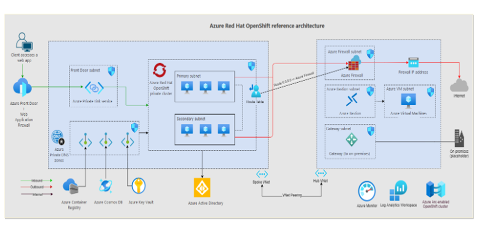

== 2. 역할과 책임

[cols=5, options="header"]
|===
|과업|책임|책임|상담|정보
|클러스터 생성|고객/파트너|고객/파트너|고객/파트너|Factory
|공유할 평가 보고서|고객/파트너|고객/파트너|고객/파트너|Factory
|분석 보고서 작성|Factory|Factory|고객/Factory|고객/Factory
|애플리케이션 배포|Factory/고객|Factory/고객|Factory/고객|Factory/고객
|===

== 3. 계획

* 클러스터 관리 액세스 보장
* Azure 구독에 대한 Controbutor 역할

== 4. 전제 조건

* 마이그레이션할 애플리케이션의 최종화(Wave 계획)
* Azure 마이그레이션 도구를 실행하여 애플리케이션 평가/수동 검색 - VM에서 실행 중인 모든 애플리케이션, 서비스 및 종속성 식별
* 랜딩 존 Azure Red Hat OpenShift 클러스터 생성
* ARO에서 네트워킹, 저장소, 보안 설정을 구성합니다.
* 클러스터 액세스 및 기여자 역할 액세스
* 매니페스트 파일에 대한 액세스
* 사이트 간 연결성
* 매우 낮은 지연 시간으로 DB 연결이 가능한지 확인하세요.
* 마이그레이션 요구 사항(구성 맵, 스토리지 클래스, 제한, 비밀 등)을 충족하는지 확인하기 위해 마이그레이션 전에 코드 수정을 완료합니다.
* 수집 및 복제/생성할 프로젝트 네임스페이스
* 환경에서 적절한 DNS 확인을 보장합니다.
* Microsoft 참조 아키텍처 다이어그램에 따라 대상 아키텍처 다이어그램을 준비합니다.
* 고객의 승인
* Azure Red Hat OpenShift 4 클러스터에 대한 Microsoft Entra 인증 구성
* 애플리케이션의 성능, 부하 및 리소스 활용도를 평가합니다.
* 스케일링 요구 사항 결정
* Docker를 사용하여 애플리케이션을 컨테이너 이미지로 변환합니다.
* 각 애플리케이션 구성 요소에 대한 Dockerfile을 만듭니다.
* 마이그레이션하기 전에 백업이 제대로 되어 있는지 확인하세요.
* GitHub/Azure DevOps와 같은 도구를 사용하여 CI/CD 파이프라인을 구성합니다. 

== 5. 실행

=== 5.1 OpenShift 웹 콘솔, DockerFile 전략(수동), DockerHub 이미지 사용 ARO에서 컨테이너화 된 앱의 마이그레이션 단계

1. OpenShift 클러스터에 로그인하고 "Administration" 화면으로 이동합닏다.
2. 아직 생성되지 않은 경우 프로젝트 네임스페이스를 만듭니다.
3. "Developer" 관점으로 전환합니다.
+
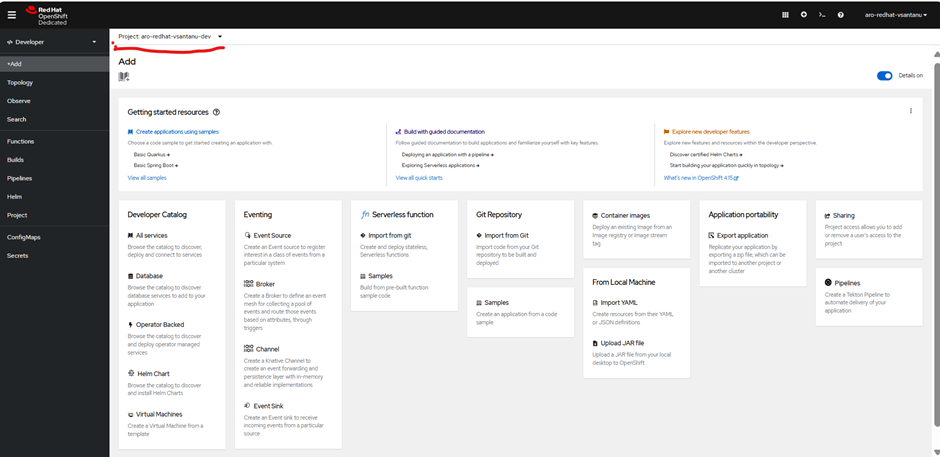
+
4. 배포에는 여러가지 옵션이 있습니다.
* GIT 리포지토리에서
* 컨테이너 레지스트리
5. 여기서는 "container images" 옵션을 사용하고 있습니다.
6. “Container images” 옵션을 클릭하면 다음 페이지가 열립니다.
+
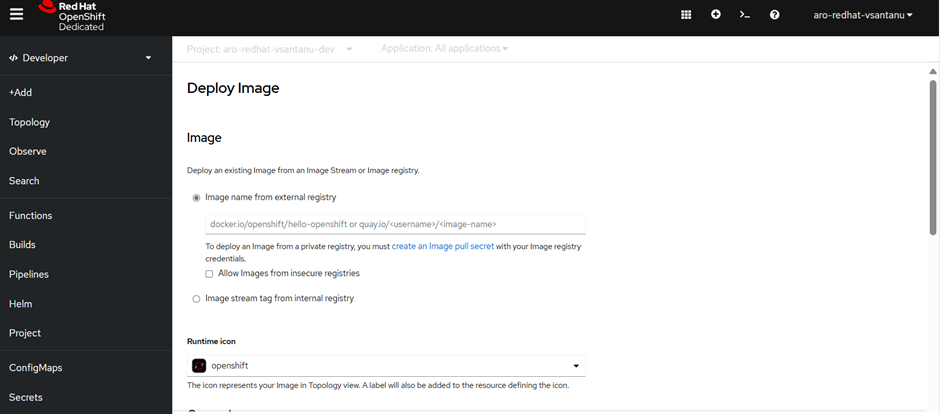
+
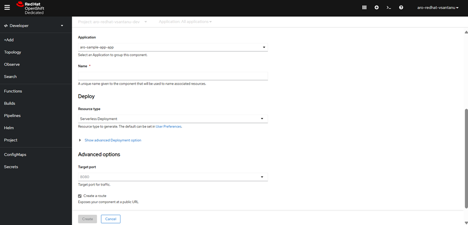
+
7. 레지스트리 이미지 이름(공개 또는 비공개)을 입력하고 모든 세부 정보를 입력하면 이미지가 ARO 워크로드로 배포됩니다. +
참고: 편의를 위해 DockerHub 공개 이미지를 사용했습니다.
8. 워크로드가 배포되면 배포 세부 정보, 로그 및 기타 모니터링 측면을 볼 수 있습니다.
9. 배포된 작업 부하에 대한 자세한 정보를 보려면 "Administration" 측면으로 전환하세요.
+
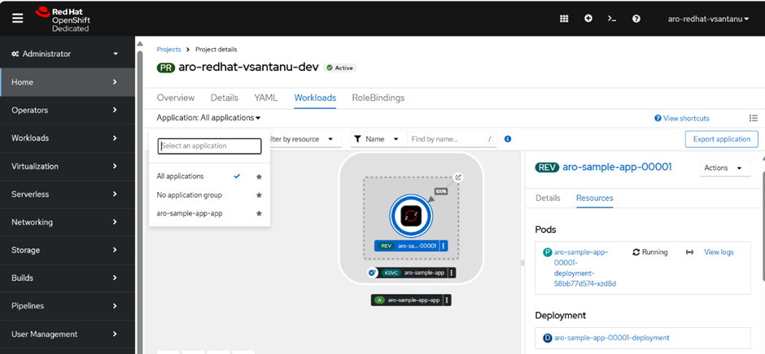
+
10. 경로 섹션은 배포된 애플리케이션에 외부적으로 접근하는데 도움이 됩니다.
+
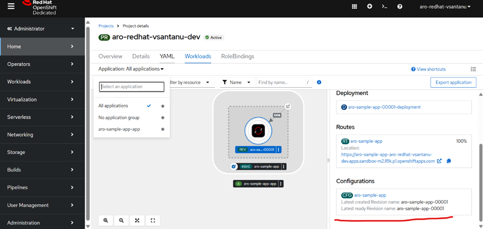
+
11. 배포 후 샘플 컨테이너에 배포된 애플리케이션은 다음과 같습니다.
+
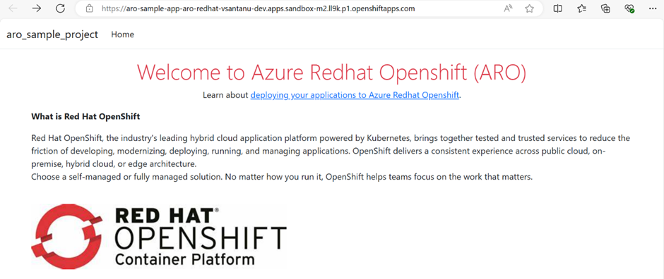
+
12. 클러스터 관리 및 기타 관리/인프라 관련 작업을 위해 관리자 모드로 전환하세요. "Workload" 블레이드로 이동하여 Pod, 배포, 시크릿, 구성 맵등을 확인하세요.
+
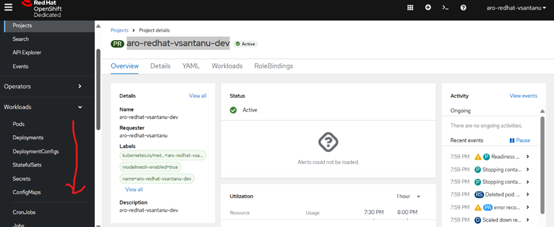
+
13. "pods" 메뉴에서 새로운 포드를 만들 수 있습니다.
+
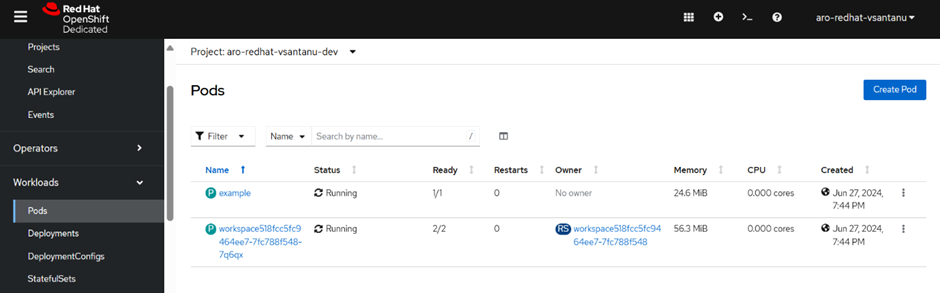
+
14. "Create pods"를 클릭하면 아래 YAML이 표시됩니다. 템플릿을 편집하고 포드를 만듭니다.
+
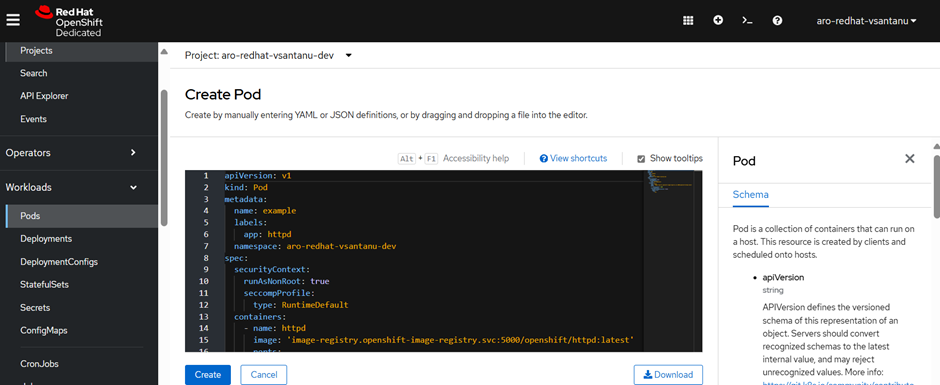

=== 5.2 ARO에서 컨테이너화됨 앱을 위한 마이그레이션 단계, OpenShift 웹 콘솔 사용, Docklerfile 전략(수동), Azure Container Registry(ACR) 이미지 사용

Azure Container Registry(ACR)는 지리적 복제와 같은 엔터프라이즈 기능을 갖춘 프라이빗 Docker 컨테이너 이미지를 저장하는 데 사용할 수 있는 관리형 컨테이너 레지스트리 서비스입니다. ARO 클러스터에서 ARO에 액세스하려면 클러스터가 Kubernetes 시크릿에 Docker 로그인 자격 증명을 저장하여 ACR에 인증해야 합니다.

1. 이 가이드에서는 기본 Azure Container Registry가 있다고 가정합니다. 없는 경우 Azure Portal 또는 Azure CLI 지침을 사용하여 컨테이너 레지스트리를 만드세요. 자세한 내용은 Azure Landing Zone Accelerlator를 참조하세요. +
자세한 내용은 https://github.com/Azure/ARO-Landing-Zone-Accelerator/blob/main/deployment/CLI/09%20appdeployment/app.azcli[ARO-Landing-Zone-Accelerator GitHub 페이지]를 참조하세요.
+
2. OpenShift 클러스터 "Administration" 퍼스펙티브에 로그인하고 새 프로젝트를 생성합니다. 이후 단계에서는 새로 생성된 프로젝트를 사용합니다.
+
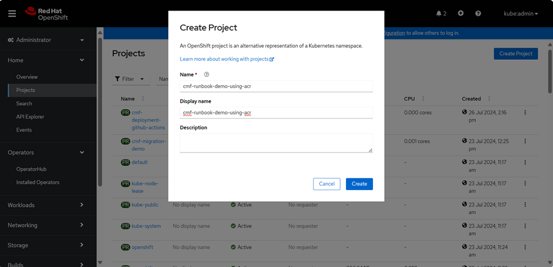
+
3. 모든 보안 권한(Full secret)을 얻습니다.
* ARO 클러스터에서 레지스트리에 액세스 하려면 ACR에서 모든 보안 권한(Full secret)이 필요합니다.
* 모든 보안 권한(Full secret)을 얻으려면 Azure Portal이나 Azure CLI를 사용할 수 있습니다.
* Azure Portal을 사용하는 경우 ACR 인스턴스로 이동하여 액세스 키를 선택합니다. docker-username은 컨테이너 레지스트리의 이름이며, docker-password에는 Password 또는 password2를 사용합니다.
+
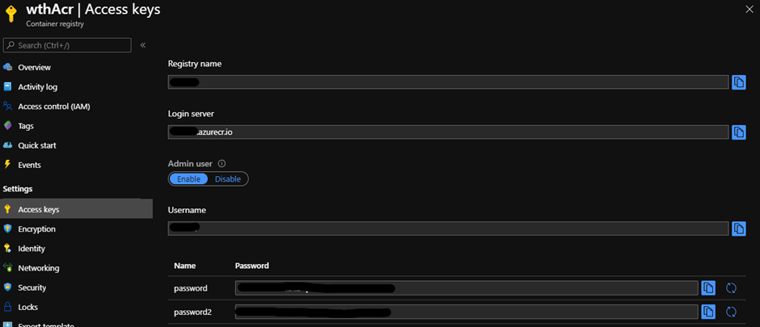
+
* 대신 Azure CLI를 사용하여 다음 자격 증명을 얻을 수 있습니다.
+
----
az acr credential show -n your registry name
----
+
4. 쿠버네티스 Secret 생성: 이 자격증명을 사용하여 쿠버네티스 시크릿을 생성합니다. ACR 자격 증명을 사용하여 다음 명령을 실행합니다.
+
----
oc create secret docker-registry \
--docker-server=<your registry name>.azurecr.io \
--docker-username=<your registry name> \
--docker-password=******** \
--docker-email=unused \
 acr-secret
----
+
5. 서비스 계정에 시크릿을 연결합니다. 다음으로, Pod가 컨테이너 레지스트리에 접속할 수 있도록 포드에서 사용할 서비스 계정에 시크릿을 연결합니다. 서비스 계정 이름은 Pod에서 사용하는 서비스 계정 이름과 일치해야 합니다. default는 기본 서비스 계정입니다.
+
----
oc secrets link default <pull_secret_name> --for=pull
----
+
6. oc new-app 명령을 사용하여 ACR 이미지를 배포하고 이미지 풀 시크릿을 연결합니다.
+
----
oc new-app --name=sample-aro-dotnet-app-using-acr <your_ registry_name>.azurecr.io/aro-dotnet-sample-app:latest
----
+
7. 현재 서비스는 준비되었지만, 공용 인터넷을 통해 애플리케이션에 접속할 경로는 아직 생성되지 않았습니다. 다음 명령을 사용하여 결로를 생성합니다.
+
----
oc expose svc/aro-dotnet-sample-app
----
+
8. 노출된 경로로 이동하여 앱에 접속합니다.
+
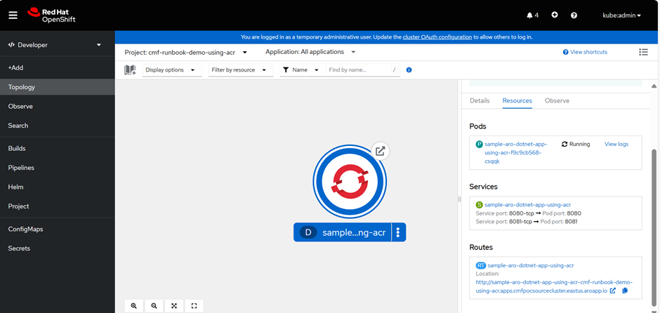
+
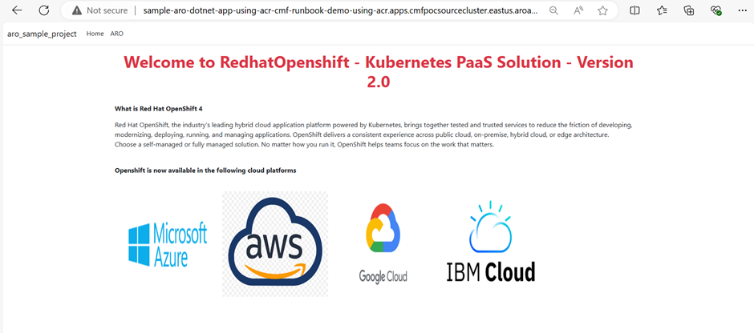

=== 5.3 OpenShift 웹 콘솔을 사용한 ARO 컨테이너화 앱 마이그레이션 단계, S2I(Source-to-Image) 전략(수동)

1. 이 접근 방식은 DockerFile을 사용하지 않고도, 즉 앱을 컨테이너화 하지 않고도 작동합니다. 이 전략은 소스를 이해하고 대상 언어와 운영체제를 이해하여 이미지를 만드는 방식으로 작동합니다.
+
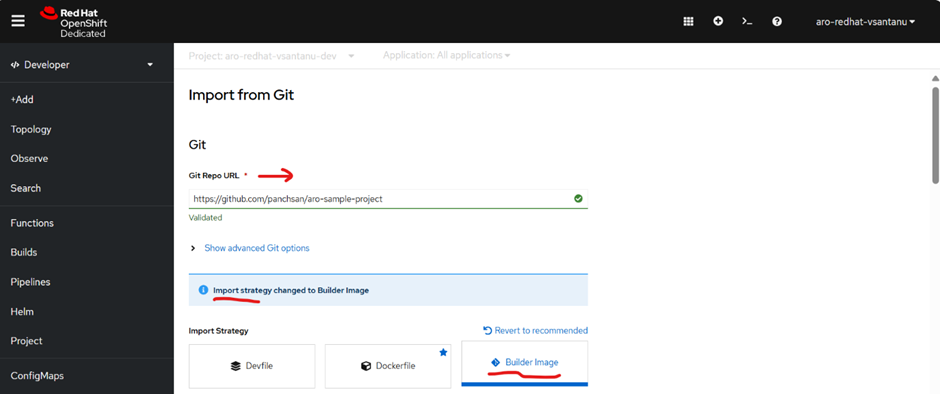
+
2. 가져오기 전략을 “Builder image”로 변경합니다.
+
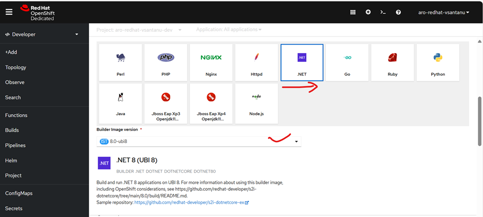
+
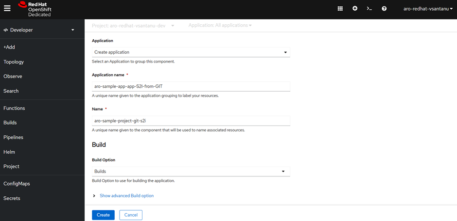
+
3. 워크로드를 생성하면 동일한 애플리케이션이 배포되지만 S2I 전략을 사용합니다.
+
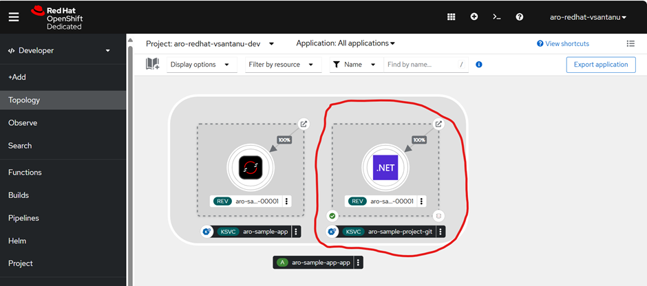
+
4. Workload를 클릭하고 생성된 경로를 사용하여 애플리케이션을 탐색합니다.
+
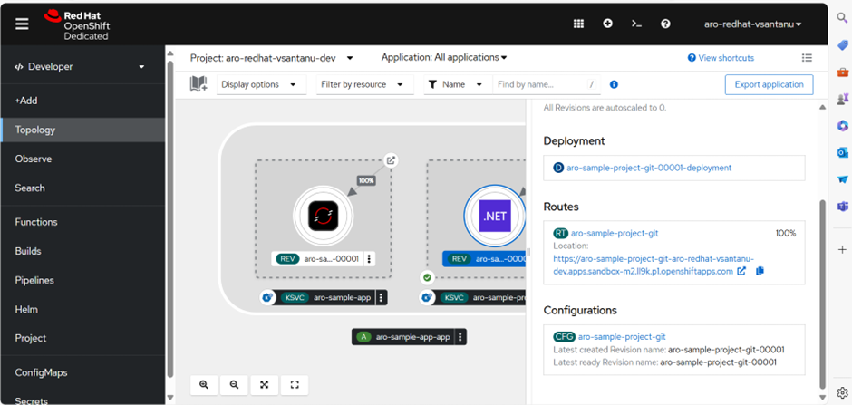
+
5. 애플리케이션이 배포되면 노출된 서비스 경로를 사용하여 애플리케이션에 액세스 할 수 있습니다.
+
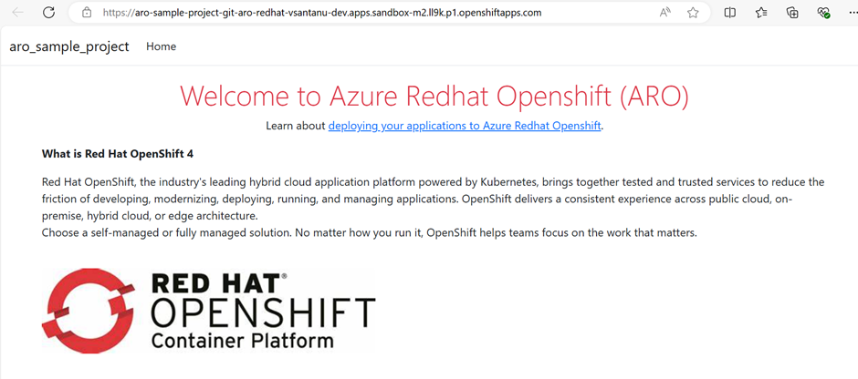

=== 5.4 OpenShift(OC) 명령줄을 사용하여 ARO에서 컨테이너화 된 앱의 마이그레이션 단계

1. 새 클러스터가 설치되면 "Help" 아이콘으로 이동하고 "Command line Tools" 옵션으로 이동하면 OpenShift 명령줄 도구를 다운로드 할 수 있습니다.
+
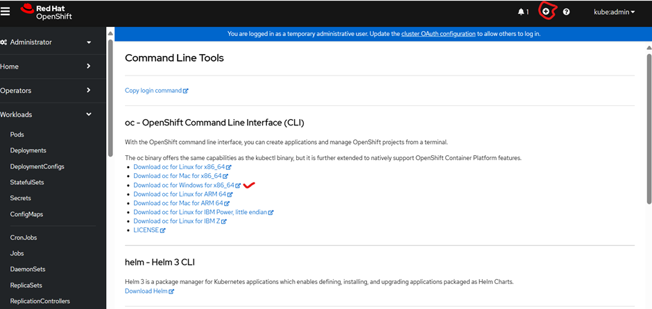
+
2. oc 명령줄 도구를 사용하면 웹 콘솔 단계에 정의된 모든 단계를 수행할 수 있습니다.
+
https://docs.openshift.com/en/container-platform/4.8/cli_reference/openshift_cli/developer-cli-commands.html[OpenShift CLI 개발자 명령 참조 - OpenShift CLI(oc) | CLI 도구 | OpenShift Container Platform 4.8]
3. oc 명령줄 도구를 사용하여 OpenShift 클러스터에 애플리케이션을 배포하는 단계만 살펴보았습니다.
4. 클러스터를 사용하여 oc 명령줄 도구에 연결하려면 "copy login command"를 클릭합니다. 그러면 탭이 열리고 토큰이 표시됩니다.
+
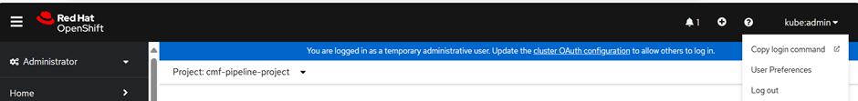
+
5. 호그인 명령을 복사하고 원하는 명령 프롬프트/터미널/PowerShell을 사용하여 클러스터에 연결합니다.
6. oc new-app 명령을 사용하면 워크로드를 클러스터에 배포할 수 있습니다.
+
----
oc new-app openshift/dotnet:8.0~https://github.com/<user_name>/aro-sample-project.git --name=aro-sample-app-cmd --context-dir=aro-sample-project
----
+
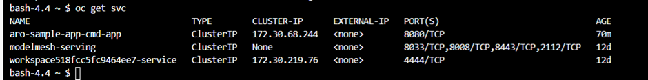
+
image:./images/image24.png[]
7. 위 명령어는 샘플앱과 서비스를 배포합니다. 아래 명령어를 사용하여 로그를 확인할 수 있습니다.
+
----
oc new-app openshift/dotnet:8.0~https://github.com/<user_name>/aro-sample-project.git --name=aro-sample-app-cmd --context-dir=aro-sample-project
----
+
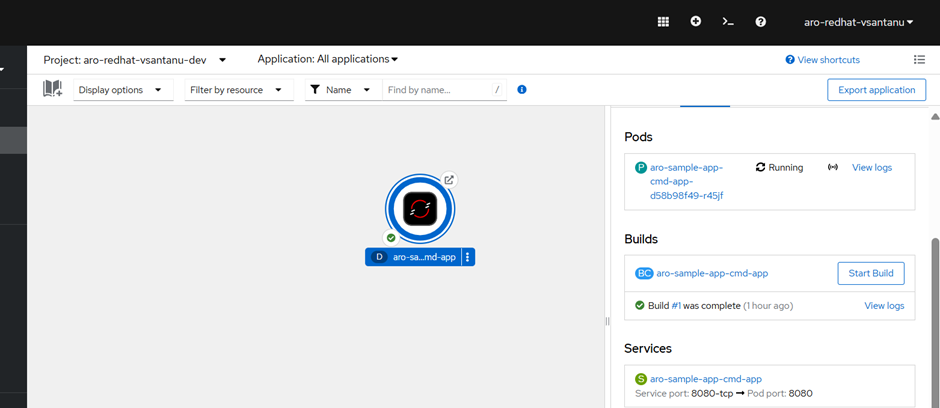
8. 현재 서비스는 준비되었지만, 공용 인터넷을 통해 애플리케이션에 접속할 경로가 생성되지 않았습니다. 다음 명령을 사용하여 경로를 생성합니다.
+
----
oc expose svc/aro-sample-app-cmd
----
+
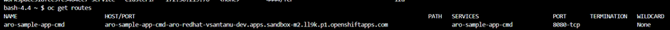
9. 경로가 활성화되면 애플리케이션을 사용할 수 있습니다.
+
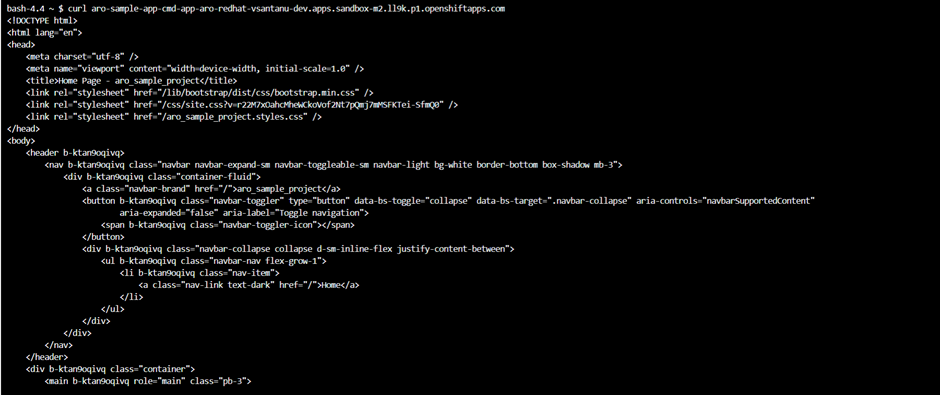
+

== 6. DevOps 파이프라인

=== 6.1 OpenShift 내장 Tekton 파이프라인을 사용하여 ARO에서 컨테이너화된 앱의 마이그레이션 단계(수동 트리거)

1. OpehShift에서 Tekton은 OpenShift Pipeline Operator라는 운영자로 제공됩니다. 설치되어 있는지 확인합니다. `Administrator` 뷰를 선택한 후 `Operators` -> `Installed Operators` -> `Searchf or OpenShift Pipelines` 로 이동하여 설치되었는지 확인합니다.
+
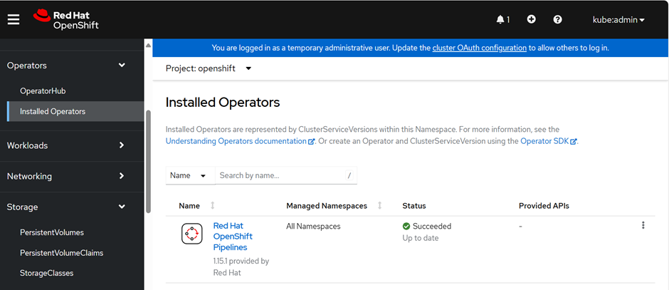
2. 새 프로젝트를 만들고 이름을 'cmf-sample-pipeline-dotnet-app'으로 저장합니다.
+
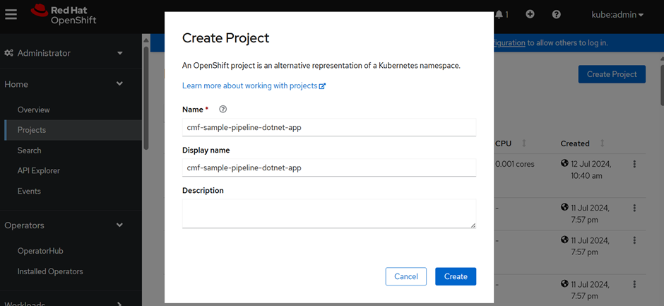
3. Tekton은 모든 파이프라인 호출 시 Persistent volume을 요구합니다. 따라서 프로젝트에 최소 1GB의 영구 볼륨 클레임(PVC)이 있는지 확인해야 합니다. 만약 없다면 `administrator` 뷰를 선택한 후 `Storage` ->  `Persistent Volume Claim` 으로 이동하여 PVC를 생성하고 `my-sample-app-tekton-pvc` 라는 이름을 지정합니다.
+
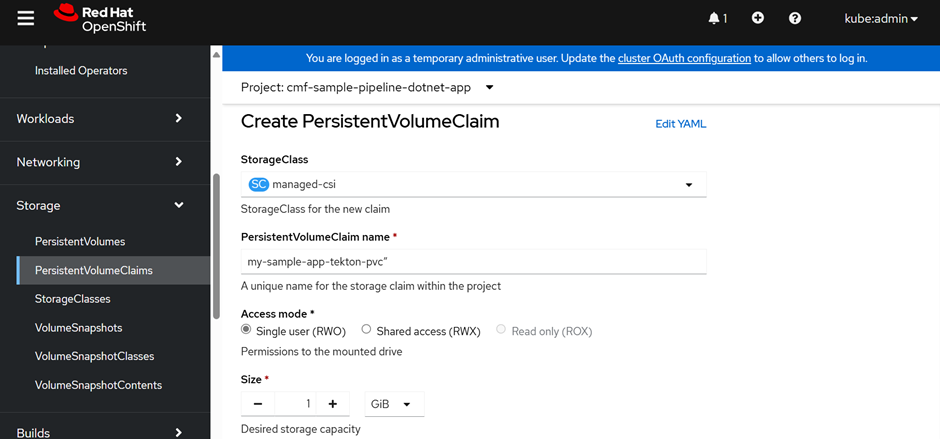
+
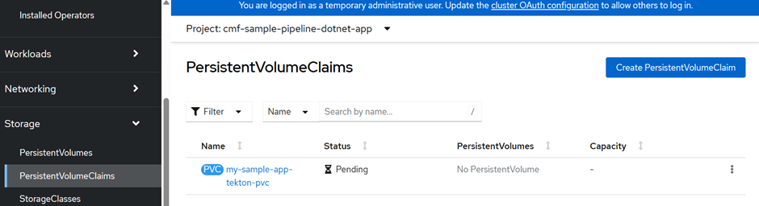
4. 파이프라인을 생성하려면 `Administrator` 보기를 선택하고 `Pipelines` -> `Pipelines` 로 이동한 다음 드롭다운 버튼 `Choose` 를 클릭하고 `Pipeline` 을 선택합니다.
* Pipeline Builder 양식이 열리면 아래오 ㅏ같이 구성합니다.
** `Configure via` 에서 `Pipeline Builder` 라디오 버튼을 클릭합니다.
** `name` 필드에 파이프라인 이름(예: `aro-dotnet-builder-pipeline`)을 입력합니다.
** Parameters에서, `Add Parameter`를 클릭하여 4개의 파라미터를 추가합니다.
*** Name: APP_NAME, 설명: 배포할 애플리케이션의 이름, 기본값: my-sample-dotnet-app
*** Name: APP_GIT_REPO, 설명: 애플리케이션 소스 코드에 대한 GitHub repo URL, 기본값: https://github.com/ <your_GitHub_user>/<your_repo_name>
*** Name: GIT_REVISION, 설명: 배포할 GitHub repo 브랜치 이름, 기본값: master(또는 main)
*** Name: PROJECT_NAME, 설명: 이미지 스트림이 내부 레지스트리에 저장되는 OpenShift 프로젝트, 기본값: <Your_current_Namespace>
* workspace에서, `add workspace`를 클릭하여 새 workspace를 생성하고, `share-workspace`를 입력하고 새 작업 공간을 생성합니다.
+
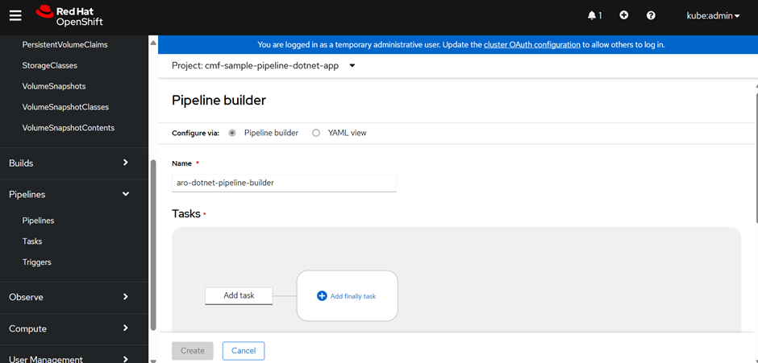
+
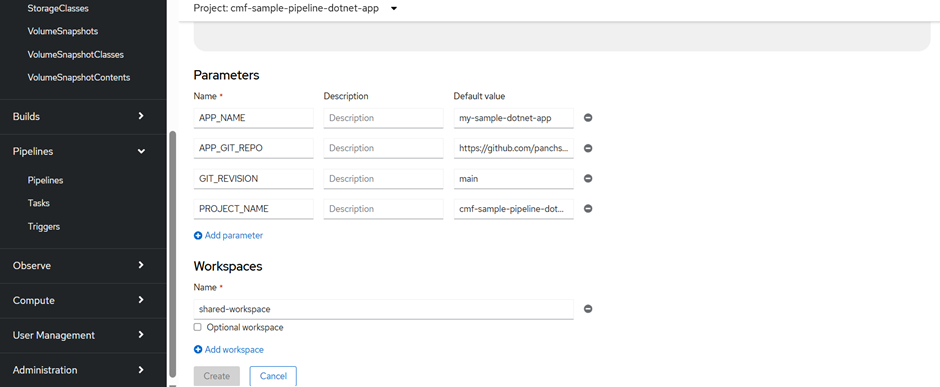
5. Tekton 파이프라인의 기본 정의가 완료되었습니다. 이제 복제-빌드-배포 주기를 위한 파이프라인을 추가해야 합니다.
6. Pipeline 작업 - 아래는 모든 샘플 파이프라인에 대한 샘플 작업입니다.
+
**Task 1: Github에서 소스 코드 검색**
+
Pipeline Builder에서 `Add Task` 를 클릭합니다. `git clone` 을 입력하고 Red Hat에서 작업을 선택한 후 `Add` 버튼을 클릭합니다.
+
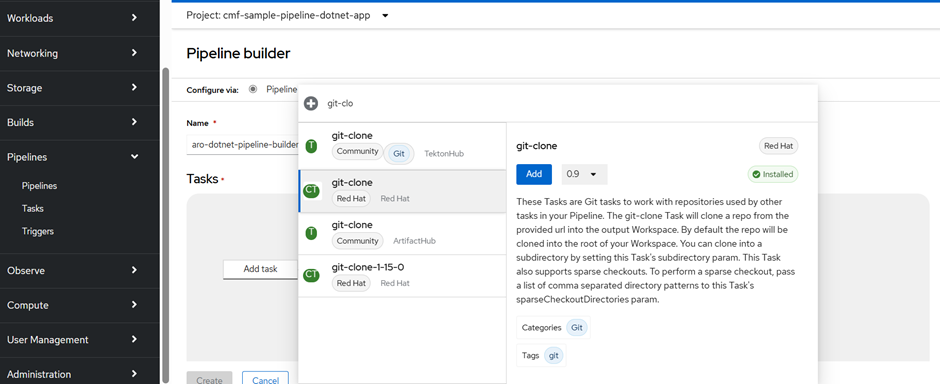
+
다음과 같이 구성합니다.
+
* Display Name: fetch
* Parameters->url : $(params.APP_GIT_REPO)
* Parameter->revision : $(params.GIT_REVISION)
* Workspaces->output : shared-workspace
+
다른 값은 기본값으로 둡니다. 이 작업의 구성을 종료하려면 바깥쪽 아무 곳이나 클릭합니다.
+
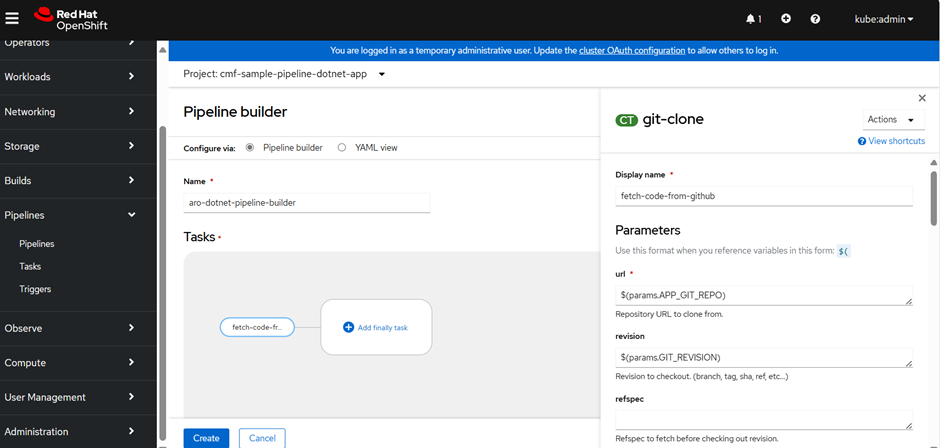
+
**Task 2: 소스 코드 빌드**
+
`fetch` 작업에 마우스를 올리고 오른쪽에 있는 파란색 `+` 기호를 클릭합니다. 그러면 다른 작업이 추가됩니다. 새로운 `Add Task` 버튼을 클릭하고 필터에 `S2I dotnet` 을 입력합니다. Red Hat에서 해당 옵션을 선택하고 `Add` 를 클릭합니다. 작업을 다시 클릭하여 작업 구성을 열고 아래와 같이 설정합니다.
+
* Display name: build
* Parameters-> Image :
+
----
image-registry openshift-image-registry.svc:5000/$(params.PROJECT_NAME)/$(params.APP_NAME):dev
----
+
* Add environment variable - DOTNET_STARTUP_PROJECT=aro-sample-project/aro-sample-project.csproj
* Workspaces->source : shared-workspace
+
다른 값은 기본으로 둡니다. 이 작업의 구성을 종료하려면 바깥쪽 아무 곳이나 클릭합니다.
+
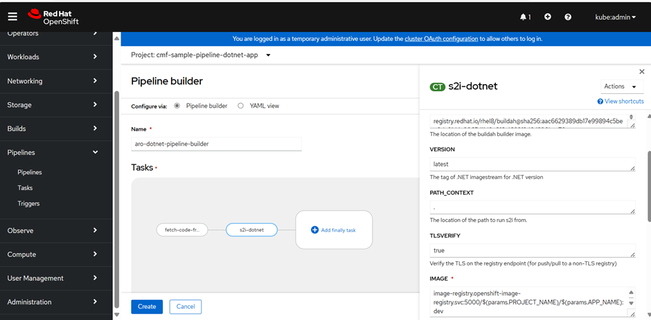
+
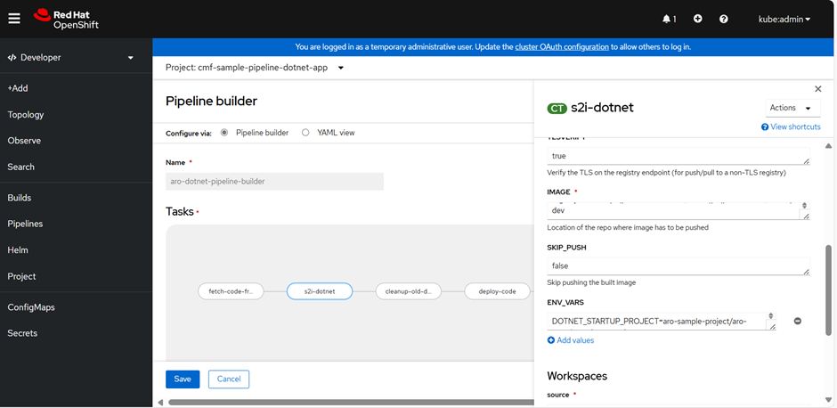
+
**Task 3: 기존 배포 제거**
+
`build` 작업에 마우스를 올리고 오른쪽에 있는 파란색 `+` 기호를 클릭합니다. 그러면 다른 작업이 추가됩니다. 새로운 `Add Task` 버튼을 클릭하고 필터에 `OpenShift Client` 를 입력합니다. Red Hat에서 옵션을 선택하고 `Add` 를 클릭합니다. `Task` 를 다시 클릭하여 작업 구성을 열고 아래와 같이 설정합니다.
+
* Display Name: cleanup-old-deployment
* Parameters->Script :
+
----
oc delete all -l app=$(params.APP_NAME)
----
+
다른 값은 기본으로 둡니다. 이 작업의 구성을 종료하려면 바깥쪽 아무 곳이나 클릭합니다.
