= Managed RedHat OpenShift를 Azure ARO(RedHat OpenShift)ë¡œ 마ì´ê·¸ë ˆì´ì…˜

== 문서 요약

[cols="1,5", options="header"]
|===
|문서 항목|í˜„ì¬ ê°€ì¹˜
|문서 제목|FACTORY_Runbook_Azure_RedHat_Openshift_Onprem_Containerized_Apps_To_Openshift
|프로그ë¨|Cloud Acceleration Factory
|마지막으로 수정한 날짜|27-03-2024
|마지막 검토 날짜|10-07-2024
|ìƒíƒœ|승ì¸
|문서 설명|ì´ ë¬¸ì„œì—서는 Devops를 사용하여 온프레미스 컨테ì´ë„ˆí™”ëœ ì• í”Œë¦¬ì¼€ì´ì…˜ì„ ARO í´ëŸ¬ìŠ¤í„°ë¡œ 마ì´ê·¸ë ˆì´ì…˜/구축하는 ë°©ë²•ì— ëŒ€í•œ ì§€ì¹¨ì„ ì œê³µí•©ë‹ˆë‹¤.
|===

== 변경 로그

== 목차

<<1. 소개>>

* <<1.1 Azure RedHat OpenShift(ARO)>>
* <<1.2 참조 아키í…처>>

<<2. ì—­í• ê³¼ ì±…ì„>>

<<3. 계íš>>

<<4. 전제 조건>>

<<5. 실행>>

* <<5.1 OpenShift 웹 콘솔, DockerFile ì „ëµ(수ë™), DockerHub ì´ë¯¸ì§€ 사용 AROì—ì„œ 컨테ì´ë„ˆí™” ëœ ì•±ì˜ ë§ˆì´ê·¸ë ˆì´ì…˜ 단계>>
* <<5.2 AROì—ì„œ 컨테ì´ë„ˆí™”ë¨ ì•±ì„ ìœ„í•œ 마ì´ê·¸ë ˆì´ì…˜ 단계, OpenShift 웹 콘솔 사용, Docklerfile ì „ëµ(수ë™), Azure Container Registry(ACR) ì´ë¯¸ì§€ 사용>>
* <<5.3 OpenShift 웹 ì½˜ì†”ì„ ì‚¬ìš©í•œ ARO 컨테ì´ë„ˆí™” 앱 마ì´ê·¸ë ˆì´ì…˜ 단계, S2I(Source-to-Image) ì „ëµ(수ë™)>>
* <<5.4 OpenShift(OC) ëª…ë ¹ì¤„ì„ ì‚¬ìš©í•˜ì—¬ AROì—ì„œ 컨테ì´ë„ˆí™” ëœ ì•±ì˜ ë§ˆì´ê·¸ë ˆì´ì…˜ 단계>>

<<6. DevOps 파ì´í”„ë¼ì¸>>

* <<6.1 OpenShift ë‚´ì¥ Tekton 파ì´í”„ë¼ì¸ì„ 사용하여 AROì—ì„œ 컨테ì´ë„ˆí™”ëœ ì•±ì˜ ë§ˆì´ê·¸ë ˆì´ì…˜ 단계(ìˆ˜ë™ íŠ¸ë¦¬ê±°)>>
* <<6.2 OpenShift ë‚´ì¥ Tekton 파ì´í”„ë¼ì¸ì„ 사용하여 AROì—ì„œ 컨테ì´ë„ˆí™”ëœ ì•±ì„ ë§ˆì´ê·¸ë ˆì´ì…˜í•˜ëŠ” 단계(ìë™ íŠ¸ë¦¬ê±°, GitHub 웹훅)>>
* <<6.3 GibHub Actions를 사용하여 AROì—ì„œ 컨테ì´ë„ˆí™” ëœ ì•±ì˜ ë§ˆì´ê·¸ë ˆì´ì…˜ 단계>>
* <<6.4 Azure DevOps를 사용하여 AROì—ì„œ 컨테ì´ë„ˆí™” ëœ ì•±ì˜ ë§ˆì´ê·¸ë ˆì´ì…˜ 단계>>

<<7. 부ë¡>>

== 1. 소개

ì´ ë¬¸ì„œì—서는 ARO(Azure RedHat OpenShift)ì— ëŒ€í•œ ê°„ëµí•œ 소개, ARO 마ì´ê·¸ë ˆì´ì…˜ì„ 위한 필수 구성 요소 ë° ìƒ˜í”Œ 컨테ì´ë„ˆí™” ëœ ì• í”Œë¦¬ì¼€ì´ì…˜ì„ ARO í´ëŸ¬ìŠ¤í„°ë¡œ 마ì´ê·¸ë ˆì´ì…˜í•˜ëŠ” ì세한 절차/단계를 제공합니다.

=== 1.1 Azure RedHat OpenShift(ARO)

Azure RedHat OpenShift는 Microsoft와 Red Hatì´ ê³µë™ìœ¼ë¡œ ëª¨ë‹ˆí„°ë§ ë° ìš´ì˜í•˜ëŠ” 주문성 고가용성 완전 관리형 OpenShift í´ëŸ¬ìŠ¤í„°ë¥¼ 제공합니다. Kuberneters는 Red Hat OpenShiftì˜ í•µì‹¬ì…니다. OpeenShift는 Kubernetees를 보완하는 부가가치 ê¸°ëŠ¥ì„ ì œê³µí•˜ì—¬ 개발ì ë° ìš´ì˜ì ê¸°ëŠ¥ì„ í¬ê²Œ 개선한 턴키 PaaS(Container Platform as a Service)ë¡œ 만듭니다.

다ìŒì€ AROì˜ ì£¼ìš” 기능ì…니다.

* Microsoft와 RedHatì´ ê³µë™ìœ¼ë¡œ ëª¨ë‹ˆí„°ë§ ë° ìš´ì˜í•˜ëŠ” 온디맨드 완전 관리형 OpenShift í´ëŸ¬ìŠ¤í„°
* 쿠버네티스 - PaaS
* 셀프 서비스, 온디맨드 애플리케ì´ì…˜ ìŠ¤íƒ í”„ë¡œë¹„ì €ë‹
* 통합 개발ì ë„구
* 보안 ë° ê·œì • 준수
* 확ì¥ì„± ë° ê°€ìš©ì„±
* 하ì´ë¸Œë¦¬ë“œ ë° ë©€í‹° í´ë¼ìš°ë“œ 지ì›
* Red Hat Enterprise Linux CoreOS(RHCOS)
* 최신 애플리케ì´ì…˜ 아키í…처 지ì›
* 기본 제공 ìš´ì˜ì ë° ìš´ì˜ì 허브 지ì›
* 기본 제공 CI/CD 파ì´í”„ë¼ì¸

=== 1.2 참조 아키í…처

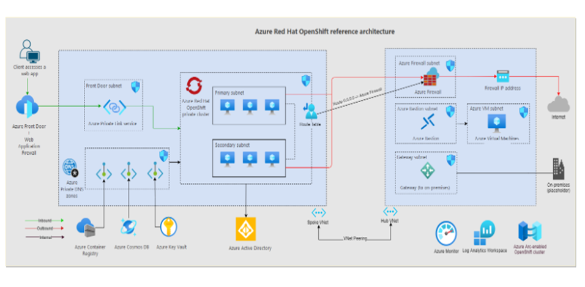

== 2. ì—­í• ê³¼ ì±…ì„

[cols=5, options="header"]
|===
|과업|ì±…ì„|ì±…ì„|ìƒë‹´|ì •ë³´
|í´ëŸ¬ìŠ¤í„° ìƒì„±|ê³ ê°/파트너|ê³ ê°/파트너|ê³ ê°/파트너|Factory
|공유할 í‰ê°€ ë³´ê³ ì„œ|ê³ ê°/파트너|ê³ ê°/파트너|ê³ ê°/파트너|Factory
|ë¶„ì„ ë³´ê³ ì„œ ì‘성|Factory|Factory|ê³ ê°/Factory|ê³ ê°/Factory
|애플리케ì´ì…˜ ë°°í¬|Factory/ê³ ê°|Factory/ê³ ê°|Factory/ê³ ê°|Factory/ê³ ê°
|===

== 3. 계íš

* í´ëŸ¬ìŠ¤í„° 관리 액세스 ë³´ì¥
* Azure 구ë…ì— ëŒ€í•œ Controbutor ì—­í• 

== 4. 전제 조건

* 마ì´ê·¸ë ˆì´ì…˜í•  애플리케ì´ì…˜ì˜ 최종화(Wave 계íš)
* Azure 마ì´ê·¸ë ˆì´ì…˜ ë„구를 실행하여 애플리케ì´ì…˜ í‰ê°€/ìˆ˜ë™ ê²€ìƒ‰ - VMì—ì„œ 실행 ì¤‘ì¸ ëª¨ë“  애플리케ì´ì…˜, 서비스 ë° ì¢…ì†ì„± ì‹ë³„
* ëœë”© ì¡´ Azure Red Hat OpenShift í´ëŸ¬ìŠ¤í„° ìƒì„±
* AROì—ì„œ 네트워킹, ì €ì¥ì†Œ, 보안 ì„¤ì •ì„ êµ¬ì„±í•©ë‹ˆë‹¤.
* í´ëŸ¬ìŠ¤í„° 액세스 ë° ê¸°ì—¬ì ì—­í•  액세스
* 매니í˜ìŠ¤íŠ¸ 파ì¼ì— 대한 액세스
* 사ì´íŠ¸ ê°„ 연결성
* 매우 ë‚®ì€ ì§€ì—° 시간으로 DB ì—°ê²°ì´ ê°€ëŠ¥í•œì§€ 확ì¸í•˜ì„¸ìš”.
* 마ì´ê·¸ë ˆì´ì…˜ 요구 사항(구성 맵, 스토리지 í´ë˜ìŠ¤, 제한, 비밀 등)ì„ ì¶©ì¡±í•˜ëŠ”ì§€ 확ì¸í•˜ê¸° 위해 마ì´ê·¸ë ˆì´ì…˜ ì „ì— ì½”ë“œ ìˆ˜ì •ì„ ì™„ë£Œí•©ë‹ˆë‹¤.
* 수집 ë° ë³µì œ/ìƒì„±í•  프로ì íŠ¸ 네ì„스í˜ì´ìŠ¤
* 환경ì—ì„œ ì ì ˆí•œ DNS 확ì¸ì„ ë³´ì¥í•©ë‹ˆë‹¤.
* Microsoft 참조 아키í…처 다ì´ì–´ê·¸ë¨ì— ë”°ë¼ ëŒ€ìƒ ì•„í‚¤í…처 다ì´ì–´ê·¸ë¨ì„ 준비합니다.
* ê³ ê°ì˜ 승ì¸
* Azure Red Hat OpenShift 4 í´ëŸ¬ìŠ¤í„°ì— 대한 Microsoft Entra ì¸ì¦ 구성
* 애플리케ì´ì…˜ì˜ 성능, 부하 ë° ë¦¬ì†ŒìŠ¤ 활용ë„를 í‰ê°€í•©ë‹ˆë‹¤.
* 스케ì¼ë§ 요구 사항 ê²°ì •
* Docker를 사용하여 애플리케ì´ì…˜ì„ 컨테ì´ë„ˆ ì´ë¯¸ì§€ë¡œ 변환합니다.
* ê° ì• í”Œë¦¬ì¼€ì´ì…˜ 구성 ìš”ì†Œì— ëŒ€í•œ Dockerfileì„ ë§Œë“­ë‹ˆë‹¤.
* 마ì´ê·¸ë ˆì´ì…˜í•˜ê¸° ì „ì— ë°±ì—…ì´ ì œëŒ€ë¡œ ë˜ì–´ ìˆëŠ”지 확ì¸í•˜ì„¸ìš”.
* GitHub/Azure DevOps와 ê°™ì€ ë„구를 사용하여 CI/CD 파ì´í”„ë¼ì¸ì„ 구성합니다. 

== 5. 실행

=== 5.1 OpenShift 웹 콘솔, DockerFile ì „ëµ(수ë™), DockerHub ì´ë¯¸ì§€ 사용 AROì—ì„œ 컨테ì´ë„ˆí™” ëœ ì•±ì˜ ë§ˆì´ê·¸ë ˆì´ì…˜ 단계

1. OpenShift í´ëŸ¬ìŠ¤í„°ì— 로그ì¸í•˜ê³  "Administration" 화면으로 ì´ë™í•©ë‹ë‹¤.
2. ì•„ì§ ìƒì„±ë˜ì§€ ì•Šì€ ê²½ìš° 프로ì íŠ¸ 네ì„스í˜ì´ìŠ¤ë¥¼ 만듭니다.
3. "Developer" ê´€ì ìœ¼ë¡œ 전환합니다.
+
image:./images/image02.png[]
+
4. ë°°í¬ì—는 여러가지 ì˜µì…˜ì´ ìˆìŠµë‹ˆë‹¤.
* GIT 리í¬ì§€í† ë¦¬ì—ì„œ
* 컨테ì´ë„ˆ 레지스트리
5. 여기서는 "container images" ì˜µì…˜ì„ ì‚¬ìš©í•˜ê³  ìˆìŠµë‹ˆë‹¤.
6. “Container imagesâ€ ì˜µì…˜ì„ í´ë¦­í•˜ë©´ ë‹¤ìŒ í˜ì´ì§€ê°€ 열립니다.
+
image:./images/image03.png[]
+
image:./images/image04.png[]
+
7. 레지스트리 ì´ë¯¸ì§€ ì´ë¦„(공개 ë˜ëŠ” 비공개)ì„ ì…력하고 모든 세부 정보를 ì…력하면 ì´ë¯¸ì§€ê°€ ARO 워í¬ë¡œë“œë¡œ ë°°í¬ë©ë‹ˆë‹¤. +
참고: í¸ì˜ë¥¼ 위해 DockerHub 공개 ì´ë¯¸ì§€ë¥¼ 사용했습니다.
8. 워í¬ë¡œë“œê°€ ë°°í¬ë˜ë©´ ë°°í¬ ì„¸ë¶€ ì •ë³´, 로그 ë° ê¸°íƒ€ ëª¨ë‹ˆí„°ë§ ì¸¡ë©´ì„ ë³¼ 수 ìˆìŠµë‹ˆë‹¤.
9. ë°°í¬ëœ ì‘ì—… ë¶€í•˜ì— ëŒ€í•œ ì세한 정보를 보려면 "Administration" 측면으로 전환하세요.
+
image:./images/image05.png[]
+
10. 경로 ì„¹ì…˜ì€ ë°°í¬ëœ 애플리케ì´ì…˜ì— 외부ì ìœ¼ë¡œ ì ‘ê·¼í•˜ëŠ”ë° ë„ì›€ì´ ë©ë‹ˆë‹¤.
+
image:./images/image06.png[]
+
11. ë°°í¬ í›„ 샘플 컨테ì´ë„ˆì— ë°°í¬ëœ 애플리케ì´ì…˜ì€ 다ìŒê³¼ 같습니다.
+
image:./images/image07.png[]
+
12. í´ëŸ¬ìŠ¤í„° 관리 ë° ê¸°íƒ€ 관리/ì¸í”„ë¼ ê´€ë ¨ ì‘ì—…ì„ ìœ„í•´ 관리ì 모드로 전환하세요. "Workload" 블레ì´ë“œë¡œ ì´ë™í•˜ì—¬ Pod, ë°°í¬, ì‹œí¬ë¦¿, 구성 ë§µë“±ì„ í™•ì¸í•˜ì„¸ìš”.
+
image:./images/image08.png[]
+
13. "pods" 메뉴ì—ì„œ 새로운 í¬ë“œë¥¼ 만들 수 ìˆìŠµë‹ˆë‹¤.
+
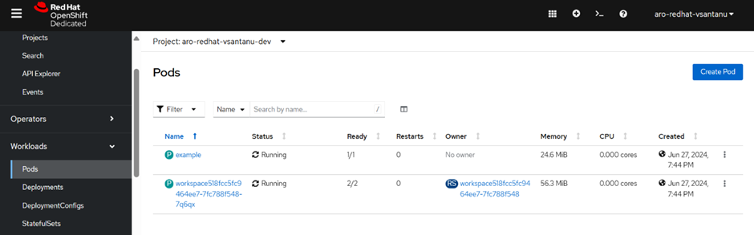
+
14. "Create pods"를 í´ë¦­í•˜ë©´ ì•„ë˜ YAMLì´ í‘œì‹œë©ë‹ˆë‹¤. í…œí”Œë¦¿ì„ í¸ì§‘하고 í¬ë“œë¥¼ 만듭니다.
+
image:./images/image10.png[]

=== 5.2 AROì—ì„œ 컨테ì´ë„ˆí™”ë¨ ì•±ì„ ìœ„í•œ 마ì´ê·¸ë ˆì´ì…˜ 단계, OpenShift 웹 콘솔 사용, Docklerfile ì „ëµ(수ë™), Azure Container Registry(ACR) ì´ë¯¸ì§€ 사용

Azure Container Registry(ACR)는 ì§€ë¦¬ì  ë³µì œì™€ ê°™ì€ ì—”í„°í”„ë¼ì´ì¦ˆ ê¸°ëŠ¥ì„ ê°–ì¶˜ 프ë¼ì´ë¹— Docker 컨테ì´ë„ˆ ì´ë¯¸ì§€ë¥¼ ì €ì¥í•˜ëŠ” ë° ì‚¬ìš©í•  수 ìˆëŠ” 관리형 컨테ì´ë„ˆ 레지스트리 서비스ì…니다. ARO í´ëŸ¬ìŠ¤í„°ì—ì„œ AROì— ì•¡ì„¸ìŠ¤í•˜ë ¤ë©´ í´ëŸ¬ìŠ¤í„°ê°€ Kubernetes ì‹œí¬ë¦¿ì— Docker ë¡œê·¸ì¸ ì격 ì¦ëª…ì„ ì €ì¥í•˜ì—¬ ACRì— ì¸ì¦í•´ì•¼ 합니다.

1. ì´ ê°€ì´ë“œì—서는 기본 Azure Container Registryê°€ ìˆë‹¤ê³  가정합니다. 없는 경우 Azure Portal ë˜ëŠ” Azure CLI ì§€ì¹¨ì„ ì‚¬ìš©í•˜ì—¬ 컨테ì´ë„ˆ 레지스트리를 만드세요. ì세한 ë‚´ìš©ì€ Azure Landing Zone Accelerlator를 참조하세요. +
ì세한 ë‚´ìš©ì€ https://github.com/Azure/ARO-Landing-Zone-Accelerator/blob/main/deployment/CLI/09%20appdeployment/app.azcli[ARO-Landing-Zone-Accelerator GitHub í˜ì´ì§€]를 참조하세요.
+
2. OpenShift í´ëŸ¬ìŠ¤í„° "Administration" í¼ìŠ¤í™í‹°ë¸Œì— 로그ì¸í•˜ê³  새 프로ì íŠ¸ë¥¼ ìƒì„±í•©ë‹ˆë‹¤. ì´í›„ 단계ì—서는 새로 ìƒì„±ëœ 프로ì íŠ¸ë¥¼ 사용합니다.
+
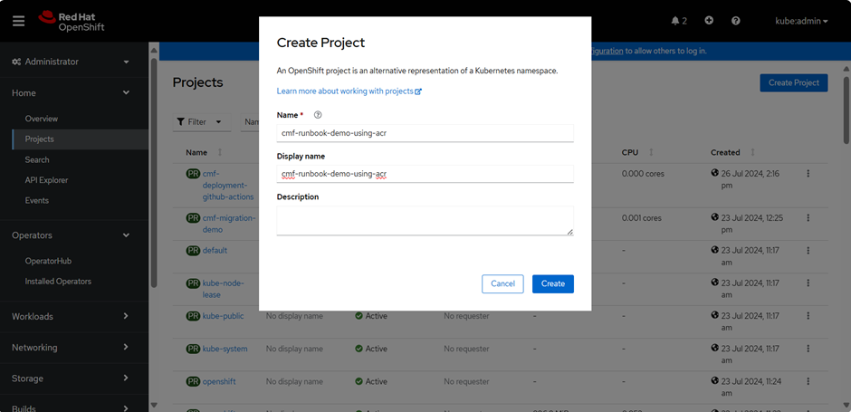
+
3. 모든 보안 권한(Full secret)ì„ ì–»ìŠµë‹ˆë‹¤.
* ARO í´ëŸ¬ìŠ¤í„°ì—ì„œ ë ˆì§€ìŠ¤íŠ¸ë¦¬ì— ì•¡ì„¸ìŠ¤ 하려면 ACRì—ì„œ 모든 보안 권한(Full secret)ì´ í•„ìš”í•©ë‹ˆë‹¤.
* 모든 보안 권한(Full secret)ì„ ì–»ìœ¼ë ¤ë©´ Azure Portalì´ë‚˜ Azure CLI를 사용할 수 ìˆìŠµë‹ˆë‹¤.
* Azure Portalì„ ì‚¬ìš©í•˜ëŠ” 경우 ACR ì¸ìŠ¤í„´ìŠ¤ë¡œ ì´ë™í•˜ì—¬ 액세스 키를 ì„ íƒí•©ë‹ˆë‹¤. docker-usernameì€ ì»¨í…Œì´ë„ˆ ë ˆì§€ìŠ¤íŠ¸ë¦¬ì˜ ì´ë¦„ì´ë©°, docker-passwordì—는 Password ë˜ëŠ” password2를 사용합니다.
+
image:./images/image12.png[]
+
* 대신 Azure CLI를 사용하여 ë‹¤ìŒ ì격 ì¦ëª…ì„ ì–»ì„ ìˆ˜ ìˆìŠµë‹ˆë‹¤.
+
----
az acr credential show -n your registry name
----
+
4. 쿠버네티스 Secret ìƒì„±: ì´ ì격ì¦ëª…ì„ ì‚¬ìš©í•˜ì—¬ 쿠버네티스 ì‹œí¬ë¦¿ì„ ìƒì„±í•©ë‹ˆë‹¤. ACR ì격 ì¦ëª…ì„ ì‚¬ìš©í•˜ì—¬ ë‹¤ìŒ ëª…ë ¹ì„ ì‹¤í–‰í•©ë‹ˆë‹¤.
+
----
oc create secret docker-registry \
--docker-server=<your registry name>.azurecr.io \
--docker-username=<your registry name> \
--docker-password=******** \
--docker-email=unused \
 acr-secret
----
+
5. 서비스 ê³„ì •ì— ì‹œí¬ë¦¿ì„ 연결합니다. 다ìŒìœ¼ë¡œ, Podê°€ 컨테ì´ë„ˆ ë ˆì§€ìŠ¤íŠ¸ë¦¬ì— ì ‘ì†í•  수 ìˆë„ë¡ í¬ë“œì—ì„œ 사용할 서비스 ê³„ì •ì— ì‹œí¬ë¦¿ì„ 연결합니다. 서비스 계정 ì´ë¦„ì€ Podì—ì„œ 사용하는 서비스 계정 ì´ë¦„ê³¼ ì¼ì¹˜í•´ì•¼ 합니다. default는 기본 서비스 계정ì…니다.
+
----
oc secrets link default <pull_secret_name> --for=pull
----
+
6. oc new-app ëª…ë ¹ì„ ì‚¬ìš©í•˜ì—¬ ACR ì´ë¯¸ì§€ë¥¼ ë°°í¬í•˜ê³  ì´ë¯¸ì§€ í’€ ì‹œí¬ë¦¿ì„ 연결합니다.
+
----
oc new-app --name=sample-aro-dotnet-app-using-acr <your_ registry_name>.azurecr.io/aro-dotnet-sample-app:latest
----
+
7. í˜„ì¬ ì„œë¹„ìŠ¤ëŠ” 준비ë˜ì—ˆì§€ë§Œ, 공용 ì¸í„°ë„·ì„ 통해 애플리케ì´ì…˜ì— ì ‘ì†í•  경로는 ì•„ì§ ìƒì„±ë˜ì§€ 않았습니다. ë‹¤ìŒ ëª…ë ¹ì„ ì‚¬ìš©í•˜ì—¬ 결로를 ìƒì„±í•©ë‹ˆë‹¤.
+
----
oc expose svc/aro-dotnet-sample-app
----
+
8. ë…¸ì¶œëœ ê²½ë¡œë¡œ ì´ë™í•˜ì—¬ ì•±ì— ì ‘ì†í•©ë‹ˆë‹¤.
+
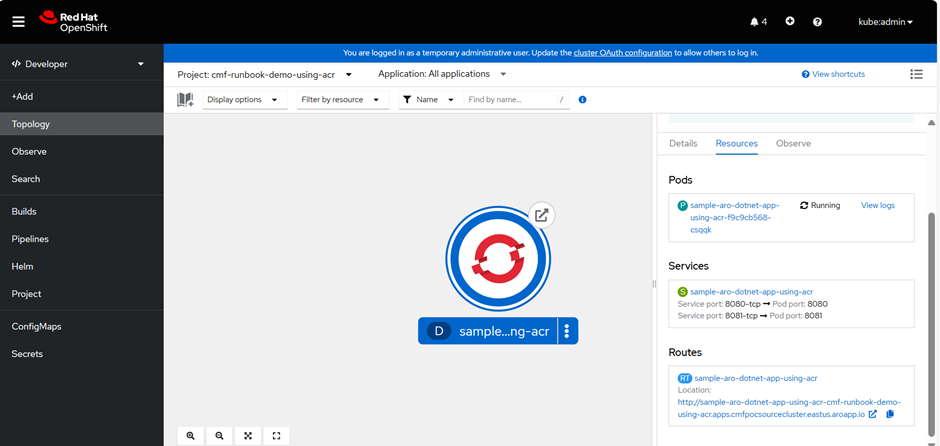
+
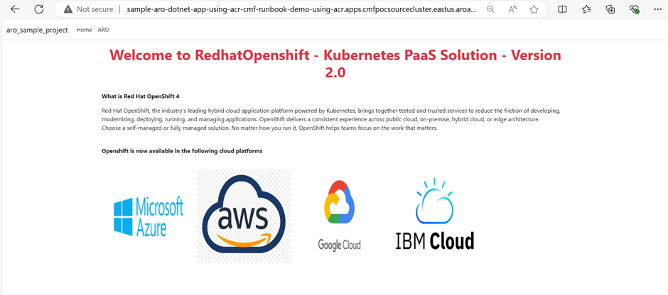

=== 5.3 OpenShift 웹 ì½˜ì†”ì„ ì‚¬ìš©í•œ ARO 컨테ì´ë„ˆí™” 앱 마ì´ê·¸ë ˆì´ì…˜ 단계, S2I(Source-to-Image) ì „ëµ(수ë™)

1. ì´ ì ‘ê·¼ ë°©ì‹ì€ DockerFileì„ ì‚¬ìš©í•˜ì§€ ì•Šê³ ë„, 즉 ì•±ì„ ì»¨í…Œì´ë„ˆí™” 하지 ì•Šê³ ë„ ì‘ë™í•©ë‹ˆë‹¤. ì´ ì „ëµì€ 소스를 ì´í•´í•˜ê³  ëŒ€ìƒ ì–¸ì–´ì™€ ìš´ì˜ì²´ì œë¥¼ ì´í•´í•˜ì—¬ ì´ë¯¸ì§€ë¥¼ 만드는 ë°©ì‹ìœ¼ë¡œ ì‘ë™í•©ë‹ˆë‹¤.
+
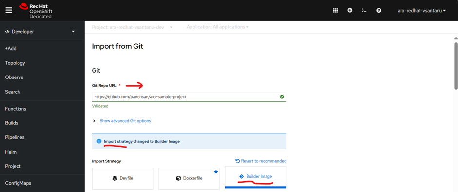
+
2. 가져오기 ì „ëµì„ “Builder imageâ€ë¡œ 변경합니다.
+
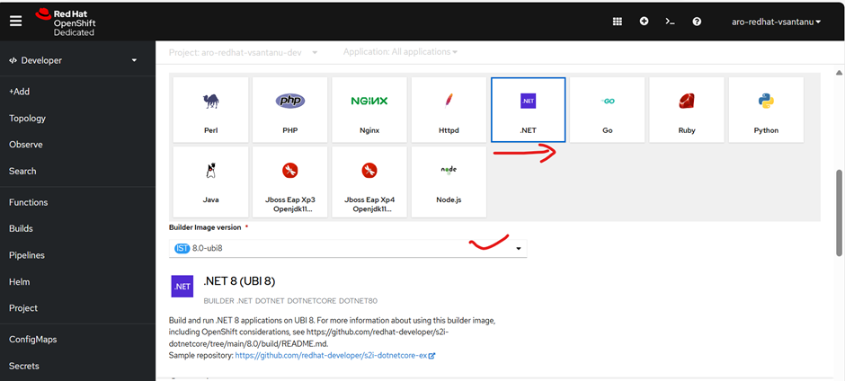
+
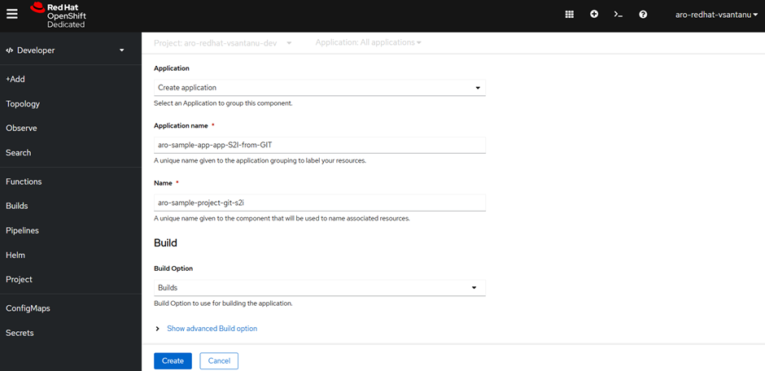
+
3. 워í¬ë¡œë“œë¥¼ ìƒì„±í•˜ë©´ ë™ì¼í•œ 애플리케ì´ì…˜ì´ ë°°í¬ë˜ì§€ë§Œ S2I ì „ëµì„ 사용합니다.
+
image:./images/image18.png[]
+
4. Workload를 í´ë¦­í•˜ê³  ìƒì„±ëœ 경로를 사용하여 애플리케ì´ì…˜ì„ íƒìƒ‰í•©ë‹ˆë‹¤.
+
image:./images/image19.png[]
+
5. 애플리케ì´ì…˜ì´ ë°°í¬ë˜ë©´ ë…¸ì¶œëœ ì„œë¹„ìŠ¤ 경로를 사용하여 애플리케ì´ì…˜ì— 액세스 í•  수 ìˆìŠµë‹ˆë‹¤.
+
image:./images/image20.png[]

=== 5.4 OpenShift(OC) ëª…ë ¹ì¤„ì„ ì‚¬ìš©í•˜ì—¬ AROì—ì„œ 컨테ì´ë„ˆí™” ëœ ì•±ì˜ ë§ˆì´ê·¸ë ˆì´ì…˜ 단계

1. 새 í´ëŸ¬ìŠ¤í„°ê°€ 설치ë˜ë©´ "Help" ì•„ì´ì½˜ìœ¼ë¡œ ì´ë™í•˜ê³  "Command line Tools" 옵션으로 ì´ë™í•˜ë©´ OpenShift 명령줄 ë„구를 다운로드 í•  수 ìˆìŠµë‹ˆë‹¤.
+
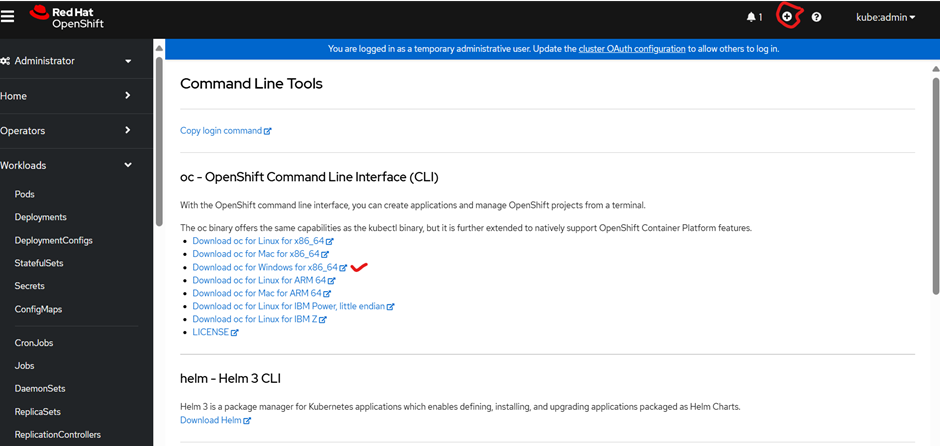
+
2. oc 명령줄 ë„구를 사용하면 웹 콘솔 ë‹¨ê³„ì— ì •ì˜ëœ 모든 단계를 수행할 수 ìˆìŠµë‹ˆë‹¤.
+
https://docs.openshift.com/en/container-platform/4.8/cli_reference/openshift_cli/developer-cli-commands.html[OpenShift CLI 개발ì 명령 참조 - OpenShift CLI(oc) | CLI ë„구 | OpenShift Container Platform 4.8]
3. oc 명령줄 ë„구를 사용하여 OpenShift í´ëŸ¬ìŠ¤í„°ì— 애플리케ì´ì…˜ì„ ë°°í¬í•˜ëŠ” 단계만 ì‚´í´ë³´ì•˜ìŠµë‹ˆë‹¤.
4. í´ëŸ¬ìŠ¤í„°ë¥¼ 사용하여 oc 명령줄 ë„êµ¬ì— ì—°ê²°í•˜ë ¤ë©´ "copy login command"를 í´ë¦­í•©ë‹ˆë‹¤. 그러면 íƒ­ì´ ì—´ë¦¬ê³  토í°ì´ 표시ë©ë‹ˆë‹¤.
+
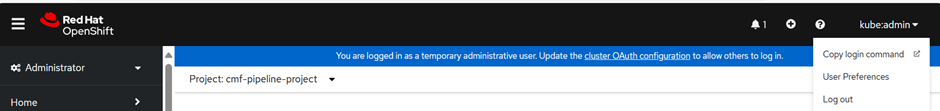
+
5. í˜¸ê·¸ì¸ ëª…ë ¹ì„ ë³µì‚¬í•˜ê³  ì›í•˜ëŠ” 명령 프롬프트/터미ë„/PowerShellì„ ì‚¬ìš©í•˜ì—¬ í´ëŸ¬ìŠ¤í„°ì— 연결합니다.
6. oc new-app ëª…ë ¹ì„ ì‚¬ìš©í•˜ë©´ 워í¬ë¡œë“œë¥¼ í´ëŸ¬ìŠ¤í„°ì— ë°°í¬í•  수 ìˆìŠµë‹ˆë‹¤.
+
----
oc new-app openshift/dotnet:8.0~https://github.com/<user_name>/aro-sample-project.git --name=aro-sample-app-cmd --context-dir=aro-sample-project
----
+
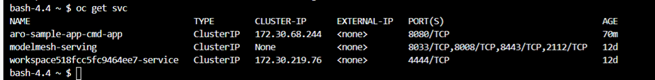
+
image:./images/image24.png[]
7. 위 명령어는 샘플앱과 서비스를 ë°°í¬í•©ë‹ˆë‹¤. ì•„ë˜ ëª…ë ¹ì–´ë¥¼ 사용하여 로그를 확ì¸í•  수 ìˆìŠµë‹ˆë‹¤.
+
----
oc new-app openshift/dotnet:8.0~https://github.com/<user_name>/aro-sample-project.git --name=aro-sample-app-cmd --context-dir=aro-sample-project
----
+
image:./images/image25.png[]
8. í˜„ì¬ ì„œë¹„ìŠ¤ëŠ” 준비ë˜ì—ˆì§€ë§Œ, 공용 ì¸í„°ë„·ì„ 통해 애플리케ì´ì…˜ì— ì ‘ì†í•  경로가 ìƒì„±ë˜ì§€ 않았습니다. ë‹¤ìŒ ëª…ë ¹ì„ ì‚¬ìš©í•˜ì—¬ 경로를 ìƒì„±í•©ë‹ˆë‹¤.
+
----
oc expose svc/aro-sample-app-cmd
----
+
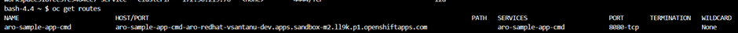
9. 경로가 활성화ë˜ë©´ 애플리케ì´ì…˜ì„ 사용할 수 ìˆìŠµë‹ˆë‹¤.
+
image:./images/image27.png[]
+
image:./images/image20.png[]

== 6. DevOps 파ì´í”„ë¼ì¸

=== 6.1 OpenShift ë‚´ì¥ Tekton 파ì´í”„ë¼ì¸ì„ 사용하여 AROì—ì„œ 컨테ì´ë„ˆí™”ëœ ì•±ì˜ ë§ˆì´ê·¸ë ˆì´ì…˜ 단계(ìˆ˜ë™ íŠ¸ë¦¬ê±°)

1. OpehShiftì—ì„œ Tektonì€ OpenShift Pipeline Operatorë¼ëŠ” ìš´ì˜ìë¡œ 제공ë©ë‹ˆë‹¤. 설치ë˜ì–´ ìˆëŠ”지 확ì¸í•©ë‹ˆë‹¤. `Administrator` 뷰를 ì„ íƒí•œ 후 `Operators` -> `Installed Operators` -> `Searchf or OpenShift Pipelines` ë¡œ ì´ë™í•˜ì—¬ 설치ë˜ì—ˆëŠ”지 확ì¸í•©ë‹ˆë‹¤.
+
image:./images/image28.png[]
2. 새 프로ì íŠ¸ë¥¼ 만들고 ì´ë¦„ì„ 'cmf-sample-pipeline-dotnet-app'으로 ì €ì¥í•©ë‹ˆë‹¤.
+
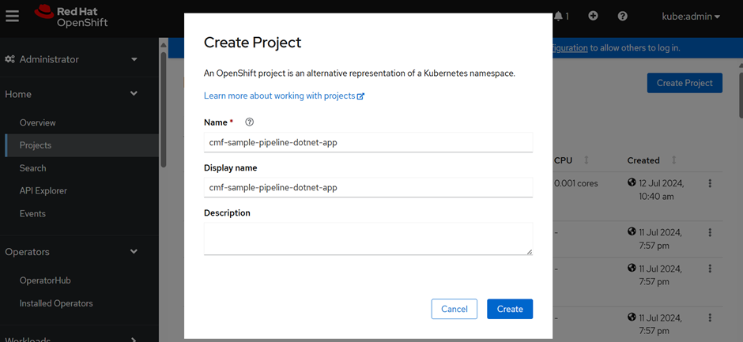
3. Tektonì€ ëª¨ë“  파ì´í”„ë¼ì¸ 호출 ì‹œ Persistent volumeì„ ìš”êµ¬í•©ë‹ˆë‹¤. ë”°ë¼ì„œ 프로ì íŠ¸ì— 최소 1GBì˜ ì˜êµ¬ 볼륨 í´ë ˆì„(PVC)ì´ ìˆëŠ”지 확ì¸í•´ì•¼ 합니다. 만약 없다면 `administrator` 뷰를 ì„ íƒí•œ 후 `Storage` ->  `Persistent Volume Claim` 으로 ì´ë™í•˜ì—¬ PVC를 ìƒì„±í•˜ê³  `my-sample-app-tekton-pvc` ë¼ëŠ” ì´ë¦„ì„ ì§€ì •í•©ë‹ˆë‹¤.
+
image:./images/image30.png[]
+
image:./images/image31.png[]
4. 파ì´í”„ë¼ì¸ì„ ìƒì„±í•˜ë ¤ë©´ `Administrator` 보기를 ì„ íƒí•˜ê³  `Pipelines` -> `Pipelines` ë¡œ ì´ë™í•œ ë‹¤ìŒ ë“œë¡­ë‹¤ìš´ 버튼 `Choose` 를 í´ë¦­í•˜ê³  `Pipeline` ì„ ì„ íƒí•©ë‹ˆë‹¤.
* Pipeline Builder ì–‘ì‹ì´ 열리면 ì•„ë˜ì˜¤ ã…ê°™ì´ êµ¬ì„±í•©ë‹ˆë‹¤.
** `Configure via` ì—ì„œ `Pipeline Builder` ë¼ë””오 ë²„íŠ¼ì„ í´ë¦­í•©ë‹ˆë‹¤.
** `name` í•„ë“œì— íŒŒì´í”„ë¼ì¸ ì´ë¦„(예: `aro-dotnet-builder-pipeline`)ì„ ì…력합니다.
** Parametersì—ì„œ, `Add Parameter`를 í´ë¦­í•˜ì—¬ 4ê°œì˜ íŒŒë¼ë¯¸í„°ë¥¼ 추가합니다.
*** Name: APP_NAME, 설명: ë°°í¬í•  애플리케ì´ì…˜ì˜ ì´ë¦„, 기본값: my-sample-dotnet-app
*** Name: APP_GIT_REPO, 설명: 애플리케ì´ì…˜ 소스 ì½”ë“œì— ëŒ€í•œ GitHub repo URL, 기본값: https://github.com/ <your_GitHub_user>/<your_repo_name>
*** Name: GIT_REVISION, 설명: ë°°í¬í•  GitHub repo 브ëœì¹˜ ì´ë¦„, 기본값: master(ë˜ëŠ” main)
*** Name: PROJECT_NAME, 설명: ì´ë¯¸ì§€ ìŠ¤íŠ¸ë¦¼ì´ ë‚´ë¶€ ë ˆì§€ìŠ¤íŠ¸ë¦¬ì— ì €ì¥ë˜ëŠ” OpenShift 프로ì íŠ¸, 기본값: <Your_current_Namespace>
* workspaceì—ì„œ, `add workspace`를 í´ë¦­í•˜ì—¬ 새 workspace를 ìƒì„±í•˜ê³ , `share-workspace`를 ì…력하고 새 ì‘ì—… ê³µê°„ì„ ìƒì„±í•©ë‹ˆë‹¤.
+
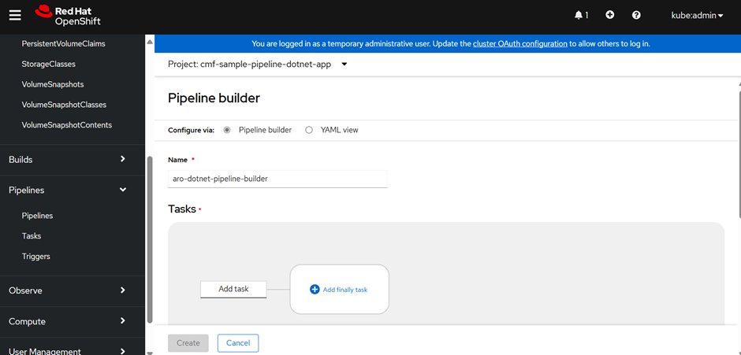
+
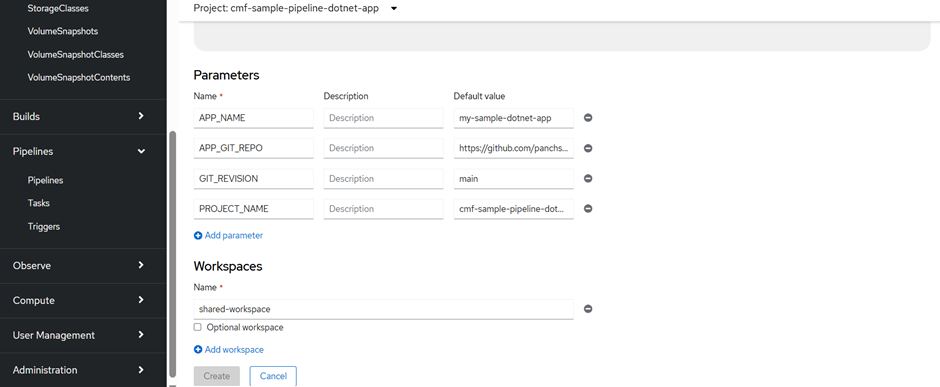
5. Tekton 파ì´í”„ë¼ì¸ì˜ 기본 ì •ì˜ê°€ 완료ë˜ì—ˆìŠµë‹ˆë‹¤. ì´ì œ 복제-빌드-ë°°í¬ ì£¼ê¸°ë¥¼ 위한 파ì´í”„ë¼ì¸ì„ 추가해야 합니다.
6. Pipeline ì‘ì—… - ì•„ë˜ëŠ” 모든 샘플 파ì´í”„ë¼ì¸ì— 대한 샘플 ì‘ì—…ì…니다.
+
**Task 1: Githubì—ì„œ 소스 코드 검색**
+
Pipeline Builderì—ì„œ `Add Task` 를 í´ë¦­í•©ë‹ˆë‹¤. `git clone` ì„ ì…력하고 Red Hatì—ì„œ ì‘ì—…ì„ ì„ íƒí•œ 후 `Add` ë²„íŠ¼ì„ í´ë¦­í•©ë‹ˆë‹¤.
+
image:./images/image34.png[]
+
다ìŒê³¼ ê°™ì´ êµ¬ì„±í•©ë‹ˆë‹¤.
+
----
* Display Name: fetch
* Parameters->url : $(params.APP_GIT_REPO)
* Parameter->revision : $(params.GIT_REVISION)
* Workspaces->output : shared-workspace
----
+
다른 ê°’ì€ ê¸°ë³¸ê°’ìœ¼ë¡œ 둡니다. ì´ ì‘ì—…ì˜ êµ¬ì„±ì„ ì¢…ë£Œí•˜ë ¤ë©´ 바깥쪽 아무 ê³³ì´ë‚˜ í´ë¦­í•©ë‹ˆë‹¤.
+
image:./images/image35.png[]
+
**Task 2: 소스 코드 빌드**
+
`fetch` ì‘ì—…ì— ë§ˆìš°ìŠ¤ë¥¼ 올리고 ì˜¤ë¥¸ìª½ì— ìˆëŠ” 파ë€ìƒ‰ `+` 기호를 í´ë¦­í•©ë‹ˆë‹¤. 그러면 다른 ì‘ì—…ì´ ì¶”ê°€ë©ë‹ˆë‹¤. 새로운 `Add Task` ë²„íŠ¼ì„ í´ë¦­í•˜ê³  í•„í„°ì— `S2I dotnet` ì„ ì…력합니다. Red Hatì—ì„œ 해당 ì˜µì…˜ì„ ì„ íƒí•˜ê³  `Add` 를 í´ë¦­í•©ë‹ˆë‹¤. ì‘ì—…ì„ ë‹¤ì‹œ í´ë¦­í•˜ì—¬ ì‘ì—… êµ¬ì„±ì„ ì—´ê³  ì•„ë˜ì™€ ê°™ì´ ì„¤ì •í•©ë‹ˆë‹¤.
+
----
* Display name: build
* Parameters-> Image :

  image-registry openshift-image-registry.svc:5000/$(params.PROJECT_NAME)/$(params.APP_NAME):dev

* Add environment variable - DOTNET_STARTUP_PROJECT=aro-sample-project/aro-sample-project.csproj
* Workspaces->source : shared-workspace
----
+
다른 ê°’ì€ ê¸°ë³¸ìœ¼ë¡œ 둡니다. ì´ ì‘ì—…ì˜ êµ¬ì„±ì„ ì¢…ë£Œí•˜ë ¤ë©´ 바깥쪽 아무 ê³³ì´ë‚˜ í´ë¦­í•©ë‹ˆë‹¤.
+
image:./images/image36.png[]
+
image:./images/image37.png[]
+
**Task 3: 기존 ë°°í¬ ì œê±°**
+
`build` ì‘ì—…ì— ë§ˆìš°ìŠ¤ë¥¼ 올리고 ì˜¤ë¥¸ìª½ì— ìˆëŠ” 파ë€ìƒ‰ `+` 기호를 í´ë¦­í•©ë‹ˆë‹¤. 그러면 다른 ì‘ì—…ì´ ì¶”ê°€ë©ë‹ˆë‹¤. 새로운 `Add Task` ë²„íŠ¼ì„ í´ë¦­í•˜ê³  í•„í„°ì— `OpenShift Client` 를 ì…력합니다. Red Hatì—ì„œ ì˜µì…˜ì„ ì„ íƒí•˜ê³  `Add` 를 í´ë¦­í•©ë‹ˆë‹¤. `Task` 를 다시 í´ë¦­í•˜ì—¬ ì‘ì—… êµ¬ì„±ì„ ì—´ê³  ì•„ë˜ì™€ ê°™ì´ ì„¤ì •í•©ë‹ˆë‹¤.
+
----
* Display Name: cleanup-old-deployment
* Parameters->Script :

  oc delete all -l app=$(params.APP_NAME)
----
+
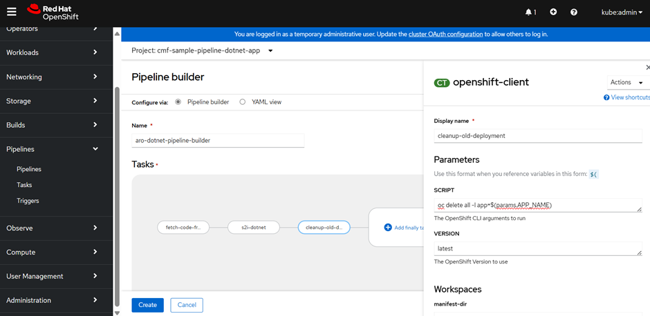
+
다른 ê°’ì€ ê¸°ë³¸ìœ¼ë¡œ 둡니다. ì´ ì‘ì—…ì˜ êµ¬ì„±ì„ ì¢…ë£Œí•˜ë ¤ë©´ 바깥쪽 아무 ê³³ì´ë‚˜ í´ë¦­í•©ë‹ˆë‹¤.
+
**Task 4: ë¹Œë“œëœ ì½”ë“œ ë°°í¬**
+
`cleanup-old-deployment` ì‘ì—…ì— ë§ˆìš°ìŠ¤ë¥¼ 올리고 ì˜¤ë¥¸ìª½ì— ìˆëŠ” 파ë€ìƒ‰ `+` 기호를 í´ë¦­í•©ë‹ˆë‹¤. 그러면 다른 ì‘ì—…ì— ì¶”ê°€ë©ë‹ˆë‹¤. 새로 ìƒì„±ëœ 'Add Task' ë²„íŠ¼ì„ í´ë¦­í•˜ê³  í•„í„°ì— `OpenShift Client` 를 ì…력하세요. Red Hatì—ì„œ 해당 ì˜µì…˜ì„ ì„ íƒí•˜ê³  `Add` ë²„íŠ¼ì„ í´ë¦­í•©ë‹ˆë‹¤. `Task` 를 다시 í´ë¦­í•˜ì—¬ ì‘ì—… êµ¬ì„±ì„ ì—´ê³  ì•„ë˜ì™€ ê°™ì´ ì„¤ì •í•˜ì„¸ìš”.
+
----
* Display Name: deploy-code
* Parameters->SCRIPT

  oc new-app --name $(params.APP_NAME) --as-deployment-config image-registry.openshift-image-registry.svc:5000/$(params.PROJECT_NAME)/$(params.APP_NAME):dev --context-dir=aro-sample-project

----
+
다른 ê°’ì€ ê¸°ë³¸ìœ¼ë¡œ 둡니다. ì´ ì‘ì—…ì˜ êµ¬ì„±ì„ ì¢…ë£Œí•˜ë ¤ë©´ 바깥쪽 아무 ê³³ì´ë‚˜ í´ë¦­í•©ë‹ˆë‹¤.
+
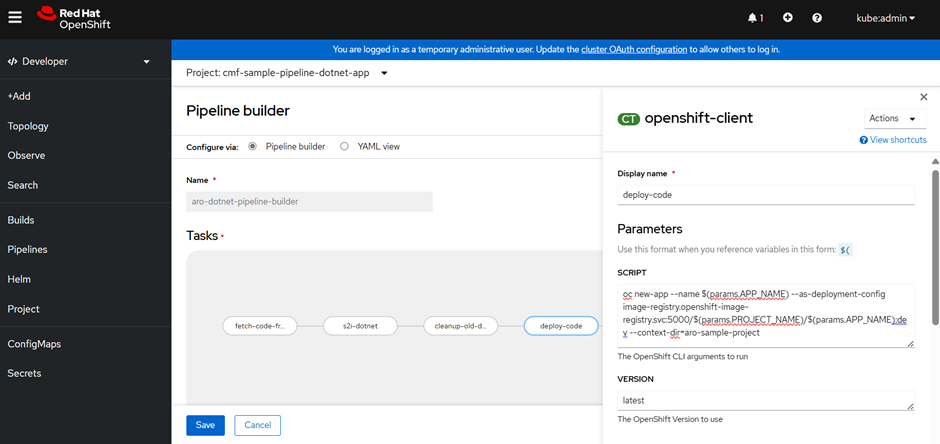
+
**Task 5: 경로ìƒì˜ 서비스 노출**
+
`deploy` ì‘ì—…ì— ë§ˆìš°ìŠ¤ë¥¼ 올리고 ì˜¤ë¥¸ìª½ì— ìˆëŠ” 파ë€ìƒ‰ `+` 기호를 í´ë¦­í•©ë‹ˆë‹¤. 그러면 다른 ì‘ì—…ì´ ì¶”ê°€ë©ë‹ˆë‹¤. 새로운 `Add Task` ë²„íŠ¼ì„ í´ë¦­í•˜ê³  í•„í„°ì— `OpenShift Client` 를 ì…력합니다. Red Hatì—ì„œ ì˜µì…˜ì„ ì„ íƒí•˜ê³  `Add` 를 í´ë¦­í•©ë‹ˆë‹¤. ì‘ì—…ì„ ë‹¤ì‹œ í´ë¦­í•˜ì—¬ ì‘ì—… êµ¬ì„±ì„ ì—´ê³  ì•„ë˜ì™€ ê°™ì´ ì„¤ì •í•©ë‹ˆë‹¤.
+
----
* Display Name: expose-service
* Parameters->SCRIPT:

  oc expose svc $(params.APP_NAME)
----
+
다른 ê°’ì€ ê¸°ë³¸ 값으로 둡니다. ì´ ì‘ì—…ì˜ êµ¬ì„±ì„ ì¢…ë£Œí•˜ë ¤ë©´ 바깥쪽 아무 ê³³ì´ë‚˜ í´ë¦­í•©ë‹ˆë‹¤.
+
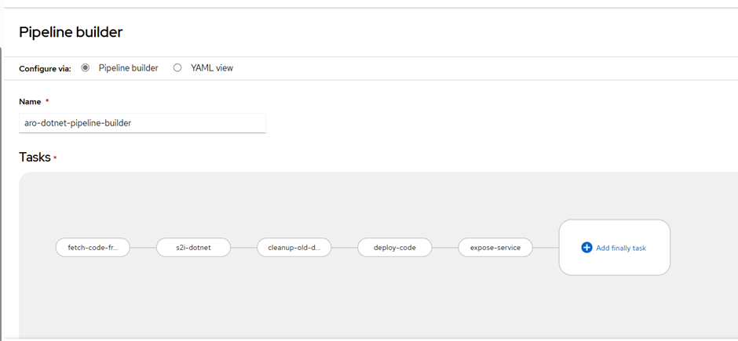
+
image:./images/image41.png[]
+
**Task 6: ë°°í¬ í™•ì¸**
+
`expose-service` ì‘ì—…ì— ë§ˆìš°ìŠ¤ë¥¼ 올리고 ì˜¤ë¥¸ìª½ì— ìˆëŠ” 파ë€ìƒ‰ `+` 기호를 í´ë¦­í•©ë‹ˆë‹¤. 그러면 다른 ì‘ì—…ì´ ì¶”ê°€ë©ë‹ˆë‹¤. 새로 ìƒì„±ëœ `Add Task` ë²„íŠ¼ì„ í´ë¦­í•˜ê³  í•„í„°ì— `OpenShift Client` 를 ì…력합니다. Red Hatì—ì„œ 해당 ì˜µì…˜ì„ ì„ íƒí•˜ê³  `Add` 를 í´ë¦­í•©ë‹ˆë‹¤. ì‘ì—…ì„ ë‹¤ì‹œ í´ë¦­í•˜ì—¬ ì‘ì—… êµ¬ì„±ì„ ì—´ê³  ì•„ë˜ì™€ ê°™ì´ ì„¤ì •í•©ë‹ˆë‹¤.
+
----
* Display Name: verify-rollout
* Parameters->SCRIPT :

  oc rollout status dc/$(params.APP_NAME)
----
+
다른 ê°’ì€ ê¸°ë³¸ 값으로 둡니다. ì´ ì‘ì—…ì˜ êµ¬ì„±ì„ ì¢…ë£Œí•˜ë ¤ë©´ 바깥쪽 아무 ê³³ì´ë‚˜ í´ë¦­í•©ë‹ˆë‹¤. 파ì´í”„ë¼ì¸ì„ ìƒì„±í•˜ë ¤ë©´ 파ë€ìƒ‰ 'Create' ë²„íŠ¼ì„ í´ë¦­í•©ë‹ˆë‹¤.
+
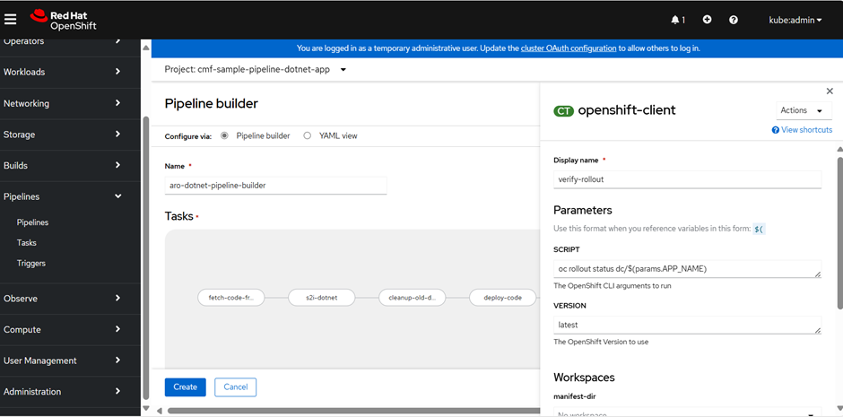
+
GitHub ì €ì¥ì†Œì— 변경 ì‚¬í•­ì„ ì»¤ë°‹í•˜ê³  파ì´í”„ë¼ì¸ì„ 실행하여 변경 ì‚¬í•­ì„ í™•ì¸í•©ë‹ˆë‹¤.
+
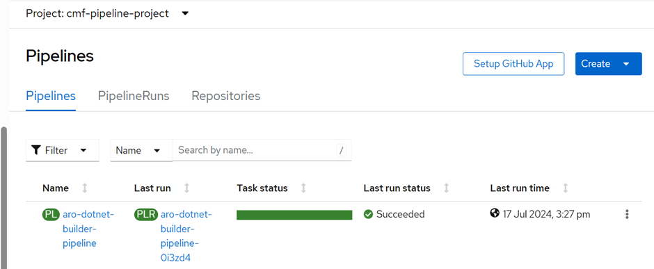

7. 파ì´í”„ë¼ì¸ì„ 수ë™ìœ¼ë¡œ 트리거합니다.
8. `Administration` 보기로 ì´ë™í•˜ì—¬ 파ì´í”„ë¼ì¸ìœ¼ë¡œ ì´ë™í•©ë‹ˆë‹¤. ì  ì„¸ê°œë¡œ í‘œì‹œëœ ë²„ê±° 메뉴를 ì„ íƒí•˜ê³  `Start` 를 í´ë¦­í•©ë‹ˆë‹¤.
+
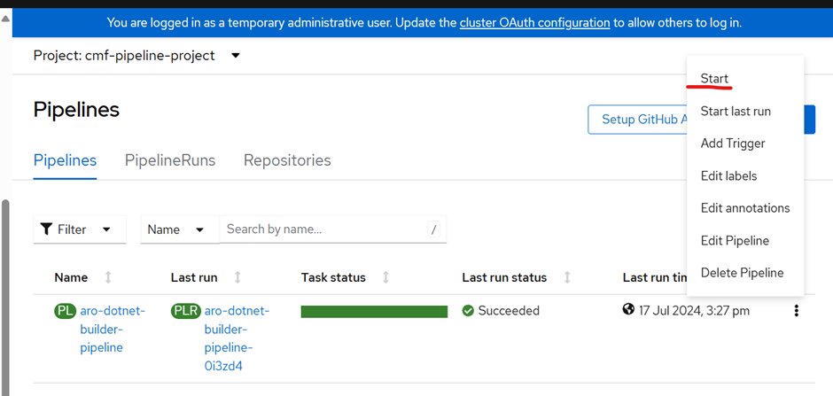
+
9. 파ë¼ë¯¸í„°ë¥¼ 검토하고 파ì´í”„ë¼ì¸ì„ 실행할 PVC(Persistent Volume Claim)를 ì„ íƒí•©ë‹ˆë‹¤. `Start` 를 í´ë¦­í•©ë‹ˆë‹¤.
+
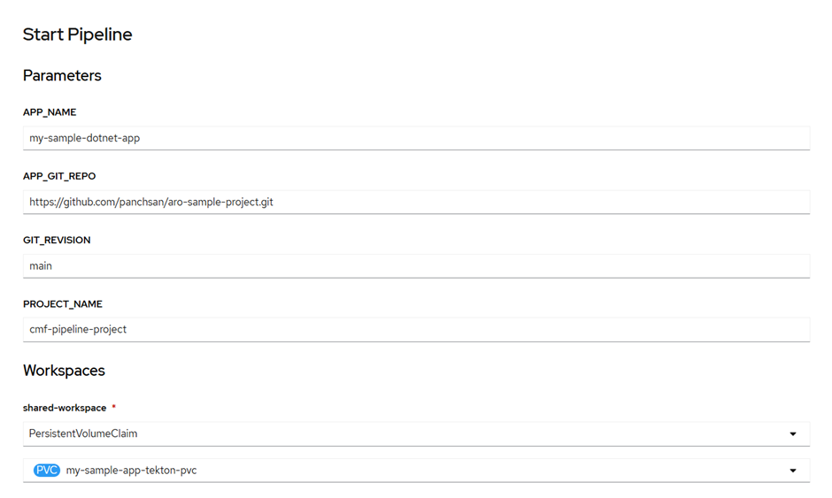
+
10. workload, Pod, Service ë° routes를 검토합니다. route path를 í´ë¦­í•˜ì—¬ 애플리케ì´ì…˜ì— 액세스합니다.
+
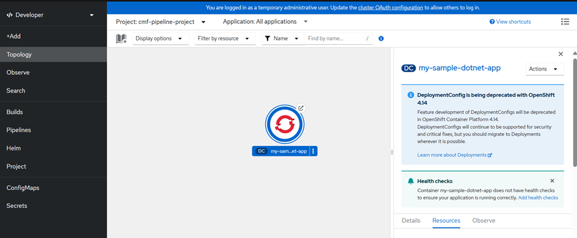
+
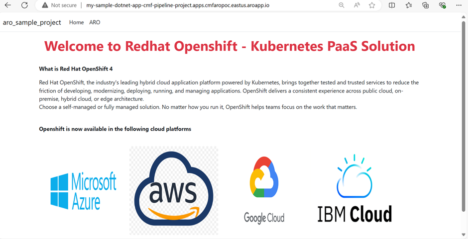

=== 6.2 OpenShift ë‚´ì¥ Tekton 파ì´í”„ë¼ì¸ì„ 사용하여 AROì—ì„œ 컨테ì´ë„ˆí™”ëœ ì•±ì„ ë§ˆì´ê·¸ë ˆì´ì…˜í•˜ëŠ” 단계(ìë™ íŠ¸ë¦¬ê±°, GitHub 웹훅)

1. 파ì´í”„ë¼ì¸ê³¼ ê²°í•©ëœ íŠ¸ë¦¬ê±°ë¥¼ 사용하면 파ì´í”„ë¼ì¸ì„ 연결하여 외부 GitHub ì´ë²¤íŠ¸(푸시 ì´ë²¤íŠ¸, í’€ 리퀘스트 등)ì— ì‘답할 수 ìˆìŠµë‹ˆë‹¤.
2. ì´ë¥¼ 위한 ì „ì œ ì¡°ê±´ì€ ì›¹í›…ì„ ì‚¬ìš©í•˜ê¸° 위해 프로ì íŠ¸ì— Trigger Template, TriggerBinding, EventListener를 ì •ì˜í•´ì•¼ 한다는 것ì…니다.
3. 웹훅과 ì—°ê²°ë  GitHub-secretì„ ìƒì„±í•©ë‹ˆë‹¤. `webhook-secret.yaml` 파ì¼ì„ ìƒì„±í•©ë‹ˆë‹¤.
+
----
webhook-secret.yml:
-------------------

apiVersion: v1
kind: Secret
metadata:
name: webhook-secret
namespace: cmf-pipeline-project
stringData:
secretToken: sample-secret
----
+ 
4. Secretì„ ì ìš©í•©ë‹ˆë‹¤.
+
----
oc apply -f webhook-secret.yaml
----
5. ì´ì œ TriggerTemplteì„ ì •ì˜í•©ë‹ˆë‹¤. TriggerTemplateì€ í…œí”Œë¦¿ 리소스 ë‚´ ì–´ë””ì—서나 ëŒ€ì²´ë  ìˆ˜ ìˆëŠ” 파ë¼ë¯¸í„°ë¥¼ 가진 리소스ì…니다. `github-template.yaml` 파ì¼ì„ ìƒì„±í•©ë‹ˆë‹¤.
+
----
github-template.yml:
--------------------

apiVersion: triggers.tekton.dev/v1alpha1
kind: TriggerTemplate
metadata:
name: github-template
spec:
params:
    - name: gitrevision
    description: The git revision
    default: main
    - name: gitrepositoryurl
    description: The git repository URL
resourcetemplates:
    - apiVersion: tekton.dev/v1beta1
    kind: PipelineRun
    metadata:
        generateName: github-pipelinerun-
    spec:
        pipelineRef:
        name: aro-dotnet-builder-pipeline
        workspaces:
        - name: shared-workspace
            persistentVolumeClaim:
            claimName: my-sample-app-tekton-pvc
        params:
        - name: gitrevision
            value: $(params.gitrevision)
        - name: gitrepositoryurl
            value: $(params.gitrepositoryurl)
----
+
6. 템플ë«ì„ ì ìš©í•©ë‹ˆë‹¤.
+
----
oc apply -f github-template.yaml
----
+
7. ë‹¤ìŒ ë‹¨ê³„ëŠ” ì´ë²¤íŠ¸ì—ì„œ 필드를 캡처하고 파ë¼ë¯¸íŠ¸ë¡œ ì €ì¥í•œ ë‹¤ìŒ ì´ë²¤íŠ¸ê°€ ë°œìƒí•  ë•Œ 마다 TriggerTemplateì—ì„œ ì´ë¥¼ 바꿀수 ìˆëŠ” TriggerBindingì„ ë§Œë“œëŠ” 것ì…니다. +
`github-binding.yaml` 파ì¼ì„ 만들고 ë™ì¼í•˜ê²Œ ì ìš©í•©ë‹ˆë‹¤.
+
----
github-binding.yaml:
-------------------

apiVersion: triggers.tekton.dev/v1alpha1
kind: TriggerBinding
metadata:
name: github-binding
spec:
params:
    - name: gitrevision
    value: $(body.head_commit.id)
    - name: gitrepositoryurl
    value: $(body.repository.clone_url)
----
+
----
oc apply -f github-binding.yaml        
----
+
8. 마지막으로 EventListener를 만듭니다. ì´ ì»´í¬ë„ŒíŠ¸ëŠ” Service를 설정하고 ì´ë²¤íŠ¸ë¥¼ 수신합니다. ë˜í•œ TriggerTemplateì„ TriggerBindingì— ì—°ê²°í•˜ì—¬ 주소 지정 가능한 엔드í¬ì¸íŠ¸(ì´ë²¤íŠ¸ 싱í¬)ë¡œ 전달합니다.
+
`github-listener.yaml` 파ì¼ì„ 만들고 ë™ì¼í•˜ê²Œ ì ìš©í•©ë‹ˆë‹¤.
+
----
github-listener.yaml:
--------------------

apiVersion: triggers.tekton.dev/v1alpha1
kind: EventListener
metadata:
name: github-listener
spec:
serviceAccountName: pipeline
triggers:
    - name: github-trigger
    interceptors:
        - ref:
            name: "github"
        params:
            - name: secretRef
            value:
                secretKey: secretToken
                secretName: webhook-secret
    bindings:
        - ref: github-binding
    template:
        ref: github-template
----
+
----
oc apply -f github-listener.yaml
----
+
9. ì•„ë˜ ëª…ë ¹ì„ ì‹¤í–‰í•˜ì—¬ eventListener 서비스를 경로로 노출합니다.
+
----
oc expose svc el-github-listener
----
+
10. ë‹¤ìŒ ë‹¨ê³„ëŠ” GitHub ì €ì¥ì†Œì—ì„œ ì›¹í›…ì„ êµ¬ì„±í•˜ëŠ” 것ì…니다.
* GitHub ì €ì¥ì†Œì—ì„œ:
** `Settings` -> 'WebHooks' ë¡œ ì´ë™í•©ë‹ˆë‹¤.
** `Add webhook` ì„ í´ë¦­í•©ë‹ˆë‹¤.
** `oc expose` 명령으로 ìƒì„±ëœ 경로 URLë¡œ í˜ì´ë¡œë“œ URLì„ ì„¤ì •í•©ë‹ˆë‹¤.
** `Content type` ì„ `application/Json` 으로 설정합니다.
** `Secret` ì•„ë˜ì— 비밀 토í°ì„ 추가합니다. (webhook-secret.yamlì—ì„œ 사용한 토í°ê³¼ ë™ì¼)
** webhookì„ íŠ¸ë¦¬ê±°í•´ì•¼ 하는 ì´ë²¤íŠ¸ë¥¼ ì„ íƒí•©ë‹ˆë‹¤. (예: 푸시 ì´ë²¤íŠ¸)
** `Add webhook` ì„ í´ë¦­í•©ë‹ˆë‹¤.
+
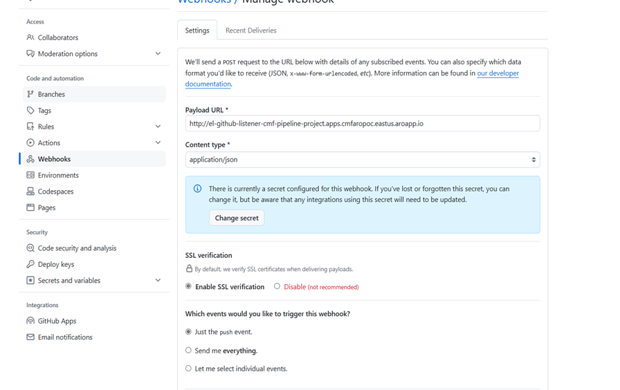
+
11. ì„¤ì •ì„ í…ŒìŠ¤íŠ¸í•˜ê³  Github ì €ì¥ì†Œì— 변경 ì‚¬í•­ì„ í‘¸ì‹œí•˜ë©´ 모든 푸시 ì´ë²¤íŠ¸ì— 대해 파ì´í”„ë¼ì¸ì´ ìë™ìœ¼ë¡œ ì‹œì‘ë©ë‹ˆë‹¤.
+
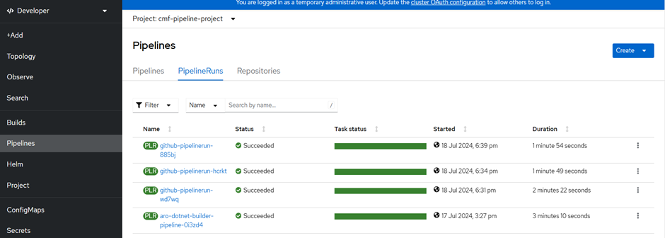

=== 6.3 GibHub Actions를 사용하여 AROì—ì„œ 컨테ì´ë„ˆí™” ëœ ì•±ì˜ ë§ˆì´ê·¸ë ˆì´ì…˜ 단계

GitHub Actions는 모든 GitHub ì €ì¥ì†Œì—ì„œ 사용할 수 ìˆëŠ” ì´ë²¤íŠ¸ 기반 ìë™í™” ì‘ì—…ì…니다. ì´ë²¤íŠ¸ëŠ” ì‘ì—…ì„ í¬í•¨í•˜ëŠ” 워í¬í”Œë¡œë¥¼ ìë™ìœ¼ë¡œ 트리거합니다. 그러면 ì‘ì—…ì€ ë‹¨ê³„ë¥¼ 사용하여 ì‘ì—… 실행 순서를 제어합니다. ì´ëŸ¬í•œ ì‘ì—…ì€ ì†Œí”„íŠ¸ì›¨ì–´ 빌드, 테스트 ë° ë°°í¬ë¥¼ ìë™í™”하는 명령ì…니다. ì´ ì¥ì—서는 샘플 .NET Core 백엔드 컨테ì´ë„ˆ ì´ë¯¸ì§€ë¥¼ 빌드하고 docker-hub ë ˆì§€ìŠ¤íŠ¸ë¦¬ì— í‘¸ì‹œí•˜ê¸° 위한 GitHub Actionì„ ì¶”ê°€í•©ë‹ˆë‹¤. +
참고: GitHub Azure 컨테ì´ë„ˆ 레지스트리 등 다른 컨테ì´ë„ˆ ë ˆì§€ìŠ¤íŠ¸ë¦¬ë„ ì‚¬ìš©í•  수 ìˆìŠµë‹ˆë‹¤.

==== 1) OpenShift 프로ì íŠ¸ ìƒì„±

`Administrator` ê´€ì ìœ¼ë¡œ ì´ë™í•˜ì—¬ 새 프로ì íŠ¸ë¥¼ 만듭니다.

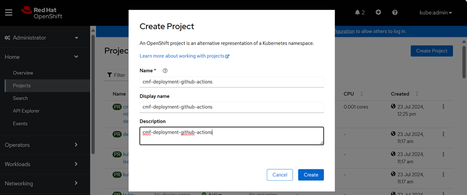

==== 2) GitHub Action 구성

GitHub Actions 워í¬í”Œë¡œëŠ” 환경으로 실행ë˜ë©°, 해당 í™˜ê²½ì˜ ë³´í˜¸ 규칙과 ë¹„ë°€ì„ ì‚¬ìš©í•˜ê¸° 위해 í™˜ê²½ì„ ì°¸ì¡°í•  수 ìˆìŠµë‹ˆë‹¤. ì´ ë‹¨ê³„ì—서는 developmentë¼ëŠ” ì´ë¦„ì˜ ìƒˆ í™˜ê²½ì„ ì¶”ê°€í•©ë‹ˆë‹¤. ì´ì „ì— GibHubì—ì„œ í¬í¬í•œ `aro-sample-project` ì €ì¥ì†Œì—ì„œ 오른쪽 ìƒë‹¨ 메뉴로 ì´ë™í•˜ì—¬ ì„¤ì •ì„ í´ë¦­í•©ë‹ˆë‹¤. 그런 ë‹¤ìŒ ì™¼ìª½ 메뉴ì—ì„œ `Environment` 를 í´ë¦­í•˜ê³  오른쪽ì—ì„œ `new environment` 를 í´ë¦­í•©ë‹ˆë‹¤.

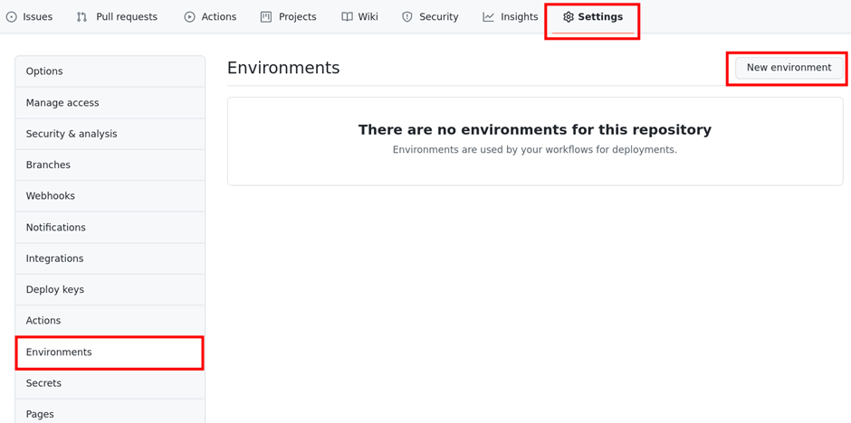

==== 3) GitHub 환경 설정

ë‹¤ìŒ ì°½ì—ì„œ ì´ë¦„ì— ì‚¬ìš©í•  GitHub í™˜ê²½ì˜ ì´ë¦„ì„ ì‚½ì…합니다.

Action: **development**

`Configure environment` 를 í´ë¦­í•˜ì—¬ 환경 êµ¬ì„±ì„ ìƒì„±í•©ë‹ˆë‹¤.

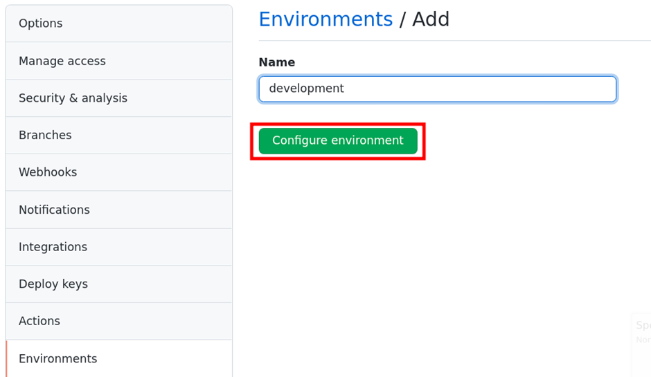

==== 4) Github Secret

방금 ìƒì„±í•œ GitHub 환경 developmentì˜ ê²°ê³¼ 화면ì—ì„œ 새로 ìƒì„±ëœ í™˜ê²½ì˜ ëª¨ë“  세부 정볼르 확ì¸í•  수 ìˆìŠµë‹ˆë‹¤. 섹션 í•˜ë‹¨ì˜ `Environment Secret` ë¡œ ì´ë™í•˜ê³  'Add Secret' 를 í´ë¦­í•˜ì—¬ 새 Secretì„ ì¶”ê°€í•©ë‹ˆë‹¤.

ì´ì œ GitHub Actionì—ì„œ OpenShift í´ëŸ¬ìŠ¤í„°ì— ì—°ê²°í•˜ëŠ”ë° ì‚¬ìš©í•  ë‘ ê°œì˜ Secretì„ êµ¬ì„±í•©ë‹ˆë‹¤.

* OPENSHIFT_SERVER: The OpenShift API server
* OPENSHIFT_TOKEN: The authentication token to connect with
* IMAGE_REGISTRY_PASSWORD: Docker hub token

image:./images/image53.png[]

==== 5) Action 추가

ì´ì œ GitHub Actionê³¼ OpenShift를 사용하여 ìë™í™”를 ì‹œì‘í•  준비가 ë˜ì—ˆìŠµë‹ˆë‹¤. GitHub Actionì˜ ì›Œí¬í”Œë¡œì™€ ì‘ì—…ì€ í•„ìš”í•œ 모든 단계가 í¬í•¨ëœ YAML 파ì¼ë¡œ ì •ì˜ë©ë‹ˆë‹¤.

1. GitHubì—ì„œ `sample-dotnet-application` 백엔드 빌드를 íŠ¸ë¦¬ê±°í•˜ëŠ”ë° ì‚¬ìš©ë˜ëŠ” ë‹¤ìŒ ì›Œí¬í”Œë¡œë¥¼ 검토합니다.
2. GitHubì—ì„œ OpenShift 스타터 í…œí”Œë¦¿ì„ ì„ íƒí•˜ê³  워í¬í”Œë¡œë¥¼ 트리거하기 위한 단계와 변수를 í¸ì§‘합니다.
+
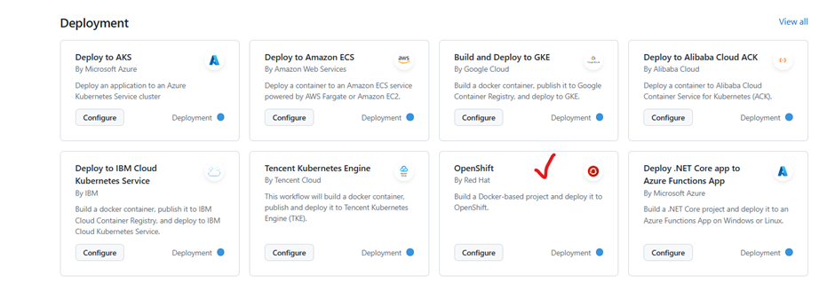
+
ë˜ëŠ”, 
+
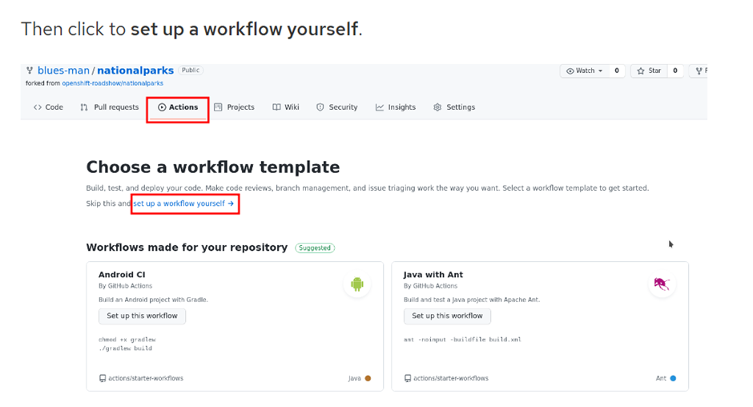
+
3. main.yml 예제 새 파ì¼ì˜ ì´ë¦„ì„ openshift.ymlë¡œ 변경합니다.
4. ì´ì „ì— ë³µì‚¬í•œ YAML ë‚´ìš©ì„ ìƒˆ íŒŒì¼ í¸ì§‘ ì•„ë˜ì˜ 코드 í…스트 ìƒìì— ë¶™ì—¬ë„£ì–´ 예제 ë‚´ìš©ì„ ë°”ê¿‰ë‹ˆë‹¤.
5. `Start Commit` ì„ í´ë¦­í•©ë‹ˆë‹¤. Commnt ì œëª©ì„ ì…력하고 `new file commit` ì„ í´ë¦­í•©ë‹ˆë‹¤.
6. 참고용으로 ì‹œì‘ í…œí”Œë¦¿ì„ ì‚¬ìš©í•˜ì„¸ìš”.
+
----
name: OpenShift

env:
# ğŸ–Šï¸ EDIT your repository secrets to log into your OpenShift cluster and set up the context.
# See https://github.com/redhat-actions/oc-login#readme for how to retrieve these values.
# To get a permanent token, refer to https://github.com/redhat-actions/oc-login/wiki/Using-a-Service-Account-for-GitHub-Actions
OPENSHIFT_SERVER: ${{ secrets.OPENSHIFT_SERVER }}
OPENSHIFT_TOKEN: ${{ secrets.OPENSHIFT_TOKEN }}
# ğŸ–Šï¸ EDIT to set the kube context's namespace after login. Leave blank to use your user's default namespace.
OPENSHIFT_NAMESPACE: "cmf-deployment-github-actions"

# ğŸ–Šï¸ EDIT to set a name for your OpenShift app, or a default one will be generated below.
APP_NAME: "aro-sample-github-action-app"

# ğŸ–Šï¸ EDIT with the port your application should be accessible on.
# If the container image exposes *exactly one* port, this can be left blank.
# Refer to the 'port' input of https://github.com/redhat-actions/oc-new-app
APP_PORT: "8080"

# ğŸ–Šï¸ EDIT to change the image registry settings.
# Registries such as GHCR, Quay.io, and Docker Hub are supported.
IMAGE_REGISTRY: docker.io/{username}
IMAGE_REGISTRY_USER: {username}
IMAGE_REGISTRY_PASSWORD: ${{ secrets.IMAGE_REGISTRY_PASSWORD }}

# ğŸ–Šï¸ EDIT to specify custom tags for the container image, or default tags will be generated below.
IMAGE_TAGS: "latest"

on:
# https://docs.github.com/en/actions/reference/events-that-trigger-workflows
workflow_dispatch:
push:
    # Edit to the branch(es) you want to build and deploy on each push.
    branches: [ "main" ]

jobs:
# ğŸ–Šï¸ EDIT if you want to run vulnerability check on your project before deploying
# the application. Please uncomment the below CRDA scan job and configure to run it in
# your workflow. For details about CRDA action visit https://github.com/redhat-actions/crda/blob/main/README.md
#
# TODO: Make sure to add 'CRDA Scan' starter workflow from the 'Actions' tab.
# For guide on adding new starter workflow visit https://docs.github.com/en/github-ae@latest/actions/using-workflows/using-starter-workflows

openshift-ci-cd:
    # ğŸ–Šï¸ Uncomment this if you are using CRDA scan step above
    # needs: crda-scan
    name: Build and deploy to OpenShift
    runs-on: ubuntu-22.04
    environment: development

    outputs:
    ROUTE: ${{ steps.deploy-and-expose.outputs.route }}
    SELECTOR: ${{ steps.deploy-and-expose.outputs.selector }}

    steps:
    - name: Check for required secrets
    uses: actions/github-script@v6
    with:
        script: |
        const secrets = {
            OPENSHIFT_SERVER: `${{ secrets.OPENSHIFT_SERVER }}`,
            OPENSHIFT_TOKEN: `${{ secrets.OPENSHIFT_TOKEN }}`,
        };

        const GHCR = "ghcr.io";
        if (`${{ env.IMAGE_REGISTRY }}`.startsWith(GHCR)) {
            core.info(`Image registry is ${GHCR} - no registry password required`);
        }
        else {
            core.info("A registry password is required");
            secrets["IMAGE_REGISTRY_PASSWORD"] = `${{ secrets.IMAGE_REGISTRY_PASSWORD }}`;
        }

        const missingSecrets = Object.entries(secrets).filter(([ name, value ]) => {
            if (value.length === 0) {
            core.error(`Secret "${name}" is not set`);
            return true;
            }
            core.info(`âœ”ï¸ Secret "${name}" is set`);
            return false;
        });

        if (missingSecrets.length > 0) {
            core.setFailed(`⌠At least one required secret is not set in the repository. \n` +
            "You can add it using:\n" +
            "GitHub UI: https://docs.github.com/en/actions/reference/encrypted-secrets#creating-encrypted-secrets-for-a-repository \n" +
            "GitHub CLI: https://cli.github.com/manual/gh_secret_set \n" +
            "Also, refer to https://github.com/redhat-actions/oc-login#getting-started-with-the-action-or-see-example");
        }
        else {
            core.info(`✅ All the required secrets are set`);
        }

    - name: Check out repository
    uses: actions/checkout@v4

    - name: Set up .NET
    uses: actions/setup-dotnet@v2
    with:
        dotnet-version: '8.0.x'  

    - name: Determine app name
    if: env.APP_NAME == ''
    run: |
        echo "APP_NAME=$(basename $PWD)" | tee -a $GITHUB_ENV

    - name: Determine image tags
    if: env.IMAGE_TAGS == ''
    run: |
        echo "IMAGE_TAGS=latest ${GITHUB_SHA::12}" | tee -a $GITHUB_ENV

    # https://github.com/redhat-actions/buildah-build#readme
    - name: Build from Dockerfile
    id: build-image
    uses: redhat-actions/buildah-build@v2
    with:
        image: ${{ env.APP_NAME }}
        tags: ${{ env.IMAGE_TAGS }}

        # If you don't have a Dockerfile/Containerfile, refer to https://github.com/redhat-actions/buildah-build#scratch-build-inputs
        # Or, perform a source-to-image build using https://github.com/redhat-actions/s2i-build
        # Otherwise, point this to your Dockerfile/Containerfile relative to the repository root.
        dockerfiles: |
        ./Dockerfile

    # https://github.com/redhat-actions/push-to-registry#readme
    - name: Push to registry
    id: push-image
    uses: redhat-actions/push-to-registry@v2
    with:
        image: ${{ steps.build-image.outputs.image }}
        tags: ${{ steps.build-image.outputs.tags }}
        registry: ${{ env.IMAGE_REGISTRY }}
        username: ${{ env.IMAGE_REGISTRY_USER }}
        password: ${{ env.IMAGE_REGISTRY_PASSWORD }}

    # The path the image was pushed to is now stored in ${{ steps.push-image.outputs.registry-path }}

    - name: Install oc
    uses: redhat-actions/openshift-tools-installer@v1
    with:
        oc: 4

    # https://github.com/redhat-actions/oc-login#readme
    - name: Log in to OpenShift
    uses: redhat-actions/oc-login@v1
    with:
        openshift_server_url: ${{ env.OPENSHIFT_SERVER }}
        openshift_token: ${{ env.OPENSHIFT_TOKEN }}
        insecure_skip_tls_verify: true
        namespace: ${{ env.OPENSHIFT_NAMESPACE }}

    # This step should create a deployment, service, and route to run your app and expose it to the internet.
    # https://github.com/redhat-actions/oc-new-app#readme
    - name: Create and expose app
    id: deploy-and-expose
    uses: redhat-actions/oc-new-app@v1
    with:
        app_name: ${{ env.APP_NAME }}
        image: ${{ steps.push-image.outputs.registry-path }}
        namespace: ${{ env.OPENSHIFT_NAMESPACE }}
        port: ${{ env.APP_PORT }}

    - name: Print application URL
    env:
        ROUTE: ${{ steps.deploy-and-expose.outputs.route }}
        SELECTOR: ${{ steps.deploy-and-expose.outputs.selector }}
    run: |
        [[ -n ${{ env.ROUTE }} ]] || (echo "Determining application route failed in previous step"; exit 1)
        echo
        echo "======================== Your application is available at: ========================"
        echo ${{ env.ROUTE }}
        echo "==================================================================================="
        echo
        echo "Your app can be taken down with: \"oc delete all --selector='${{ env.SELECTOR }}'\""
----
+
참고: ì´ í…œí”Œë¦¿ì€ .NET 앱 ì „ìš©ì…니다. 애플리케ì´ì…˜ ìœ í˜•ì— ë”°ë¼ í…œí”Œë¦¿ì„ ì„ íƒí•´ì£¼ì„¸ìš”.
+
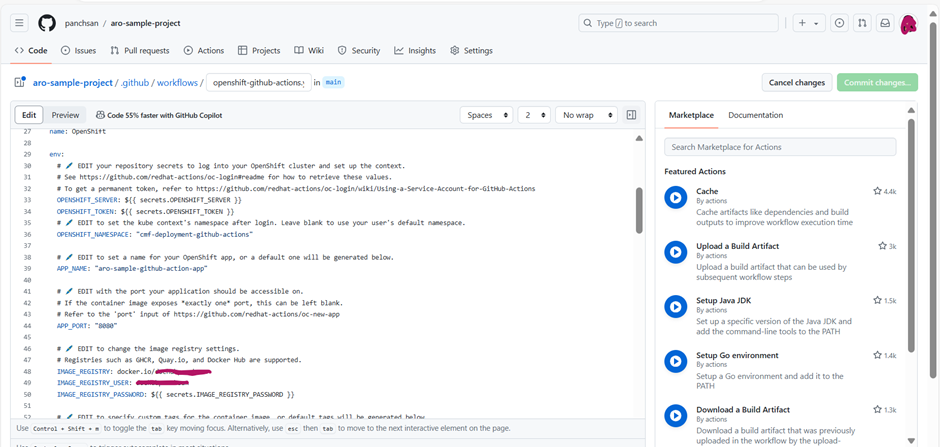
+
7. 변경 ì‚¬í•­ì„ ì»¤ë°‹í•˜ì§€ë§ˆì 해당 ì‘ì—…ì´ ì‹œì‘ë˜ê³  애플리케ì´ì…˜ì´ ë°°í¬ë©ë‹ˆë‹¤.
+
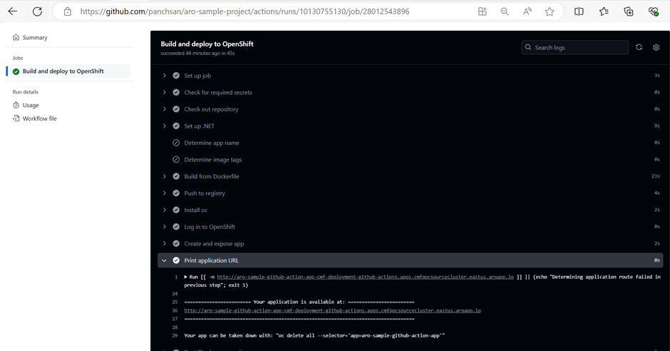
+
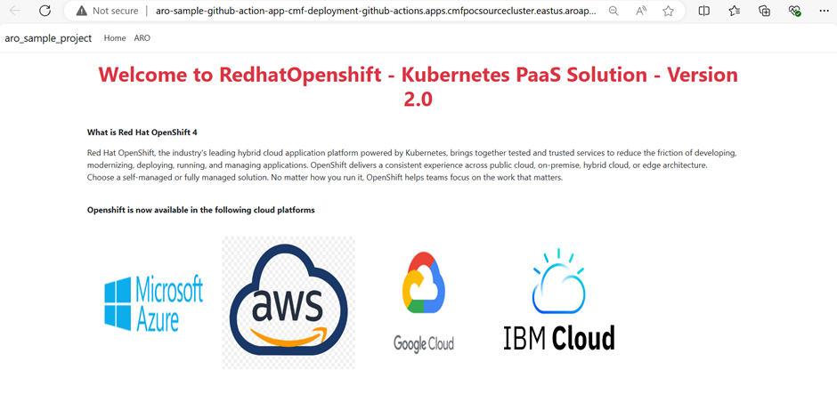

=== 6.4 Azure DevOps를 사용하여 AROì—ì„œ 컨테ì´ë„ˆí™” ëœ ì•±ì˜ ë§ˆì´ê·¸ë ˆì´ì…˜ 단계

Microsoft Azure DevOps를 사용하여 Red Hat OpenShiftì— ì• í”Œë¦¬ì¼€ì´ì…˜ì„ ë°°í¬í•˜ëŠ” 파ì´í”„ë¼ì¸ì„ 설정하는 모든 단계를 ì‚´í´ë´…니다.

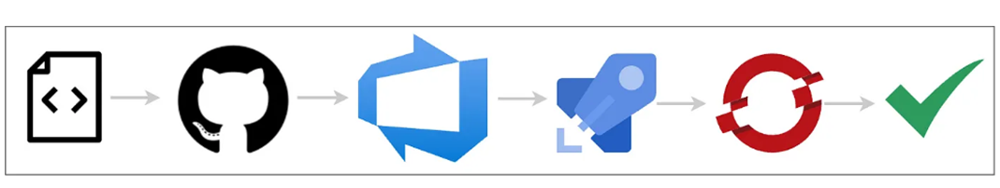

**필수 조건**

* GitHub 계정
* Azure 구ë…
* Red Hat OpenShift í´ëŸ¬ìŠ¤í„°
* Azure DevOpsì— ëŒ€í•œ 액세스

1. ADO ì¡°ì§ì—ì„œ 새 프로ì íŠ¸ë¥¼ 만듭니다.
+
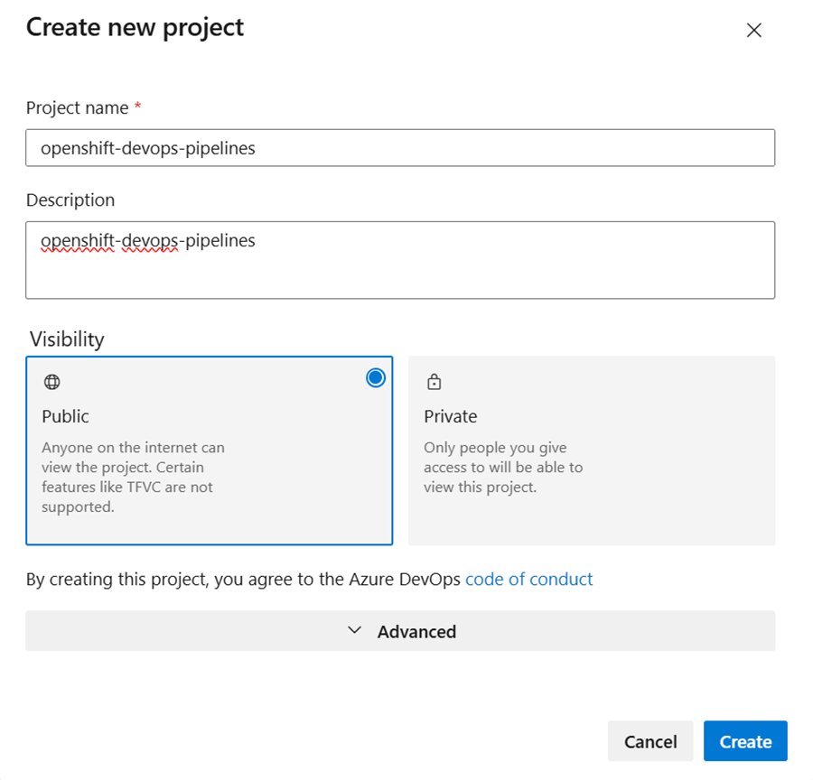
+
2. OpenShift í™•ì¥ í”„ë¡œê·¸ë¨ ì„¤ì¹˜
+
마켓플레ì´ìŠ¤[여기] ( https://marketplace.visualstudio.com/items?itemName=redhat.openshift-vsts )ì—ì„œ 무료로 받기를 í´ë¦­í•˜ê³  ì¡°ì§ì— 설치합니다.
+
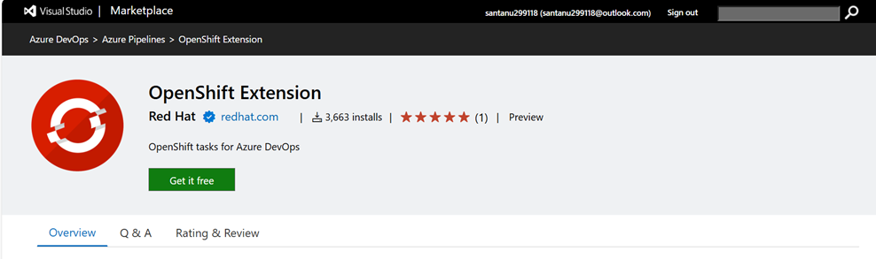
+
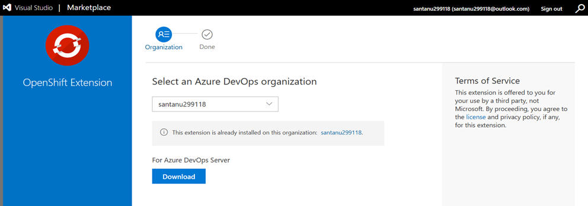
+
3. 서비스 ì—°ê²° ìƒì„±
+
Microsoft Azure DevOps를 OpenShift í´ëŸ¬ìŠ¤í„°ì— 연결하려면 OpenShift 서비스 ì—°ê²°ì„ êµ¬ì„±í•´ì•¼ 합니다.
+
. Click on Project settings를 í´ë¦­í•©ë‹ˆë‹¤.
. Service Connections를 ì„ íƒí•©ë‹ˆë‹¤.
. OpenShift를 ì„ íƒí•©ë‹ˆë‹¤.
+
image:./images/image63.png[]
+
ì›í•˜ëŠ” ì¸ì¦ ë°©ì‹(Basic, Token or No authentication)ì„ ì„ íƒí•©ë‹ˆë‹¤. 기존 OpenShift í´ëŸ¬ìŠ¤í„°ì—ì„œ 서버 URLê³¼ API 토í°ì„ 가져옵니다.
+
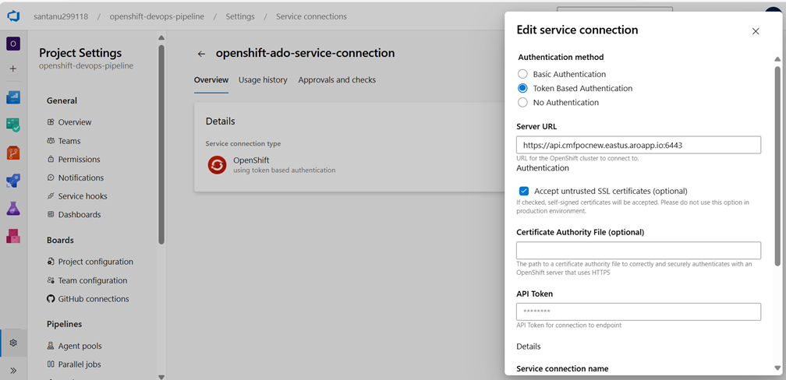
+
4. 파ì´í”„ë¼ì¸ ìƒì„±:
+
파ì´í”„ë¼ì¸ìœ¼ë¡œ ì´ë™í•©ë‹ˆë‹¤.
+
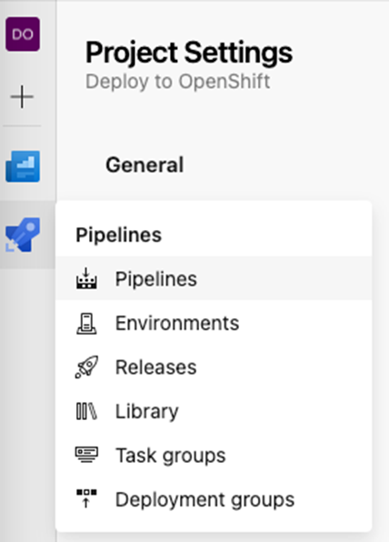
+
`Create Pipeline` ì„ í´ë¦­í•©ë‹ˆë‹¤. 코드가 GitHubì— ìˆìœ¼ë¯€ë¡œ GitHub ì˜µì…˜ì„ ì‚¬ìš©í•©ë‹ˆë‹¤.
+
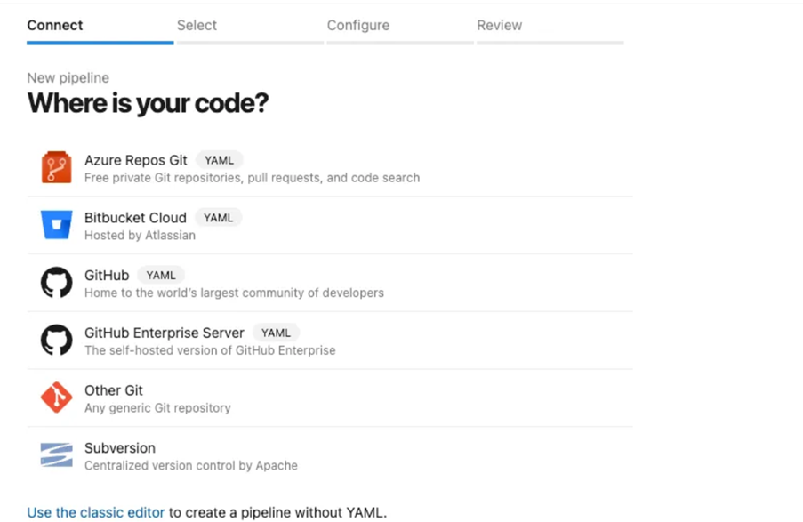
+
그런 ë‹¤ìŒ Azure Pipelines를 승ì¸í•©ë‹ˆë‹¤. 리í¬ì§€í† ë¦¬ë¥¼ ì„ íƒí•˜ë¼ëŠ” 메시지가 표시ë©ë‹ˆë‹¤.
+
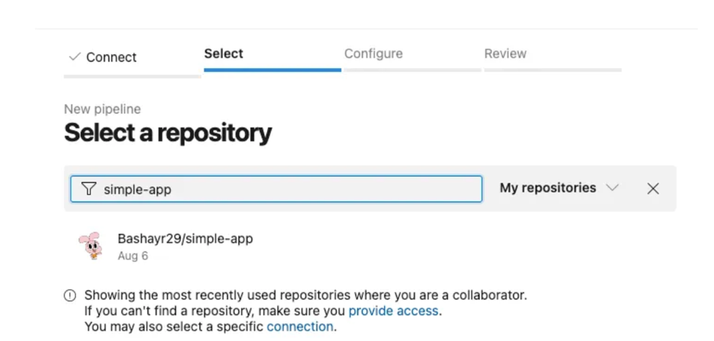
+
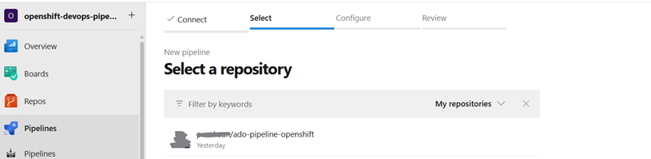
+
GitHubì— ëŒ€í•œ ì—°ê²°ì´ ìŠ¹ì¸ë˜ë©´ 파ì´í”„ë¼ì¸ì„ 구성하고 Starter 파ì´í”„ë¼ì¸ì„ ì„ íƒí•©ë‹ˆë‹¤.
+
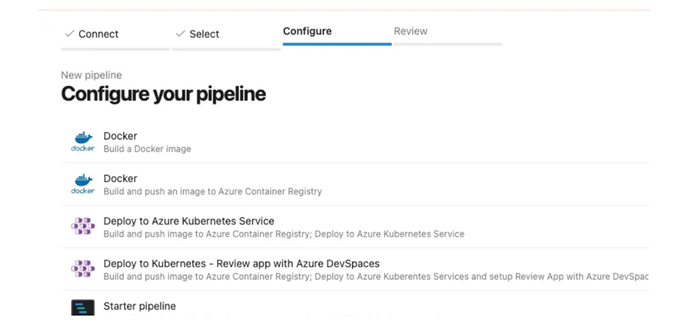
+
`Show assistant` 를 í´ë¦­í•˜ê³  `Execute oc` 를 ì„ íƒí•˜ì—¬ OC ëª…ë ¹ì„ ì‹¤í–‰í•©ë‹ˆë‹¤.
+
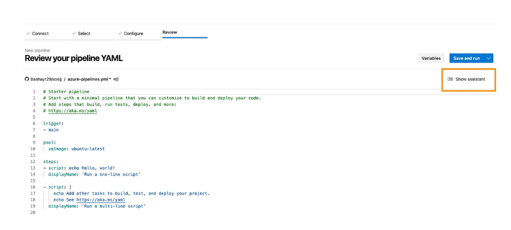
+
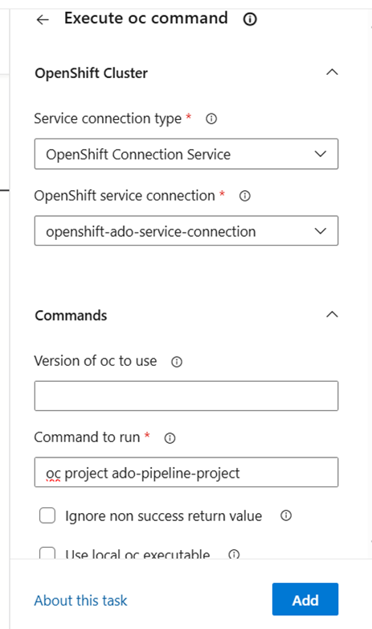
+
그런 ë‹¤ìŒ `Add` 를 í´ë¦­í•©ë‹ˆë‹¤. ë‹¤ìŒ ëª…ë ¹ì— ëŒ€í•´ì„œë„ ê°™ì€ ë‹¨ê³„ë¥¼ 반복합니다. 참고용으로 ì²¨ë¶€ëœ í…œí”Œë¦¿ì„ í™•ì¸í•˜ì„¸ìš”.
+
----
        Starter Template:
        -----------------

        trigger:
        - main

        pool:
          vmImage: ubuntu-latest

        steps:

        - task: oc-cmd@3
          inputs:
            connectionType: 'OpenShift Connection Service'
            openshiftService: 'openshift-ado-service-connection'
            cmd: 'oc project ado-pipeline-project'
          displayName: 'Select Project'
        - task: oc-cmd@3
          inputs:
            connectionType: 'OpenShift Connection Service'
            openshiftService: 'openshift-ado-service-connection'
            cmd: 'oc delete buildconfig ado-openshift-app'
          displayName: 'Cleanup old Build Config'
        - task: oc-cmd@3
          inputs:
            connectionType: 'OpenShift Connection Service'
            openshiftService: 'openshift-ado-service-connection'
            cmd: 'oc delete deployment ado-openshift-app'
          displayName: 'Cleanup old Deployment'
        - task: oc-cmd@3
          inputs:
            connectionType: 'OpenShift Connection Service'
            openshiftService: 'openshift-ado-service-connection'
            cmd: 'oc delete service ado-openshift-app'
          displayName: 'Cleanup old Service'

        - task: oc-cmd@3
          inputs:
            connectionType: 'OpenShift Connection Service'
            openshiftService: 'openshift-ado-service-connection'
            cmd: 'oc delete route ado-openshift-app'
          displayName: 'Cleanup old Route'
        - task: oc-cmd@3
          inputs:
            connectionType: 'OpenShift Connection Service'
            openshiftService: 'openshift-ado-service-connection'
            cmd: 'oc delete imagestream ado-openshift-app -n ado-pipeline-project'
          displayName: 'Cleanup old Image Stream'  
        - task: oc-cmd@3
          inputs:
            connectionType: 'OpenShift Connection Service'
            openshiftService: 'openshift-ado-service-connection'
            cmd: 'oc new-app openshift/dotnet:7.0-ubi8~https://github.com/panchsan/ado-pipeline-openshift.git --name=ado-openshift-app --context-dir=MyDotnetOpenshiftApp'
          displayName: 'Start New Deployment'
        - task: oc-cmd@3
          inputs:
            connectionType: 'OpenShift Connection Service'
            openshiftService: 'openshift-ado-service-connection'
            cmd: 'oc expose svc/ado-openshift-app'
          displayName: 'Expose service'
        - task: oc-cmd@3
          inputs:
            connectionType: 'OpenShift Connection Service'
            openshiftService: 'openshift-ado-service-connection'
            cmd: 'oc logs -f buildconfig/ado-openshift-app'
          displayName: 'Get Build Logs'
        - task: oc-cmd@3
          inputs:
            connectionType: 'OpenShift Connection Service'
            openshiftService: 'openshift-ado-service-connection'
            cmd: 'oc status'
          displayName: 'Verify Rollout'
----
+
파ì´í”„ë¼ì¸ì„ ì €ì¥í•˜ê³  실행합니다.
+
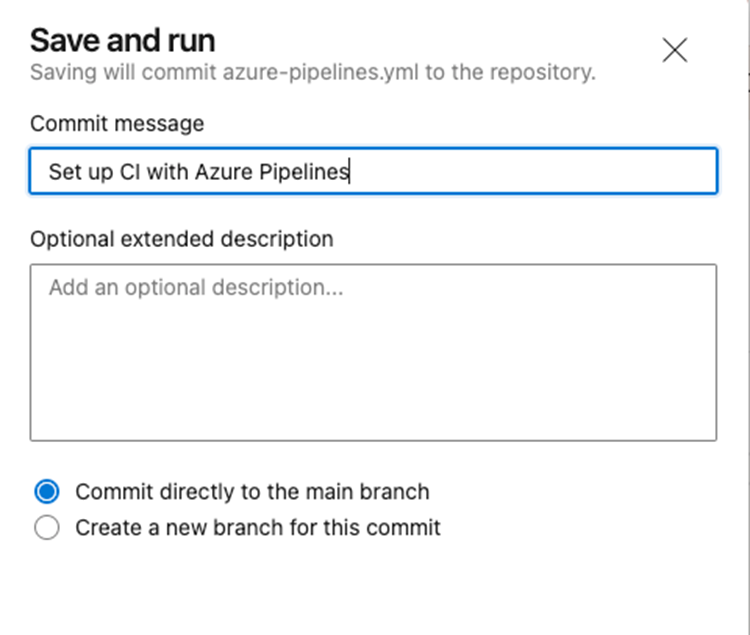
+
해당 ì‘ì—…ì— ì ‘ê·¼í•˜ì—¬ 확ì¸í•©ë‹ˆë‹¤.
+
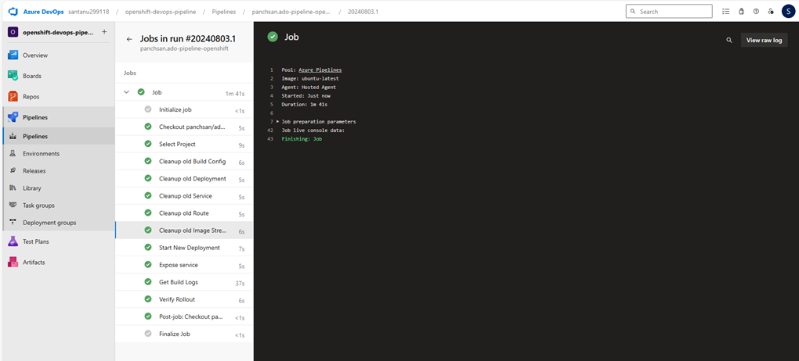
+
5. ë°°í¬ í™•ì¸
+
OpenShift í´ëŸ¬ìŠ¤í„°ì— 로그ì¸í•˜ê³  OpenShift í´ëŸ¬ìŠ¤í„°ì—ì„œ ë°°í¬ë¥¼ 확ì¸í•©ë‹ˆë‹¤.
+
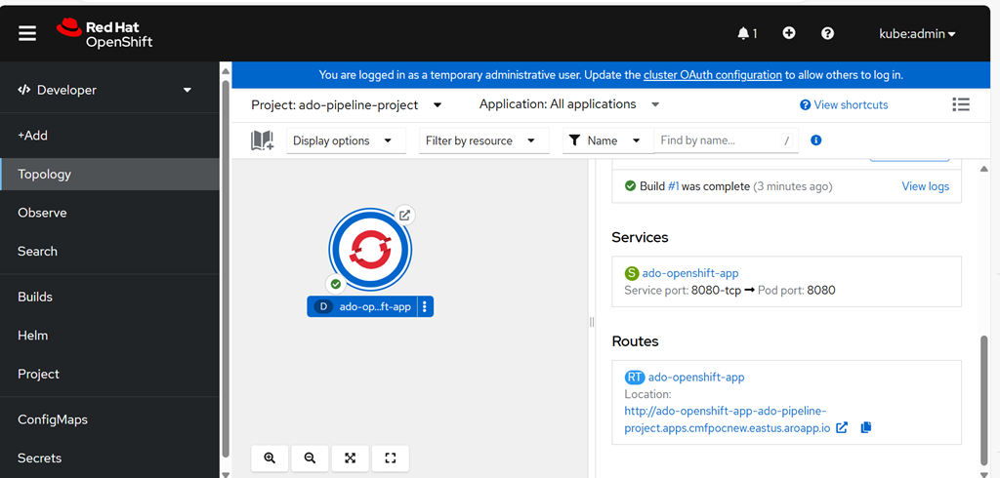
+
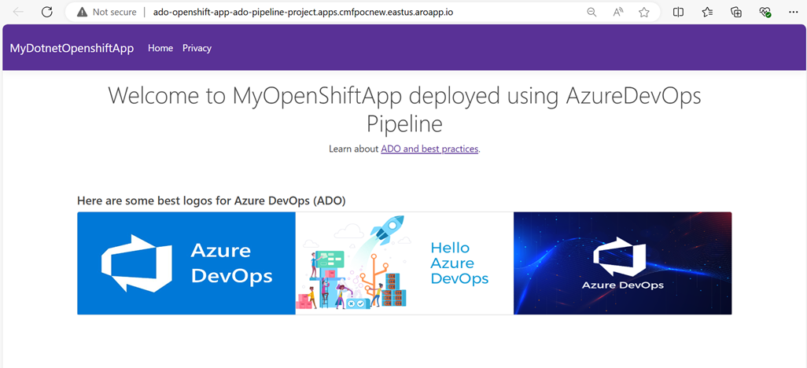

== 7. 부ë¡

* https://docs.openshift.com/en/container-platform/4.7/cli_reference/openshift_cli/getting-started-cli.html[OpenShift CLI ì‹œì‘하기 - OpenShift CLI(oc) | CLI ë„구 | OpenShift Container Platform 4.7]
* https://docs.openshift.com/en/container-platform/4.9/cicd/pipelines/using-tekton-hub-with-openshift-pipelines.html[OpenShift 파ì´í”„ë¼ì¸ê³¼ 함께 Tekton Hub 사용 - 파ì´í”„ë¼ì¸ | CI/CD | OpenShift 컨테ì´ë„ˆ 플ë«í¼ 4.9]
* https://www.redhat.com/en/blog/deploying-to-openshift-using-github-actions[GitHub Actions를 사용하여 OpenShiftì— ë°°í¬(redhat.com)]
* https://github.com/Azure/ARO-Landing-Zone-Accelerator/blob/main/deployment/CLI/09%20appdeployment/app.azcli[ARO-Landing-Zone-Accelerator/deployment/CLI/09 appdeployment/app.azcli at main · Azure/ARO-Landing-Zone-Accelerator (github.com)]