= Containerize an .NET Application

== 문서 요약

[cols="1,5", options="header"]
|===
|Document Item|Current Value
|Document Title|FACTORY_Runbook_Containerize_Sample_.NET_Application_1.0
|Program|Cloud Accelerate Factory
|Date Last Modified|29-08-2024
|Date Last Reviewed|08-10-2024
|Status|Draft V1.0
|Document Description|이 문서에서는 샘플 애플리케이션을 컨테이너화하고 컨테이너 레지스트리에 게시하기 위한 간단한 소개 및 사전 요구 사항과 세부 절차/단계를 제공합니다.
|===

== 변경 로그

== 목차

<<변경 로그>> +
<<목차>> +
<<1. 소개>> +
<<2. 필수 조건>> +
<<3. 실행>> +
<<3.1 .NET Core(8.0) 애플리케이션 컨테이너화>> +
<<3.1.1 DockerFile 생성>> +
<<3.1.2 Dockerfile에서 이미지를 생성하고 Linux 컨테이너로 실행>> +
<<3.1.3 Azure Container Registry(ACR)에 이미지 푸시>> +
<<3.2 .NET Framework(4.8) 애플리케이션 컨테이너화>> +
<<3.2.1 Dockerfile 생성>> +
<<3.2.2 Dockerfile에서 이미지를 생성하고 Windows 컨테이너로 실행>> +
<<3.2.3 Azure Container Registry(ACR)에 이미지 푸시>> +
<<4. 부록>>

== 1. 소개

이 문서에서는 샘플 애플리케이션을 컨테이너화하고 컨테이너 레지스트리에 게시하기 위한 간단한 소개 및 사전 요구사항과 세부 절차/단계를 제공합니다.

> Microsoft 클라우드 도입 프레임워크(CAF)는 클라우드 도입 시 복원력의 중요성을 강조하며, 특히 영역 중복성은 애플리케이션 가용성과 내결함성을 향상시키는 핵심 전략입니다. 영역 중복성은 한 지역 내에서 물리적으로 분리된 Azure 가용성 영역(Azure Availability Zones)을 활용하여 리소스를 복제하고, 한 영역에 장애가 발생하더라도 애플리케이션이 다른 영역에서 계속 실행될 수 있도록 보장합니다. 이러한 접근 방식은 가동 중지 시간을 최소화하고 서비스 수준 계약(SLA)을 향상시킵니다. 자세한 내용은 다음 실행 설명서를 참조하십시오. https://github.com/CAE-TEAM/cmf-runbooks/blob/main/scenarios/zoneredundancy/README.md

== 2. 필수 조건

1. Docker 데몬이 설치되어 있어야 합니다. 다음 문서는 플랫폼에 Docker를 설치하는 방법을 보여줍니다. +
https://docs.docker.com/engine/install/[Docker Engine 설치 | Docker 문서]
2. Docker 확장 기능이 포함된 Visual Studio/VSCode
3. DockerHub 계정 (선택)
4. Azure CLI(선택)

== 3. 실행

=== 3.1 .NET Core(8.0) 애플리케이션 컨테이너화

==== 3.1.1 DockerFile 생성

1. Visual Studio 2022를 사용하여 샘플 .NET Core 애플리케이션을 만듭니다.
+
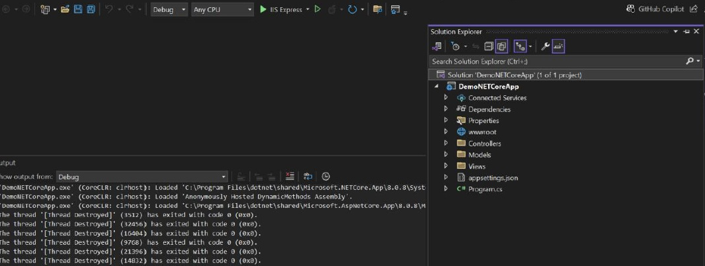
+
2. Visual Studio Docker 지원을 사용하여 Docker 파일을 만듭니다. 애플리케이션을 마우스 오른쪽 클릭하고 추가 -> Docker 지원을 선택한 후 Docker 파일을 추가합니다.
+
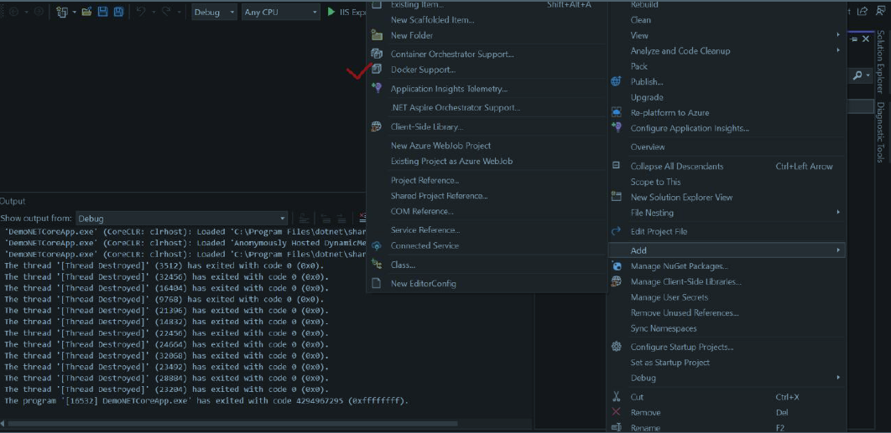
+
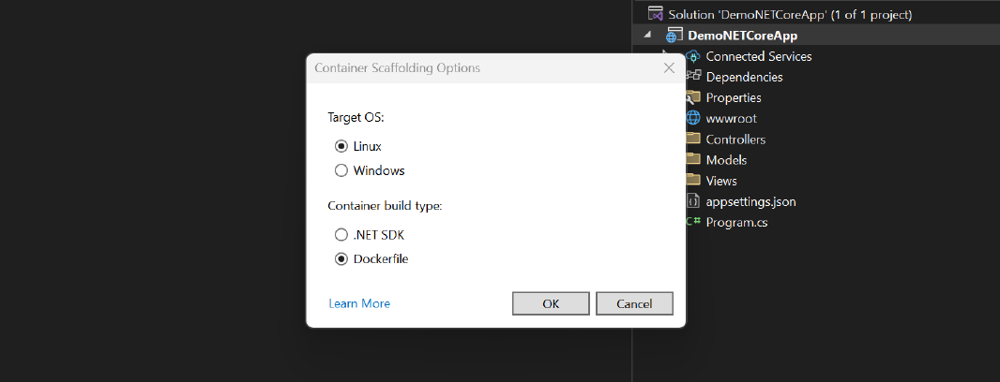
+
아래는 샘플 애플리케이션에 사용된 샘플 도커 파일입니다.
+
[source, dockerfile]
----
Sample Docker file:
#See https://aka.ms/customizecontainer to learn how to customize your debug container and how Visual Studio uses this Dockerfile to build your images for faster debugging.
FROM mcr.microsoft.com/dotnet/aspnet:8.0 AS base
USER app
WORKDIR /app
EXPOSE 8080
FROM mcr.microsoft.com/dotnet/sdk:8.0 AS build
ARG BUILD_CONFIGURATION=Release
WORKDIR /src
COPY ["DemoNETCoreApp.csproj", "."]
RUN dotnet restore "./DemoNETCoreApp.csproj"
COPY . .
WORKDIR "/src/."
RUN dotnet build "./DemoNETCoreApp.csproj" -c $BUILD_CONFIGURATION -o /app/build
FROM build AS publish
ARG BUILD_CONFIGURATION=Release
RUN dotnet publish "./DemoNETCoreApp.csproj" -c $BUILD_CONFIGURATION -o /app/publish /p:UseAppHost=false
FROM base AS final
WORKDIR /app
COPY --from=publish /app/publish .
ENTRYPOINT ["dotnet", "DemoNETCoreApp.dll"]
----
+
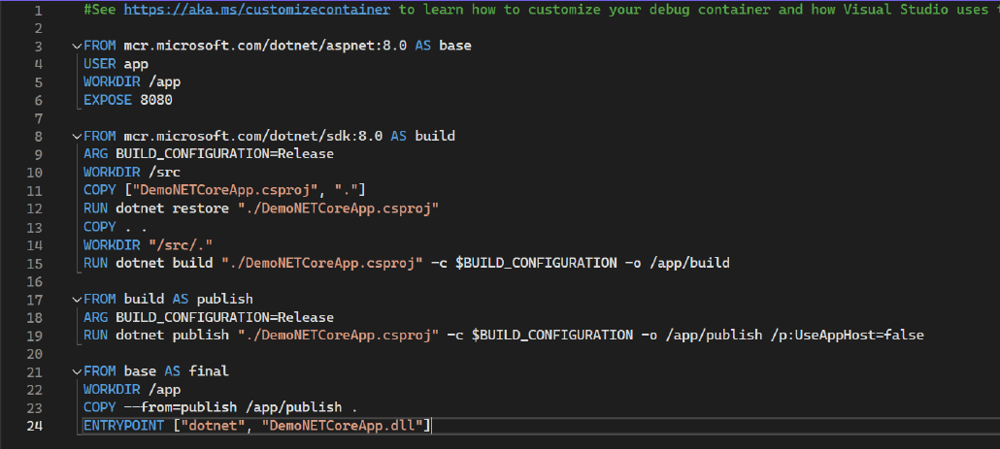

==== 3.1.2 Dockerfile에서 이미지를 생성하고 Linux 컨테이너로 실행

1. Dockerfile이 있는 프로젝트 디렉토리로 이동합니다.
2. 다음 명령을 실행하여 프로젝트를 빌드합니다. DOCKER_NAME을 사용자 이름으로 변경합니다.
+
----
docker build -t <DOCKER_USERNAME>/getting-started-todo-app
----
+
PS <DOCKER_USERNAME>은 로컬에서 컨테이너를 빌드하는 경우 선택 사항입니다. 하지만 이미지를 DockerHub에 푸시하려면 사용자 이름이 필요합니다.
+
예를 들어, 애플리케이션에 `net-core-app` 이라는 태그를 지정하면 결과는 아래와 같습니다.
+
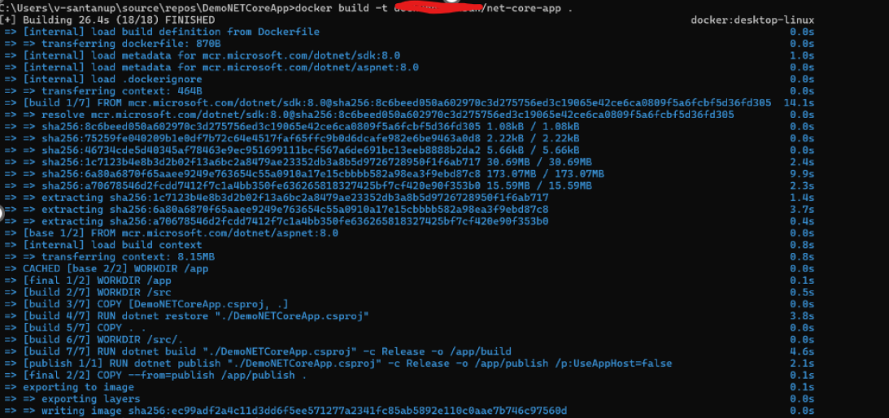
+
3. 이미지가 로컬에 있는지 확인하려면 docker image ls 명령을 사용할 수 있습니다.
+
----
docker images
----
+
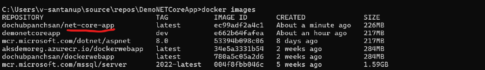
+
4. Docker 데스크톱에서도 이미지를 볼 수 있어야 합니다.
+
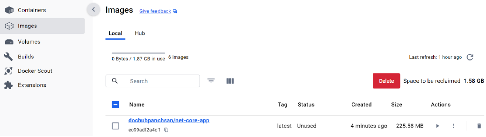
+
5. 이미지의 실행가능한 버전인 컨테이너를 생성하고 로컬에서 애플리케이션을 테스트합니다. 아래는 docker 이미지에서 컨테이너를 생성하는 명령입니다.
+
----
docker run -d -p 3001:8080 --name <container-name>> <<image-id>
----
+
우리 애플리케이션을 위해 포트 3001을 수신하는 `net-core-app-container` 라는 컨테이너를 만들었습니다. +
아래 명령을 사용하여 모든 컨테이너를 확인할 수 있습니다.
+
----
docker ps -a
----
+
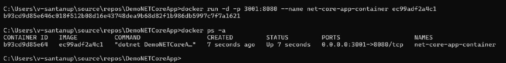
+
6. Docker 데스크톱 앱에서 컨테이너를 볼 수도 있고, 로컬에서 테스트하기 위해 애플리케이션에 액세스 할 수도 있습니다.
+
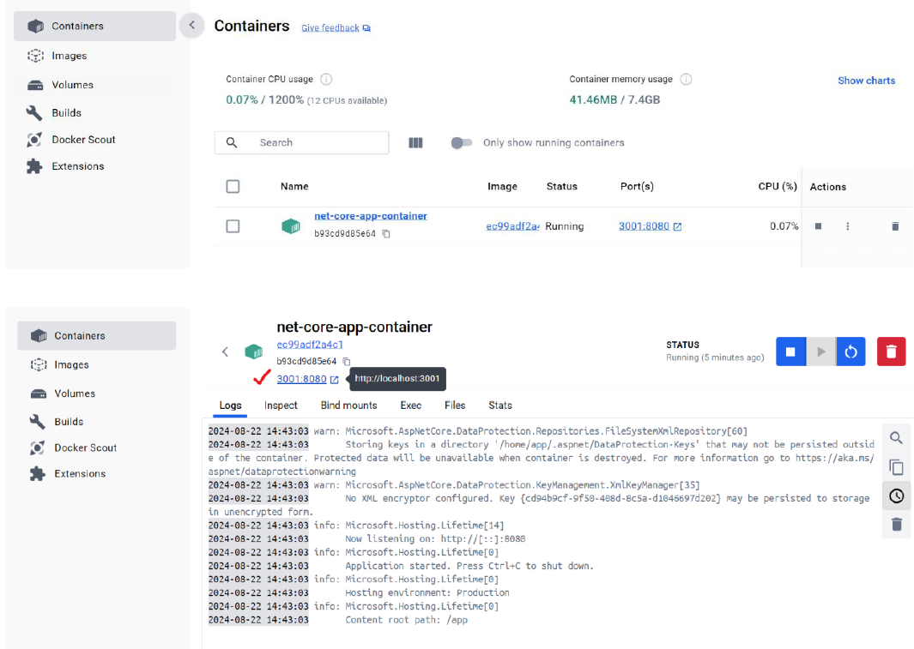
+
image:./images/image10.png[width=700]
+
7. localhost:3001로 이동하면 애플리케이션에 액세스 할 수 있습니다.
+
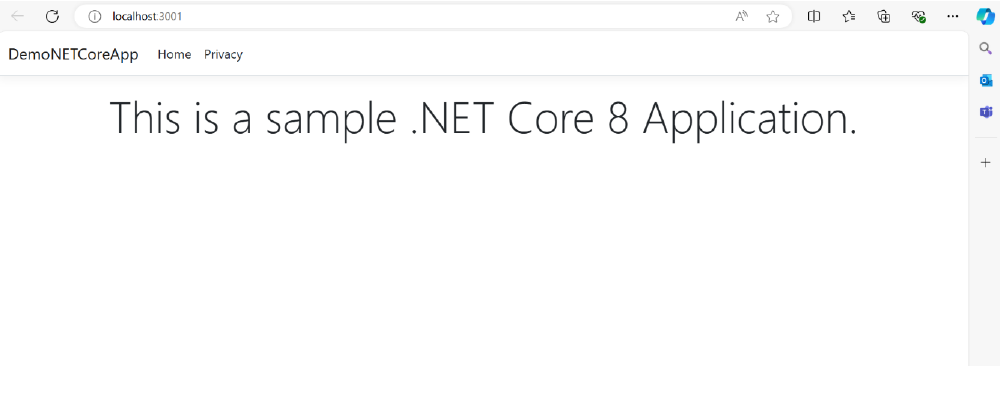

==== 3.1.3 Azure Container Registry(ACR)에 이미지 푸시

1. Azure 구독에서 Azure Container Registry(ACR)에 리소스를 만듭니다.
+
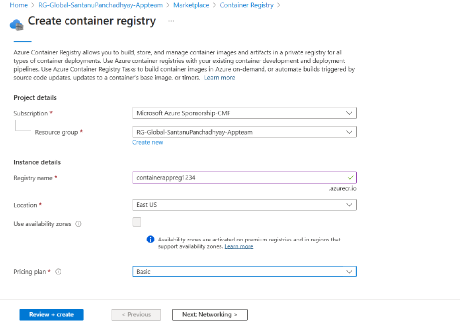
+
또는 Azure CLI에서 아래 명령을 사용할 수 있습니다.
+
----
az acr create --resource-group RG-name --name containerappreg1234 --sku Basic
----
+
2. 레지스트리에 관리자 권한을 부여합니다. 이 권한은 Azure 컨테이너 레지스트리에 로그인하는데 사용됩니다. 메시지가 표시되면 관리자 권한 부여시 생성한 관리자 이름과 비밀번호를 사용합니다.
+
----
az acr login --name containerappreg1234
----
+
image:./images/image13.png[width=700]
+
3. 다음 명령을 사용하여 Docker 이미지에 태그를 지정하고 빌드합니다. 아래 예시에서는 ACR 레지스트리로 이미지에 태그를 지정합니다.
+
----
docker build -t containerappreg1234.azurecr.io/net-core-app:latest
----
+
4. 아래 명령을 사용하여 이미지를 ACR에 푸시합니다.
+
----
docker push containerappreg1234.azurecr.io/net-core-app:latest
----
+
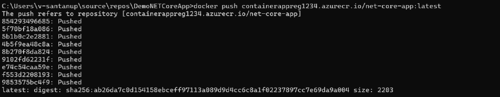
+
5. 이제 컨테이너 레지스트리에서 이미지를 검증하여 이미지가 성공적으로 푸시 되었는지 확인합니다.
+
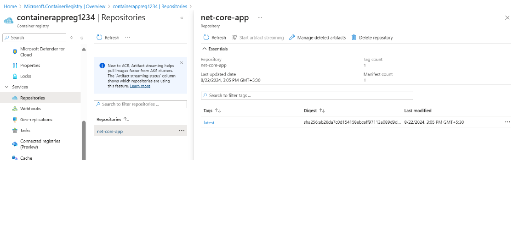

=== 3.2 .NET Framework(4.8) 애플리케이션 컨테이너화

==== 3.2.1 Dockerfile 생성

1. Visual Studio 2022를 사용하여 샘플 .NET Framework를 만듭니다. 
+
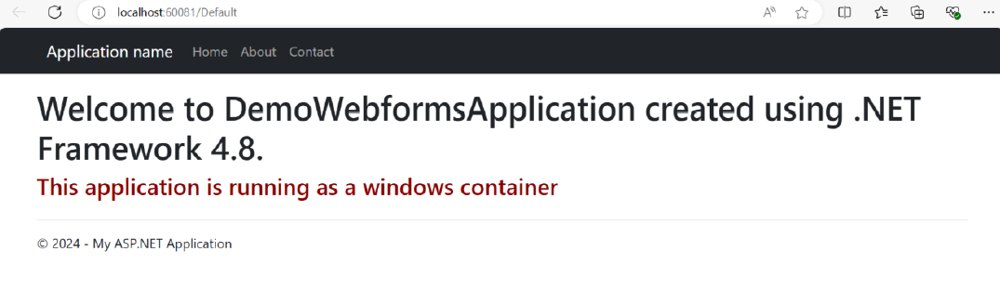
+
2. Visual Studio의 Docker Support를 사용하여 Dockerfile을 생성하는 것과 동일한 방법으로 Dockerfile을 생성할 수 있습니다. 애플리케이션을 마우스 오른쪽 버튼으로 클릭하고 추가(Add) -> Docker Support를 선택한 후 Dockerfile을 추가합니다. +
&#46;NET Framework는 Windows 기반 애플리케이션으로 이 애플리케이션을 실행하기 위해 Windows 컨테이너를 만듭니다. +
Windows 컨테이너를 대상으로 Docker 데몬 엔진을 전환합니다.
+
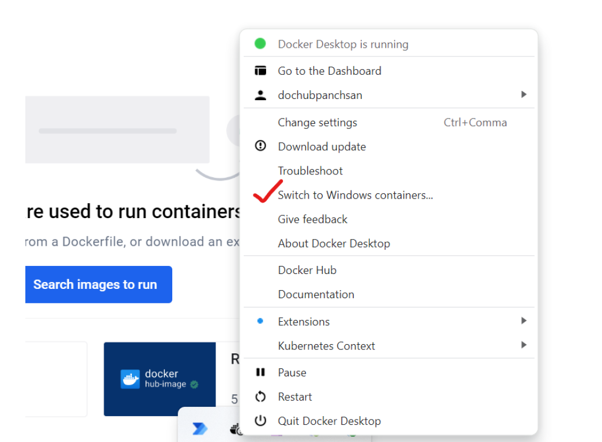
+
3. 아래는 샘플 애플리케이션에 대한 dockerfile 입니다.
+
[source, dockerfile]
----
FROM mcr.microsoft.com/dotnet/framework/aspnet:4.8-windowsservercore-ltsc2019
ARG source
WORKDIR /inetpub/wwwroot
EXPOSE 8002
COPY ${source:-obj/Docker/publish} 
----
+
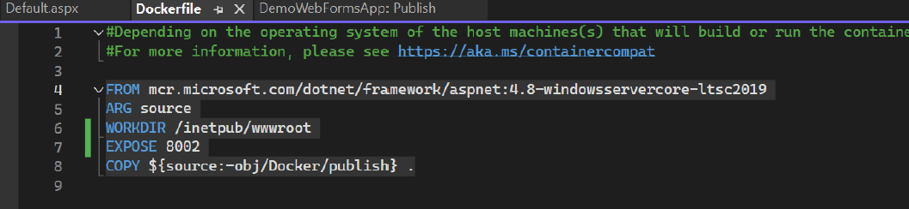

==== 3.2.2 Dockerfile에서 이미지를 생성하고 Windows 컨테이너로 실행

1. Dockerfile이 있는 프로젝트 디렉토리로 이동합니다.
2. 다음 명령을 실행하여 프로젝트를 빌드합니다. DOCKER_USERNAME을 사용자 이름으로 변경합니다.
+
----
docker build -t <DOCKER_USERNAME>/getting-started-todo-app
----
+
PS <DOCKER_USERNAME>은 로컬에서 컨테이너를 빌드하는 경우 선택 사항입니다. 하지만 이미지를 Docker Hub에 푸시하려면 사용자 이름이 필요합니다.
+
애플리케이션에 `demo-net-framework-app` 이라는 태그를 지정했고 그 결과는 아래와 같습니다.
+
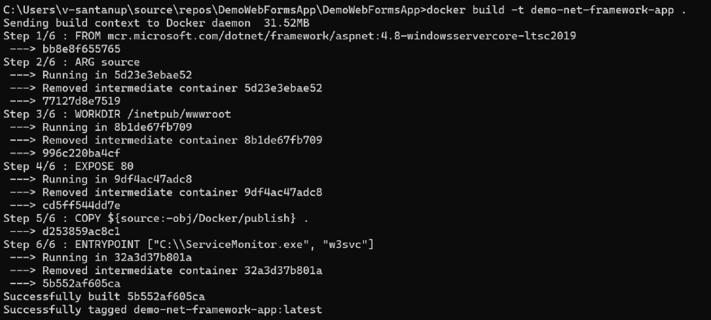
+
3. 이미지가 로컬에 있는지 확인하려면 docker image ls 명령을 사용할 수 있습니다.
+
----
docker images
----
+
4. Docker 데스크톱에서도 이미지를 볼 수 있어야 합니다.
+
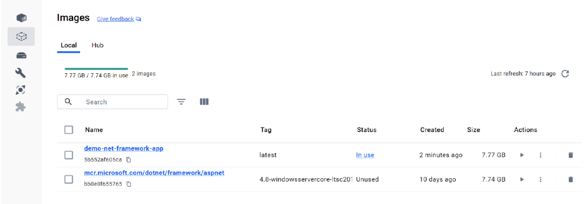
+
5. 이미지의 실행 가능한 버전인 컨테이너를 생성하고 로컬에서 애플리케이션을 테스트합니다. 아래는 docker 이미지에서 컨테이너를 생성하는 명령입니다.
+
----
docker run -d -p 80:80 --name <container-name>> <<image-id>
----
+
6. 아래 명령을 사용하여 모든 컨테이너를 확인할 수 있습니다.
+
----
docker ps -a
----
+
7. Docker 데스크톱에서 컨테이너를 볼 수도 있고, 로컬에서 테스트하기 위해 애플리케이션에 액세스 할 수도 있습니다.
+
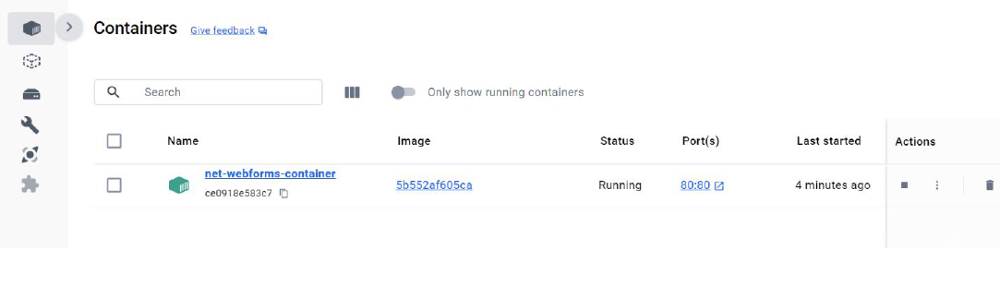
+
8. localhost:80으로 이동하면 애플리케이션에 접속할 수 있습니다.
+
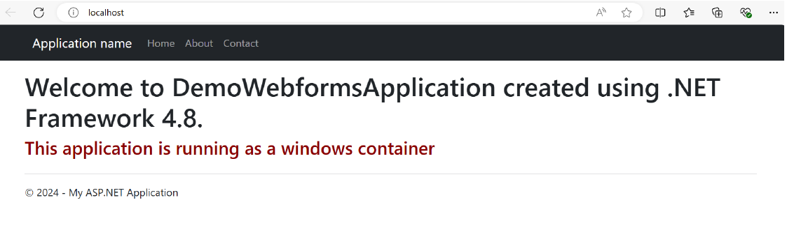

==== 3.2.3 Azure Container Registry(ACR)에 이미지 푸시

1. Azure 구독에서 Azure Container Registory(ACR) 리소스를 만듭니다.
+
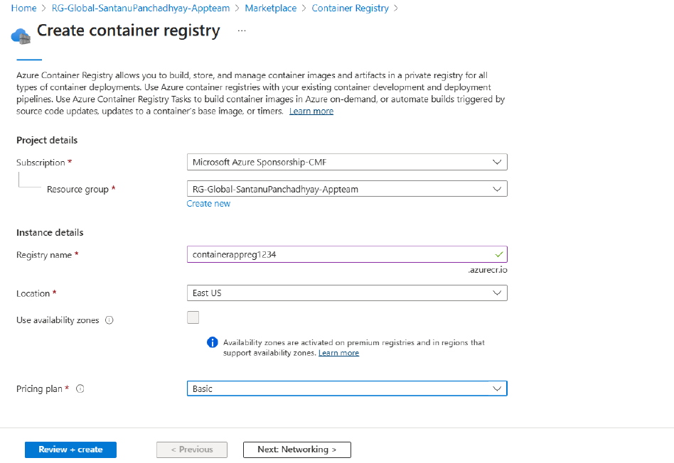
+
또는 아래 명령을 사용하여 Azure CLI를 사용할 수 있습니다.
+
----
az acr create --resource-group RG-name --name containerappreg1234 --sku Basic
----
+
2. 레지스트리에 관리자 권한을 부여합니다. 이 권한은 Azure 컨테이너 레지스트리에 로그인하는데 사용됩니다. 메시지가 표시되면 관리자 권한 부여시 생성한 관리자 이름과 비밀번호를 사용합니다.
+
----
az acr login --name containerappreg1234
----
+
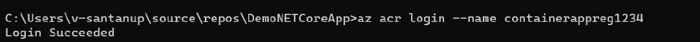
+
3. 다음 명령을 사용하여 도커 이미지에 태그를 지정하고 빌드합니다. 아래 예는 ACR 레지스트리로 이미지에 태그를 지정합니다.
+
----
docker build -t containerappreg1234.azurecr.io/net-framework-webforms-app:latest .
----
+
4. 아래 명령을 사용하여 이미지를 ACR에 푸시합니다.
+
----
docker push containerappreg1234.azurecr.io/ net-framework-webforms-app:latest
----
+
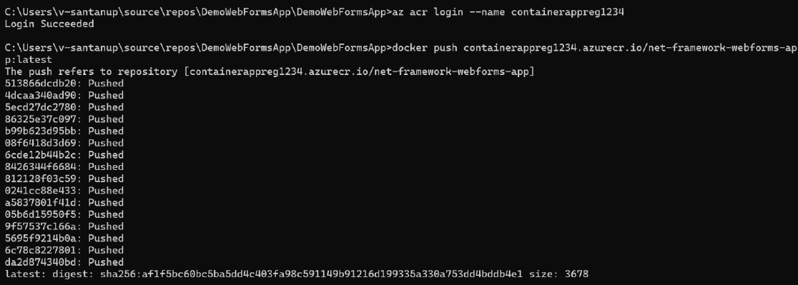
+
5. 컨테이너 레지스트리에서 이미즈를 검증하여 이미지가 성공적으로 푸시 되었는지 확인합니다.
+
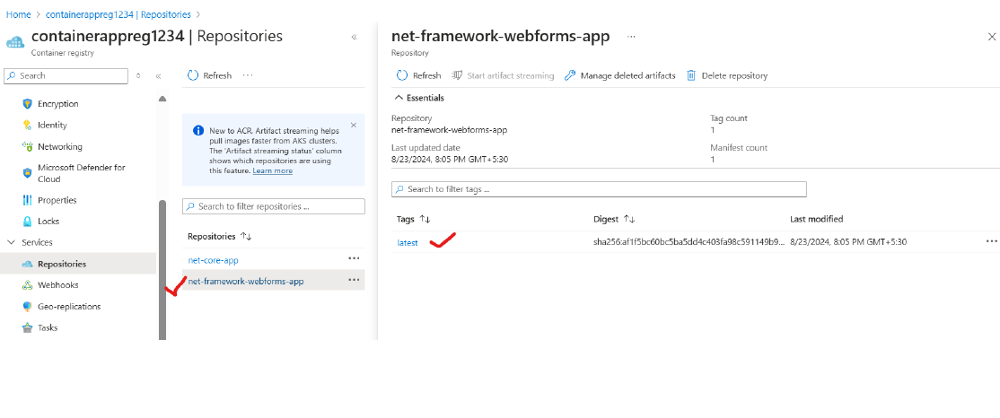

== 4. 부록

* https://docs.docker.com/reference/cli/docker/[도커 | 도커 문서]
* https://docs.docker.com/get-started/docker_cheatsheet.pdf[도커_치트시트.pdf]
* https://learn.microsoft.com/en-us/dotnet/core/containers/sdk-publish?pivots=dotnet-8-0[dotnet publish를 사용하여 앱 컨테이너화 - .]NET | Microsoft Learn
* https://learn.microsoft.com/en-us/azure/container-registry/[Azure 컨테이너 레지스트리 설명서 | Microsoft Learn]