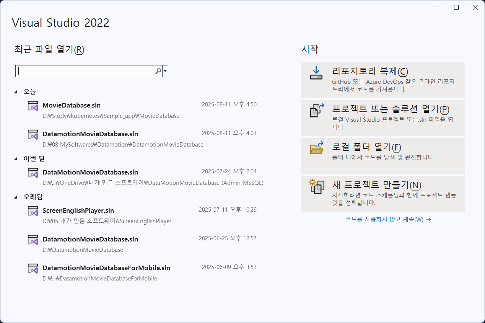
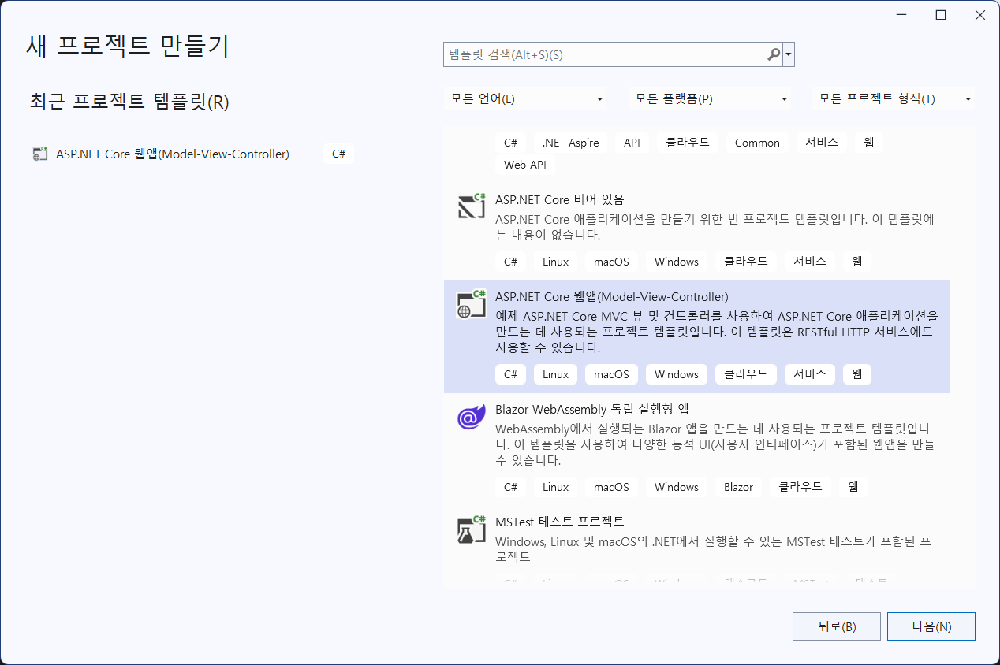
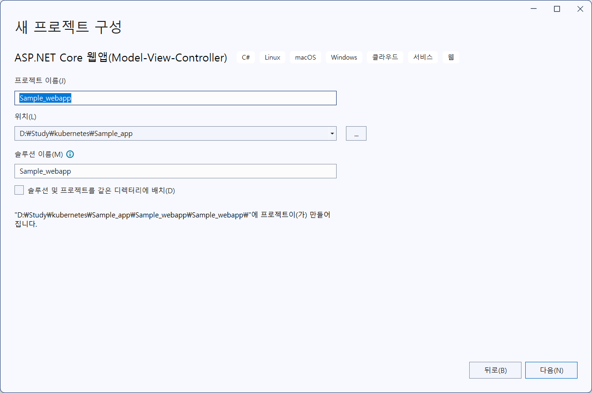
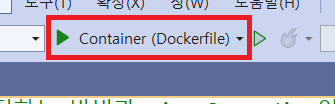
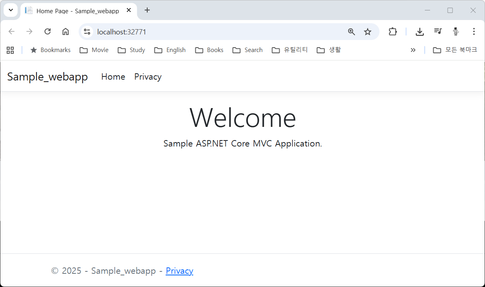

= 실습을 위한 ASP.NET Core App 작성

이 연습에서는 Azure Kubernetes Service 배포 실습을 위한 ASP.NET Core MVC App을 생성합니다. 

이 연습을 위해서는 Docker Desktop이 설치되어 실행중이어야 합니다.

== 1. Visual Studio에서 ASP.NET Core MVC 앱 생성

여기에서는 Viausl Studio를 사용하여 ASP.NET Core MVC 앱을 생성합니다. 아래 절차에 따릅니다.

1. Visual Studio를 실행하고 `새 프로젝트 만들기` 를 시작합니다.
+

+
2. `새 프로젝트 만들기` 창에서 ASP.NET Core 웹앱(Model-View Controller) 를 선택하고 다음 버튼을 클릭합니다.
+

+
3. `프로젝트 이름` 과 `솔루션 이름` 을 Sample_webapp 으로 지정하고 `위치` 에 적당한 위치를 지정한 후 `다음` 버튼을 클릭합니다.
+

+
4. `추가 정보` 창에서 아래와 같이 정보를 구성합니다.
a. 프레임워크: *.NET 8.0(장기 지원)*
b. 인증 유형: *없음*
c. HTTPS에 대한 구성: *선택*
d. 컨테이너 지원 사용: *선택*
e. 컨테이너 os: *Linux*
f. 컨테이너 빌드 형식: *Dockerfile*
g. 최상위 문 사용 안함: *선택하지 않음*
h. .NET Aspire 오케스트레이션에 등록: *선택하지 않음*
5. `만들기` 버튼을 클릭합니다.
6. 솔루션이 생성됩니다.
7. 솔루션 탐색기에서 View/Home/Index.cshtml 파일을 열고 7번째 라인을 아래와 같이 수정합니다.
+
[source, html]
----

Sample ASP.NET Core MVC Application</a>.

----
+
8. 솔루션 탐색기에서 Dockerfile을 클릭하고 내용을 확인합니다.
+
[source, dockerfile]
+
----
# 이 스테이지는 VS에서 빠른 모드로 실행할 때 사용됩니다(디버그 구성의 기본값).
FROM mcr.microsoft.com/dotnet/aspnet:8.0 AS base
USER $APP_UID
WORKDIR /app
EXPOSE 8080
EXPOSE 8081

# 이 스테이지는 서비스 프로젝트를 빌드하는 데 사용됩니다.
FROM mcr.microsoft.com/dotnet/sdk:8.0 AS build
ARG BUILD_CONFIGURATION=Release
WORKDIR /src
COPY ["Sample_webapp/Sample_webapp.csproj", "Sample_webapp/"]
RUN dotnet restore "./Sample_webapp/Sample_webapp.csproj"
COPY . .
WORKDIR "/src/Sample_webapp"
RUN dotnet build "./Sample_webapp.csproj" -c $BUILD_CONFIGURATION -o /app/build

# 이 스테이지는 최종 스테이지에 복사할 서비스 프로젝트를 게시하는 데 사용됩니다.
FROM build AS publish
ARG BUILD_CONFIGURATION=Release
RUN dotnet publish "./Sample_webapp.csproj" -c $BUILD_CONFIGURATION -o /app/publish /p:UseAppHost=false

# 이 스테이지는 프로덕션에서 사용되거나 VS에서 일반 모드로 실행할 때 사용됩니다(디버그 구성을 사용하지 않는 경우 기본값).
FROM base AS final
WORKDIR /app
COPY --from=publish /app/publish .
ENTRYPOINT ["dotnet", "Sample_webapp.dll"]
----
+
9. `빌드` 메뉴에서 `솔루션 빌드` 를 클릭합니다.
+
image:./images/image07.png[]
+
10. 위쪽 도구 상자에서 Container (Dockerfile)을 클릭하여 디버깅을 시작합니다.
+

+
11. 실행된 웹 응용 프로그램을 확인합니다.
+

+
12. 실행된 웹 응용 프로그램을 닫습니다(브라우저를 종료합니다)
13. 