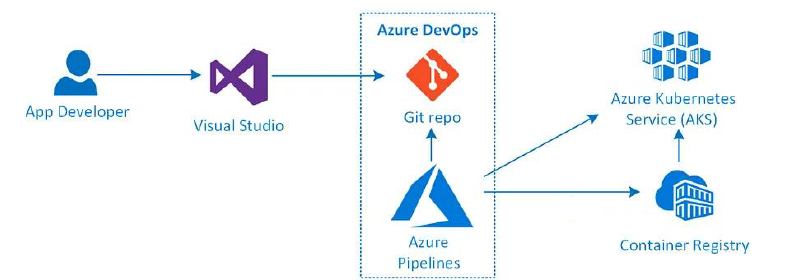
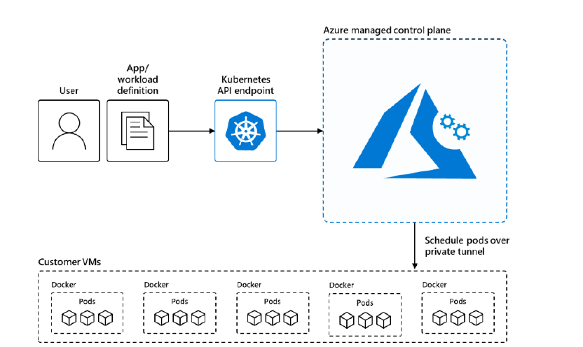
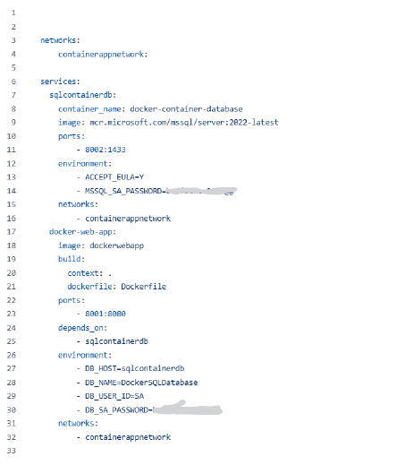

= Migrating Containerized Application to AKS

https://github.com/CAE-TEAM/cmf-runbooks/tree/main/scenarios/containerized-to-aks

== 문서 요약

[cols="1,5", options="header"]
|===
|Document Item|Current Value
|Document Title|FACTORY_Runbook_Migrate_Containerized_Application_To_AKS_v5.0
|Program|Cloud Accelerate Factory
|Date Last Modified|31-07-2025
|Date Last Reviewed|31-07-2025
|Status|Draft V1.0
|Document Description|이 문서에서는 Devops를 사용하여 컨테이너화된 온프레미스 애플리케이션을 AKS 클러스터로 마이그레이션/배포하는 방법에 대한 지침을 제공합니다.
|===

== 변경 로그

== 목차

1. 소개

여기에서는 Azure Kubernetes Service(AKS)에 대한 간략한 개요와 주요 기능 및 참조 아키텍처를 제공합니다.

> Microsoft 클라우드 도입 프레임워크(CAF)는 클라우드 도입 시 복원력의 중요성을 강조하며, 특히 영역 중복성은 애플리케이션 가용성과 내결함성을 향상시키는 핵심 전략입니다. 영역 중복성은 한 지역 내에서 물리적으로 분리된 Azure 가용성 영역(Azure Availability Zones)을 활용하여 리소스를 복제하고, 한 영역에 장애가 발생하더라도 애플리케이션이 다른 영역에서 계속 실행될 수 있도록 보장합니다. 이러한 접근 방식은 가동 중지 시간을 최소화하고 서비스 수준 계약(SLA)을 향상시킵니다. 자세한 내용은 다음 실행 설명서를 참조하십시오. https://github.com/CAE-TEAM/cmf-runbooks/blob/main/scenarios/zoneredundancy/README.md

=== 1.1 Azure Kubernetes Service(AKS)

Azure Kubenetes Service(AKS)는 컨테이너화된 애플리케이션을 배포하고 관리하기 위한 Azure의 관리형 서비스입니다. AKS를 사용하려면 최소한의 컨테이너 오케스트레이션 전문 지식이 필요합니다. Azure Kubernetes Service(AKS)는 운영 부담의 상당 부분을 Azure로 이전하여 쿠버네티스 클러스터 관리를 간소화합니다. AKS는 고가용성, 확장성 및 이식성을 요구하는 컨테이너화 된 애플리케이션을 배포하고 관리하기 위한 강력한 플랫폼 역할을 합니다. 특히 여러 지역에 애플리케이션을 배포하고, 오픈 소스 도구를 활용하고, 기존 DevOps 도구와 원활하게 통합하는데 적합합니다.

이 문서는 플랫폼 관리자 또는 개발자가 컨테이너화 된 앱을 확장 가능한 AKS에 배포하고 GitHub Actions 및 Azure DevOps 파이프라인과 같은 DevOps 도구를 사용하여 작업을 자동화하는데 도움을 줍니다.

=== 1.2 AKS의 주요 특징

1. 관리형 쿠버네티스 서비스
* 자동 업그레이드 및 패치: +
AKS는 자동 Kubernetes 버전 업그레이드 및 패치를 제공하여 관리자의 운영 부담을 줄여줍니다.
* 관리되는 Control Plane: +
Azure API는 서버와 etcd를 포함한 Kubenetes Control Plane을 관리하여 높은 가용성과 복원력을 보장합니다.
2. 확장성 및 유연성:
* 클러스터 자동 확장: +
작업 부하 수요에 따라 클러스터의 노드 수를 자동으로 조정합니다.
* 가상 노드: +
추가 Kubernetes 노드를 관리하지 않고도 트래픽 급증을 처리하기 위해 Azure Container Instances(ACI)로 원활하게 버스트합니다.
* 다중 지역 클러스터: +
재해 복구 및 고가용성을 위해 여러 지역에 AKS 클러스터를 배포합니다.
3. Azure 에코시스템과의 통합:
* Azure Active Directory(AAD) 통합: +
사용자 인증 및 역할 기반 액세스 제어(RBAC)을 위해 AAD와 통합합니다.
* 컨테이너용 Azure Monitor: +
Prometheus 및 Grafana와의 통합을 통해 AKS 클러스터에 대한 포괄적인 모니터링 및 로깅을 제공합니다.
* Azure 정책: +
조직 표준을 준수하도록 AKS 리소스에 대한 정책을 시행합니다.
* Azure DevOps: +
CI/CD 파이프라인을 위해 Azure DevOps와 원활하게 통합하여 애플리케이션 배포 프로세스를 자동화합니다.
4. 보안 및 규정 준수
* 네트워크 정책: +
Azure CNI와 Calico를 사용하여 Pod 통신에 대한 네트워크 정책을 정의하고 적용합니다.
* Pod 보안 정책: +
Pod의 보안 컨텍스트를 제어하기 위한 보안 정책을 정의합니다.
* Azure Key Vault 통합: +
Azure Key Vault를 사용하여 Secret, 인증서 및 키를 안전하게 관리합니다.
* Azure 개인 링크: +
트래픽을 공개 인터넷에 노출하지 않고 Azure 서비스에 안전하게 연결합니다.
5. 개발자 생산성:
* Azure Dev Spaces: +
반복적인 개발 및 디버깅 기능을 통해 AKS에서 마이크로서비스 기반 애플리케이션 개발을 간소화합니다.
* Helm 지원: +
Helm 차트를 사용하여 Kubernetes 애플리케이션을 쉽게 배포하고 관리합니다.
* Azure용 Open Service Broker: +
Kubernetes 애플리케이션 내에서 Azure 서비스 프로비저닝을 간소화합니다.
6. 높은 가용성 및 안정성: +
* 가용성 영역 +
여러 가용성 영역에 AKS 클러스러를 배포하여 데이터 센터 장애로부터 보호합니다.
* 재해 복구: +
다중 지역 배포 및 Azure Site Recovery를 사용하여 애플리케이션에 대한 재해 복구를 설정합니다.
7. 비용 관리:
* 초당 청구: +
초당 청구로 사용한 컴퓨팅 리소스에 대해서만 비용을 지불하세요.
* 노드 풀 관리: +
단일 클러스터 내에 여러 노드 풀을 생성하여 작업 부하 요구 사항에 따라 최적화된 리소스 할당을 허용합니다.
* 예약 인스턴스 및 스팟 가격: +
AKS 노드에 예약 인스턴스와 스팟 가격을 사용하여 비용을 최적화하세요.
8. 하이브리드 및 엣지 배포: +
* Azure Arc: +
Azure Arc를 사용하여 온프레미스 또는 다른 클라우드 환경에서 실행되는 Kubernetes 클러스터를 관리하세요
* Azure Stack HCI의 AKS: +
Azure Stack HCI에서 AKS를 실행하여 클라우드 기반 애플리케이션을 온프레미스 데이터 센터로 가져옵니다.
9. 스토리지 통합: +
* Azure 디스크 및 파일: +
AKS 클러스터의 영구 저장소에 Azure Managed Disk 및 Azure Files 사용
+ CSI 드라이버: +
스토리지 리소스를 프로비저닝하고 관리하기 위한 Container Storage Interface(CSI) 드라이버 지원
10. 네트워킹: +
* Azure CNI 및 Kubenet: +
클러스터에 대한 네트워킹을 구성하는 방법에 있어 유연성을 제공하면서 네트워크 관리를 위해 Azure CNI와 Kubenet 중에서 선택합니다.
* 로그 밸런서 및 Ingress 아키텍처: +
Azure Load Balancer와 다양한 Ingress 컨트롤러를 사용하여 들어오는 트래픽을 관리합니다.

=== 1.3 참조 아키텍처

아래 이미지는 코드를 빌드하고 컨테이너화하고, ACR에 푸시하는 과정과 Azure DevOps 파이프라인을 사용하여 배포하는 과정을 보여줍니다.

아래 이미지는 AKS 아키텍처를 보여주며, 고객 VM이 개발자 소유이고 애플리케이션은 Kubernetes API 엔드포인트를 통해 배포 가능하다는 점을 강조합니다.

== 2. Role and Responsibility

[cols=5, options="header"]
|===
|Task|Responsible|Accountable|Consulted|Informed
|클러스터 생성|고객/파트너|고객/파트너|고객/파트너|Factory
|공유할 평가 보고서|고객/파트너|고객/파트너|고객/파트너|Factory
|분석 보고서 작성|Factory|Factory|고객/Factory|고객/Factory
|애플리케이션 배포|Factory/고객|Factory/고객|Factory/고객|Factory/고객
|===

== 3. 계획

1. 클러스터 관리 액세스를 보장합니다.
2. Azure 구독에 대한 기여자 역할

== 4. 사전 필수 조건

* 마이그레이션할 애플리케이션의 최종회(Wave plan)
* Azure 마이그레이션 도구를 실행하여 애플리케이션 평가/수동 검색 - VM에서 실행중인 모든 애플리케이션, 서비스 및 종속성을 식별합니다.
* AKS 클러스터에 대한 랜딩 존 생성
* AKS에서 네트워킹, 저장소 및 보안 설정을 구성합니다.
* 클러스터 액세스 및 기여자 역할 액세스.
* 매니페스트 파일에 대한 액세스(존재하는 경우)
* 사이트 간 연결성
* 매우 낮은 지연 시간으로 DB 연결이 가능한지 확인하세요.
* 마이그레이션 요구 사항(구성 맵, 스토리지 클래스, 제한, 비밀 등)을 충족하는지 확인하기 위해 마이그레이션 전에 코드 수정을 완료합니다.
* 수집하고 복제/생성할 프로젝트 네임스페이스입니다.
* 환경에서 적절한 DNS 확인을 보장합니다.
* Microsoft 참조 아키텍처 다이어그램에 따라 대상 아키텍처 다이어그램을 준비합니다.
* 고객의 승인
* AKS 클러스터에 대한 Microsoft Entra 인증을 구성합니다.
* 애플리케이션의 성능, 부하 및 리소스 활용도를 평가합니다.
* 확장 요구 사항을 결정합니다.
* Docker를 사용하여 애플리케이션을 컨테이너 이미지로 변환합니다.
* 각 애플리케이션 구성 요소에 대한 Dockerfile을 만듭니다.
* 마이그레이션하기 전에 백업이 제대로 되어 있는지 확인하세요.
* GitHub/Azure DevOps와 같은 도구를 사용하여 CI/CD 파이프라인을 구성합니다.

== 5. 실행: AKS에서 컨테이너화 된 앱의 마이그레이션 단계

=== 5.1 시나리오: Linux 컨테이너

==== 5.1.1 Azure Kubernetes Service(AKS)용 애플리케이션 준비

쿠버네티스에서 사용할 다중 컨테이너 애플리케이션을 준비해보겠습니다. Docker Compose와 같은 기존 개발 도구를 사용하여 로컬에서 애플리케이션을 빌드하고 테스트합니다. 컴퓨터에 Docker 데스트톱이 설치되어 있는지 확인해보세요.

* 샘플 애플리케이션 소스에서 컨테이너 이미지를 만듭니다.
* 로컬 Docker 환경에서 다중 컨테이너 애플리케이션을 테스트합니다. AKS 클러스터에 배포할 경우 매우 간단한 영화 앱이 있습니다. 노트북에서 docker-compose.yaml 파일을 실행하여 로컬에서 애플리케이션을 테스트합니다. 아래는 참고용 애플리케이션의 docker-compose 파일과 Dockerfile 입니다.
+
docker-compose.yml:
+

+
Dockerfile:
imaeg:./images/image04.png[]
+
