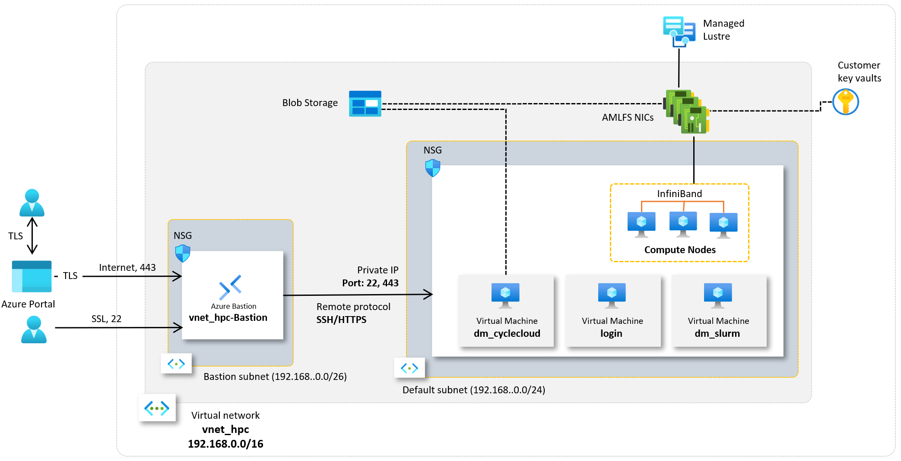
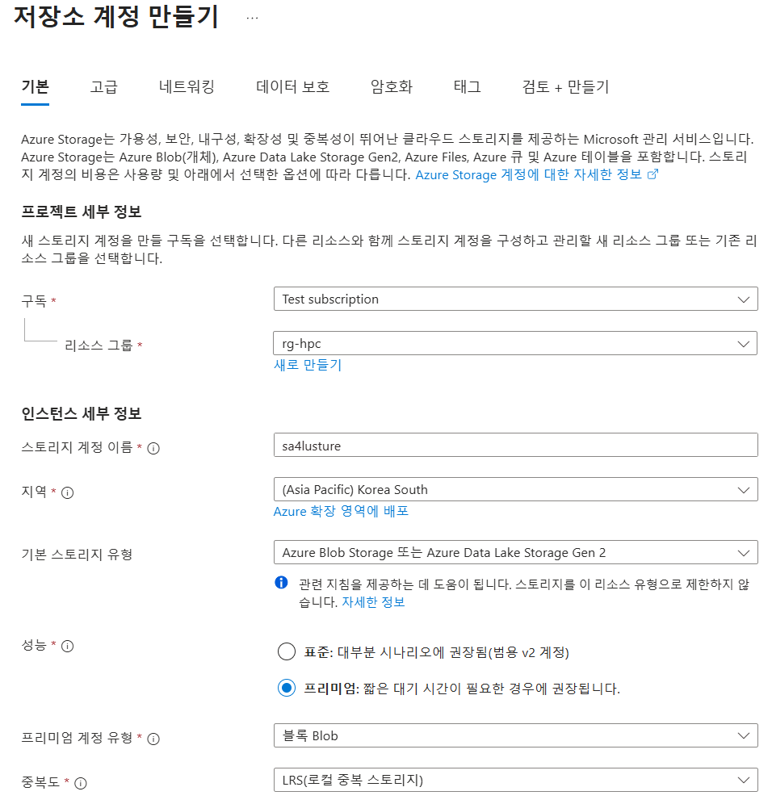
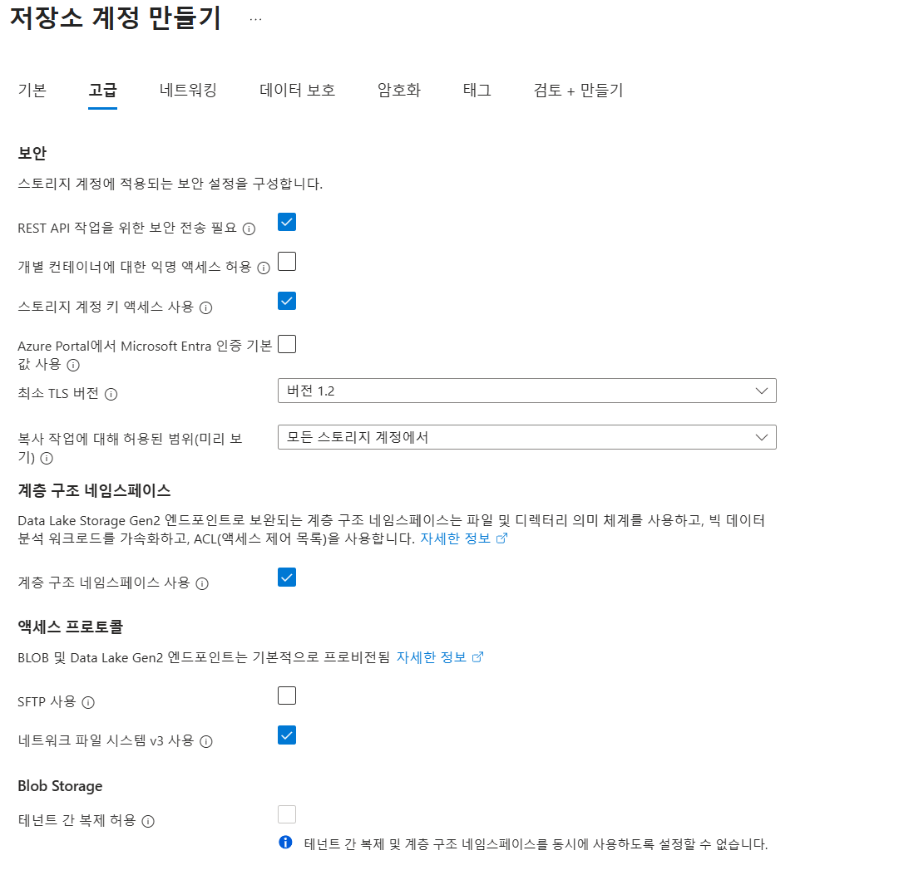
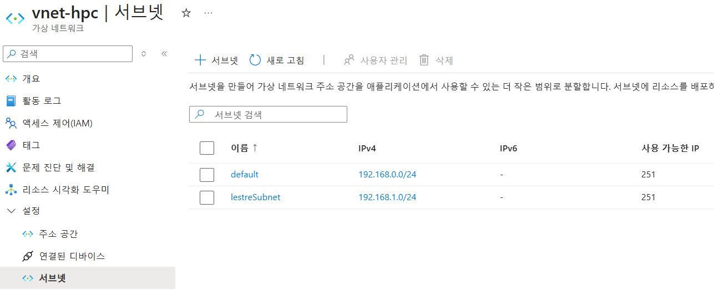
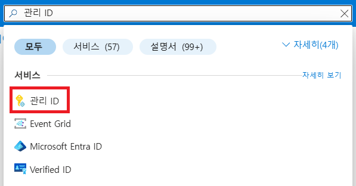
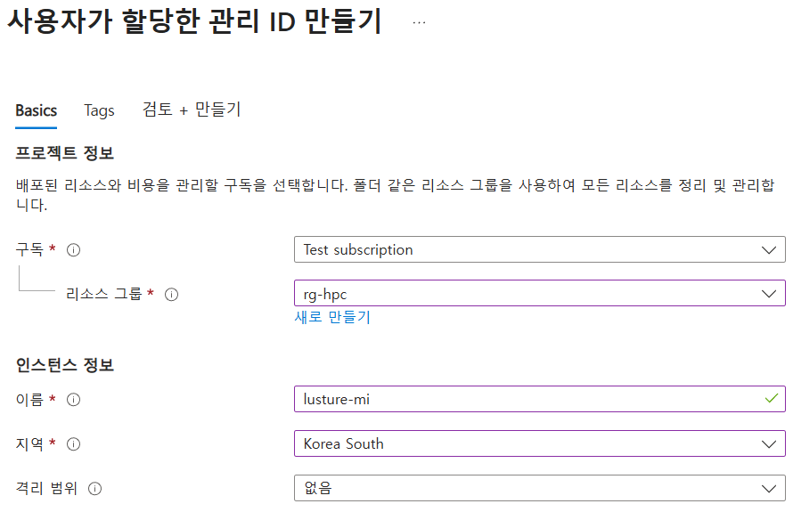
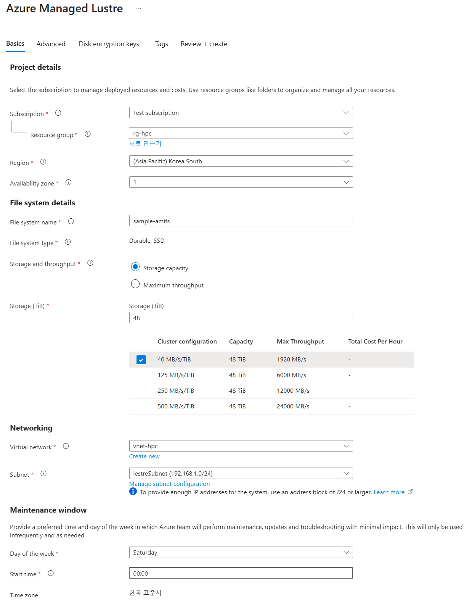

= Azure Managed Lustre 구성
:sectnums:
:toc:

Microsoft Azure는 슈퍼컴퓨팅 수준의 워크로드를 지원하기 위해 Lustre를 직접 활용할 수 있는 기능을 제공합니다. HPC 전용 인프라, 고속 네트워크, 스토리지 서비스와 결합하여 확장성과 성능을 확보합니다. 클라우드 환경에서의 Lustre는 클라우드의 무제한 용량 특성을 기본으로 사용자가 스토리지와 컴퓨팅을 유연하게 확장할 수 있는 장점을 누릴 수 있습니다.

Azure는 Lustre를 관리되는 서비스 형태로 제공합니다. 사용자는 복잡한 Lustre 클러스터를 직접 구성할 필요 없이, Azure Portal 또는 CLI를 사용하여 Lustre 파일 시스템을 몇 분만에 배포할 수 있습니다. HPC 워크로드에 맞게 고성능 SSD 기반 OST를 사용하며, 필요시 크기를 자동적으로 확장할 수 있습니다. Azure Managed Lustre는 워크로드 완료 후 결과 데이터를 Azure Blob Storage에 저장하고 저 비용으로 보관할 수 있습니다.

Azure Managed Lustre(AMLFS)는 처리량이 높은 병렬 파일 시스템으로, 활성 데이터, 즉 클러스터에서 활성 또는 계획된 작업에 대한 학습에서 생성된 출력 및 중간 데이터만 저장하는 데 권장됩니다. 비용 최적화를 위해 이 파일 시스템을 범용 저장소로 사용해서는 안 됩니다. 오래되었거나 사용되지 않는 데이터는 Blob 저장소로 옮겨야 합니다. 다행히 AMLFS는 Blob 저장소와 동기화할 수 있습니다. 이 섹션에서는 설정 방법을 설명합니다.

이 가이드에서는 Azure Managed Lustre 파일 시스템과 Blob 통합을 설명하고, Azure Managed Lustre를 생성하며 Slurm 클러스터에서 사용하도록 구성합니다.

이 가이드의 절차를 완료하면 아래와 같은 환경이 구성됩니다. 

이 연습을 위해서는 **Slurm 클러스터 생성 및 배포** 가이드에서 수행한 환경이 구성되어 있어야 합니다.

== 스토리지 계정 설정 추가

여기에서는 Azure Managed Lustre에서 blob 통합에 사용할 Storage 계정에 설정을 추가합니다. 아래 절차에 따릅니다.

== Subnet 구성

여기에서는 Lustre 구성을 위한 Subnet을 **Virtual Network, Subnet, Bastion 구성** 가이드의 **3. Virtual Network와 Bastion 생성** 단계에서 생성한 **vnet-hpc** 가상 네트워크에 생성합니다. 아래 단계를 따릅니다.

1. 상단의 Microsoft Azure 로고를 클릭하여 Azure Portal의 Home 페이지로 이동합니다.
2. 리소스 그룹을 클릭합니다.
3. 리소스 그룹에서 rg-hpc를 클릭합니다.
4. rg-hpc 페이지의 리소스 목록에서 vnet-hpc 가상 네트워크를 클릭합니다.
5. 왼쪽 패널에서 **설정** -> **서브넷**을 클릭합니다.
6. **+서브넷**을 클릭합니다.
+

+
7. 서브넷 추가 패널에서 **이름**을 _lestreSubnet_ 으로 지정하고 다른 값은 기본 값으로 지정합니다. IPv4를 위한 설정 값은 아래와 같습니다.
+
[cols="1,2a", options="header"]
|===
|항목|값
|서브넷 용도|Default (기본 값)
|이름|_lestreSubnet_
|IPv4 주소 공간 포함|선택 (기본 값)
|IPv4 주소 범위|192.168.0.0/16 (기본 값)
|시작 주소|192.168.1.0 (기본 값)
|크기|/24(256개 주소)
|===
+

+
8. 아래쪽의 **추가** 버튼을 클릭합니다.
9. 생성된 서브넷을 확인합니다.
+

== Azure Managed Lustre

여기에서는 Azure Managed Lustre를 구성합니다. 아래 단계에 따릅니다.

1. 위쪽의 검색 창에서 lestre를 입력하여 검색한 다음, **Azure Managed Lustre**를 클릭합니다.
+

+
2. **스토리지 센터** Managed Lustre 페이지에서 **+만들기**를 클릭합니다.
+

+
3. **Basic** 탭에서 아래와 같이 정보를 입력합니다.
+
[cols="1,3a", options="header"]
|===
|항목|값
|Susbscritpion|Azure Managed Lustre 파일 시스템을 사용할 구독을 선택합니다.
|Resource Group|_rg-hpc_
|Region|_(Asia Pacific) Korea South_
|Availability zone|1(기본 값)
|File System Name|_sample-amifs_ (이 이름은 리소스 목록에서 파일 시스템을 식별하는데 사용되며, mount 명령에 사용되는 파일 시스템의 이름이 아닙니다
)
|Storage and throughput|_Storage capacity_ (기본 값)
|Storage(TiB)|48 (기본 값)
|Virtual Network|_vnet-hpc_
|Subnet|lestreSubnet
|Day of the week|Saturday
|Start time|00:00
|===
+

+
4. 아래쪽의 **Next + advaced** 버튼을 클릭합니다.
5. **Advanced** 탭에서, Import/export data from blob 옵션을 선택하고 아래와 같이 정보를 입력합니다.
