= Azure Managed Lustre 구성
:sectnums:
:toc:

Microsoft Azure는 슈퍼컴퓨팅 수준의 워크로드를 지원하기 위해 Lustre를 직접 활용할 수 있는 기능을 제공합니다. HPC 전용 인프라, 고속 네트워크, 스토리지 서비스와 결합하여 확장성과 성능을 확보합니다. 클라우드 환경에서의 Lustre는 클라우드의 무제한 용량 특성을 기본으로 사용자가 스토리지와 컴퓨팅을 유연하게 확장할 수 있는 장점을 누릴 수 있습니다.

Azure는 Lustre를 관리되는 서비스 형태로 제공합니다. 사용자는 복잡한 Lustre 클러스터를 직접 구성할 필요 없이, Azure Portal 또는 CLI를 사용하여 Lustre 파일 시스템을 몇 분만에 배포할 수 있습니다. HPC 워크로드에 맞게 고성능 SSD 기반 OST를 사용하며, 필요시 크기를 자동적으로 확장할 수 있습니다. Azure Managed Lustre는 워크로드 완료 후 결과 데이터를 Azure Blob Storage에 저장하고 저 비용으로 보관할 수 있습니다.

Azure Managed Lustre(AMLFS)는 처리량이 높은 병렬 파일 시스템으로, 활성 데이터, 즉 클러스터에서 활성 또는 계획된 작업에 대한 학습에서 생성된 출력 및 중간 데이터만 저장하는 데 권장됩니다. 비용 최적화를 위해 이 파일 시스템을 범용 저장소로 사용해서는 안 됩니다. 오래되었거나 사용되지 않는 데이터는 Blob 저장소로 옮겨야 합니다. 다행히 AMLFS는 Blob 저장소와 동기화할 수 있습니다. 이 섹션에서는 설정 방법을 설명합니다.

이 가이드에서는 Azure Managed Lustre 파일 시스템과 Blob 통합을 설명하고, Azure Managed Lustre를 생성하며 Slurm 클러스터에서 사용하도록 구성합니다.

이 가이드의 절차를 완료하면 아래와 같은 환경이 구성됩니다. 

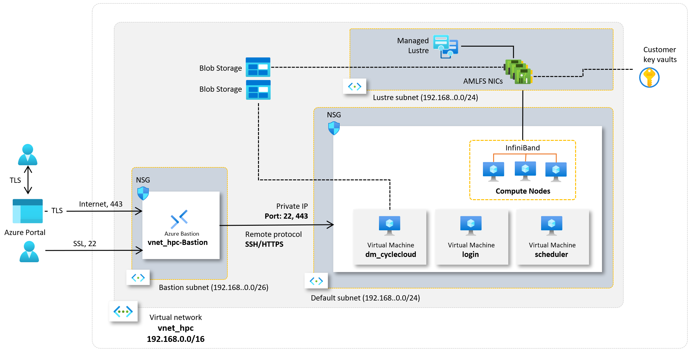

이 연습을 위해서는 **Slurm 클러스터 생성 및 배포** 가이드에서 수행한 환경이 구성되어 있어야 합니다.

== Lustre용 Subnet 구성

여기에서는 Lustre 구성을 위한 Subnet을 **Virtual Network, Subnet, Bastion 구성** 가이드의 **3. Virtual Network와 Bastion 생성** 단계에서 생성한 **vnet-hpc** 가상 네트워크에 생성합니다. 아래 단계를 따릅니다.

1. 상단의 Microsoft Azure 로고를 클릭하여 Azure Portal의 Home 페이지로 이동합니다.
2. 리소스 그룹을 클릭합니다.
3. 리소스 그룹에서 rg-hpc를 클릭합니다.
4. rg-hpc 페이지의 리소스 목록에서 vnet-hpc 가상 네트워크를 클릭합니다.
5. 왼쪽 패널에서 **설정** -> **서브넷**을 클릭합니다.
6. **+서브넷**을 클릭합니다.
+
image:./images/06/01/image01.png[width=800]
+
7. 서브넷 추가 패널에서 **이름**을 _lestreSubnet_ 으로 지정하고 다른 값은 기본 값으로 지정합니다. IPv4를 위한 설정 값은 아래와 같습니다.
+
[cols="1,2a", options="header"]
|===
|항목|값
|서브넷 용도|Default (기본 값)
|이름|_lestreSubnet_
|IPv4 주소 공간 포함|선택 (기본 값)
|IPv4 주소 범위|192.168.0.0/16 (기본 값)
|시작 주소|192.168.1.0 (기본 값)
|크기|/24(256개 주소)
|===
+
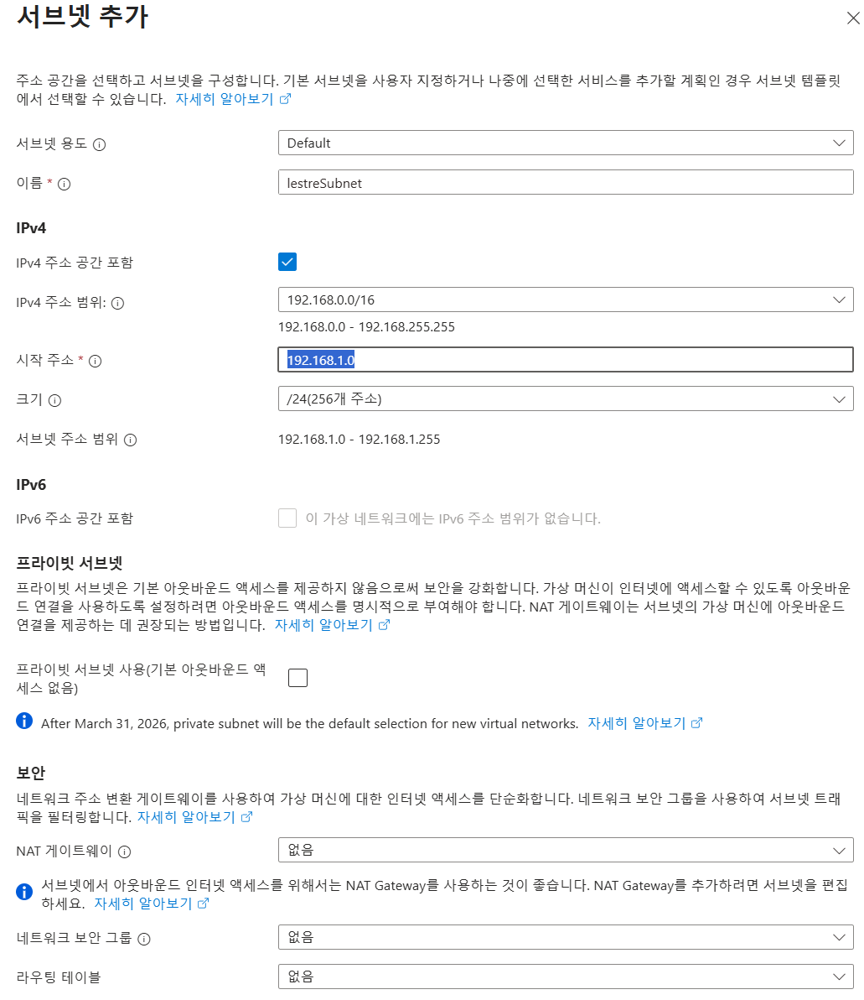
+
8. 아래쪽의 **추가** 버튼을 클릭합니다.
9. 생성된 서브넷을 확인합니다.
+

== 스토리지 계정 생성

1. 상단의 Microsoft Azure 로고를 클릭하여 Azure Portal의 Home 페이지로 이동합니다.
2. Azure 서비스 구역에서 **리소스 만들기**를 클릭합니다.
3. 왼쪽 패널에서 **스토리지**를 클릭하고 오른쪽에서 **스토리지 계정** 아래의 **만들기**를 클릭합니다.
4. 아래와 같이 기본 사항을 지정합니다. 다른 설정은 기본값으로 유지합니다.
+
[cols="1,2a", options="header"]
|===
|항목|값
|리소스 그룹|_rg-hpc_
|스토리지 계정 이름|_sa4lustre_
|위치|_(Asia Pacific) Korea South_
|기본 스토리지 유형|_Azure Blob Storage 또는 Azure Data Lake Storage Gen 2
|성능|_프리미엄_
|프리미엄 계정 유형|_블록 blob_
|중복도|_LRS(로컬 중복 스토리지)_
|===
+
image:./images/06/02/image01.png[width=800]
+
5. 아래쪽에서 **다음** 버튼을 클릭합니다.
6. **고급** 탭에서 아래와 같이 설정합니다.
+
[cols="1,2a", options="header"]
|===
|항목|값
|REST API 작업을 위한 보안 전송 필요|선택 (기본 값)
|개별 컨테이너에 대한 익명 액세스 허용|선택하지 않음 (기본 값)
|스토리지 계정 치 액세스 사용|선택 (기본 값)
|Azure Portal에서 Microsoft Entra 인증 기본값 사용|선택하지 않음 (기본 값)
|최소 TLS 버전|버전 1.2 (기본 값)
|복사 작업에 대해 허용된 범위(미리 보기)|모든 스토리지 계정에서 (기본 값)
|계층 구조 네임 스페이스 사용|**_선택_**
|네트워크 파일 시스템 v3 사용|**_선택_**
|===
+

+
7. 아래쪽에서 **다음** 버튼을 클릭합니다.
8. **네트워킹** 탭에서 아래와 같이 네트워크 설정을 지정합니다. 다른 설정은 기본값으로 유지합니다. 
+
[cols="1,2a", options="header"]
|===
|항목|값
|공용 네트워크 액세스|사용 (기본 값)
|공용 네트워크 액세스 범위|_선택한 가상 네트워크 및 IP 주소에서 사용_
|가상 네트워크|_vnet-vpc_
|서브넷|lestureSubnet(192.168.1.0/24)('Micrsoft.Storage’엔드포인트가 추가됨)
|===
+
|===
|**참고** 계정 액세스를 위해 사용자 IP를 추가할 수 있습니다.
|===
+
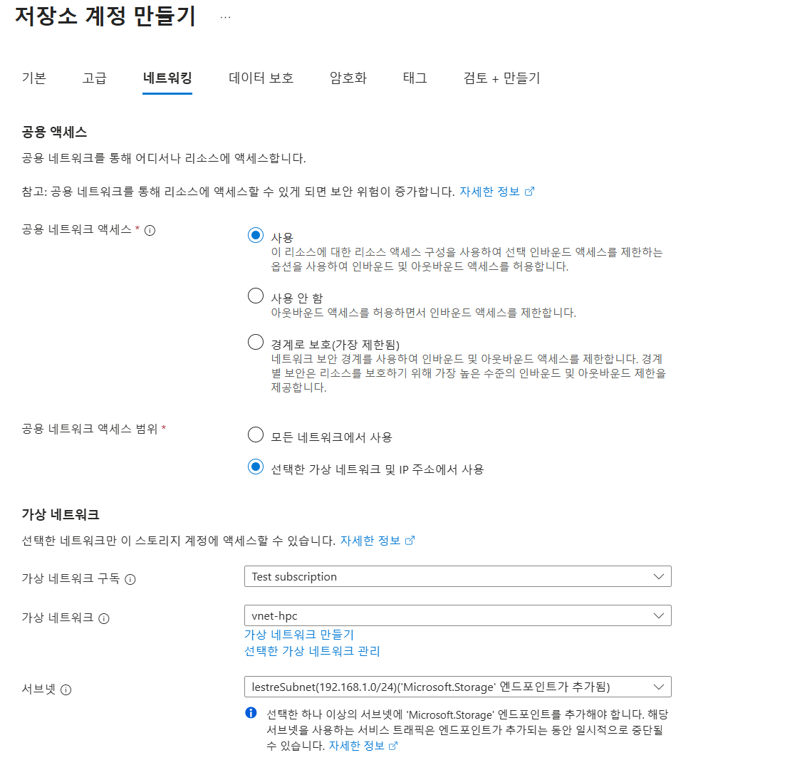
+
9. 아래쪽에서 **검토 + 만들기** 버튼을 클릭합니다.
10. 유효성 검사가 완료되면 **만들기** 버튼을 클릭합니다.
11. 배포가 진행됩니다.
12. 배포가 완료되면 **리소스로 이동** 버튼을 클릭합니다.

=== 컨테이너 생성

여기에서는 생성한 스토리지 계정에 컨테이너를 생성합니다. 아래 절차에 따릅니다.

1. 스토리지 계정 페이지에서, 왼쪽 패널에서 **데이터 스토리지** -> **컨테이너**를 클릭합니다.
2. 컨테이너 페이지에서 **+ 컨테이너 추가**를 클릭합니다.
+
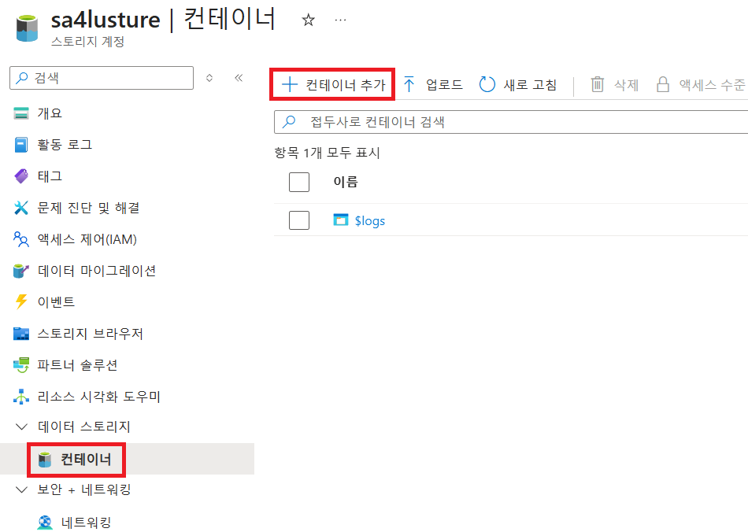
+
3. **새 컨테이너** 패널에서 _lustreintegrated_ 를 입력하고 아래쪽의 **만들기** 버튼을 클릭합니다.
+
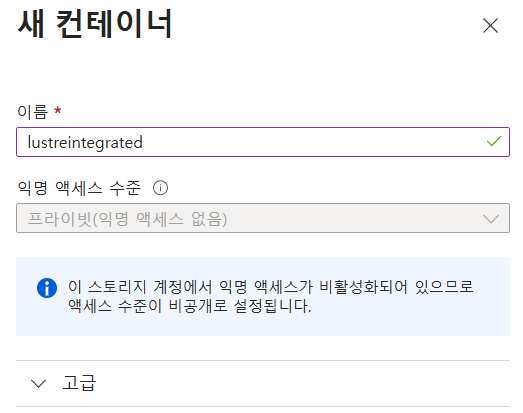
+
4. 같은 방법으로, _logs_ 컨테이너를 생성합니다.
5. 생성된 두 컨테이너를 확인합니다.
+
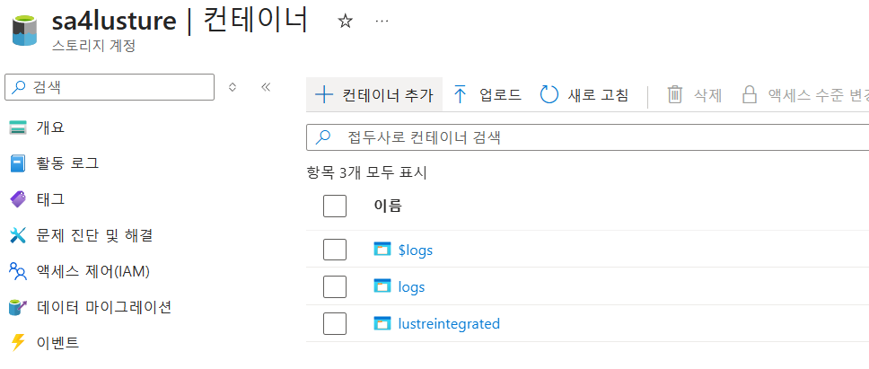

== 보안 구성

여기에서는 Azure Managed Lustre와 Blob 스토리지 계정을 통합하기 위한 관리 ID를 생성하고 설정합니다. 아래 절차에 따릅니다.

=== 관리 ID 생성

여기에서는 AMLFS와 Blob 스토리지 통합을 위한 관리 ID를 생성합니다. 아래 절차에 따릅니다.

1. Portal의 위쪽 검색창에 관리 ID를 검색하고 선택합니다.
+

+
2. 관리 ID 페이지에서 왼쪽 위의 만들기를 클릭합니다.
3. 사용자가 할당한 관리 ID 만들기 페이지에서 아래와 같이 설정합니다.
+
[cols="1,2a", options="header"]
|===
|항목|값
|구독|해당 구독
|리소스 그룹|_rg-hpc_
|이름|lusture-mi
|지역|Korea South
|격리 범위|없음
|===
+

+
4. 아래쪽의 **검토 + 만들기** 버튼을 클릭합니다.
5. 유효성 검사가 완료되면 **만들기** 버튼을 클릭합니다.
6. 배포가 완료되면 **리소스로 이동** 버튼을 클릭합니다.
7. Portal의 위쪽 검색창에 관리 ID를 검색하고 선택합니다.
8. 생성된 관리 ID를 확인합니다. 보이지 않으면 **새로 고침**을 클릭합니다.
+
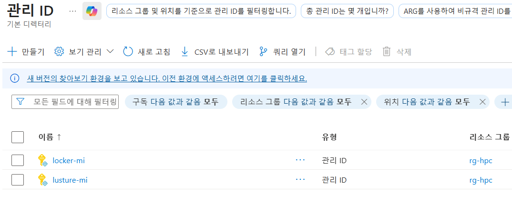

=== 스토리지 계정에 대한 권한 부여

1. 상단의 Microsoft Azure 로고를 클릭하여 Azure Portal의 Home 페이지로 이동합니다.
2. **리소스 그룹**을 클릭합니다.
3. 리소스 그룹에서 **rg-hpc**를 클릭합니다.
4. rg-hpc 페이지의 리소스 목록에서 sa4lustre 스토리지 계정을 클릭합니다.
5. 왼쪽 패널에서 **액세스 제어(IAM)**을 클릭합니다.
6. 추가 버튼을 클릭하고 역할 할당 추가를 클릭합니다.
+
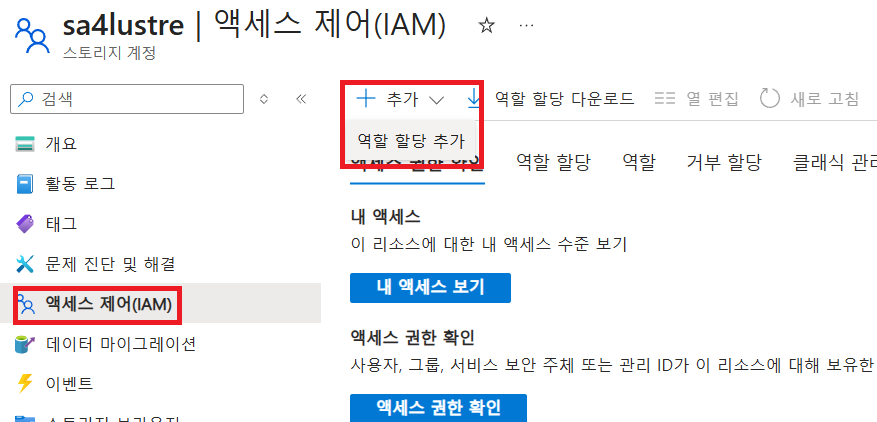
+
7. **역할 할당 추가** 페이지에서, **역할** 탭, **작업 기능 역할** 탭의 검색 텍스트 상자에 **storage blob 데이터 Contributor** 를 입력하여 검색하고 선택합니다.
+
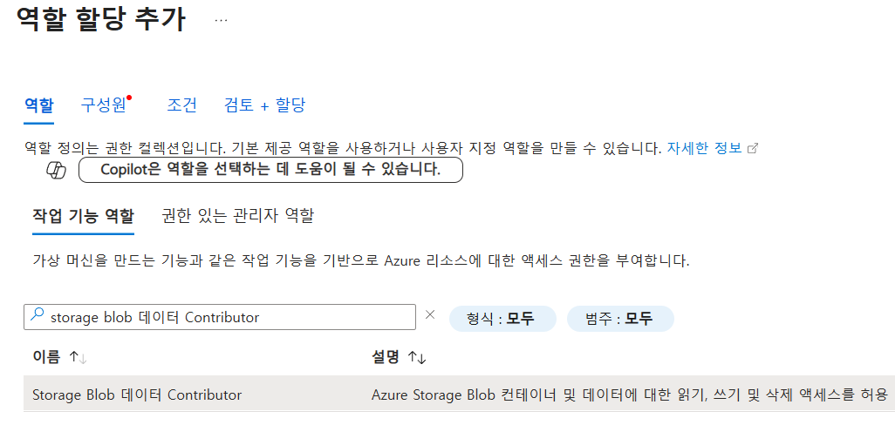
+
8. 아래쪽에서 **다음** 버튼을 클릭합니다.
9. **역할 할당 추가** 페이지의 구성원 탭에서 **다음에 대한 액세스 할당**에서 **관리 ID**를 선택하고 **+ 구성원 선택** 링크를 클릭합니다.
+
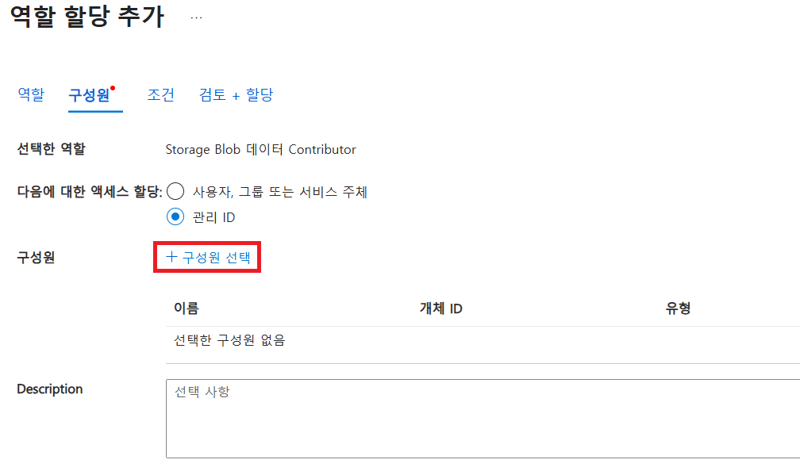
+
10. 오른쪽의 관리 ID 선택 패널에서 관리 ID 드롭다운 목록을 클릭하고 **사용자가 할당한 관리 ID**를 선택합니다.
+
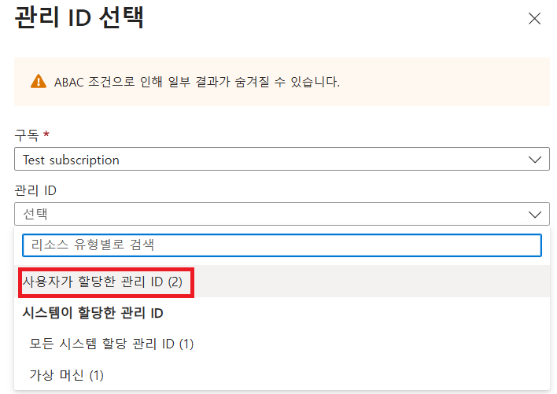
+
11. 위에서 생성한 lustre-mi를 클릭하고 선택 버튼을 클릭합니다.
+
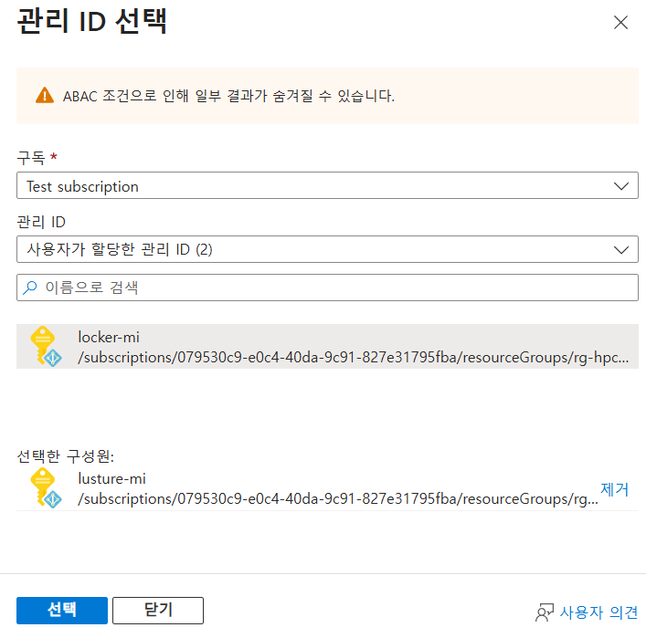
+
12. 역할 할당 추가 페이지에서 **검토 + 할당** 버튼을 클릭합니다.
13. 유효성 검사가 완료되면 **검토 + 할당** 버튼을 클릭합니다.
14. **sa4lustre | 액세스 제어(IAM)** 페이지에서 **역할 할당** 탭을 클릭하고 할당된 역할들을 확인합니다.
+
image:./images/06/03/image09.png[width=800]

== Key Vault 생성

여기서는 Lustre 키를 저장하기 위한 키 자격 증명 모음(Azure Key Vault)를 생성합니다. 아래 절차에 따릅니다.

1. Portal 위쪽의 검색창에서 _키 자격 증명 모음_ 을 입력하거 검색한 다음, 결과에서 **키 자격 증명 모음**을 클릭합니다.

== Azure Managed Lustre 생성

여기에서는 Azure Managed Lustre를 구성합니다. 아래 단계에 따릅니다.

1. Portal 위쪽의 검색 창에서 lestre를 입력하여 검색한 다음, **Azure Managed Lustre**를 클릭합니다.
+
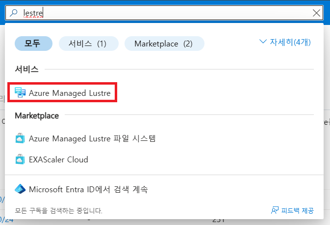
+
2. **스토리지 센터** Managed Lustre 페이지에서 **+만들기**를 클릭합니다.
+
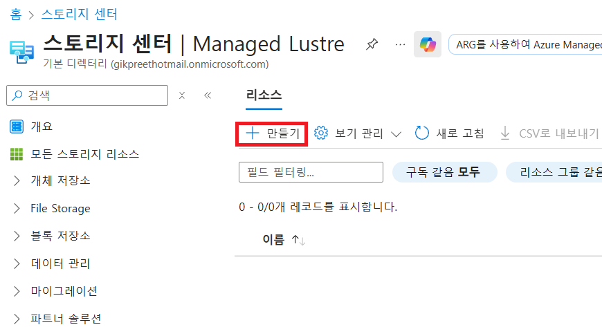
+
3. **Basic** 탭에서 아래와 같이 정보를 입력합니다.
+
[cols="1,3a", options="header"]
|===
|항목|값
|Susbscritpion|Azure Managed Lustre 파일 시스템을 사용할 구독을 선택합니다.
|Resource Group|_rg-hpc_
|Region|_(Asia Pacific) Korea South_
|Availability zone|1(기본 값)
|File System Name|_sample-amlfs_ (이 이름은 리소스 목록에서 파일 시스템을 식별하는데 사용되며, mount 명령에 사용되는 파일 시스템의 이름이 아닙니다
)
|Storage and throughput|_Storage capacity_ (기본 값)
|Storage(TiB)|48 (기본 값)
|Virtual Network|_vnet-hpc_
|Subnet|lestreSubnet
|Day of the week|Saturday
|Start time|00:00
|===
+
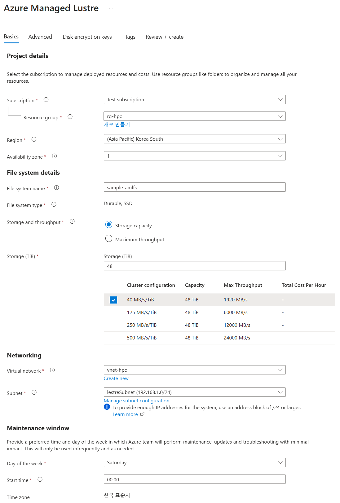
+
4. 아래쪽의 **Next + advaced** 버튼을 클릭합니다.
5. **Advanced** 탭에서, Import/export data from blob 옵션을 선택하고 아래와 같이 정보를 입력합니다.
+
[cols="1,3a", options="header"]
|===
|항목|값
|Subscription|Azure Managed Lustre 파일 시스템을 사용할 구독을 선택합니다.
|Storage Account|_sa4lesture_
|Container|_lustreIntegrated_
|Logging container|_logs_
|Import Prefix(es) (Optional)|/data, /test +
**참고** `+` 를 눌러 여러개의 접두사를 지정할 수 있습니다.
|===
+
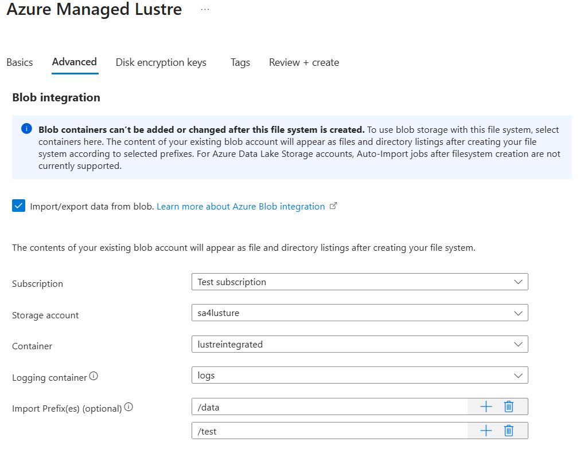
+
6. 아래쪽에서 **Next: Disk encryption keys** 버튼을 클릭합니다.
7. 

