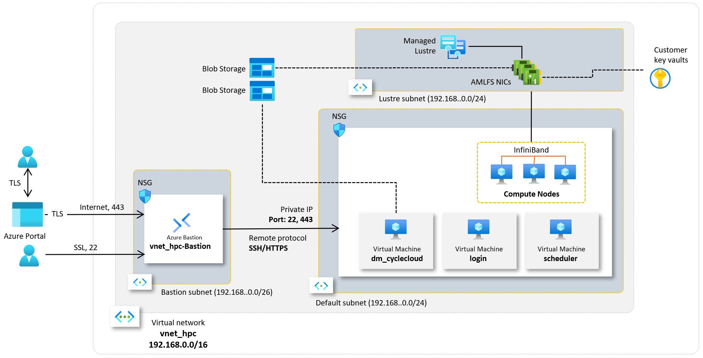

= Virtual Network, Subnet, Bastion 구성
:sectnums:
:toc:

////
https://learn.microsoft.com/ko-kr/azure/bastion/quickstart-host-portal
https://learn.microsoft.com/ko-kr/training/modules/connect-vm-with-azure-bastion/4-exercise-connect-vm-with-bastion
////

이 문서 시리즈는 Microsoft Azure에서 NVidia GPU를 사용한 분산 머신 러닝을 위한 Slurm/CycleCloud 기반 환경을 구성하는 것을 목표로 제작되었습니다. 모든 문서의 연습을 마무리하면, 아래와 같은 구조의 Azure Cloud 기반 HPC 환경이 구성됩니다.

이 가이드에서는 첫 번째 단계로 리소스 그룹을 만들고, Virtual Network와 Subnet을 구성한 후 Bastion을 사용한 보안된 접근을 구성합니다. 이 연습에서는 아래와 같은 과정을 수행합니다.

* 리소스 그룹 생성
* Virtual Network와 Subnet 생성
* Bastion 구성
* Virtual Machine 생성
* 클라이언트에서 Azure Portal과 SSH를 사용한 연결 테스트