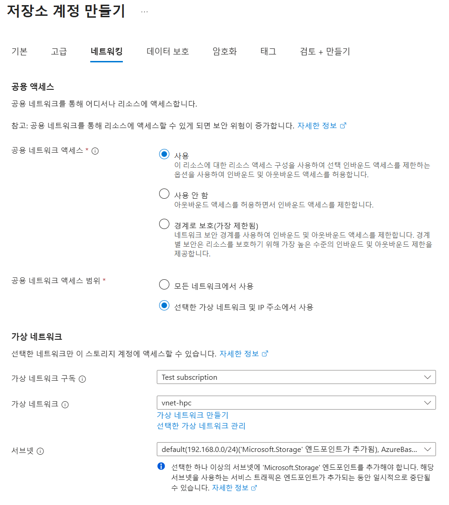
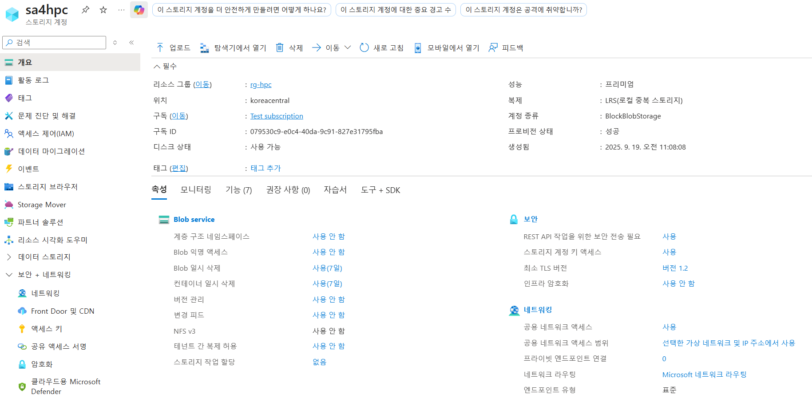
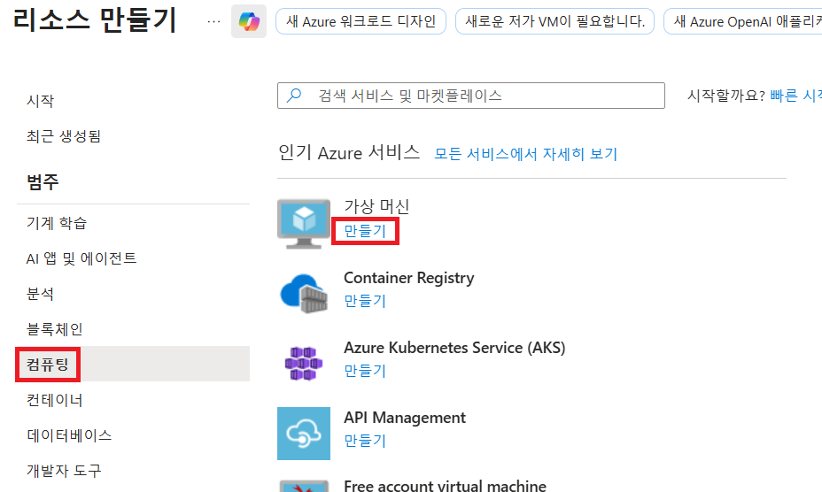
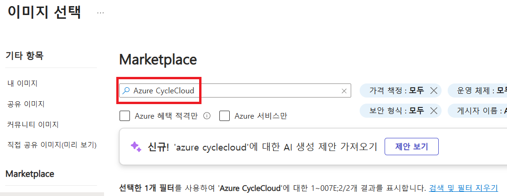
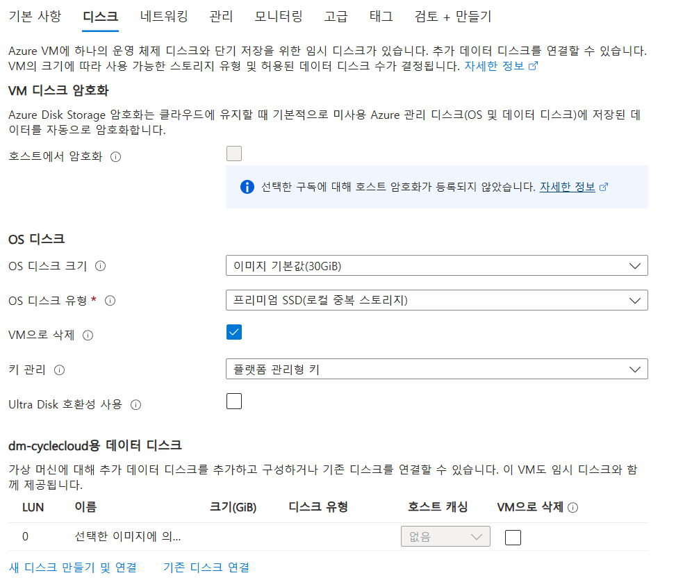
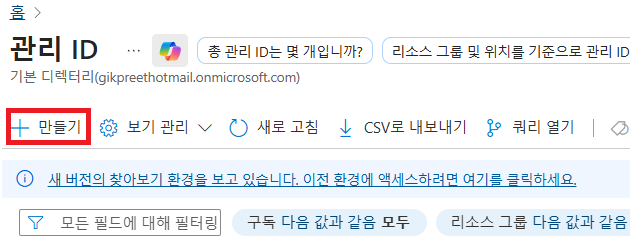
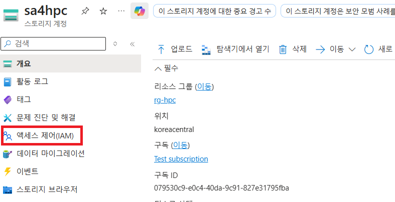
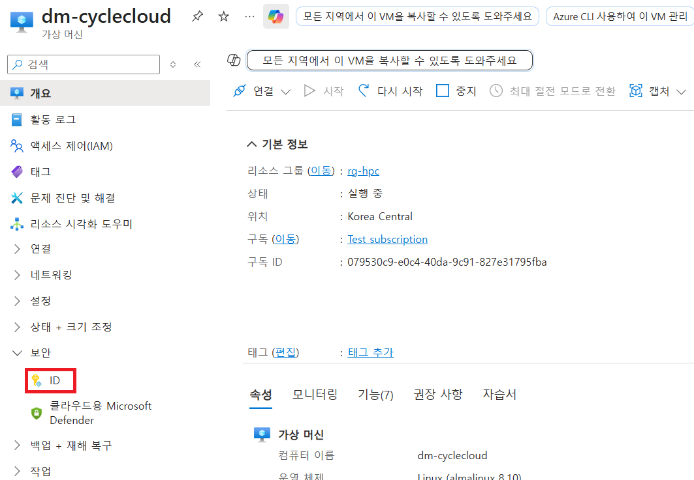
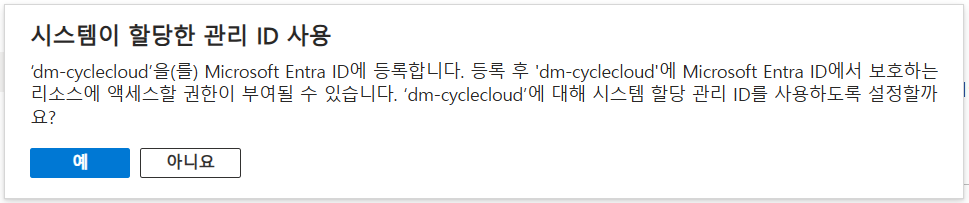

= Azure CycleCloud

이 가이드에서는 이전의 문서에서 생성한 가상 네트워크에서 CycleCloud를 생성합니다. Azure CycleCloud는 HPC 스케줄러를 구현하는 간단하고 안전하며 스케일이 가능한 방법을 제공합니다.

이 가이드에서는 첫 번째 단계로 프로젝트를 저장할 스토리지 계정을 만들고, CycleCloud 가상 머신을 생성합니다. 이 연습에서는 아래와 같은 과정을 수행합니다.

* CycleCloud 스토리지 생성
* 공용 SSH 키 생성
* CycleCloud 가상 머신 생성
* Locker Identity를 위한 관리 ID 생성
* Web UI에서 CycleCloud 설정

이 가이드의 절차를 완료하면 아래와 같은 환경이 구성됩니다. 

image:./images/02/image01.png[width=800]

이 연습을 위해서는 이전 가이드에서 수행한 환경이 구성되어 있어야 합니다.

////
https://learn.microsoft.com/ko-kr/training/modules/azure-cyclecloud-high-performance-computing/4-exercise-install-configure
////

== CycleCloud Storage 생성

여기에서는 CycleCloud Storage를 생성합니다.

1. Azure Portal에 접속합니다.
+
https://portal.azure.com
+
2. 유효한 계정으로 Azure Portal에 로그인합니다.
3. Azure 서비스 구역에서 **리소스 만들기**를 클릭합니다.
4. 왼쪽 패널에서 **스토리지**를 클릭하고 오른쪽에서 **스토리지 계정** 아래의 **만들기**를 클릭합니다.
+
image:./images/02/image02.png[width=500]
+
5. 아래와 같이 기본 사항을 지정합니다. 다른 설정은 기본값으로 유지합니다.
+
[cols="1,3a", options="header"]
|===
|항목|값
|리소스 그룹|_rg-hpc_
|스토리지 계정 이름|_sa4hpc_
|위치|_(Asia Pacific) Korea Central_
|기본 스토리지 유형|_Azure Blob Storage 또는 Azure Data Lake Storage Gen 2_
|성능|_프리미엄_
|프리미엄 계정 유형|_블록 blob_
|중복도|_LRS(로컬 중복 스토리지)_
|===
+
image:./images/02/image03.png[width=500]
+
6. 아래쪽에서 **다음** 버튼을 클릭합니다.
7. **고급** 탭에서 아래와 같이 네트워크 설정을 지정합니다. 다른 설정은 기본값으로 유지합니다.
+
[cols="1,3a", options="header"]
|===
|항목|값
|REST API 작업을 위한 보안 전송 필요|_선택_
|스토리지 계정 키 액세스 사용|_선택_
|계층 구조 네임스페이스 사용|_선택_
|네트워크 파일 시스템 v3 사용|_선택
|===
+

+
8. 아래쪽에서 **다음** 버튼을 클릭합니다.
9. **네트워킹** 탭에서 아래와 같이 네트워크 설정을 지정합니다. 다른 설정은 기본값으로 유지합니다.
+
[cols="1,3a", options="header"]
|===
|항목|값
|공용 네트워크 액세스|_사용_
|공용 네트워크 액세스 범위|_선택한 가상 네트워크 및 IP 주소에서 사용_
|가상 네트워크|_vnet-vpc_
|서브넷|_default(192.168.0.0/24)('Micrsoft.Storage'엔드포인트가 추가됨), AzureBastionSubnet('Micrsoft.Storage'엔드포인트가 추가됨)_
|===
+

+
10. 아래쪽에서 **검토 + 만들기** 버튼을 클릭합니다.
11. 유효성 검사가 완료되면 **만들기** 버튼을 클릭합니다.
12. 배포가 진행됩니다.
13. 배포가 완료되면 **리소스로 이동** 버튼을 클릭합니다.
+
image:./images/02/image05.png[width=700]
+
14. 생성된 스토리지 계정의 정보를 확인합니다.
+

=== Blob 컨테이너 생성

여기에서는 생성된 스토리지 계정에 Blob 컨테이너를 생성합니다. 아래 절차에 따릅니다.

1. 스토리지 계정의 왼쪽 패널에서, **데이터 스토리지** -> **컨테이너**를 클릭합니다.
2. 위쪽의 **컨테이너 추가** 버튼을 클릭합니다.
+

+
3. 오른쪽의 새 컨테이너 패널에서, 아래와 같이 정보를 입력합니다.
+
[cols="1,3a", options="header"]
|===
|항목|값
|이름|_cyclecloud_|
|익명 액세스 수준|_프라이빗(익명 액세스 없음)_ (기본 값)
|===
+
4. 아래쪽에서 **만들기** 버튼을 클릭합니다.
5. 생성된 blob 컨테이너를 확인합니다.
+

== SSH 키 생성

여기에서는 VM에서 사용할 SSH 키를 생성합니다. 아래 절차에 따릅니다.

1. 위쪽의 검색 텍스트 상자에서 **SSH 키**를 입력하고 검색 결과 창에서 **SSH 키**를 클릭합니다.
+
image:./images/02/image09.png[width=400]
+
2. **SSH 키** 페이지에서 왼쪽 위의 **만들기** 를 클릭합니다.
+

+
3. SSH 키 만들기 페이지에서 아래와 같이 기본 사항을 지정합니다. 다른 설정은 기본값으로 유지합니다.
+
[cols="1,3a", options="header"]
|===
|항목|값
|리소스 그룹|_rg-hpc_
|키 쌍 이름|_vnet-hpc-sshkey_
|SSH 공개 키 원본|_새 키 쌍 생성_
|SSH 키 유형|_RSA SSH 형식_
|===
+
image:./images/02/image11.png[width=700]
+
4. 아래쪽의 **검토 + 만들기** 버튼을 클릭합니다.
5. 유효성 검사를 통과하면 아래쪽의 **만들기** 버튼을 클릭합니다.
6. **새 키 쌍 생성** 대화상자에서 **프라이빗 키 다운로드 및 리소스 만들기**를 클릭합니다.
+

+
7. 다른 이름으로 저장 대화상자에서 SSH 키를 저장할 폴더를 지정하고 **저장** 버튼을 클릭하여 저장합니다.
8. SSH 키 페이지에서 생성된 SSH 키를 확인합니다. (보이지 않으면 **새로 고침**을 클릭합니다)
+
image:./images/02/image13.png[width=800]

== CycleCloud 가상 머신 생성

이 연습에서는 CycleCloud 가상 머신을 생성합니다. 아래 절차에 따릅니다.

1. 상단의 Microsoft Azure 로고를 클릭하여 Azure Portal의 Home 페이지로 이동합니다.
2. Azure 서비스 구역에서 **리소스 만들기**를 클릭합니다.
3. 왼쪽 패널에서 **컴퓨팅**을 선택하고 **가상 머신** 아래의 **만들기**를 클릭합니다.
+
 
+
4. 아래와 같이 가상 머신 기본 사항을 지정합니다. 다른 설정은 기본값으로 유지합니다.
+
[cols="1,3a", options="header"]
|===
|항목|값
|리소스 그룹|_rg_rpc_
|가상 머신 이름|_dm-cyclecloud_ (다른 이름을 지정할 수 있습니다)
|지역|_(Asia Pacific) Korea Central_
|가용성 옵션|_인프라 중복이 필요하지 않습니다_
|보안 유형|_표준_
|이미지|이미지를 선택하기 위해 아래 절차에 따릅니다. 

1. 아래쪽의 **모든 이미지 보기**를 클릭합니다. +
2. Market Place 페이지에서, 검색창에 _Azure CycleCloud_를 입력하고 엔터키를 눌러 검색합니다.
+

+
3. 검색 결과에서, **Azure CycleCloud** 아래의 **선택**을 클릭하고 **Azure CycleCloud 8.7 - X64 2세대**를 클릭합니다.
+
    
+
4. **가상 머신 만들기** 페이지에서, **이미지**에 해당 이미지가 표시됩니다.
|크기|_Standard_D4ds_v4 - 4 vcpus, 16 GiB memory_
|인증 형식|_SSH 공개 키_
|사용자 이름|_azureuser_ (다른 이름을 지정할 수 있습니다)
|SSH 공개 키 원본|_Azure에 저장된 기본 키 사용_
|저장된 키|_vnet-hpc-sshkey_ (SSH 키 생성에서 생성한 키)
|===
+

+
5. 아래에서 **다음: 디스크** 버튼을 클릭합니다.
6. 디스크 탭에서, **VM으로 삭제** 항목치 선택되어 있는 것을 확인합니다.
+

+
7. 나머지 기본 값들을 유지하고 아래에서 **다음: 네트워킹** 버튼을 클릭합니다.
8. 네트워킹 탭에서, 아래와 같이 가상 머신의 네트워크 정보를 설정합니다. 다른 설정은 기본값으로 유지합니다.
+
[cols="1,3a", options="header"]
|===
|항목|값
|가상 네트워크|_vnet-hpc(rg-hpc)_
|서브넷|_default_
|VM 삭제시 공용 IP 및 NIC 삭제|_선택_
|가속화된 네트워킹 사용|_선택_
|===
+

+
9. 아래에서 **검토 + 만들기** 버튼을 클릭합니다.
10. 유효성 검사가 완료되면, 아래에서 **만들기** 버튼을 클릭합니다.
11. 배포가 시작됩니다.
12. 배포가 완료되면, **리소스로 이동** 버튼을 클릭합니다.

== Locker Identity 생성

CycleCloud Locker는 Azure CycleCloud에서 프로젝트의 이진 파일(예: 오픈 소스 소프트웨어)을 저장하고 관리하기 위한 스토리지 영역입니다. 이 Locker에 업로드된 이진 파일들은 /project/Blob 경로에 표시되며, 이를 통해 프로젝트 작성자는 자신이 배포하고자 하는 소프트웨어의 바이너리를 관리하고 클러스터에 배포할 수 있습니다.

CycleCloud의 Locker Identity는 Azure CycleCloud가 Azure 스토리지 계정에서 데이터를 읽고 쓰기 위해 사용하는 관리 ID입니다. 사용자가 직접 암호를 관리할 필요 없이, CycleCloud가 권한을 안전하게 관리할 수 있도록 도와주며, 스토리지 계정 접근을 위한 보안 메커니즘으로 작동합니다. 

=== 사용자 할당 관리 ID 생성

여기에서는 CycleClod Locker Identity를 위한 관리 ID를 생성합니다. 아래 절차에 따릅니다.

1. Portal의 위쪽 검색창에 **관리 ID**를 검색하고 선택합니다.
+
image:./images/02/image19.png[width=500]
+
2. 관리 ID 페이지에서 왼쪽 위의 **만들기**를 클릭합니다.
+

+
3. **사용자가 할당한 관리 ID 만들기** 페이지에서 아래와 같이 설정합니다.
+
|===
|항목|값
|구독|해당 구독
|리소스 그룹|_rg-hpc_
|이름|_cyclecloud-locker-identity_
|지역|_Korea Central_
|격리 범위|_없음_
|===
+
4. 아래쪽의 **검토 + 만들기** 버튼을 클릭합니다.
5. **사용자가 할당한 관리 ID 만들기** 페이지에서 설정을 확인하고 **만들기** 버튼을 클릭합니다.
6. 배포가 시작됩니다.
7. 배포가 완료되면 **리소스로 이동** 버튼을 클릭합니다.
8. Portal의 위쪽 검색창에 **관리 ID**를 검색하고 선택합니다.
9. 생성된 관리 ID를 확인합니다.
+

=== 스토리지 계정에 대한 권한 부여

여기에서는 생성한 관리 ID가 Locker로 사용될 스토리지 계정에 접근할 수 있도록 역할을 할당합니다. 아래 절차에 따릅니다.

1. 상단의 Microsoft Azure 로고를 클릭하여 Azure Portal의 Home 페이지로 이동합니다.
2. **리소스 그룹**을 클릭합니다.
3. 리소스 그룹에서 **rg-hpc**를 클릭합니다.
4. rg-hpc 페이지의 리소스 목록에서 sa4hpc 스토리지 계정을 클릭합니다.
5. 왼쪽 패널에서 **액세스 제어(IAM)**을 클릭합니다.
+

+
6. **추가** 버튼을 클릭하고 **역할 할당 추가**를 클릭합니다.
+

+
7. **역할 할당 추가** 페이지에서, **역할** 탭, **작업 기능 역할** 탭의 검색 텍스트 상자에 _storage blob 데이터 Contributor_ 를 입력하여 검색하고 선택합니다.
+

+
8. 아래쪽에서 **다음** 버튼을 클릭합니다.
9. **역할 할당 추가** 페이지의 **구성원** 탭에서 **다음에 대한 액세스 할당**에서 **관리 ID**를 선택하고 **+ 구성원 선택** 링크를 클릭합니다.
+

+
10. 오른쪽의 관리 ID 선택 패널에서 관리 ID 드롭다운 목록을 클릭하고 사용자가 할당한 관리 ID를 선택합니다.
+

+
11. 위에서 생성한 **cyclecloud-locker-identity**를 클릭하고 **선택** 버튼을 클릭합니다.
+

+
12. 역할 할당 추가 페이지에서 **검토 + 할당** 버튼을 클릭합니다.
13. sa4hpc | 액세스 제어(IAM) 페이지에서 **역할 할당** 탭을 선택하고 **Storage Blob 데이터 Contributor 구역에 추가된 관리 ID**를 확인합니다.
+
image:./images/02/image28.png[width=500]

== 시스템 관리 ID 추가

Microsoft Entra 관리 ID를 사용하여 구독에서 클러스터를 관리할 수 있는 Azure CycleCloud 권한을 부여합니다. 이 방법은 서비스 주체를 사용하는 대신 사용됩니다. 관리 ID를 CycleCloud VM에 할당하여 Storage, Key Vault 또는 Azure Container Registries와 같은 Azure 리소스에 대한 액세스를 제공합니다.

1. dm-cyclecloud 가상 머신 페이지에서의 왼쪽 패널에서 **보안** -> **ID**를 클릭합니다.
2. 시스템 할당 
+

+
3. **시스템 할당 항목** 페이지에서 **상태**를 **켜기**로 변경합니다.
+

+
4. 위쪽에서 저장 버튼을 클릭합니다.
+
image:./images/02/image31.png[width=800]
+
5. **시스템에 할당한 관리 ID 사용**에서 **예**를 클릭합니다.
+

+
6. **Azure 역할 할당** 버튼을 클릭합니다.
+

+
7. Azure 역할 할당 페이지에서 **역할 할당 추가**를 클릭합니다.
+

+
8. **역할 할당 추가** 패널에서 아래와 같이 설정합니다.
+
[cols="1,3a", options="header"]
|===
|항목|값
|범위 선택|_스토리지_
|구독|해당 구독
|리소스|sa4hpc
|역할|기여자
|===
+

+
9. 같은 방법으로, 구독에 대한 역할을 추가합니다.
+
[cols="1,3a", options="header"]
|===
|항목|값
|범위 선택|_구독_
|구독|해당 구독
|역할|_기여자_
|===
+
10. 같은 방법으로, 리소스 그룹에 대한 역할을 추가합니다.
+
[cols="1,3a", options="header"]
|===
|항목|값
|범위 선택|_리소스 그룹_
|구독|해당 구독
|리소스 그룹|_rg-hpc_
|역할|기여자
|===
+
11. 추가된 역할을 확인합니다.
+

== CycleCloud Web UI에 액세스

여기서는 생성한 CycleCloud의 Web UI에 액세스합니다. 아래 절차에 따릅니다.

1. cyclecloud 가상 머신의 왼쪽 패널에서 개요를 클릭합니다.
2. 기본 정보 구역에서 기본 NIC 공용 IP를 확인합니다.
+

+
3. 새 웹 브라우저를 실행하고, 해당 IP로 이동합니다.
4. 웹 브라우저(chrome 또는 egde 등)에서 TLS 보안 경고 화면을 표시합니다. 
5. **고급** 버튼을 클릭합니다.
+

+
6. **아래쪽의 x.x.x.x(안전하지 않음)로 이동** 링크를 클릭합니다.
+

+
7. Welcome 페이지에서, Site 이름을 지정하고 Next 버튼을 클릭합니다.
+

+
8. 두 번째 페이지에서, 사용자 ID와 Password를 입력하고 Done 버튼을 클릭합니다.
* 사용자 ID는 가상 컴퓨터의 ID와 별개의 ID입니다. 동일한 이름을 지정할 수도 있습니다.
* 패스워드는 8자에서 123자 사이여야 하며, 아래 규칙을 따라야 합니다.
** 대문자를 포함해야 합니다.
** 소문자를 포함해야 합니다.
** 숫자를 포함해야 합니다.
** 다음 특수를 문자 포함해야 합니다: @ # $ % ^ & * - _ ! + = [ ] { } | \ : ' , . ? ` ~ " ( ) ;
9. 두 번째 페이지는 아래와 같습니다.
+

+
10. Add Subscription 페이지에서, Validate 버튼을 클릭합니다.
11. **Test Successed** 메시지가 녹색 텍스트로 표시되는 것을 확인합니다.
+
[cols="1,3a", options="header"]
|===
|항목|값
|Subscription Name|_cyclecloud demo_ +
적당한 이름을 지정할 수 있습니다.
|Set Default|_선택_
|Authentication|_Managed Identity_
|Subscription ID|기본 값
|Default Location|_Korea Central_
|Resource Group|_rg_hpc_
|Locker Identity|_rg-hpc/cyclecloud-locker-identity_
|Storage Account|_sa4hpc_
|Storage Container|_cyclecloud_
|===
+

+
12. 아래쪽의 Save 버튼을 클릭합니다.
13. 위쪽의 **Back to Cluster** 링크를 클릭합니다.
+

+
14. 클러스터 페이지를 확인합니다.
+
image:./images/02/image44.png[width=700]

---