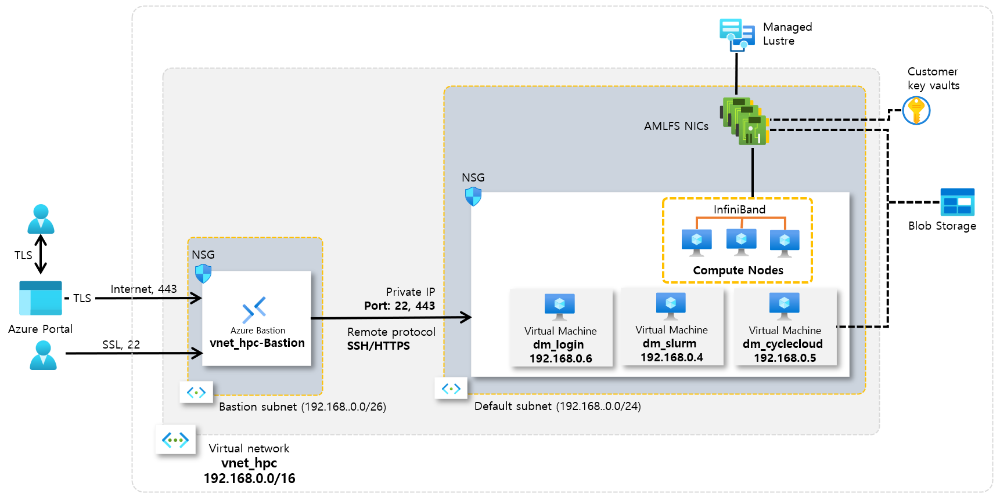
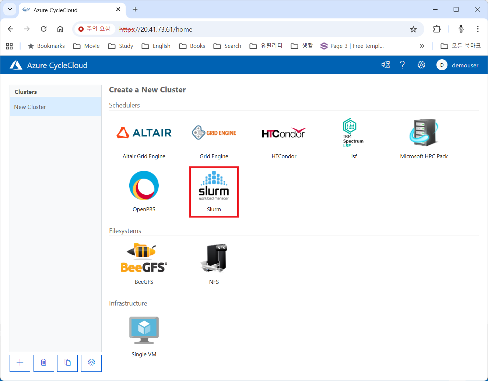
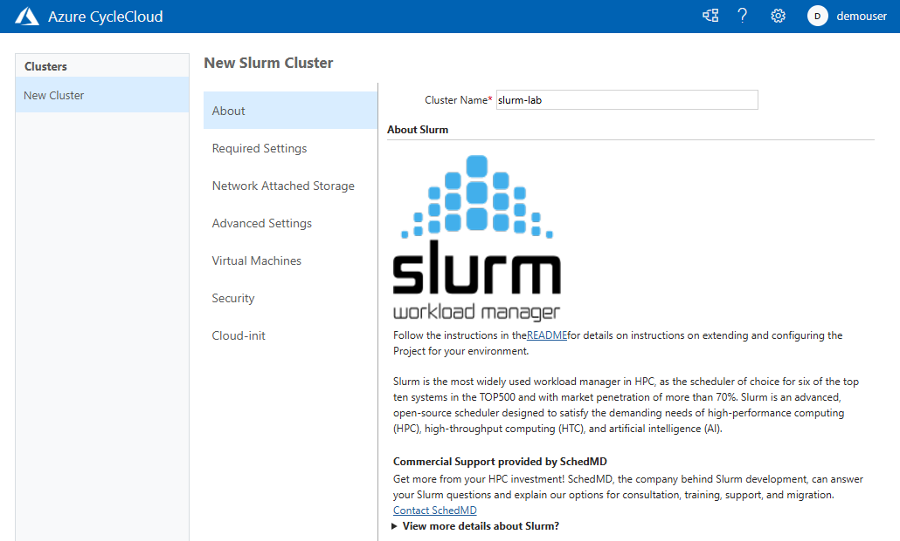

= Slurm 클러스터 생성

이 가이드의 절차를 완료하면 아래와 같은 환경이 구성됩니다.

== CycleCloud 접근

1. 웹 브라우저 (Chrome, Edge 등)를 실행합니다.
2. 생성된 CycleCloud의 Web UI에 접근합니다.
3. **Slurm**을 클릭합니다.
+

+
4. 위쪽의 **Cluster Name** 텍스트 상자에 클러스터의 이름을 입력합니다. 여기서는 _slurm-lab_ 입니다.
+

+
5. 아래쪽에서 **Next** 버튼을 클릭합니다.
