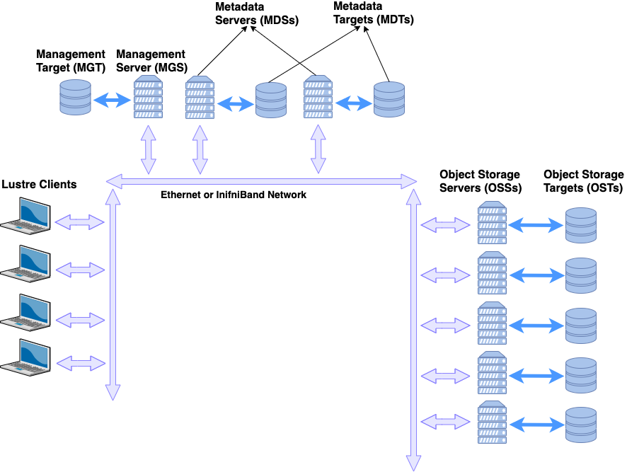

= Azure Managed Lustre
:sectnums:
:toc:

Lustre는 Linux와 Cluster의 합성어로, 1999년 카네기 멜론 대학에서 개발된 오픈소스 기반의  대표적 파일 시스템입니다. 슈퍼 컴퓨터나 HPC 클러스터에서 공통의 스토리지 계층을 제공하기 위해 설계되었으며, 리눅스 기반 클러스터 환경에서 대용량 데이터를 병렬로 처리하고 저장할 수 있도록 최적화된 구조를 가지고 있습니다.

Lusture의 가장 큰 특징은 확장성과 병렬성입니다. 수천 개 이상의 노드가 동시에 하나의 파일 시스템에 접근할 수 있으며, 페타바이트 단위의 데이터를 관리하고 초당 수백기가바이트 이상의 처리 성능을 지원합니다. 이를 위해 Lustre는 데이터를 여러 스토리지 서버에 분산 저장하고, 클라이언트가 병렬로 접근할 수 있도록 설계되어 있습니다.

== Lustre 아키텍처

Lustre 파일시스템의 아키텍처는 병렬성과 확장성을 극대화하기 위해 메타데이터와 실제 데이터 저장 영역을 분리하는 구조를 가지고 있습니다. 이를 통해 대규모 HPC 환경에서 수천 개 노드가 동시에 읽기와 쓰기 작업을 수행할 수 있습니다.

=== 구조

구조적으로 Lustre는 크게 네 가지 컴포넌트로 나눌 수 있습니다.

메타데이터 서버 MDS(Metadata Server)와 MDT(Metadata Target)::
* MDS는 파일의 이름, 디렉토리 계층, 소유권, 권한, 파일 크기, 파일이 저장된 위치 등의 메타데이터를 관리합니다.
* MDT는 실제 메타데이터가 저장되는 저장소를 의미합니다.
* 클라이언트가 파일 열기, 디렉토리 생성, 권한 확인 등의 요청을 할 때 MDS가 관여합니다.
* 대규모 시스템에서는 여러 개의 MDS를 두어 메타데이터 작업을 분산 처리할 수 있습니다.
OSS(Object Storage Server)와 OST(Object Storage Target)::
* OSS는 실제 파일 데이터를 저장·관리하는 서버입니다.
* OST는 파일의 데이터를 조각(Object) 단위로 저장하는 장치입니다.
* 클라이언트가 데이터를 읽거나 쓸 때, MDS로부터 "파일이 어떤 OST에 분산 저장되어 있는지" 정보를 받은 후, 직접 OSS/OST로 접근합니다.
* 파일 하나가 여러 OST에 걸쳐 병렬로 분산 저장되므로, 동시에 수많은 클라이언트가 I/O 작업을 수행할 수 있습니다.
클라이언트 노드::
* 일반 사용자 애플리케이션이 설치된 계산 노드(Compute Node)에서 Lustre 파일시스템을 마치 로컬 파일시스템처럼 마운트하여 사용합니다.
* 클라이언트는 메타데이터 요청을 MDS에, 실제 파일 데이터 입출력은 OSS에 직접 요청합니다.
* POSIX 호환성을 제공하므로, 별도의 특별한 API가 없어도 기존 프로그램이 Lustre 위에서 동작할 수 있습니다.
네트워크(LNET, Lestre Networking)::
* Lustre의 통신 계층으로, 클라이언트 ↔ MDS/OSS 간 데이터 교환을 담당합니다.
* InfiniBand, Omni-Path, TCP/IP 등 다양한 네트워크 백엔드를 지원합니다.
* LNET은 메시지 기반 통신을 사용하며, 고속 네트워크를 활용해 지연을 최소화합니다.

=== 데이터 접근 흐름

Lustre 파일시스템에서의 데이터 접근 흐름은 일반적인 단일 서버 파일시스템과 달리, 메타데이터와 실제 데이터 경로가 분리된 이원화구조로 설계되어 있습니다. 이를 통해 클라이언트는 병목 없이 고속으로 데이터를 읽고 쓸 수 있습니다.

클라이언트가 Lustre 파일 시스템에 저장된 파일을 접근하려 할 때, 먼저 데타데이터 작업과 데이터 작업이 순차적으로 이루어집니다.

1. 메타데이터 요청 단계
* 사용자가 애플리케이션에서 파일을 열거나 디렉토리에 접근하면, 클라이언트는 우선 메타데이터 서버(MDS)에 요청을 보냅니다.
* 이 과정에서 파일 이름, 디렉토리 경로, 접근 권한, 소유권등의 정보가 확인됩니다.
* MDS는 해당 파일이 실제로 저장된 위치(즉, 오브젝트 스토리지 타겟, OST에 분산되어 있는지)를 클라이언트에 알려줍니다.
2. 데이터 입출력 단계
* 클라이언트는 MDS로 부터 받은 정보를 바탕으로, 직접 오브젝트 스토리지 서버(OSS)와 통신합니다.
* 파일 데이터는 여러 OST에 스트라이핑(striping)되어 저장되므로, 클라이언트는 동시에 여러 OST와 병렬적으로 데이터를 주고 받습니다.
* 예를 들어, 1TB의 파일이 4개의 OST에 스트라이핑되어 있다면, 클라이언트는 이를 네 갈래로 나누어 병렬 I/O 작업을 수행합니다.
3. 메타데이터 갱신 단계
* 데이터 읽기·쓰기 작업이 끝나면, 파일 크기나 수정 시간 등 새로운 메타데이터 정보가 다시 MDS에 갱신됩니다.
* 이 단계에서 MDS는 파일 시스템의 일관성과 동기화를 보장합니다.

=== 특징 및 장점

Lustre 병렬 파일시스템의 특징 및 장점은 다음과 같습니다.

메타데이터와 데이터 경로 분리::
데이터 전송 경로에서 MDS가 병목 지점이 되지 않고, 클라이언트와 OSS간 직접 통신이 가능해 성능이 크게 향상됩니다.
병렬 I/O 최적화::
파일이 여러 OST에 걸쳐 분산 저장되므로, 수많은 클라이언트가 동시에 같은 파일을 접근하더라도 확장성이 유지됩니다.
POSIX 호환성::
클라이언트는 Lustre를 로컬 파일 시스템처럼 사용할 수 있으며, 별도의 특수 API가 필요하지 않습니다.

== Azure Managed Lustre

////
https://learn.microsoft.com/ko-kr/azure/azure-managed-lustre/amlfs-overview
////

Azure는 슈퍼컴퓨팅 수준의 워크로드를 지원하기 위해 Lustre를 직접 활용할 수 있는 기능을 제공합니다. HPC 전용 인프라, 고속 네트워크, 스토리지 서비스와 결합하여 확장성과 성능을 확보합니다. 클라우드 환경에서의 Lustre는 클라우드의 무제한 용량 특성을 기븐으로 사용자가 스토리지와 컴퓨팅을 유연하게 확장할 수 있는 장점은 누릴 수 있습니다.

Microsoft Azure에서는 Lustre를 두 가지 방법으로 구현할 수 있습니다.

Azure Managed Luctre::
Azure는 최근 Lustre를 관리되는 서비스 형태로 제공합니다. 사용자는 복잡한 Lustre 클러스터를 직접 구성할 필요 없이, Azure Portal 또는 CLI를 사용하여 Lustre 파일 시스템을 몇 분만에 배포할 수 있습니다. HPC 워크로드에 맞게 고성능 SSD 기반 OST를 사용하며, 필요시 크기를 동적으로 확장할 수 있습니다. Azure Managed Lustre는 워크로드 완료 후 결과 데이터를 Azure Blob Storage에 저장하고 저비용으로 보관할 수 있습니다.

IaaS 기반 직접 구축::
관리되는 서비스 외에도 사용자가 직접 VM, 네트워크, 디스크를 활용해 Lustre를 설치하고 구성할 수 있습니다. 이 경우 구성 요소는 다음과 같이 매핑됩니다.

* MDS/MDT: Azure VM + Managed Disk
* OSS/OST: Azure VM + NVMe SSD 또는 Premium SSD
* 클라이언트 노드: HPC 계산 VM (예: HBv3, HC 시리즈)

**데이터 계층화 및 하이브리드 연계** +
Lustre는 계산 작업 중에는 초고속 파일시스템으로 활용되지만, 장기 보관은 비용 효율적인 스토리지에 맡기는 것이 일반적입니다. Azure에서는 Lustre와 Blog Storage를  연계해, 작업 전 데이터세트는 Blob Storage에서 Lustre로 로드하고, 계산 완료 후 결과물은 Lustre에서 Blob Storage로 백업하는 방식으로 활용할 수 있습니다.

=== 데이터 보안

Azure에 저장된 모든 데이터는 기본적으로 Azure 관리 키를 사용하여 미사용 시 암호화됩니다. Azure Managed Lustre 파일 시스템의 모든 정보는 Lustre 디스크에 대한 고객 관리형 키를 추가하더라도 데이터를 보유하는 관리 디스크의 VM(가상 머신) 호스트 암호화로 보호됩니다. 고객 관리형 키를 추가하면 보안 요구 사항이 높은 고객에게 추가 수준의 보안이 제공됩니다. 

Azure Managed Lustre는 서비스 인스턴스를 배포하는 지역 외부에 고객 데이터를 저장하지 않습니다.

=== 데이터 복원력

Azure Managed Lustre 파일 시스템은 AZURE 관리 디스크를 OST(개체 스토리지 대상) 데이터 디스크로 사용합니다.

"지속성" 파일 시스템 유형으로 만든 모든 Azure Managed Lustre 파일 시스템은 LRS(로컬 중복 스토리지)로 구성된 Azure Premium SSD(반도체 드라이브) 디스크를 사용합니다. LRS 디스크 콘텐츠는 드라이브 및 서버 랙 오류로부터 보호하기 위해 로컬 데이터 센터 내에서 세 번 복제됩니다.

또한 Azure Managed Lustre 파일 시스템 자체는 이러한 디스크에 데이터를 저장하는 데 사용하는 개체 스토리지 프로세스를 통해 데이터 복원력에 기여합니다.

지역 또는 글로벌 데이터 중복성이 필요한 경우 파일 시스템을 Azure Blob Storage와 통합할 수 있습니다. 통합되면 장기 스토리지에 대한 다른 중복 정책을 사용하여 Azure Blob Storage 컨테이너로 파일을 내보내는 내보내기 작업을 시작할 수 있습니다. 스토리지 계정에 대한 Azure Blob Storage 중복성을 구성합니다. 스토리지 계정을 만들 때 ZRS(영역 데이터 중복성) 또는 GRS(글로벌 데이터 중복성)를 선택할 수 있습니다.

=== Blog Storage 통합

Azure Blob Storage는 Azure Managed Lustre와 통합되어 파일 시스템에서 사용하기 위해 Blob 컨테이너에서 가져올 파일을 지정할 수 있습니다. Azure Blob Storage 통합은 Lustre HSM(계층적 스토리지 관리)의 애플리케이션입니다. 모든 작업에 대해 전체 데이터 집합을 가져올 필요가 없습니다. 대신 다른 작업에 대해 다른 파일 시스템을 만들고 사용 사이에 저비용 Azure Blob 컨테이너에 데이터를 저장할 수 있습니다. 고성능 컴퓨팅 작업이 완료되면 변경된 데이터를 Azure Blob Storage로 내보내고 Azure Managed Lustre 시스템을 삭제할 수 있습니다.

Azure Managed Lustre는 Azure Blob Storage와 원활하게 작동하도록 사용자 지정됩니다. 기존 Blob 컨테이너를 지정하여 Azure Managed Lustre 파일 시스템에서 기존 데이터에 액세스할 수 있도록 할 수 있습니다. 데이터로 채우거나 출력을 저장하는 데 사용하는 빈 컨테이너를 지정할 수도 있습니다. 설치 및 유지 관리가 완료됩니다. 사용할 Blob 컨테이너를 지정하기만 하면 됩니다.

Lustre 파일 시스템을 만들 때 Azure Blob Storage를 통합하는 경우 Lustre HSM 기능을 사용할 수 있습니다. Lustre HSM의 이점을 원하지 않는 경우 클라이언트 명령을 직접 사용하여 Azure Managed Lustre 파일 시스템에 대해 데이터를 가져오고 내보낼 수 있습니다.

---

////
https://learn.microsoft.com/ko-kr/azure/azure-managed-lustre/amlfs-overview
////