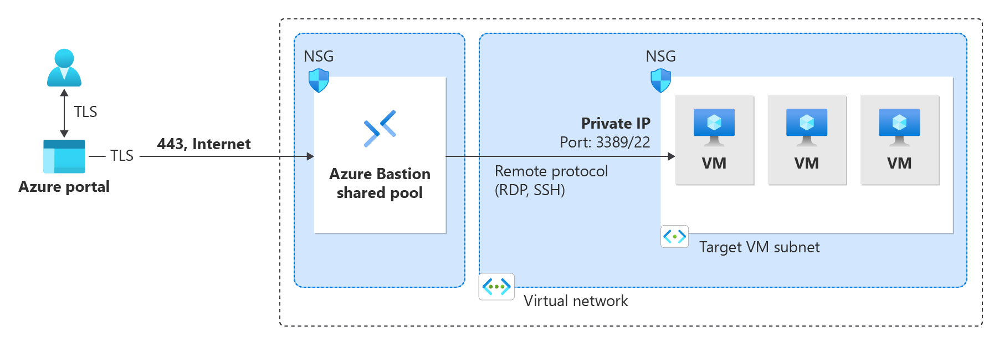

= Azure Bastion 배포 가이드

이 가이드에서는 기본 설정과 표준 SKU를 사용하여 Azure Portal에서 Azure Bastion을 자동으로 배포하는 방법을 알아봅니다. Bastion을 배포한 후 SSH 또는 RDP를 사용하여 VM의 개인 IP 주소를 사용하여 Bastion을 통해 가상 네트워크의 VM(가상 머신)에 연결할 수 있습니다. 연결하는 VM에는 공용 IP 주소, 클라이언트 소프트웨어, 에이전트 또는 특수 구성이 필요하지 않습니다.

이 배포 가이드는 아래와 같은 아키텍처의 Azure Bastion 구성을 만듭니다.

https://learn.microsoft.com/ko-kr/azure/bastion/quickstart-host-portal