= Azure Bastion 배포 가이드
:sectnums:
:toc:

이 가이드에서는 기본 설정과 표준 SKU를 사용하여 Azure Portal에서 Azure Bastion을 자동으로 배포하는 방법을 알아봅니다. Bastion을 배포한 후 SSH 또는 RDP를 사용하여 VM의 개인 IP 주소를 사용하여 Bastion을 통해 가상 네트워크의 VM(가상 머신)에 연결할 수 있습니다. 연결하는 VM에는 공용 IP 주소, 클라이언트 소프트웨어, 에이전트 또는 특수 구성이 필요하지 않습니다.

이 가이드에서는 구성된 Virtual Network(Vnet)의 Linux VM에 Azure Bastion을 통해 SSH 연결을 구성합니다. 이 배포 가이드는 아래와 같은 아키텍처의 Azure Bastion 구성을 만듭니다.

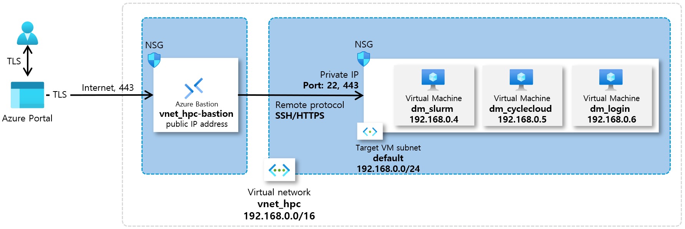 

////
https://learn.microsoft.com/ko-kr/azure/bastion/quickstart-host-portal
https://learn.microsoft.com/ko-kr/training/modules/connect-vm-with-azure-bastion/4-exercise-connect-vm-with-bastion
////

이 연습을 위해서는 비용에 대한 권한이 있는 Azure 구독이 필요합니다.

== Azure Portal에 로그인

여기서는 Azure Portal에 로그인합니다. 아래 절차에 따릅니다.

1. Azure Portal에 접속합니다.
+
https://portal.azure.com
+
2. 유효한 계정으로 Azure Portal에 로그인합니다.
3. 위쪽의 검색 텍스트 상자에서 **구독**을 입력하고 검색 결과 창에서 **구독**을 클릭합니다.
+
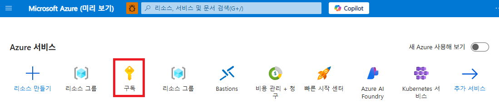
4. 로그인한 계정의 디렉토리에 있는 계정과 내 역할 및 비용에 대한 권한을 확인합니다.
+
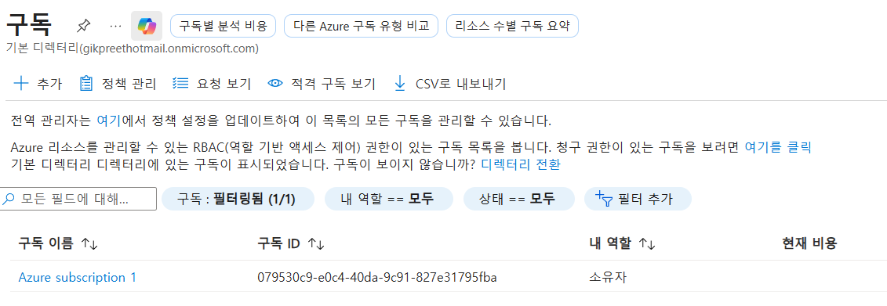

== Resource Group 생성

이 연습에서는 Resource Group을 생성합니다. 아래 절차에 따릅니다.

1. 위쪽의 검색 텍스트 상자에서 **리소스 그룹**을 입력하고 검색 결과 창에서 **리소스 그룹**을 클릭합니다.
+
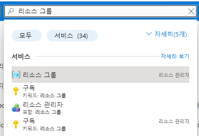
+
2. **리소스 관리자 | 리소스 그룹** 페이지에서 **+ 만들기**를 클릭합니다.
+
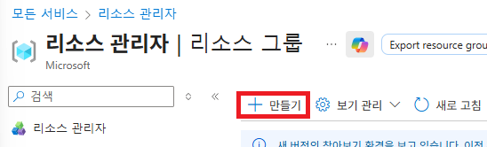
+
3. 적절한 구독이 선택되어 있는 것을 확인하고, 지역을 선택한 후 리소스 이름을 지정합니다. 이 연습에서는 지역을 _(Asia Pacific)_ _Korea_ _South_ 로, 리소스 그룹 이름을 _HPC_Demo_ 로 지정합니다.
+
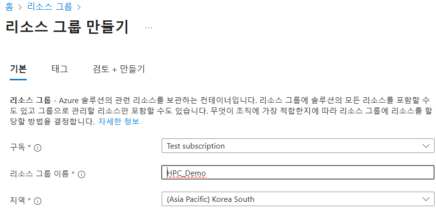
+
4. 아래쪽의 **검토+만들기** 버튼을 클릭합니다.
5. **리소스 그룹 만들기** 페이지의 아래쪽에서 **만들기** 버튼을 클릭합니다.
6. 생성된 리소스 그룹을 확인합니다. 생성한 리소스 그룹이 보이지 않으면 **리소스 그룹** 페이지를 새로 고침 합니다.
+
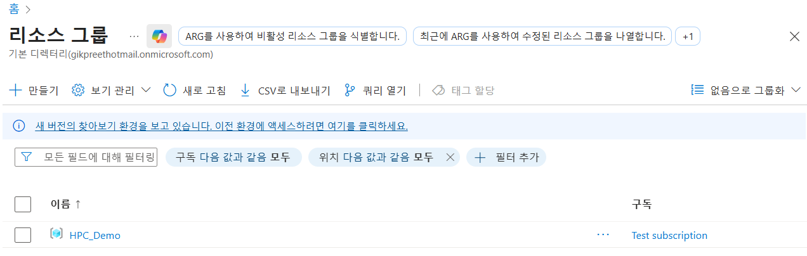

== Virtual Network와 Bastion 생성

1. 상단의 Microsoft Azure 로고를 클릭하여 Azure Portal의 Home 페이지로 이동합니다.
+
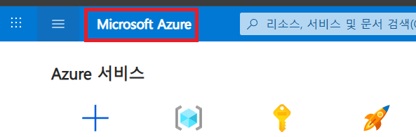
+
2. Azure 서비스 구역에서 **리소스 만들기**를 클릭합니다.
+
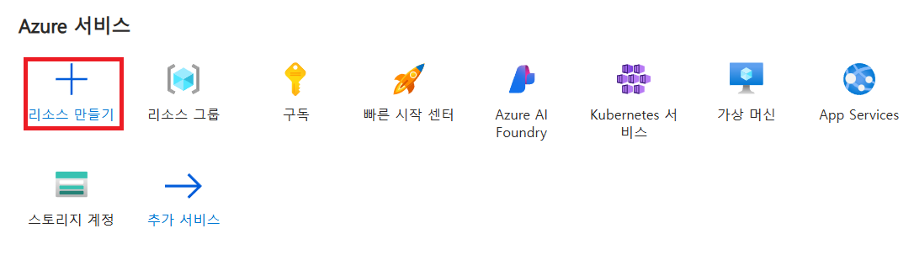
+
3. **범주** 구역에서 **네트워킹**을 클릭하고 **Virtual network**아래의 **만들기**를 클릭합니다.
+
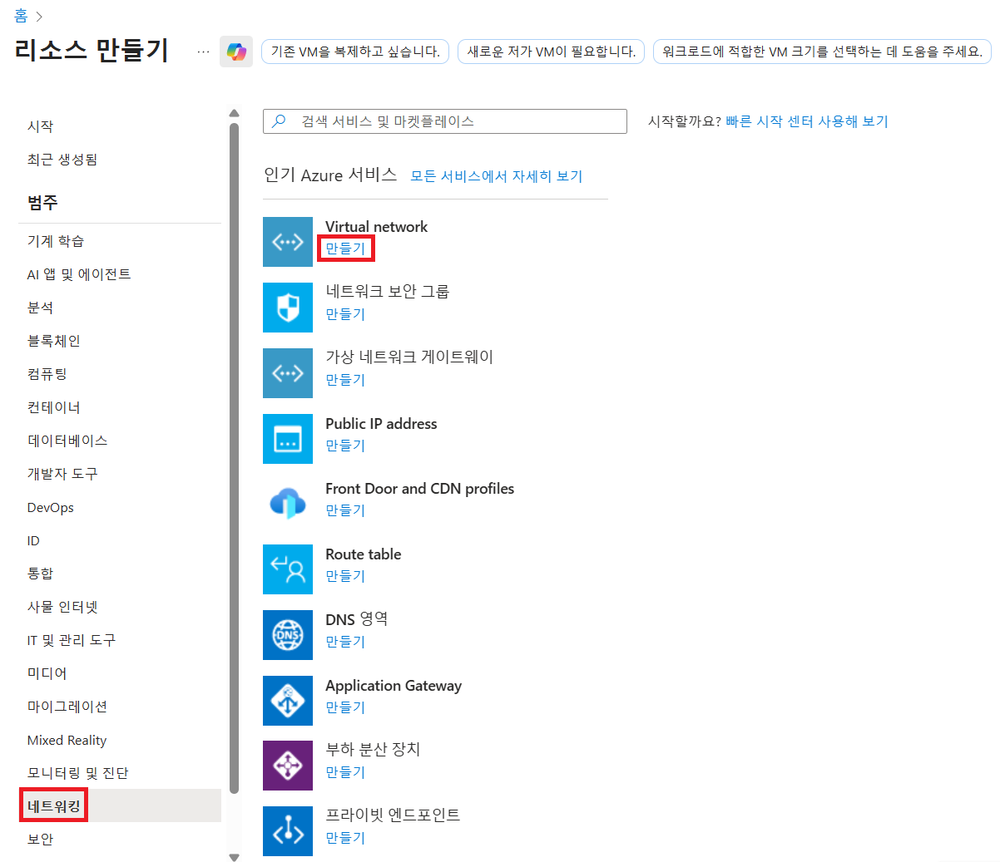
4. **가상 네트워크 만들기** 페이지에서 **구독**이 제대로 선택되었는지 확인하고, **리소스 그룹**에 앞에서 생성한 HPC_demo를 선택한 후 가상 네트워크의 이름을 지정합니다. 이 연습에서는 _vnet_hpc_ 라는 이름을 사용합니다.
+
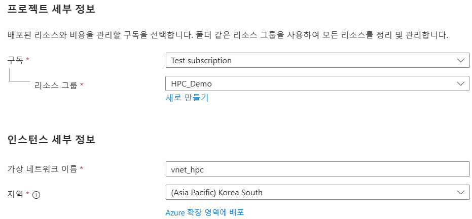
5. 아래쪽에서 **다음: 보안** 버튼을 클릭합니다.
6. **가상 네트워크 만들기**의 **보안** 페이지에서 **Azure Bastion 사용** 체크박스를 선택합니다. Azure Bastion의 이름을 지정하거나 기억합니다. 여기에서는 _vnet_hpc-Bastion_ 입니다.
+
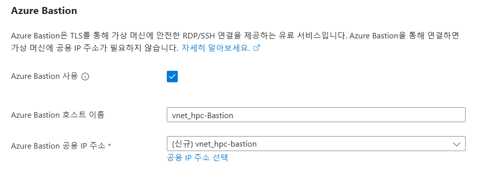
+
7. **Azure Bastion 공용 IP 주소** 드롭다운 리스트 아래의 **공용 IP 주소 선택**을 클릭하고 SKU를 확인합니다.
+
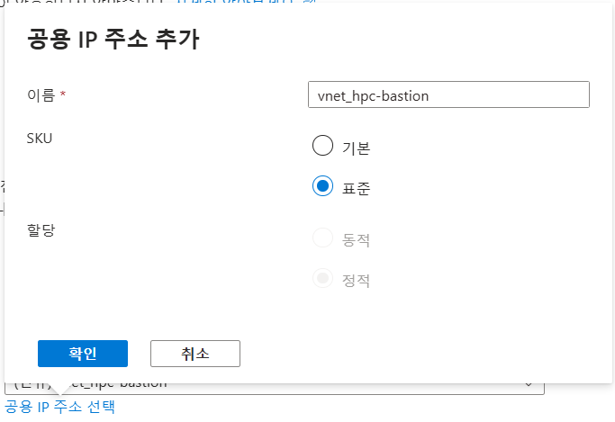
+
8. 아래쪽의 **다음: IP 주소** 버튼을 클릭합니다.
9. **가상 네트워크 만들기**의 **IP 주소** 페이지에서 주소 공간을 _192.168.0.0_ 으로 변경합니다. 미리 만들어진 두 서브넷을 확인합니다.
+
[cols="1,2,2,2"]
|===
|서브넷|IP 주소 범위|크기|NAT 게이트웨이
|default|192.168.0.0 - 192.168.0.255|/24(256개 주소)|-
|AzureBastionSubnet|192.168.1.0 - 192.168.1.63|/26(64개 주소)|-
|===
+
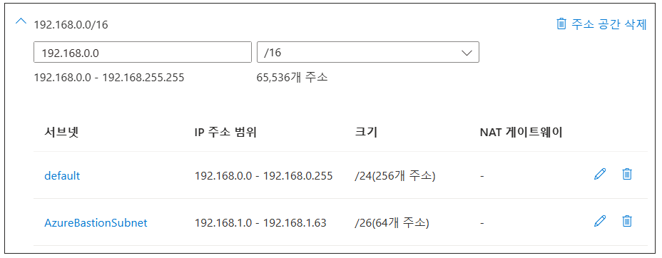
+
10. 아래쪽의 **검토 + 만들기** 버튼을 클릭합니다.
11. **가상 네트워크 만들기**의 **검토 + 만들기** 페이지에서 유효성 검사가 완료되면 **만들기** 버튼을 클릭합니다.
+
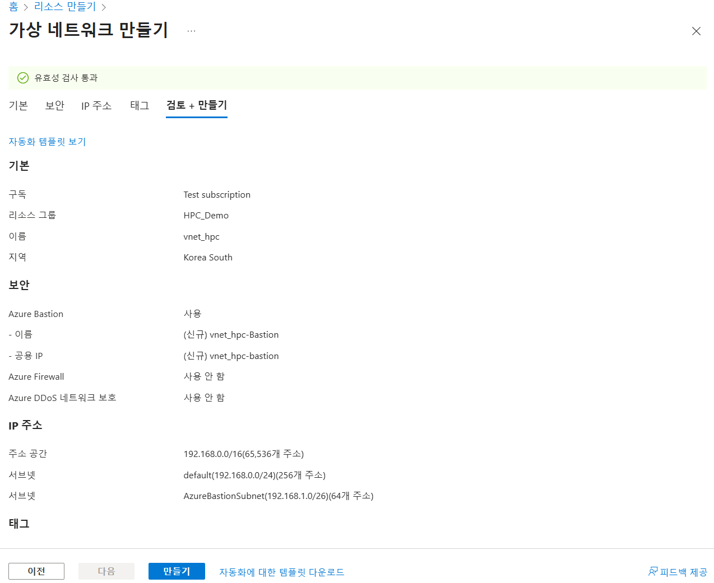
+
12. Virtual Network 배포가 진행됩니다.
+
13. 배포가 완료되면, 정보를 확인하고 **리소스로 이동** 버튼을 클릭하여 리소스로 이동합니다.
+
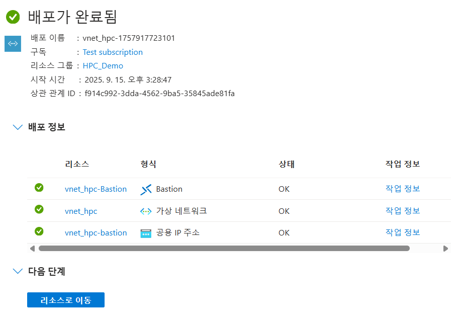
+
14. 왼쪽 패널에서 **설정**을 클릭하여 생성된 vnet_hpc 주소공간과 서브넷을 확인합니다.
+
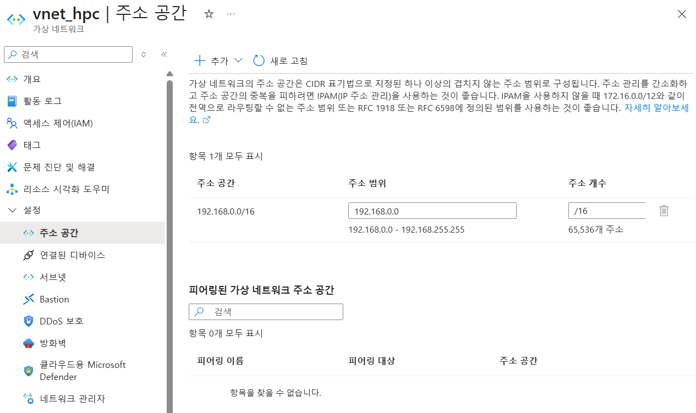
+
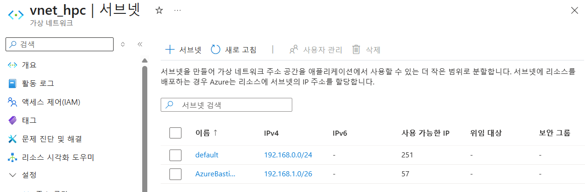
+
15. 왼쪽 패널에서 Bastion을 클릭하여 생성된 Azure Bastion 정보를 확인합니다. 현재 Bastion에 연결된 VM이 VNet에 존재하지 않습니다.
+
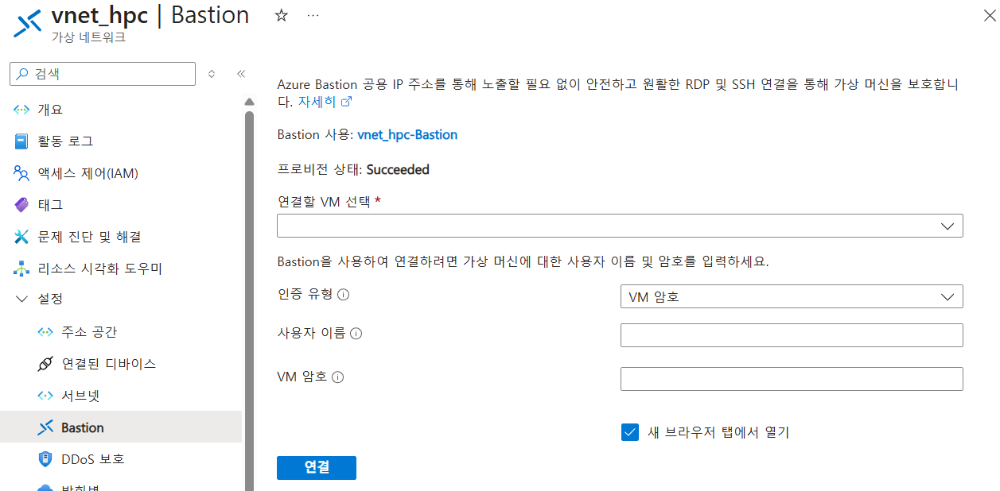

== Virtual Machine 생성

이 연습에서는 생성한 VNet 내부에 Linux Virtual Machine을 생성합니다. 아래 절차에 따릅니다.

1. 상단의 Microsoft Azure 로고를 클릭하여 Azure Portal의 Home 페이지로 이동합니다.
2. Azure 서비스 구역에서 **리소스 만들기**를 클릭합니다.
3. 왼쪽 패널에서 **컴퓨팅**을 선택하고 **가상 머신** 아래의 **만들기**를 클릭합니다.
+
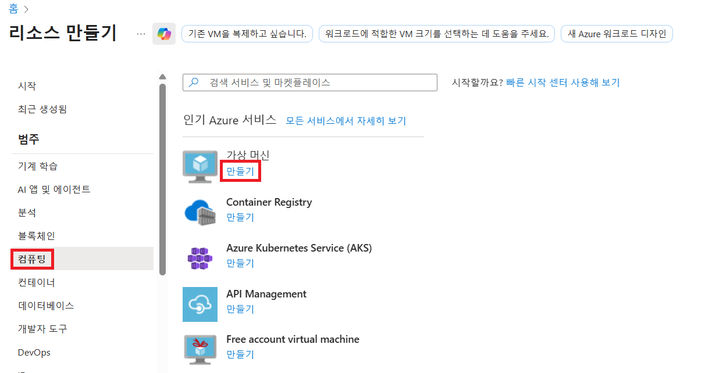
+
4. 아래와 같이 가상 머신 기본 사항을 지정합니다.
. **가상 머신 만들기** 페이지의 **기본 사항**에서 **구독**을 확인하고 **리소스 그룹**을 위에서 생성한 **HPC_Demo** 로 지정합니다.
. 가상 머신 이름을 지정합니다. 여기에서는 _dm-slurm_ 로 지정합니다.
. **지역**을 선택합니다. 여기에서는 _(Asia_ _Pacific)_ _Korea_ _South_ 로 지정합니다.
. **가용성 옵션**을 **인프라 중복이 필요하지 않습니다**로 지정합니다.
. **보안 유형**을 표준으로 지정합니다.
. **이미지**를 지정합니다. 여기서는 **Ubuntu Server 24.04 LTS - x64 Gen2**를 사용합니다.
. **VM 아키텍처**를 **x64**로 지정합니다.
. **크기**를 선택합니다. 여기에서는 **Standard_B1s - 1 vcpu, 1 GiB 메모리**를 사용합니다.
. **인증 형식**을 **SSH 공개 키**로 지정합니다.
. **사용자 이름**에서 적당한 사용자 이름을 지정합니다. 여기에서는 기본 값인 azureuser를 사용합니다.
. **SSH 공개 키 원본**을 **새 키 쌍 생성**으로 지정합니다. 기본 값입니다.
. **SSH 키 유형**을 기본 값인 **RSA SSH 형식**으로 지정합니다. 더 강력한 보안이 필요할 경우 **Ed25519 SSH 형식**을 사용할 수 있습니다.
* **키 쌍 이름**에서 적당한 키 쌍 이름을 지정합니다. 여기에서는 기본 값인 dm-slurm_key를 사용합니다.
. **인바운드 포트 규칙**에서 **공용 인바운드 포트**를 **없음**으로 지정합니다.
+
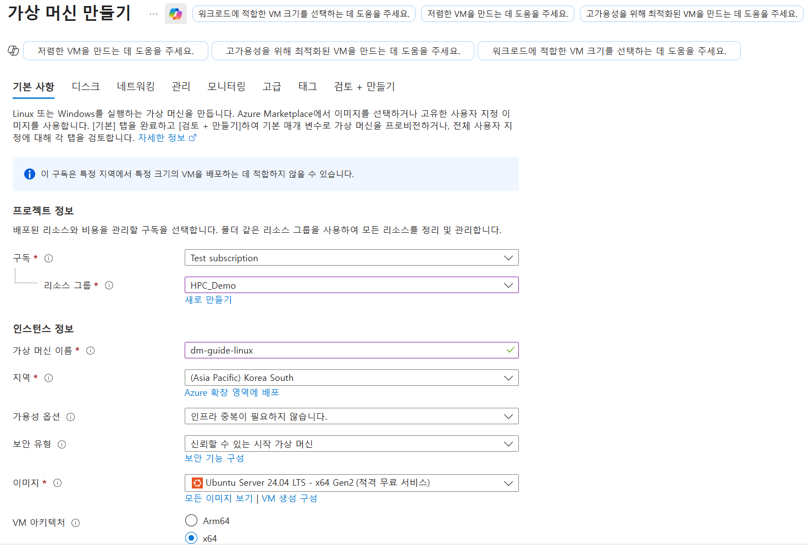
5. 아래쪽에서 **다음: 디스크** 버튼을 클릭합니다.
6. 아래와 같이 디스크 정보를 지정합니다.
. **OS 디스크 크기**를 **이미지 기본값(30GiB)**로 지정합니다.
. **OS 디스크 유형**을 지정합니다. 여기서는 **표준 HDD(로컬 중복 스토리지)**를 사용합니다.
. 키 관리를 플랫폼 관리형 키로 지정합니다.
+
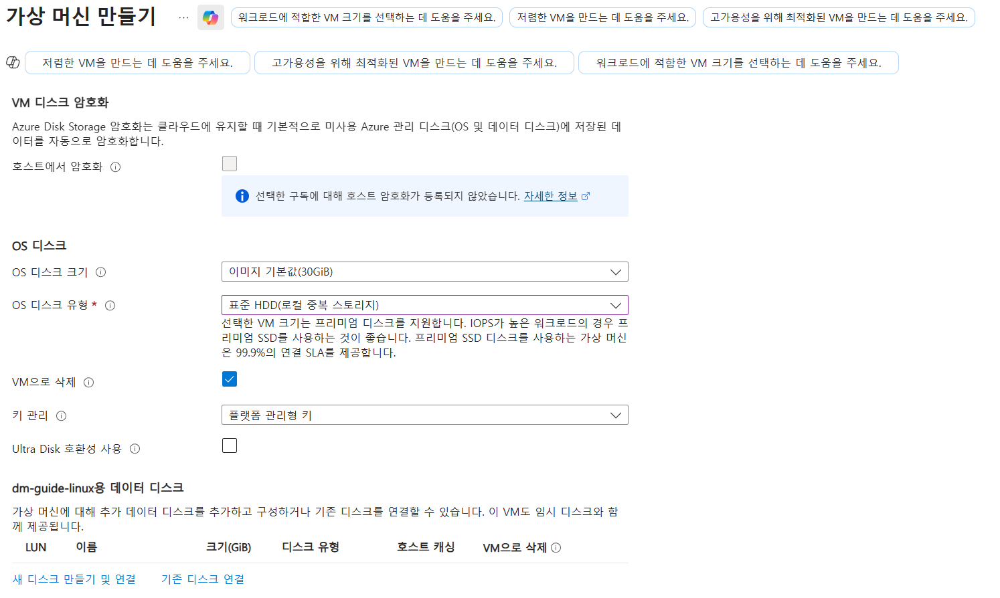
+
7. 아래쪽에서 **다음: 네트워킹** 버튼을 클릭합니다.
8. 아래와 같이 네트워킹 정보를 지정합니다.
. **가상 네트워크**를 위에서 생성한 vnet_hpc로 지정합니다.
. **서브넷**을 **default**로 지정합니다.
. **공용 IP**를 **없음**으로 지정합니다.
. **네트워크 보안 그룹**을 **기본**으로 지정합니다.
. **공용 인바운드 포트**를 **없음**으로 지정합니다.
. **VM 삭제 시 NIC 삭제**를 **선택**합니다.
+
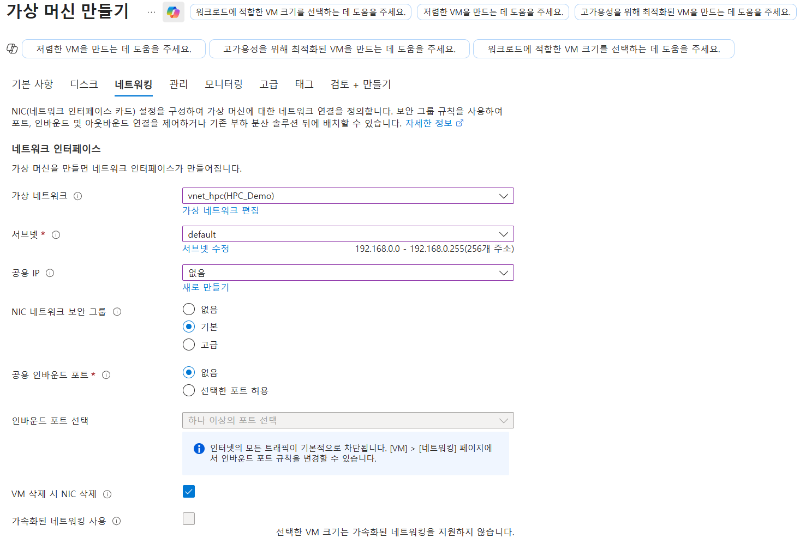
9. 아래쪽에서 **검토 + 만들기** 버튼을 클릭합니다.
10. **가상 머신 만들기**의 **검토 + 만들기** 페이지에서 최종 유효성 검사가 완료되면 **만들기** 버튼을 클릭합니다.
11. **새 키 쌍 생성** 창에서, **프라이빗 키 다운로드 및 리소스 만들기** 버튼을 클릭합니다.
+
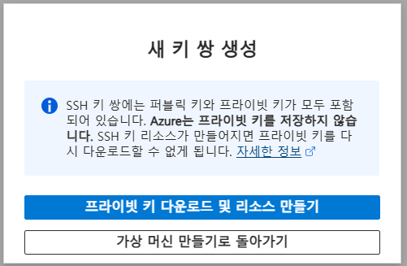
+
12. 다른 이름으로 저장 대화상자에서, **dm-slurm_key.pem** 키를 적당한 곳에 저장합니다.
13. 배포가 진행됩니다.
14. 배포가 완료되면, 리소스로 이동 버튼을 클릭합니다.
+
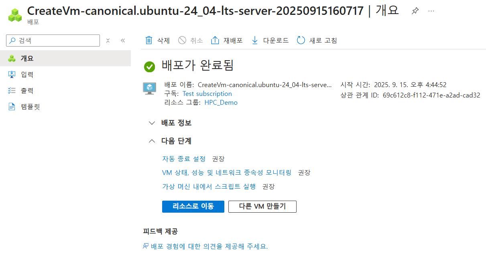
+
15. 같은 방법으로, dm-cyclecloud, dm-login 가상 머신을 생성합니다.
. 가용성 옵션과 보안 유형, 이미지, 크기를 용도에 따라 다르게 지정할 수 있습니다.
. 모든 VM은 Azure Bastion을 통해 연결될 것이므로, 위와 같이 공용 IP와 공용 인바운트 포트를 만들지 않습니다.
. 프라이빗 키는 반드시 로컬에 저장합니다.

== Baston을 통해 VM에 연결

여기에서는 공용 IP와 공용 인바운드 포트가 없이 만들어진 VM에 Bastion을 통해 연결합니다. 아래 절차에 따릅니다. 

1. 상단의 Microsoft Azure 로고를 클릭하여 Azure Portal의 Home 페이지로 이동합니다.
2. **Azure 서비스** 구역에서 **리소스 그룹**을 클릭합니다.
3. 생성한 **HPC_Demo** 리소스 그룹을 클릭합니다.
4. 리소스 그룹에서, 위에서 생성한 **dm_slurm** 가상 머신을 클릭합니다.
+
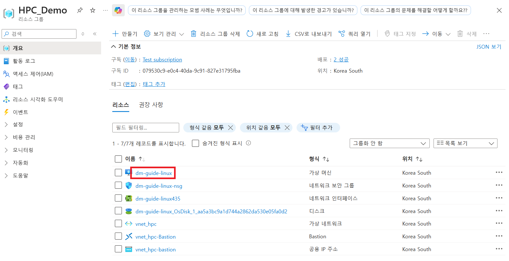
+
5. 왼쪽 패널에서 **네트워킹** -> **네트워크 설정**을 클릭하고 **공용 IP 주소**가 없음을 확인합니다.
+
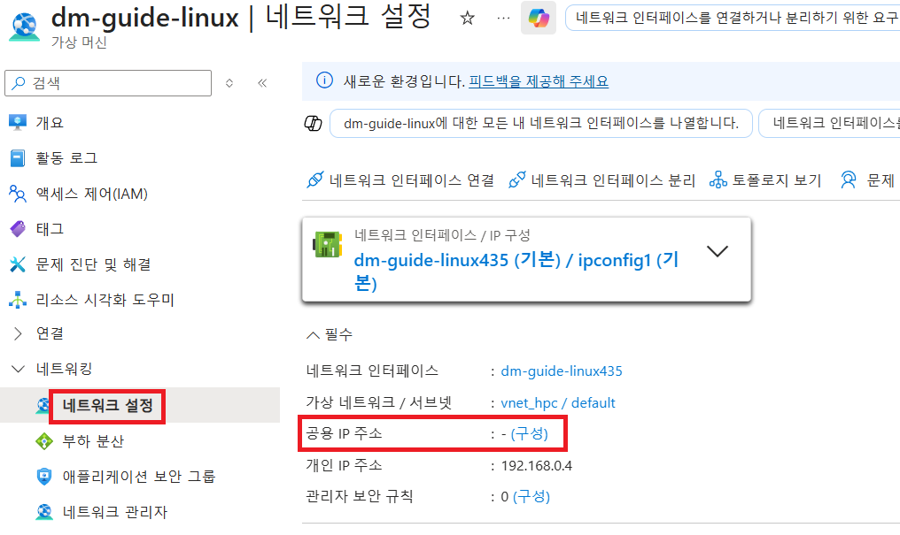
+
6. 왼쪽 패널에서 **연결** -> **배스천**을 클릭합니다.
7. **인증 유형**을 **로컬 파일의 SSH 프라이빗 키**로 지정하고, 사용자 이름을 지정한 이름(여기서는 azureuser)로 지정한 후, 로컬 파일에서 로컬 컴퓨터에 저장한 **dm-slurm_key.pem** 파일을 지정합니다.
+
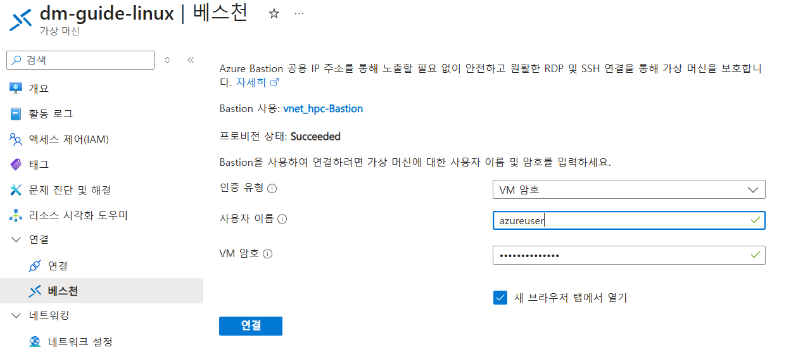
+
8. **연결** 버튼을 클릭합니다.
9. 새 브라우저 탭에서 SSH 연결을 확인합니다.
+
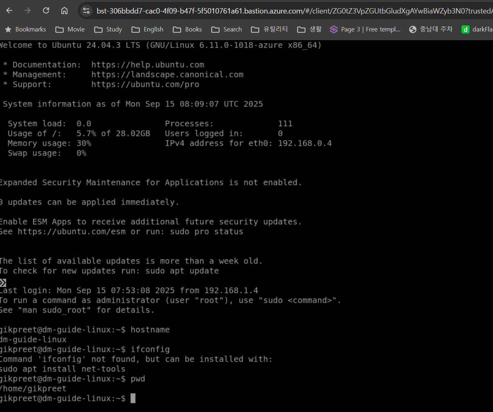
+
10. 터미널에서 exit 를 입력하고 enter 키를 눌러 접속을 종료합니다.
11. Disconnected 에서 Close 버튼을 클릭합니다.
+
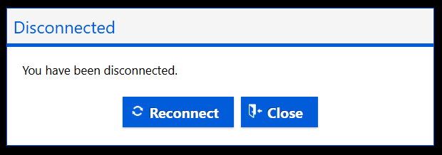 

== 로컬 SSH 클라이언트를 통한 Bastion 접속

Azure에서 제공하는 Bastion 터널링을 사용하면 Azure Portal이 아닌 로컬 SSH를 통해 가상 머신에 접속할 수 있습니다. 명령의 형식은 아래와 같습니다.

[source, bash]
----
az network bastion ssh --auth-type
                       [--auth-type]            // SSH 연결에 사용할 인증 형식입니다.
                       [--ids]                  // 선택적 매개변수로, 리소스 ID를 나타냅니다.
                       [--name]                 // Bastion Host의 이름입니다.
                       [--resource-group]       // Bastion Host의 리소스 그룹 이름입니다.
                       [--resource-port]        // 선택적 매개변수로, Bastion이 연결할 대상 VM의 리소스 포트입니다.
                       [--ssh-key]              // 선택적 매개변수로, SSH 연결에 대한 SSH 키 파일 위치입니다.
                       [--subscription]         // 선택적 매개변수로, 구독의 이름 또는 ID입니다.
                       [--target-ip-address]    // 선택적 매개변수로, 대상 Virtual Machine의 IP 주소입니다.
                       [--target-resource-id]   // 선택적 매개변수로, 대상 Virtual Machine의 ResourceId입니다.
                       [--username]             // 선택적 매개변수로, SSH 연결의 사용자 이름입니다.
                       []
----

////
https://learn.microsoft.com/ko-kr/cli/azure/network/bastion?view=azure-cli-latest#az-network-bastion-ssh
////

=== Azure Bastion SKU 변경

Azure Bastion 터널링을 사용하기 위해서는 표준 또는 프리미엄 SKU가 필요합니다. 아래 절차에 따라 SKU를 변경합니다.

1. 상단의 Microsoft Azure 로고를 클릭하여 Azure Portal의 Home 페이지로 이동합니다.
2. 리소스 그룹을 클릭하고 **HPC_demo** 그룹을 클릭합니다.
3. **vnet-hpc-Bastion** 을 클릭합니다.
+
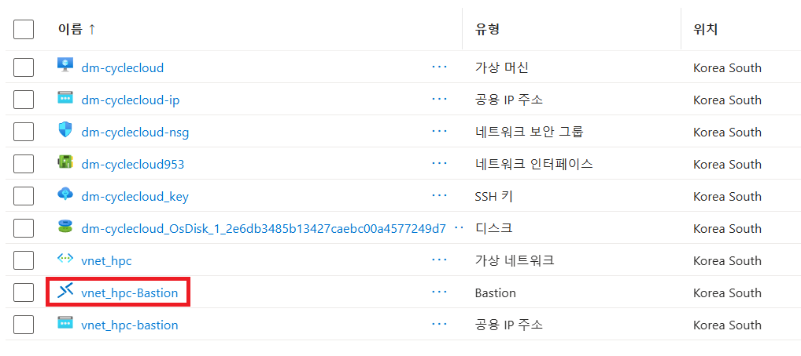
+
4. 왼쪽 패널의 **설정** 구역에서 **구성**을 클릭합니다.
+
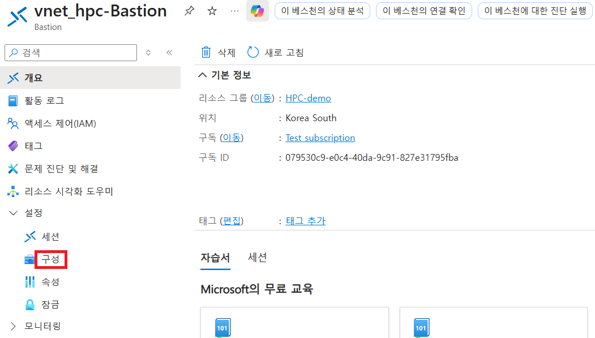
+
5. **계층**을 **표준**으로 변경합니다.
6. **복사 및 붙여 넣기** 옵션이 체크된 것을 확인합니다.
7. **기본 클라이언트 지원** 옵션을 체크하고 아래쪽의 적용 버튼을 클릭합니다.
+
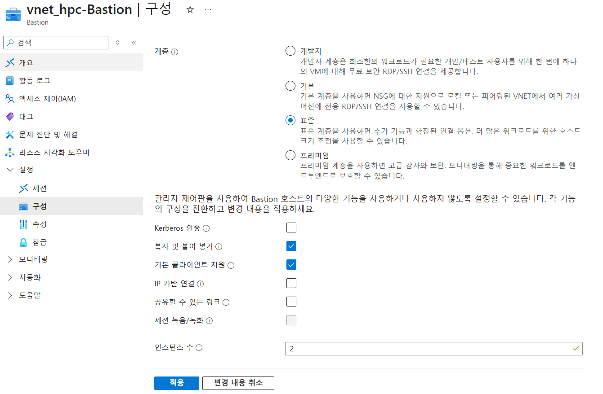
+
8. 변경 내용이 적용되는 것을 확인합니다.

=== SSH를 통해 접속

1. 터미널을 실행합니다.
2. 아래 명령을 실행하여 dm-cyclecloud 가상 머신에 접속합니다.
+
----
az network bastion ssh --name vnet_hpc-Bastion --resource-group HPC-demo --target-resource-id dm-cyclecloud --auth-type ssh-key --username azureuser --ssh-key C:/keys/dm-cyclecloud_key.pem
----

----
az network bastion tunnel \
  --name MyBastion \
  --resource-group MyResourceGroup \
  --target-resource-id /subscriptions/<subId>/resourceGroups/<rg>/providers/Microsoft.Compute/virtualMachines/<vmName> \
  --resource-port 22 \
  --port 50022
----

----
az network bastion tunnel \
  --name vnet_hpc-Bastion \
  --resource-group HPC_demo \
  --target-resource-id /subscriptions/079530c9-e0c4-40da-9c91-827e31795fba/resourceGroups/HPC_demo/providers/Microsoft.Compute/virtualMachines/dm-slurm \
  --resource-port 22 \
  --port 50022
----

az network bastion tunnel --name vnet_hpc-Bastion --resource-group HPC_demo target-resource-id /subscriptions/079530c9-e0c4-40da-9c91-827e31795fba/resourceGroups/HPC_demo/providers/Microsoft.Compute/virtualMachines/dm-slurm --resource-port 22 --port 50022

az network bastion ssh --name vnet_hpc-Bastion --resource-group HPC_demo --target-resource-id dm-slurm --resource-type "Microsoft.Compute/virtualMachines" --resource-port 22 --port 50022

az network bastion ssh --name vnet_hpc-Bastion --resource-group HPC_demo --target-resource-id dm-cyclecloud --auth-type ssh-key --username azureuser --ssh-key C:/keys/dm-cyclecloud_key.pem