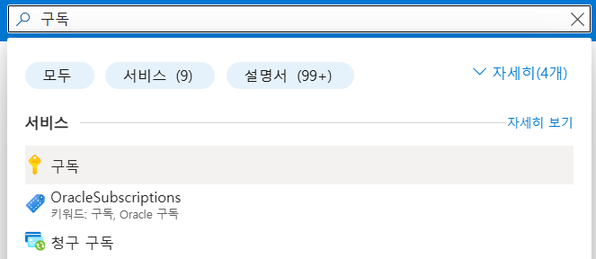

= Azure Bastion 배포 가이드

이 가이드에서는 기본 설정과 표준 SKU를 사용하여 Azure Portal에서 Azure Bastion을 자동으로 배포하는 방법을 알아봅니다. Bastion을 배포한 후 SSH 또는 RDP를 사용하여 VM의 개인 IP 주소를 사용하여 Bastion을 통해 가상 네트워크의 VM(가상 머신)에 연결할 수 있습니다. 연결하는 VM에는 공용 IP 주소, 클라이언트 소프트웨어, 에이전트 또는 특수 구성이 필요하지 않습니다.

이 배포 가이드는 아래와 같은 아키텍처의 Azure Bastion 구성을 만듭니다.

////
https://learn.microsoft.com/ko-kr/azure/bastion/quickstart-host-portal
////

이 연습을 위해서는 비용에 대한 권한이 있는 Azure 구독이 필요합니다.

== Azure Portal에 로그인

여기서는 Azure Portal에 로그인합니다. 아래 절차에 따릅니다.

1. Azure Portal에 접속합니다.
+
https://portal.azure.com
+
2. 유효한 계정으로 Azure Portal에 로그인합니다.
3. 위쪽의 **Azure Service**에서 **구독**을 클릭합니다.
+

4. 로그인한 계정의 디렉토리에 있는 계정과 내 역할 및 비용에 대한 권한을 확인합니다.

== Resource Group 생성

이 연습에서는 Resource Group을 생성합니다. 아래 절차에 따릅니다.

1. 위쪽의 검색 텍스트 상자에서 **리소스 그룹**을 입력하고 검색 결과 창에서 **리소스 그룹**을 클릭합니다.
+
image:./images/image05.png[]
2. **리소스 관리자 | 리소스 그룹** 페이지에서 **+ 만들기**를 클릭합니다.
+
image:./images/image06.png[]

== Virtual Machine 생성

1. 유효한 계정을 사용하여 Azure Portal에 로그인합니다.

== 