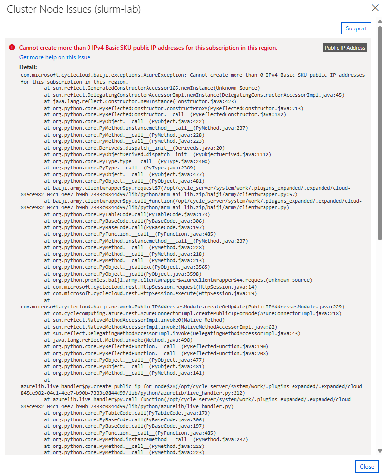

= Error Messages

== Cannot create more than 0 IPv4 Basic SKU public IP addresses for this subscription in this region.

----
Cannot create more than 0 IPv4 Basic SKU public IP addresses for this subscription in this region.
Public IP Address
Get more help on this issue
Detail:
com.microsoft.cyclecloud.baiji.exceptions.AzureException: Cannot create more than 0 IPv4 Basic SKU public IP addresses for this subscription in this region.
	at sun.reflect.GeneratedConstructorAccessor165.newInstance(Unknown Source)
	at sun.reflect.DelegatingConstructorAccessorImpl.newInstance(DelegatingConstructorAccessorImpl.java:45)
	at java.lang.reflect.Constructor.newInstance(Constructor.java:423)
	at org.python.core.PyReflectedConstructor.constructProxy(PyReflectedConstructor.java:213)
	at org.python.core.PyReflectedConstructor.__call__(PyReflectedConstructor.java:182)
	at org.python.core.PyObject.__call__(PyObject.java:422)
	at org.python.core.PyMethod.instancemethod___call__(PyMethod.java:237)
	at org.python.core.PyMethod.__call__(PyMethod.java:228)
	at org.python.core.PyMethod.__call__(PyMethod.java:223)
	at org.python.core.Deriveds.dispatch__init__(Deriveds.java:20)
	at org.python.core.PyObjectDerived.dispatch__init__(PyObjectDerived.java:1112)
	at org.python.core.PyType.type___call__(PyType.java:2408)
	at org.python.core.PyType.__call__(PyType.java:2389)
	at org.python.core.PyObject.__call__(PyObject.java:477)
	at org.python.core.PyObject.__call__(PyObject.java:481)
	at baiji.army.clientwrapper$py.request$7(/opt/cycle_server/system/work/.plugins_expanded/.expanded/cloud-845ce982-04c1-4ee7-b90b-7333c0844d99/lib/python/arm-api-lib.zip/baiji/army/clientwrapper.py:57)
	at baiji.army.clientwrapper$py.call_function(/opt/cycle_server/system/work/.plugins_expanded/.expanded/cloud-845ce982-04c1-4ee7-b90b-7333c0844d99/lib/python/arm-api-lib.zip/baiji/army/clientwrapper.py)
	at org.python.core.PyTableCode.call(PyTableCode.java:173)
	at org.python.core.PyBaseCode.call(PyBaseCode.java:306)
	at org.python.core.PyBaseCode.call(PyBaseCode.java:197)
	at org.python.core.PyFunction.__call__(PyFunction.java:485)
	at org.python.core.PyMethod.instancemethod___call__(PyMethod.java:237)
	at org.python.core.PyMethod.__call__(PyMethod.java:228)
	at org.python.core.PyMethod.__call__(PyMethod.java:218)
	at org.python.core.PyMethod.__call__(PyMethod.java:213)
	at org.python.core.PyObject._jcallexc(PyObject.java:3565)
	at org.python.core.PyObject._jcall(PyObject.java:3598)
	at org.python.proxies.baiji.army.clientwrapper$AzureClientWrapper$44.request(Unknown Source)
	at com.microsoft.cyclecloud.rest.HttpSession.request(HttpSession.java:14)
	at com.microsoft.cyclecloud.rest.HttpSession.execute(HttpSession.java:19)
	at com.microsoft.cyclecloud.baiji.network.PublicIPAddressesModule.createOrUpdate(PublicIPAddressesModule.java:229)
	at com.cyclecomputing.azure.rest.AzureConnectorImpl.createPublicIpForNode(AzureConnectorImpl.java:218)
	at sun.reflect.NativeMethodAccessorImpl.invoke0(Native Method)
	at sun.reflect.NativeMethodAccessorImpl.invoke(NativeMethodAccessorImpl.java:62)
	at sun.reflect.DelegatingMethodAccessorImpl.invoke(DelegatingMethodAccessorImpl.java:43)
	at java.lang.reflect.Method.invoke(Method.java:498)
	at org.python.core.PyReflectedFunction.__call__(PyReflectedFunction.java:190)
	at org.python.core.PyReflectedFunction.__call__(PyReflectedFunction.java:208)
	at org.python.core.PyObject.__call__(PyObject.java:477)
	at org.python.core.PyObject.__call__(PyObject.java:481)
	at org.python.core.PyMethod.__call__(PyMethod.java:141)
	at azurelib.live_handler$py.create_public_ip_for_node$28(/opt/cycle_server/system/work/.plugins_expanded/.expanded/cloud-845ce982-04c1-4ee7-b90b-7333c0844d99/lib/python/azurelib/live_handler.py:212)
	at azurelib.live_handler$py.call_function(/opt/cycle_server/system/work/.plugins_expanded/.expanded/cloud-845ce982-04c1-4ee7-b90b-7333c0844d99/lib/python/azurelib/live_handler.py)
	at org.python.core.PyTableCode.call(PyTableCode.java:173)
	at org.python.core.PyBaseCode.call(PyBaseCode.java:306)
	at org.python.core.PyBaseCode.call(PyBaseCode.java:197)
	at org.python.core.PyFunction.__call__(PyFunction.java:485)
	at org.python.core.PyMethod.instancemethod___call__(PyMethod.java:237)
	at org.python.core.PyMethod.__call__(PyMethod.java:228)
	at org.python.core.PyMethod.__call__(PyMethod.java:223)
	at org.python.core.PyObject._callextra(PyObject.java:589)
	at cloudlib.util$py.delegate_generic$43(/opt/cycle_server/system/work/.plugins_expanded/.expanded/cloud-845ce982-04c1-4ee7-b90b-7333c0844d99/lib/python/cloudlib/util.py:325)
	at cloudlib.util$py.call_function(/opt/cycle_server/system/work/.plugins_expanded/.expanded/cloud-845ce982-04c1-4ee7-b90b-7333c0844d99/lib/python/cloudlib/util.py)
	at org.python.core.PyTableCode.call(PyTableCode.java:173)
	at org.python.core.PyBaseCode.call(PyBaseCode.java:150)
	at org.python.core.PyFunction.__call__(PyFunction.java:426)
	at azurelib.provider$py._delegate$60(/opt/cycle_server/system/work/.plugins_expanded/.expanded/cloud-845ce982-04c1-4ee7-b90b-7333c0844d99/lib/python/azurelib/provider.py:220)
	at azurelib.provider$py.call_function(/opt/cycle_server/system/work/.plugins_expanded/.expanded/cloud-845ce982-04c1-4ee7-b90b-7333c0844d99/lib/python/azurelib/provider.py)
	at org.python.core.PyTableCode.call(PyTableCode.java:173)
	at org.python.core.PyBaseCode.call(PyBaseCode.java:134)
	at org.python.core.PyFunction.__call__(PyFunction.java:416)
	at org.python.core.PyMethod.__call__(PyMethod.java:126)
	at azurelib.provider$py.create_public_ip_for_node$13(/opt/cycle_server/system/work/.plugins_expanded/.expanded/cloud-845ce982-04c1-4ee7-b90b-7333c0844d99/lib/python/azurelib/provider.py:59)
	at azurelib.provider$py.call_function(/opt/cycle_server/system/work/.plugins_expanded/.expanded/cloud-845ce982-04c1-4ee7-b90b-7333c0844d99/lib/python/azurelib/provider.py)
	at org.python.core.PyTableCode.call(PyTableCode.java:173)
	at org.python.core.PyBaseCode.call(PyBaseCode.java:150)
	at org.python.core.PyFunction.__call__(PyFunction.java:426)
	at org.python.core.PyMethod.__call__(PyMethod.java:141)
	at org.python.pycode._pyx379.handle$1(/opt/cycle_server/system/work/.plugins_expanded/.expanded/cloud-845ce982-04c1-4ee7-b90b-7333c0844d99/plugins/azure/cluster/create_public_ip.py:8)
	at org.python.pycode._pyx379.call_function(/opt/cycle_server/system/work/.plugins_expanded/.expanded/cloud-845ce982-04c1-4ee7-b90b-7333c0844d99/plugins/azure/cluster/create_public_ip.py)
	at org.python.core.PyTableCode.call(PyTableCode.java:173)
	at org.python.core.PyBaseCode.call(PyBaseCode.java:306)
	at org.python.core.PyFunction.function___call__(PyFunction.java:474)
	at org.python.core.PyFunction.__call__(PyFunction.java:469)
	at org.python.core.PyFunction.__call__(PyFunction.java:459)
	at org.python.core.PyFunction.__call__(PyFunction.java:454)
	at com.cyclecomputing.apex.plugin.python.BasePyPluginFunction.evaluate(BasePyPluginFunction.java:139)
	at com.cyclecomputing.apex.plugin.python.BasePyPluginFunction.call(BasePyPluginFunction.java:92)
	at com.cyclecomputing.apex.plugin.java.PluginInvocationHandler.invoke(PluginInvocationHandler.java:114)
	at com.sun.proxy.$Proxy61.handle(Unknown Source)
	at com.cyclecomputing.cloud.orchestration.OrchestrationPlugin._execute(OrchestrationPlugin.java:921)
	at com.cyclecomputing.cloud.orchestration.OrchestrationPlugin.executePhase(OrchestrationPlugin.java:743)
	at sun.reflect.GeneratedMethodAccessor362.invoke(Unknown Source)
	at sun.reflect.DelegatingMethodAccessorImpl.invoke(DelegatingMethodAccessorImpl.java:43)
	at java.lang.reflect.Method.invoke(Method.java:498)
	at com.cyclecomputing.apex.plugin.java.JavaPluginFunction.call(JavaPluginFunction.java:157)
	at com.cyclecomputing.appsupport.task.impl.TaskOrganizer.run(TaskOrganizer.java:393)
	at com.cyclecomputing.appsupport.task.impl.TaskOrganizer.lambda$executeTaskBlocking$0(TaskOrganizer.java:98)
	at com.cyclecomputing.appsupport.task.impl.TaskOrganizer.runTask(TaskOrganizer.java:222)
	at com.cyclecomputing.appsupport.task.impl.TaskOrganizer.executeTaskBlocking(TaskOrganizer.java:98)
	at com.cyclecomputing.appsupport.task.impl.TaskCoordinator$TaskRunner.run(TaskCoordinator.java:364)
	at com.cyclecomputing.apex.plugin.impl.PluginTaskAdapter$PythonRunnable.run(PluginTaskAdapter.java:37)
	at com.cyclecomputing.apex.ad.auth.impl.ThreadContextTaskAdapter$CustomRunnable.run(ThreadContextTaskAdapter.java:42)
	at com.cyclecomputing.apex.event.impl.EventLogRunnable.run(EventLogRunnable.java:23)
	at com.cyclecomputing.core.concurrency.logging.LoggingRunnable.run(LoggingRunnable.java:31)
	at com.cyclecomputing.core.concurrency.BracketedQueueService$TaskRunner.run(BracketedQueueService.java:118)
	at java.util.concurrent.ThreadPoolExecutor.runWorker(ThreadPoolExecutor.java:1149)
	at java.util.concurrent.ThreadPoolExecutor$Worker.run(ThreadPoolExecutor.java:624)
	at java.lang.Thread.run(Thread.java:750)
----

== exceeding approved Total Regional Cores quota

----
Operation could not be completed as it results in exceeding approved Total Regional Cores quota. Additional details - Deployment Model: Resource Manager, Location: KoreaSouth, Current Limit: 4, Current Usage: 4, Additional Required: 4, (Minimum) New Limit Required: 8. Setup Alerts when Quota reaches threshold. Learn more at https://aka.ms/quotamonitoringalerting . Submit a request for Quota increase at https://aka.ms/ProdportalCRP/#blade/Microsoft_Azure_Capacity/UsageAndQuota.ReactView/Parameters/%7B%22subscriptionId%22:%22079530c9-e0c4-40da-9c91-827e31795fba%22,%22command%22:%22openQuotaApprovalBlade%22,%22quotas%22:[%7B%22location%22:%22KoreaSouth%22,%22providerId%22:%22Microsoft.Compute%22,%22resourceName%22:%22cores%22,%22quotaRequest%22:%7B%22properties%22:%7B%22limit%22:8,%22unit%22:%22Count%22,%22name%22:%7B%22value%22:%22cores%22%7D%7D%7D%7D]%7D by specifying parameters listed in the ‘Details’ section for deployment to succeed. Please read more about quota limits at https://docs.microsoft.com/en-us/azure/azure-supportability/regional-quota-requests
----

image:./images/image02.png[]