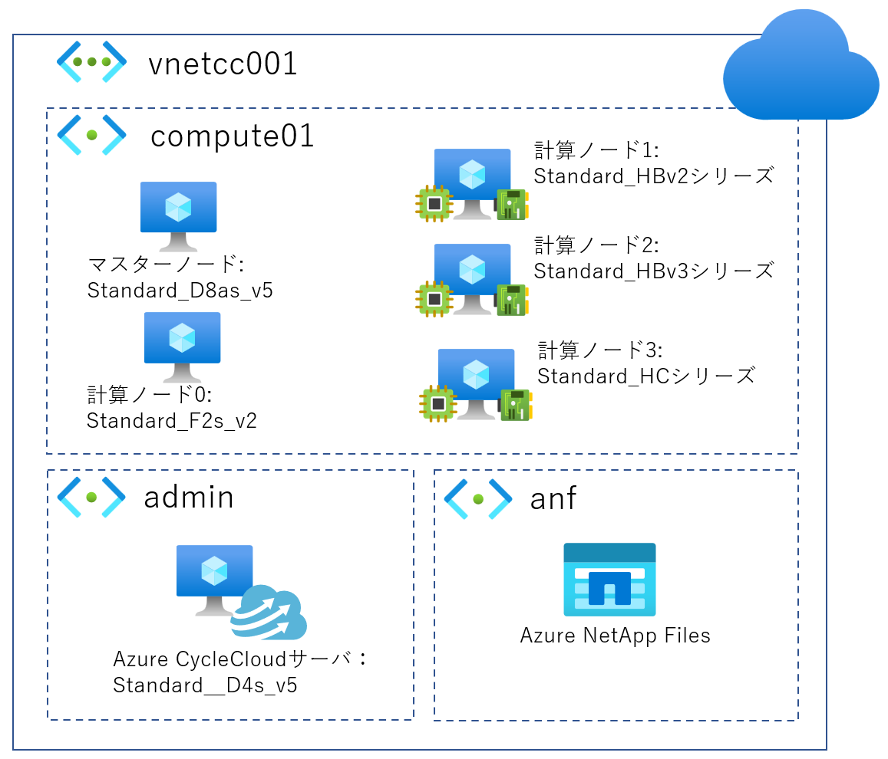

= Azure CycleCloud 구축 가이드 (ver.1.00)
:author: 일본 마이크로소프트 주식회사
:revdate: 2023/04/05
:doctype: book

== 1. 서문
이 문서는 Azure CycleCloud를 사용하여 Azure에 HPC 클러스터 환경을 구축하는 절차를 요약한 것입니다. (이 문서에서는 Azure CycleCloud 8.3을 사용하여 검증했습니다.) 

=== 1.1. 전체 구성
구축할 환경은 다음과 같은 구성입니다. 

== 2. 네트워크 설정

먼저 지금부터 구축할 HPC 클러스터 환경의 네트워크를 작성해 갑니다. 네트워크의 구성은 1.1절의 구성도에서 네트워크 부분을 잘라내면 아래 표와 같이 정리할 수 있습니다.

[options="header"]
|===
|Virtual Network|Vnet Address Range|Subnet|Subnet Address Range
|vnetcc001|10.0.0.0/16|admin|10.0.0.0/24
| | |anf|10.0.2.0/24
| | |compute|10.0.4.0/22
|===

이 문서에서는 간단한 설정을 사용하지만, 목적에 따라 Lustre Filesystem용 서브넷이나 다른 서브넷을 추가할 수 있습니다. 

=== 2.1. 가상 네트워크 설정

Azure Portal의 '리소스 만들기'에서 'Virtual Network'를 검색하여 선택합니다. 

기본 설정:

구독: 사용할 구독을 선택합니다. 

리소스 그룹: 가상 네트워크를 배포할 리소스 그룹을 지정합니다. (CycleCloud001) 

이름: 가상 네트워크 이름을 설정합니다. (vnetcc001) 

지역: 배포할 리전을 설정합니다. (East US) 

IP 주소 설정:

IPv4 주소 공간: 10.0.0.0/16을 지정합니다. 

서브넷: CycleCloud에서 사용할 서브넷(admin 10.0.0.0/24, anf 10.0.1.0/24, compute 10.0.4.0/22)을 설정합니다. 

설정이 완료되면 '확인 및 만들기'를 누르고, 유효성 검사 성공 시 '만들기'를 누릅니다. 

anf 서브넷을 

Microsoft.Netapp/volumes 서비스에 위임하는 설정을 합니다. 

== 3. 공유 디스크 설정
Azure NetApp Files를 이용하기 위해 NetApp 계정을 만들고, 용량 풀을 만든 다음 그 안에 볼륨을 생성합니다. 

=== 3.1. Azure NetApp Files
==== 3.1.1. 리소스 공급자 등록
Azure Cloud Shell에서 다음 명령어를 입력하여 Azure NetApp Files 리소스 공급자를 등록합니다. 

az account set --subscription XXXXXXXX-XXXX-XXXX-XXXX-XXXXXXXXXXXX [cite: 205]
az provider register --namespace Microsoft.NetApp --wait [cite: 206]
==== 3.1.2. NetApp 계정 생성
Azure Portal에서 'Azure NetApp Files'를 검색하여 클릭하고, 새 계정을 생성합니다. 

[options="header"]
|===
|설정 항목|설정 내용|설명
|이름|anfac001|NetApp 계정 이름을 설정합니다.
|구독|구독 이름|사용할 구독을 선택합니다.
|리소스 그룹|ANF001(신규 생성)|리소스 그룹을 지정합니다.
|위치|East US|배포할 리전을 설정합니다.
|===
==== 3.1.3. 용량 풀 생성
생성한 NetApp 계정을 열고 '용량 풀' 메뉴에서 '풀 추가'를 누릅니다. 

[options="header"]
|===
|설정 항목|설정 내용|설명
|이름|pool001|용량 풀 이름을 설정합니다.
|서비스 수준|표준|서비스 수준을 선택합니다.
|크기|4|용량 풀 크기(TiB)를 설정합니다. (최소 2 TiB)
|===
==== 3.1.4. 볼륨 설정

anf 볼륨(4 TiB)을 먼저 만듭니다. 

기본:

볼륨 이름: voll 

할당량 (GiB): 4096 

가상 네트워크: vnetcc001 

네트워크 기능: Standard 

프로토콜:

프로토콜 종류: NFS 

파일 경로: vol001 

버전: NFSv3 

==== 3.1.5. 볼륨 추가

pool001의 크기를 5 TiB로 확장한 후, sw 볼륨(1 TiB)을 추가합니다. 

기본:

볼륨 이름: SW 

할당량 (GiB): 1024 

가상 네트워크: vnetcc001 

네트워크 기능: Standard 

프로토콜:

프로토콜 종류: NFS 

파일 경로: vol001 

버전: NFSv3 

== 4. Azure CycleCloud 서버
Azure CycleCloud 서버를 배포하고 설정합니다. 

=== 4.1. Azure CycleCloud 서버의 배포
Azure Portal의 '리소스 만들기'에서 'cyclecloud'를 검색하여 'Azure CycleCloud'를 클릭합니다. 

기본 설정:

가상 머신 이름: cycle 

지역: East US 

크기: D4s_v5 

인증 종류: 비밀번호 

네트워크 설정:

가상 네트워크: vnetcc001 

서브넷: admin(10.0.0.0/24) 

관리 설정:

시스템 할당 관리 ID의 활성화: 체크 

=== 4.2. DNS 이름 설정
Azure CycleCloud 서버 배포 후 DNS 이름을 설정합니다. 

DNS 이름 레이블에 cyclecloud001을 설정합니다. 

=== 4.3. 관리 ID 설정
Azure CycleCloud의 'ID' 메뉴에서 '시스템 할당' 탭을 열고 'Azure 역할 할당'을 눌러 '기여자' 역할을 부여합니다. 

=== 4.4. Azure CycleCloud 서버 설정
4.2절에서 설정한 DNS 이름으로 접속하여 초기 설정을 진행합니다. 

Site Name: 설치 이름을 설정합니다. 

관리자 계정:

User ID: msadmin 

Name: msadmin 

Password: 비밀번호 설정 

SSH Public Key: SSH 공개 키를 설정합니다. 

구독 설정:

Subscription Name: azure 

Managed Identity: 체크 

Default Location: East US 

Resource Group: CycleCloud001 

Storage Account: ccsa001 

Storage Container: cyclecloud 

=== 4.5. Azure CycleCloud CLI 설정
CycleCloud 서버에 SSH로 접속하여 CLI를 초기화합니다. 

ssh msadmin@cyclecloud001.eastus.cloudapp.azure.com [cite: 963]
cyclecloud initialize [cite: 978]
== 5. 클러스터 설정
=== 5.1. 템플릿 다운로드

git clone 명령어로 cyclecloud-pbspro 리포지토리를 복제합니다. 

git clone https://github.com/Azure/cyclecloud-pbspro.git [cite: 998]
=== 5.2. 템플릿 사용자 정의

openpbs.txt 템플릿을 openpbs_hpc.txt로 복사하여 수정합니다. 

==== 5.2.1. 템플릿 이름 변경
템플릿의 cluster 섹션에서 이름을 

OpenPBS_HPC로 변경합니다. 

==== 5.2.2. 계산 노드 추가

HB120rs_v2와 같은 계산 노드를 추가하는 설정을 합니다. 

==== 5.2.3. NFS 서버 추가
클러스터에 NFS 서버를 추가로 마운트하기 위한 설정을 합니다. 

=== 5.3. 패키지 가져오기

project.ini 파일에서 버전(예: 2.0.19)을 확인하고, GitHub Releases에서 해당 버전의 패키지를 다운로드합니다. 

=== 5.4. 프로젝트 업로드

cyclecloud project upload 명령어로 프로젝트를 업로드합니다. 

=== 5.5. 템플릿 가져오기

cyclecloud import_template 명령어로 템플릿을 가져옵니다. 

=== 5.6. 템플릿 삭제

cyclecloud delete_template 명령어로 기존 템플릿을 삭제합니다. 

== 6. 클러스터 배포
Azure CycleCloud 관리 포털에서 클러스터를 설정하고 배포합니다. 

=== 6.1. 클러스터 설정
==== 6.1.1. 템플릿 선택

OpenPBS_HPC 템플릿 아이콘을 선택합니다. 

==== 6.1.2. 클러스터 이름 설정

About 탭에서 Cluster Name을 설정합니다. 

==== 6.1.3. 필수 설정

Virtual Machines: VM 크기(Server: Standard_D8as_v4, Execute: Standard_F2s_v2)를 선택합니다. 

Auto-Scaling: Autoscale을 체크하고 Max Cores를 설정합니다. 

Networking: SubnetID를 지정합니다. 

==== 6.1.4. 네트워크 연결 스토리지
NFS 마운트 디스크를 설정합니다. 

Default NFS Share: NFS Type을 Builtin으로, Size를 100 GB로 설정합니다. 

Additional NFS Mount: 추가 마운트할 디스크 설정을 합니다. 

==== 6.1.5. 고급 설정
각 VM의 OS 이미지, 네트워크 등 고급 설정을 합니다. 

==== 6.1.6. Cloud-init
필요에 따라 Cloud-init 설정을 합니다. 

=== 6.2. 클러스터 시작
설정 완료 후 

Save를 누르고, Start 버튼을 눌러 클러스터를 시작합니다. 

=== 6.3. 계산 노드 확인
배포한 클러스터의 

Arrays 탭에서 추가된 계산 노드(HB120rs_v2, HB120rs_v3, HC44rs)를 확인합니다. 

== 7. 클러스터 동작 확인
=== 7.1. 마스터 노드에 로그인

Connect를 눌러 표시되는 SSH 명령어를 사용하여 마스터 노드에 접속합니다. 

=== 7.2. 디스크 확인

df -h 명령어로 Azure NetApp Files 볼륨(mnt/anf, mnt/sw)이 마운트되었는지 확인합니다. 

=== 7.3. 잡 투입 테스트

간단한 스크립트를 사용하여 잡을 투입하고, 

qstat 명령어로 잡 상태를 확인합니다. 

멀티 노드 잡 테스트 및 스케일업 테스트를 진행하여 클러스터 동작을 확인합니다