= Azure Appservice Migration/Deployment

== 문서 요약

[cols="1,5", options="header"]
|===
|문서 항목|현재 가치
|문서 제목|FACTORY_Runbook_Azure_AppService_v2.0 
|프로그램|Cloud Accelerate Factory
|마지막 수정 날짜|2024년 8월 29일
|마지막 검토 날짜|2024년 9월 8일
|상태|승인됨
|문서 설명|이 문서에서는 .Net 웹 애플리케이션/웹 API를 Azure App Service로 마이그레이션/배포하는 방법에 대한 지침을 제공합니다.
|===

== 변경 로그

== 목차

== 소개

이 문서는 Azure App Service에 대한 .NET 앱 배포에 대한 간략한 소개, App Service 배포를 위한 필수 조건 및 마이그레이션을 위한 세부 절차/단계를 제공합니다.

&#46;NET 웹 애플리케이션/Web API/MVC 애플리케이션, .NET Framework 애플리케이션을 Azure로 이전합니다.

== Azure App Service

Azure App Service는 웹앱과 API를 안전하게 빌드, 확장 및 배포할 수 있는 완전 관리형 서비스입니다. PaaS 입니다.

=== **Azure App Service**의 기능은 다음과 같습니다.

* 인프라 유지 관리, 보안 패치 및 확장 기능이 내장된 완전 관리형 서비스
* 내장된 지속적 통합 및 지속적 배포(CI/CD) 및 가동 중지 시간 없는 배포
* 가상 네트워크 지원 및 격리되고 전용된 App Service 환경에서 실행할 수 있는 기능
* 클라우드, Azure Government 및 온프레미스에서의 원활한 배포를 위한 SOC 및 PCI를 포함한 엄격한 보안 및 규정 준수 표준
* 클라우드에서 웹 앱과 API를 빠르게 구축하세요
* 원하는 프레임워크 언어를 사용하여 코드나 컨테이너를 가져옵니다
* Visual Studio Code와 Visual Studio의 긴밀한 통합을 통해 개발자 생산성을 가져옵니다.
* Git, GitHub, GitHub Actions, Atlassian Bitbucket, Azure DevOps, Docker Hub 및 Azure Container Registry를 사용하여 CI/CD를 간소화합니다.
* 앱 업데이트로 인한 가동 중지 시간을 줄이고 위험을 최소화합니다.

== 1. 참조 아키텍처

> Microsoft 클라우드 도입 프레임워크(CAF)는 클라우드 도입 시 복원력의 중요성을 강조하며, 특히 영역 중복성은 애플리케이션 가용성과 내결함성을 향상시키는 핵심 전략입니다. 영역 중복성은 한 지역 내에서 물리적으로 분리된 Azure 가용성 영역(Azure Availability Zones)을 활용하여 리소스를 복제하고, 한 영역에 장애가 발생하더라도 애플리케이션이 다른 영역에서 계속 실행될 수 있도록 보장합니다. 이러한 접근 방식은 가동 중지 시간을 최소화하고 서비스 수준 계약(SLA)을 향상시킵니다. 자세한 내용은 다음 실행 설명서를 참조하십시오. https://github.com/CAE-TEAM/cmf-runbooks/blob/main/scenarios/zoneredundancy/README.md

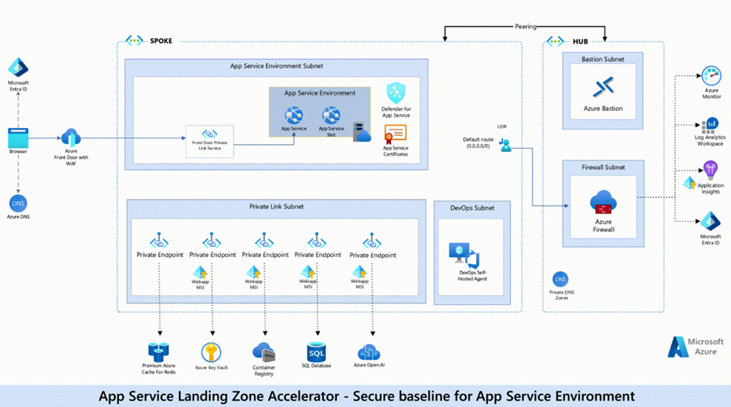

== 2. 역할 및 책임

[cols="2,1,1,2,1" options="header"]
|===
|일|Responsible|Accountable|Consulted|Informed
|Azure에서 App Service 생성|고객/파트너|고객/파트너|고객/파트너/Factory|Factory
|공유할 평가 보고서|고객/파트너|고객/파트너|고객/파트너|Factory
|분석 보고서 준비|Factory|Factory|고객/Facrtory|고객/파트너
|웹 앱 배포|고객/파트너|고객/파트너|고객/Factory|고객/파트너
|===

== 3. 계획

* 구독 및 서비스 액세스 보장
* Azure 구독에 대한 Contributor 역할

== 4. 사전 준비 사항

=== Azure 포털

1. Appcat 도구를 사용하여 애플리케이션을 분석합니다. 이 도구는 프로젝트와 코드를 평가하고 'N' 개의 제안 사항이 포함된 보고서를 생성합니다. 애플리케이션을 Azure로 마이그레이션하려면 이러한 변경 작업을 수행해야 합니다. 참고: FACTORY_Runbook_AppCat_DotNet_v2.1 1.docx (sharepoint.com)
2. 웹 애플리케이션/웹 API, ASP.NET MVC 프로젝트를 웹 앱으로 Azure 앱 서비스에 배포하려면 먼저 .NET 프로젝트의 대상 프레임워크를 찾아야 합니다.
3. 그런 다음 필요한 구성으로 `App Service` 를 만듭니다.
4. 생성된 웹 앱 URL로 이동합니다.
5. Azure 구독을 통해 Visual Studio에 로그인합니다.
6. 게시 프로필을 만듭니다.
7. Visual Studio에서 이미 생성된 웹 앱에 코드를 게시합니다.
8. 호스팅된 URL로 이동하여 애플리케이션에 액세스 할 수 있는지 확인합니다.

=== Azure CLI

1. IIS 서버에 대한 관리자 역할이 필요합니다.
2. Azure CLI를 설치
3. 스크립트를 실행하는 사용자는 Azure 구독에 대한 Contributor 역할이 있어야 합니다.
4. 마이그레이션될 사이트에 대한 평가 도구에서 식별된 모든 호환성 문제가 해결되었으며, 애플리케이션 마이그레이션에 대한 결정이 최종 확정되었습니다.

=== 4.1 Azure CLI 설치

다음 링크를 클릭합니다.

https://learn.microsoft.com/en-us/cli/azure/install-azure-cli?view=azure-cli-latest[Azure CLI]

OS 구성에 따라 설치 링크를 선택합니다.

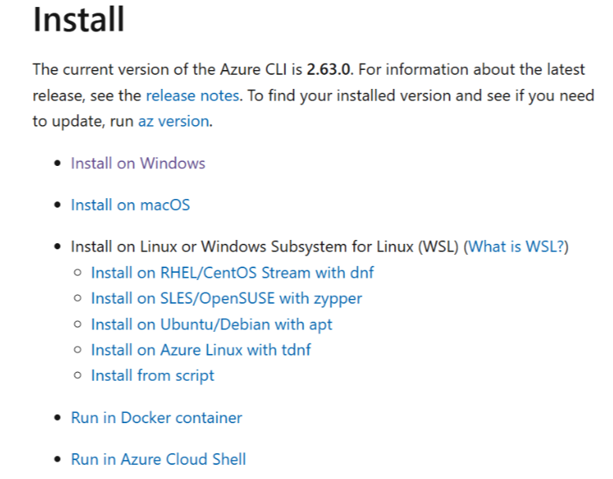

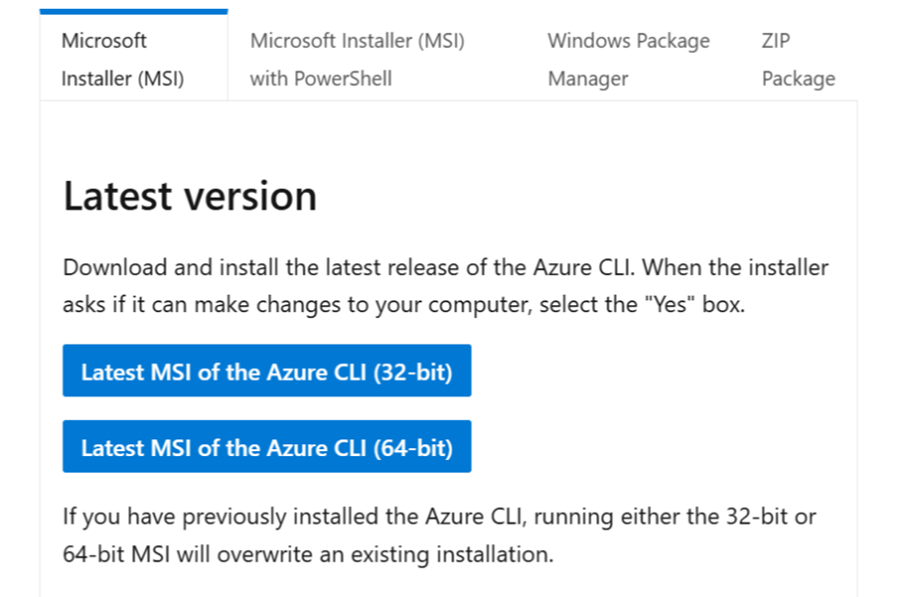

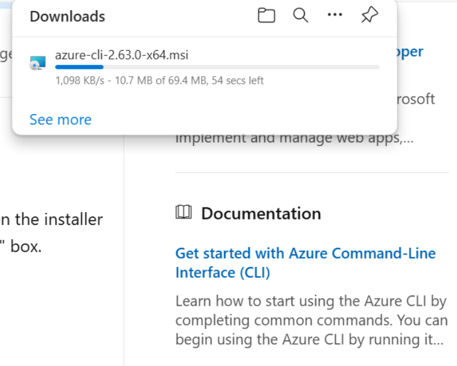

다운로드한 MSI 설치 관리자 파일을 더블클릭하여 안내에 따라 Azure CLI를 설치합니다. 설치가 완료되면 `Finish` 를 클릭합니다.

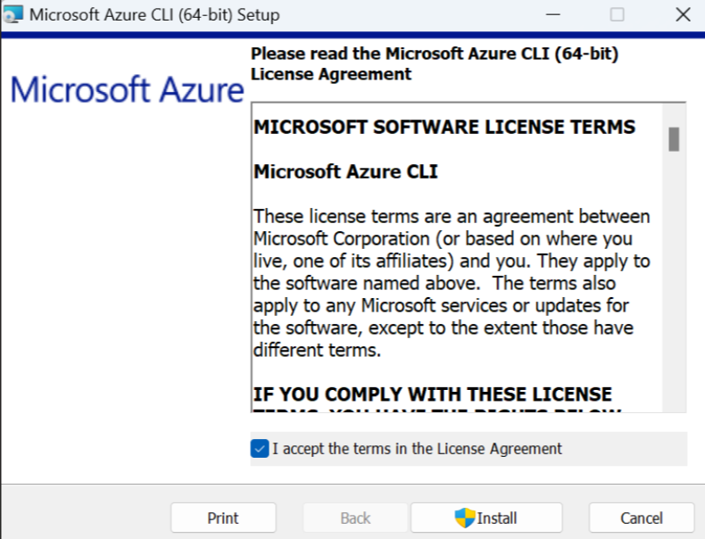

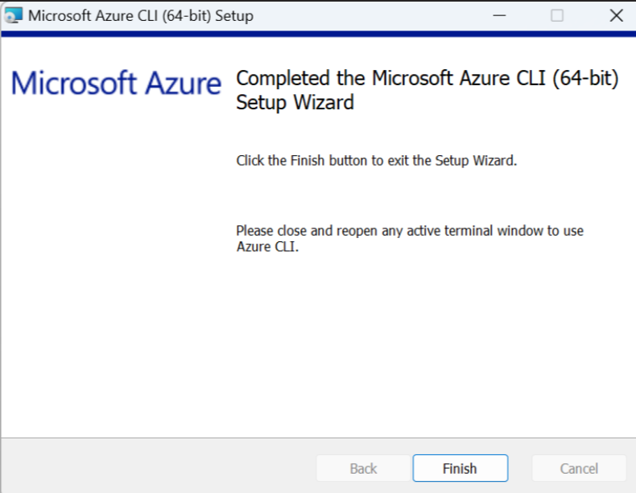

== 5. 실행

=== 5.1 App Service 마이그레이션 단계 - Azure Portal 사용

1. Visual Studio에서 솔루션/프로젝트를 엽니다.
2. 솔루션 탐색기에서 솔루션 탐색기에 게시할 프로젝트를 마우스 오른쪽 버튼으로 클릭합니다.
3. `Publish` 를 클릭합니다.
4. 아래 절차대로 게시 프로필을 생성합니다.
. `New Profile` 을 클릭합니다.
+
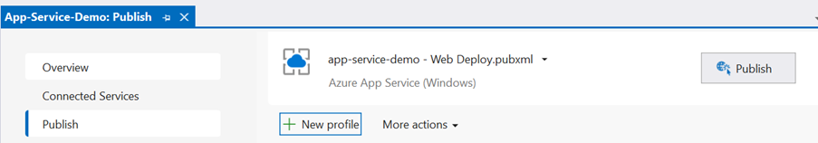
+
. `Azure` 를 선택하고 `Next`를 클릭합니다.
+
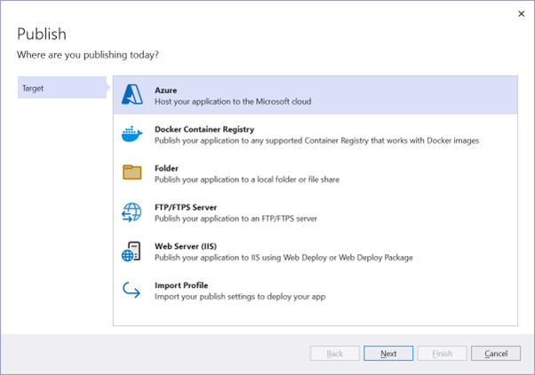
+
. 포털에서 동일한 구성으로 웹앱을 생성했으므로 `Azure Web Service(Windows)` 를 선택합니다.
+
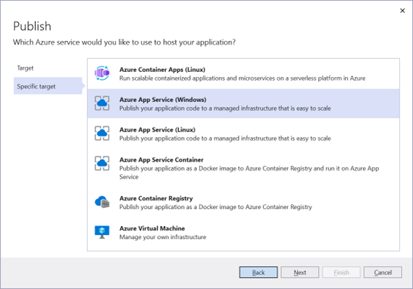
+
. 프로필 게시 페이지가 열립니다. Azure 구독 자격 증명을 사용하여 페이지에 로그인합니다.
+
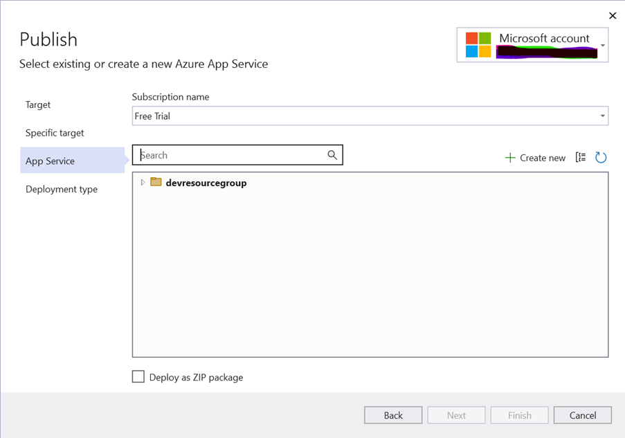
+
. 로그인하면 사용 가능한 모든 앱 서비스가 내열됩니다.
. 유효한 구독을 선택하고 Azure Portal에서 생성한 리소스 그룹에서 `app-service-demo` 웹 앱을 선택합니다.
+
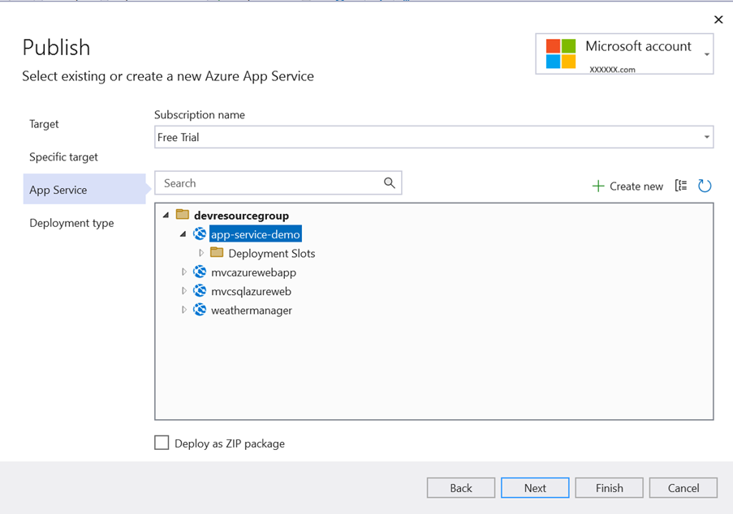
+
. 웹 앱 생성 과정에서 수동 배포를 선택했으므로 `Next` 를 클릭하고 `Publish (generates pubxml file)` 을 선택합니다. `Finish` 를 클릭하여 게시된 프로필 생성을 완료합니다.
+
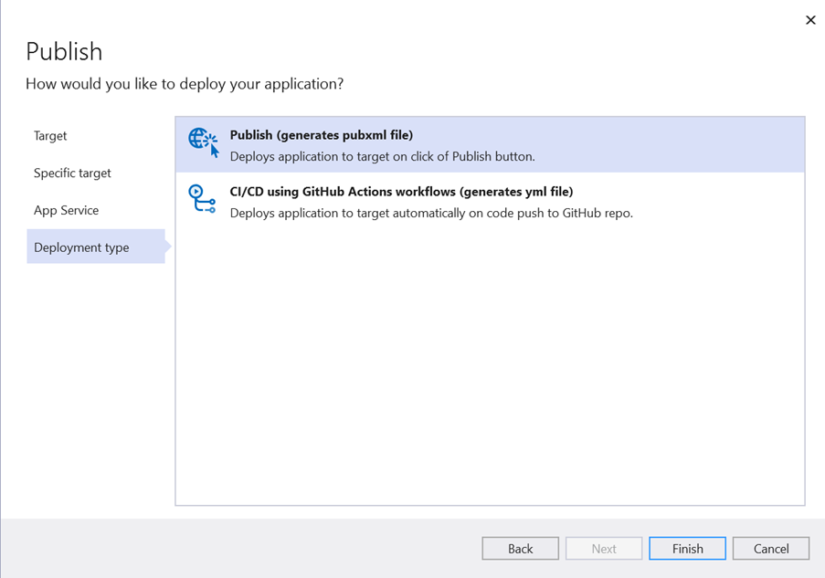
+
. 프로필 생성이 진행됩니다.
+
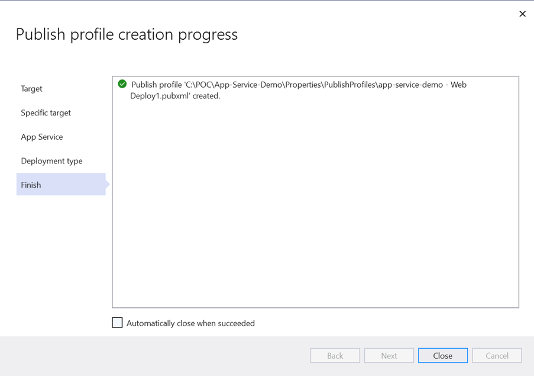
+
. 프로필이 준비되었습니다. 게시할 수 있습니다.
+
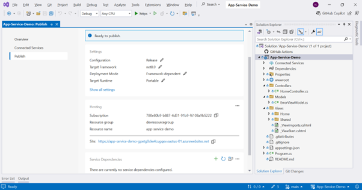
+
5. 프로필 설정이 유효하고 포털에서 생성한 웹앱과 일치하는지 다시 한번 확인합니다. 확인 후 `Publish` 를 클릭합니다.
6. 게시는 곧 시작됩니다.
+
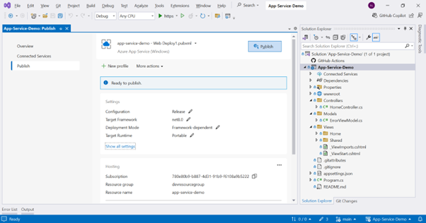
+
7. 게시가 완료됩니다.
+
image:./images/image16.png[width=600]
+
8. 게시를 확인합니다. +
게시된 후, 호스팅된 URL은 브라우저를 통해 탐색되며 애플리케이션을 볼 수 있어야 합니다. 이제 웹 앱이 Azure에 호스팅되어 실행되고 있습니다.
+
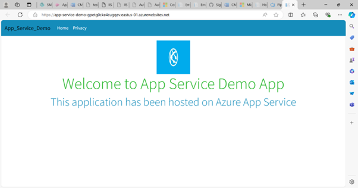

==== 5.1.1 게시 프로필 다운로드 및 가져오기 - Azure Portal 사용

Azire Portal에서 웹앱의 게시 프로필을 다운로드하여 게시하기 전에 Visual Studio로 가져올 수도 있습니다.

===== 단계

1. Azure 포털로 이동합니다.
2. App Service를 클릭합니다.
3. 프로젝트를 배포할 적절한 앱 서비스를 선택합니다.
4. `Download publish profile` 을 클릭합니다.
+
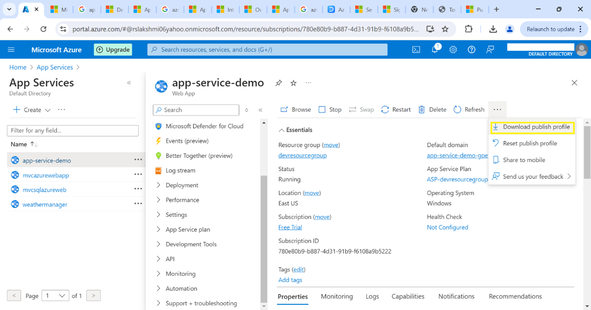
+
5. 게시 설정 파일이 다운로드됩니다.
+
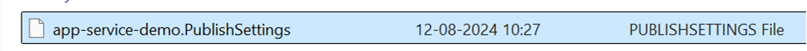
+
6. 솔루션 탐색기에서 Visual Studio를 열고 배포할 프로젝트를 마우스 오른쪽 버튼으로 클릭한 다음 `Publish` 를 선택합니다.
7. `New Profile` 을 클릭하고 창에서 `Import Profile` 를 선택합니다.
+
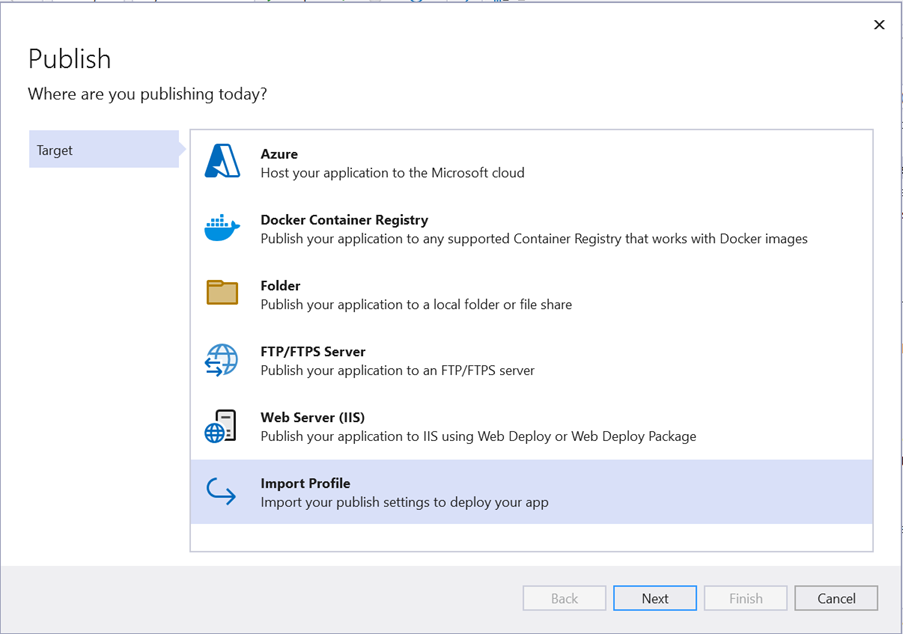
+
8. 프로필 생성이 진행됩니다.
+
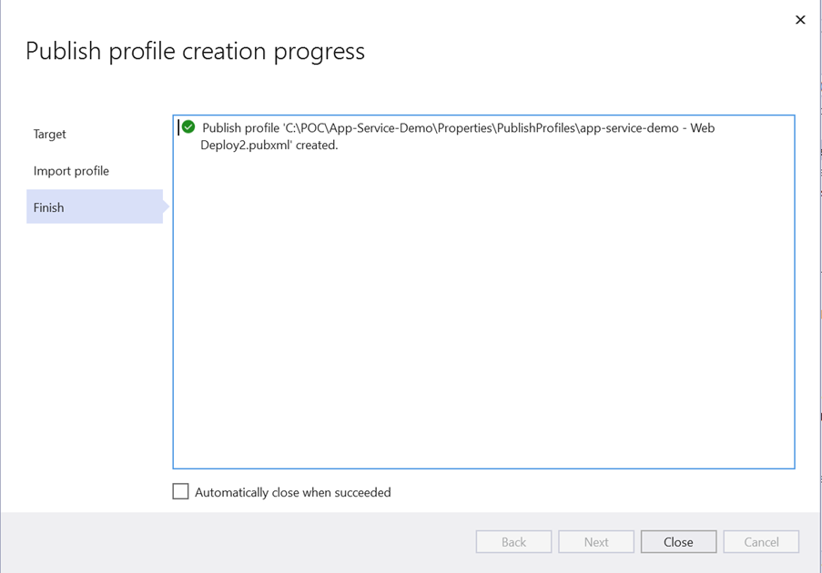
+
9. `Publish` 를 클릭합니다.
+
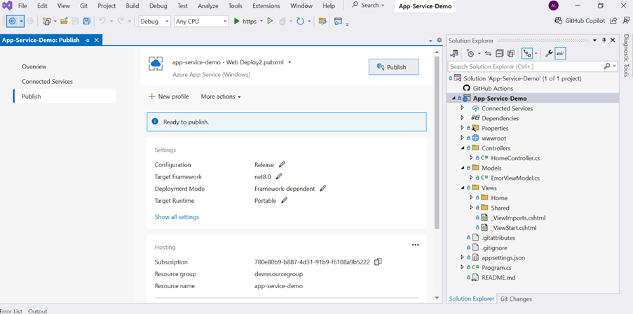
+
10. 게시를 확인합니다. +
게시된 후, 호스팅된 URL은 브라우저를 통해 탐색되며 애플리케이션을 볼 수 있어야 합니다. 이제 웹 앱이 Azure에 호스팅되어 실행되고 있습니다.
+

==== 5.1.2 배포 슬롯을 사용한 앱 서비스 배포

Azure App Service에 슬롯을 배포하는 목적은 무엇입니까?

* Azure App Service 배포 슬롯을 사용하면 함수 앱에서 슬롯이라는 여러 인스턴스를 실행할 수 있습니다. 슬롯은 공개적으로 사용 가능한 앤드포인트를 통해 노출되는 다양한 환경입니다. 하나의 앱 인스턴스는 항상 프로덕선 슬롯에 매핑되며, 필요에 따라 슬롯에 할당된 인스턴스를 교체할 수 있습니다.
* Azure App Service에서 사용 가능한 배포 슬롯 수는 App Service 요금제의 가격 책정 계층에 따라 다릅니다. 표준 App Service 요금제의 경우, 추가할 수 있는 최대 배포 슬롯 수는 5개입니다.
* Azure Portal에서 App Service를 열고 Publish로 이동한 후 배포 슬롯을 클릭합니다.
* 배포 슬롯을 추가할 수 있는 것은 표준 및 프리미엄 플랜뿐입니다. 플랜이 기본인 경우 App Service 플랜을 "표준/프리미엄"으로 업그레이드 해야 합니다.
+
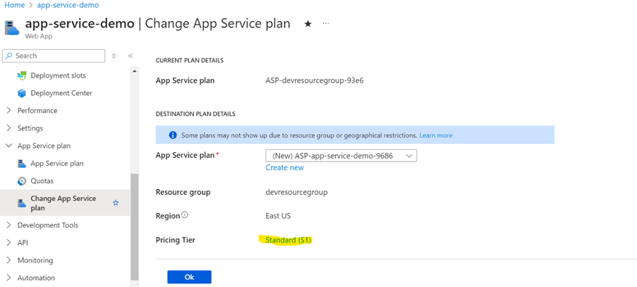
+
* 고유한 이름으로 배포 슬롯을 추가합니다.
+
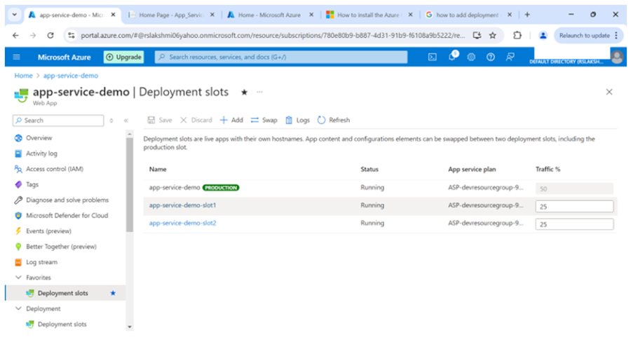
+
* Visual Studio로 이동하여 게시 프로필을 만든 다음, App Service에서 배포 슬롯을 선택하고 `Finish` 를 클릭합니다. 프로필이 생성되면 `Publish` 를 클릭합니다.
+
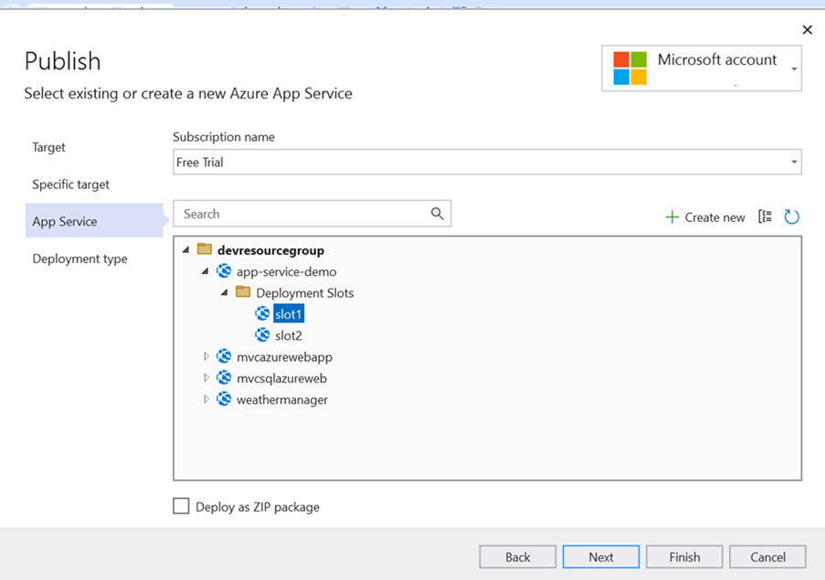
+
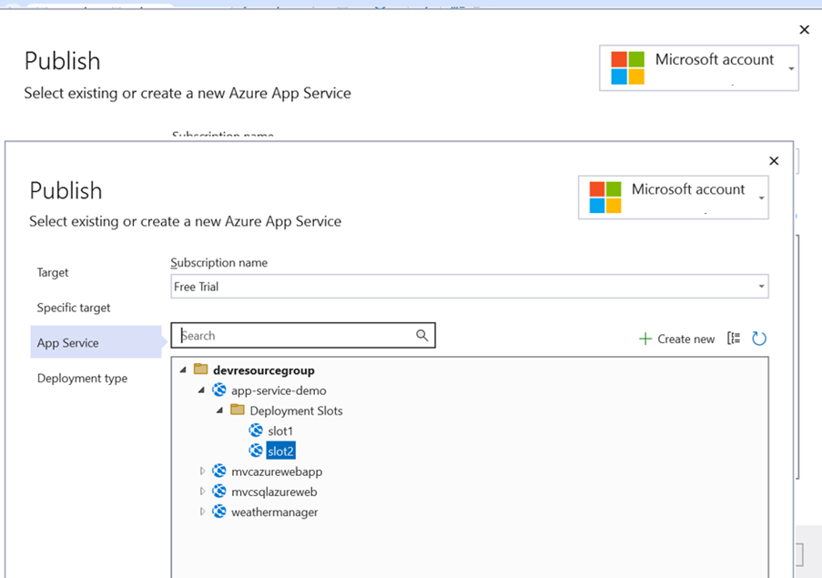
+
* 배포가 진행됩니다.
+
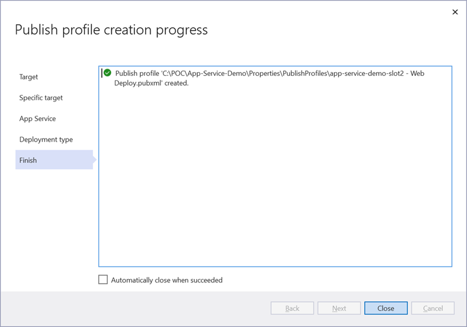
+
* 포털과 앱 서비스 슬롯으로 가서 모든 슬롯이 작동 중인지 확인합니다.
+
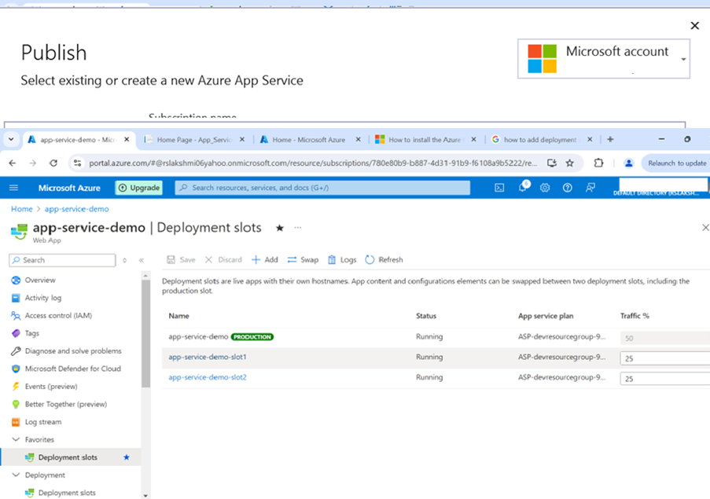
+
* 애플리케이션은 75%, 25%, 25% 트래픽으로 3개의 다른 슬롯에 배포되었습니다.
* 실시간 요구 사항에 맞게 트래픽을 조정합니다.

=== 5.2 App Service 마이그레이션 단계 - Azure CLI 사용

==== 5.2.1 IIS 서버에서 배포

1. 아래 단계에서는 Azure CLI를 사용해서 IIS에서 호스팅되는 온프레미서 .NET 웹 애플리케이션을 Azure App Service로 마이그레이션하기 위한 간략한 가이드를 제공합니다.
+
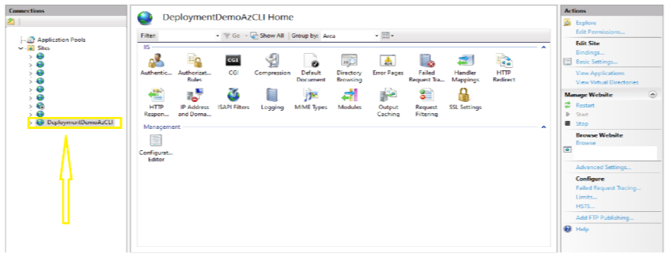
+
2. 사이트를 마우스 오른쪽 버튼으로 클릭하고 `Explore` 옵션을 클릭합니다. 사이트 바이너리가 복사된 폴더가 열립니다.
+
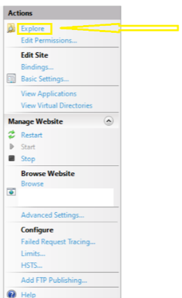
+
3. 사이트 폴더의 모든 내용을 선택하여 압축합니다. zip 폴더 배로 아래에 웹사이트 내용이 있는지, 하위 폴더 아래에 있는지 확인합니다.
+
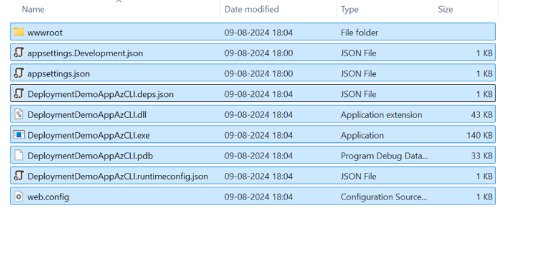
+
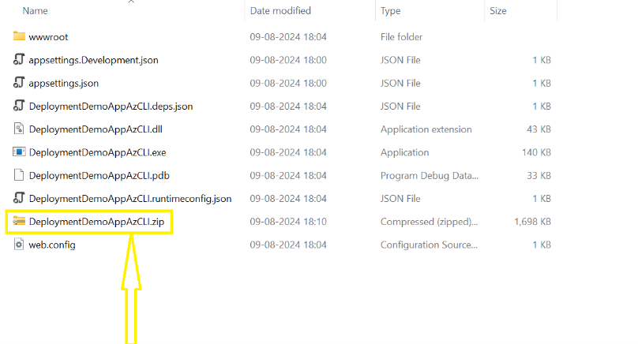
+
4. Azure Portal로 이동하여 사이트에 적합한 App Service Plan을 만듭니다. 기존 App Service Plan은 여러 애플리케이션을 호스팅하는데 재사용할 수도 있습니다.
5. App Service Plan에서 애플리케이션 이름으로 새 웹앱을 만듭니다.
6. 온프레미스 앱의 .NET 버전을 캡처한 후 웹앱을 만드는 동안 해당 버전이나 상위 버전을 선택합니다.
7. 애플리케이션에 대한 Log Analytics 및 app Insight를 활성화합니다.
8. 조직 정책에 따라 Azure 리소스의 명명 규칙을 따르거나 Microsoft 용어를 따릅니다.
9. 조직 정책에 따라 웹앱에 태그를 지정합니다.
10. Azure CLI를 사용하여 애플리케이션을 마이그레이션하는데 나중에 사용될 리소스 그룹과 웹앱 이름을 기록해둡니다.
11. 관리자 권한으로 Bash 콘솔을 엽니다.
12. 다음 명령을 사용하여 Azure에 로그인합니다.
+

+
Azure Portal 로그인 창이 나타납니다. 자격 증명을 입력하고 Azure Portal에 로그인합니다.
13. 계정에 여러 구독 액세스 권한이 있는 경우 다음 명령을 사용하여 원하는 구독을 사용할 적절한 컨텍스트를 설정합니다.
+

+
14. 다음 명령을 사용하여 Azure의 웹앱에 애플리케이션을 배포합니다.
+
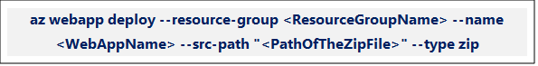
+
15. zip 파일 크기와 네트워크 대역폭에 따라 Azure App Service에 애플리케이션을 배포하는데 시간이 다소 걸립니다.
16. 애플리케이션이 배포되면 Azure Portal로 이동하여 사이트를 탐색하고 필요한 구성을 수행합니다.

==== 5.2.2 소스 코드에서 배포

아래 단계에서는 Azure CLI를 사용하여 소스 폴더에서 호스팅되는 온프레미스 .NET 웹 애플리케이션을 Azure App Service로 마이그레이션하기 위한 간략한 가이드를 제공합니다.

* 관리자 권한으로 명령 프롬프트를 엽니다.
* 현재 디렉토리를 소스 코드가 포함된 디렉토리로 변경합니다.
* Text Box 2, TextBoxRun에 아래 명령을 입력합니다.
+
----
dotnet publish --configuration release
----
+
* 파일 탐색기를 열고 게시 폴더로 이동합니다.
* 게시 폴더는 코드가 포함된 폴더 내의 \bin\Release\net8.0 경로에서 찾을 수 있습니다.
* 게시 폴더에 모든 파일을 선택한 후 적절한 이름의 폴더에 압축하세요. 압출 폴더 바로 아래에 웹사이트 콘텐츠가 있는지, 하위 폴더가 아닌지 확인합니다. 아래 그림과 같습니다.
+
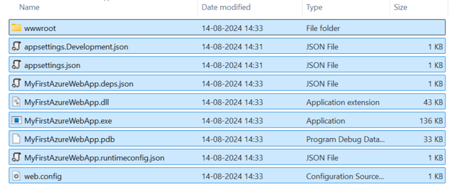
+
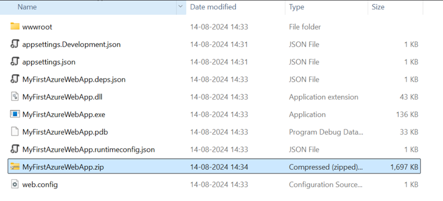
+
* Azure Portal로 이동하여 사이트에 적합한 App Service Plan을 만듭니다. 기존 App Service Plan은 여러 애플리케이션을 호스팅하는데 재사용할 수도 있습니다.
* App Service Plan 아래에 애플리케이션 이름으로 새 웹앱을 만듭니다. 기본 애플리케이션은 아래와 같습니다.
+
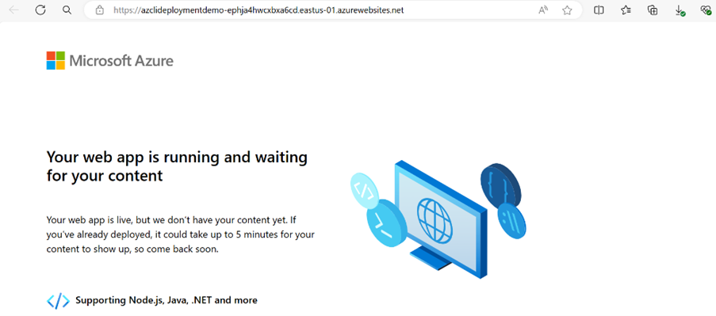
+
* 온프레이스 앱의 .NET 버전을 캡처한 후 웹앱을 만드는 동안 해당 버전이나 상위 버전을 선택합니다.
* 애플리케이션에 대한 Log Analytics 및 App Insight를 활성화합니다.
* 조직 정책에 따라 Azure 리소스의 명명 규칙을 따르거나 Microsoft 용어를 따릅니다.
* 조직 정책에 따라 웹앱에 태그를 지정합니다.
* Azure CLI를 사용하여 애플리케이션을 마이그레이션하는데 나중에 사용될 리소스 그룹과 웹앱 이름을 기록해둡니다.
* 다음 명령을 사용하여 Azure에 로그인합니다.
+
----
az login
----
+
* Azure Portal 로그인 창이 나타납니다. 자격 증명을 입력하고 Azure Portal에 로그인합니다. 아래 그림과 같습니다.
+
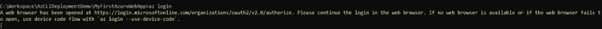
+
----
az account set --subscription"<SubscriptonName>
----
+
계정에 여러 구독 액세스 권한이 있는 경우 다름 명령을 사용하여 원하는 구독을 사용할 적절한 컨텍스트를 설정합니다. 아래 그림을 참조합니다.
+
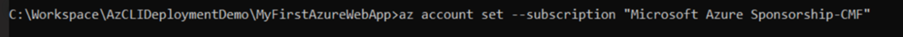
+
* zip 파일 크기와 네트워크 대역폭에 따라 Azure App Service에 애플리케이션을 배포하는데 사간이 다소 걸립니다.
* 애플리케이션이 배포되면 azure Portal로 이동하여 사이트를 탐색하고 필요한 구성을 수행합니다.
+
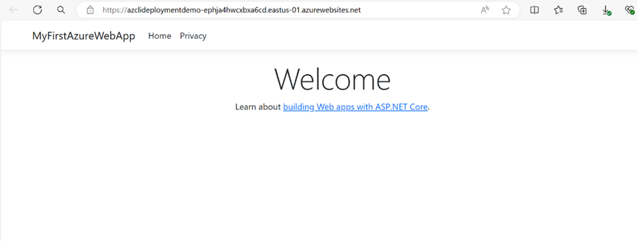
+
* Kudu 로그에 표시된 배포 파일(사이트 콘텐츠 배포 확인용)
+
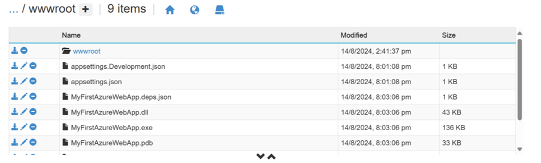
+
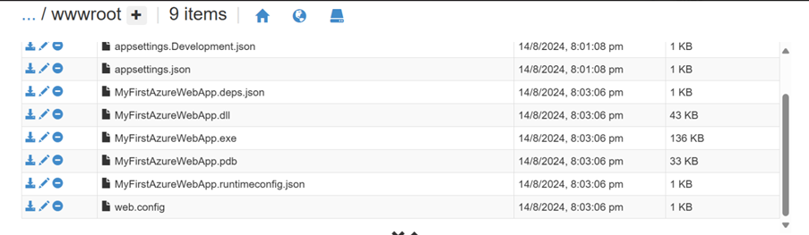

=== 5.3 Azure DevOps 파이프라인을 사용한 App Service 배포

==== 5.3.1 전제 조건

1. GitHub에 애플리케이션 소스 코드가 있는 원격 저장소가 있어야 합니다.
2. Azure Portal로 이동하여 사이트에 적합한 App Service Plan 을 만듭니다. 기존 App Service Plan은 여러 애플리케이션을 호스팅하는데 재사용할 수 있습니다.
3. App Service Plan에서 애플리케이션 이름으로 새 웹앱을 만듭니다.
4. 웹앱의 대상 프레임워크는 애플리케이션의 대상 프레임워크와 동일해야 합니다.
5. 애플리케이션에 대한 Log Analytics 및 App Insignt를 활성화합니다.
6. 조직 정책에 따라 Azure 리소스의 명명 규칙을 따르거나 Microsoft 용어를 따릅니다.
7. 조직 정책에 따라 웹앱에 태그를 지정합니다.
8. 웹앱 URL을 클릭합니다. 기본 웹사이트는 아래와 같습니다.
+
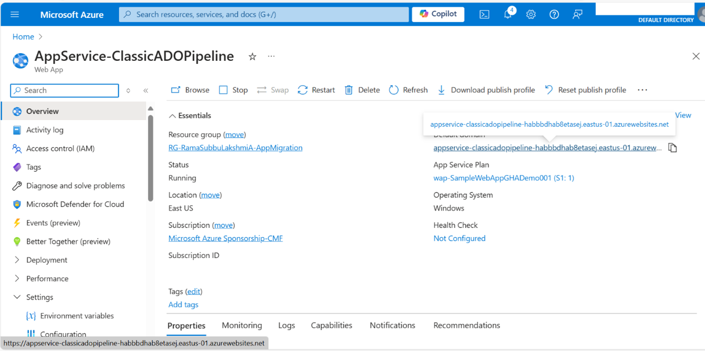
+
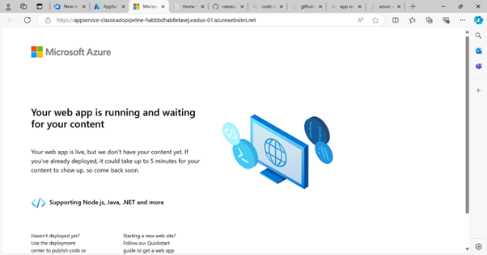
+
9. GitHub 저장소를 가져와서 Azure DevOps "Repos" 섹션에 저장소를 만듭니다.
10. Azure Portal에서 앱 등록 템플릿에 서비스 주체를 만듭니다. 서비스 주체는 사용자와 같은 보안 주체로, 조직 수준에서 인증 및 구독 권한을 부여받을 수 있습니다. 서비스 주체(앱 등록 템플릿)에 클라이언트 비밀번호를 만듭니다.
+
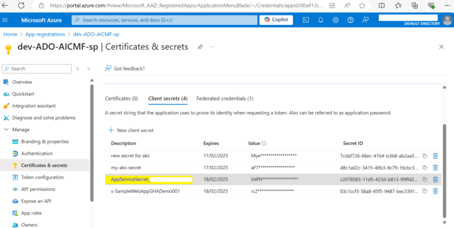
+
11. Azure에서 앱 등록(서비스 주체)의 ClientID, TenentId, 클라이언트 비밀번호 값을 기록해둡니다. 아래와 같이 ADO(Azure DevOps)에서 서비스 연결을 생성할 때 이 값을 사용해야 합니다.

==== 5.3.2 ADO(Azure DevOps) 서비스 연결 생성

1. ADO에 로그인합니다.
2. `Project Settings` 를 클릭합니다.
+
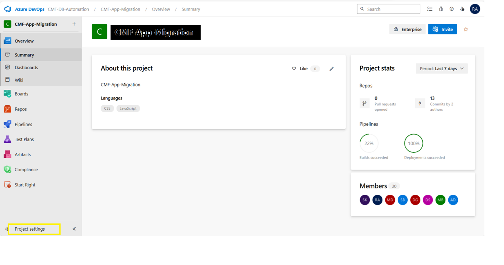
+
3. Pipelines` 구역에서 `Service connections` 를 클릭합니다.
+
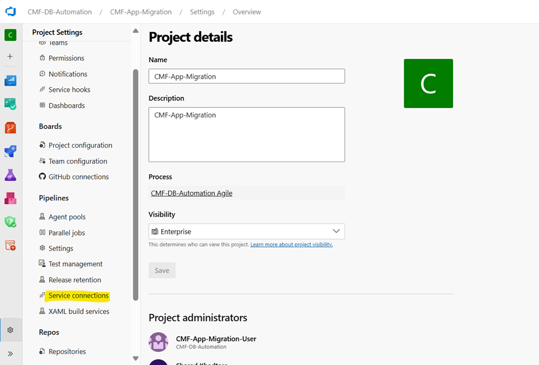
+
4. `New Service Connection` 을 클릭하고 `Azure Resource Manager` 를 선택하고 `Next` 버튼을 클릭합니다.
+
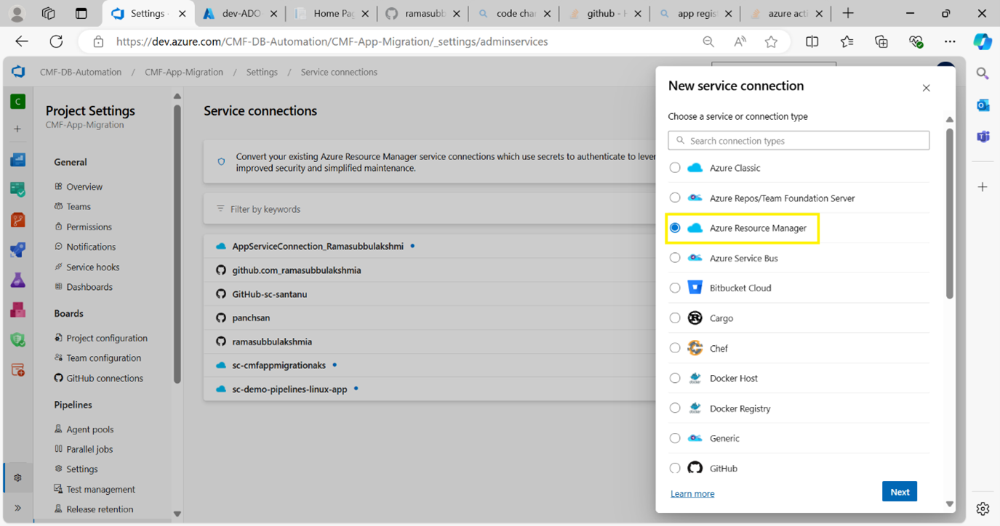
+
5. `Service Principal Manual` 을 선택하고 `Next` 를 클릭합니다.
+
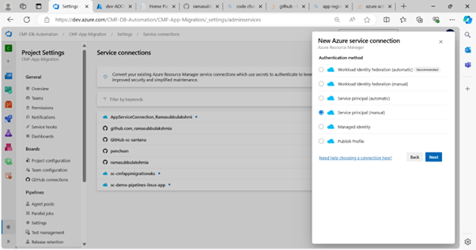
+
6. `New Azure service connection` 연결 팝업에서 아래와 같이 필드를 채웁니다.
* Subscription Id -> Azure 구독 ID를 복사하여 붙여넣습니다.
* Subscription Name -> Azure 구독 이름을 복사하여 붙여넣습니다.
* Service Principal Id -> Azure에서 앱 등록의 클라이언트 ID를 복사하여 붙여넣습니다.
* Tenant Id -> Azure에서 앱 등록의 테넌트 ID를 복사하여 붙여넣습니다.
* Service Principal Key -> 앱 등록 템플릿에서 생성한 클라이언트 비밀 값을 복사하여 붙여넣습니다.
* Service Connection Name -> 회사의 명명 기준에 따라 고유한 서비스 연결 이름을 지정합니다.
* Grant permission to all pipelines -> 체크박스 체크
+
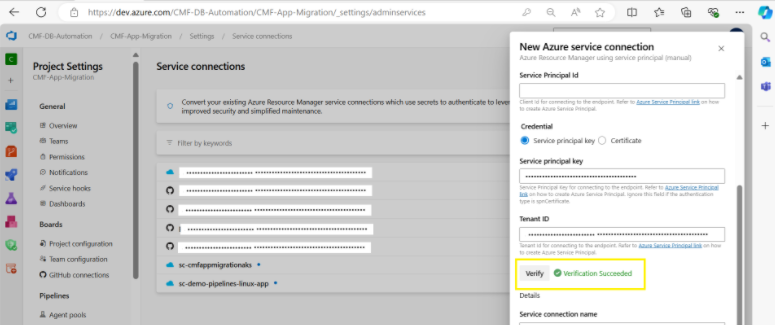
+
* `Verify` 클릭 하고 확인이 성공했는지 확인합니다.
+
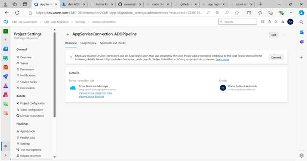

==== 5.3.3 ADO Classic 파이프라인을 사용한 App Service 배포 - CI/CD

===== Continuous Integration

1. ADO(Azure DevOps)에 로그인합니다.
2. 왼족 패널의 `Pipelines` 구역에서 `New Pipeline` 을 클릭합니다.
3. `Native Azure DevOps Experience` 링크를 클릭합니다.
+
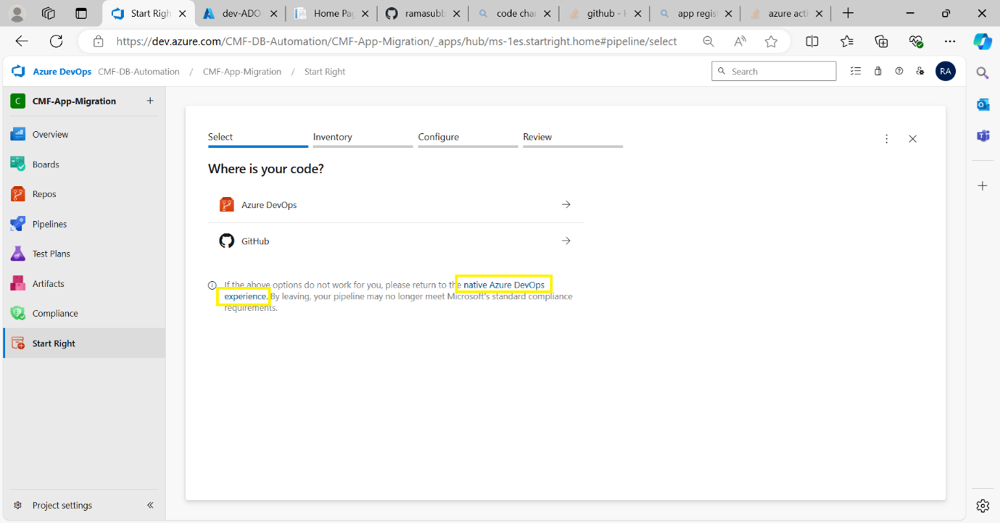
+
4. `Use the Classic Editor` 링크를 클릭합니다.
5. `Select Source` 아래에서 `Git Hub` 을 선택합니다.
+

+
6. 저장소를 사용할 수 있는 GibHub 연결을 사용하여 권한을 부여합니다.
7. GitHub 리포지토리와 브랜치를 선택합니다.
8. `Continue` 를 클릭합니다.
9. `ASP.NET Core` 템플릿을 선택하고 `Apply` 를 클릭합니다.
+

+
10. Pipeline과 기본 Agent job 1을 볼 수 있습니다.
11. 원하는 에이전트를 선택합니다. (Linux / Windows)
12. 나중에 Release Pipeline에서 이 이름을 선택해야 하므로, 원하는 이름으로 파이프라인 이름을 편집합니다.
13. `Save & Queue` 를 클릭합니다.
+

+
14. 파이프라인 실행 창에서 저장될 주석을 입력하고 `Save and Run` 을 클릭합니다.
+

+
15. 파이프라인은 GitHub 저장소에서 코드 빌드를 시작합니다.
+

+
16. Agent Job 1이 대기열에 추가됩니다.
+

+
17. Agent Job 1을 더블 클릭하여 진행 상황을 볼 수 있습니다.
+

+
18. 빌드가 성공합니다.
+

+
19. 지속적 통합 활성화/PS 지속적 통합은 비프로덕션 환경에서는 괜찮습니다. 프로덕션 환경에서 지속적 통합을 활성화하려면 고객의 승인을 받아야 합니다.
20. Pipeline을 선택하고 편집을 클릭한 후 트리거 탭으로 이동하여 저장소를 선택하고 `Enable continuous Integration` 를 선택합니다.
+


===== Continuous Deployment

1. 왼쪽 패널에서 `Release` 옵션을 선택합니다.
2. 중간 패널에서 `New Release Pipeline` 을 선택합니다.
+

+
3. `Azure App Service deployment` 템플릿을 선택합니다.
+

+
4. `Add an artifact` 에서 이전에 생성한 빌드 파이프라인을 선택하고 `Add` 버튼을 클릭합니다.
+

+
5. 스테이지 템플릿에서 `1 Job, 1 task` 링크를 클릭하고 애플리케이션을 배포해야 하는 Azure 구독, Azure Service 이름을 입력합니다.
+

+
6. `Save` 버튼을 클릭합니다.
+

+
7. 저장 팝업에서 `All pipeline` 폴더를 선택하고 확인을 클릭합니다.
+

+
8. 새로운 빌드가 출시되고, 자동 배포를 활성화하려면 Artifact에서 Trigger 기호를 클릭합니다.
9. `Continuous deployment trigger` 창의 `Enabled` 를 켜짐으로 전환합니다. PS 프로덕션을 위해 지속적인 배포 트리거를 활성화하기 전에 고객의 승인을 받아야 합니다.
+

+
10. `Save` 를 클릭합니다.
11. 명명 기준에 따라 릴리스 파이프라인에 이름을 지정하고 저장합니다.
+

+
12. 새로 생성된 릴리스 파이프라인은 아래와 같이 보여집니다.
+


===== 수동으로 릴리스 트리거

1. `Create release` 를 클릭합니다.
+

+

+

+

+

+


===== Continuous Integration 및 지속적인 배포 트리거 확인

1. Visual Studio가서 코드를 변경하고 git-changes를 사용하여 커밋하고 푸시합니다.
+

+
2. ADO로 가서 파이프라인을 확인하여 빌드가 시작되었는지 확인합니다.
+

+
3. 빌드가 성공하면 `release` 로 가서 `release pipeline` 을 선택하면 새 릴리스가 성공적으로 트리거됩니다.
+

+

+

+
4. 릴리스가 완료되면 브라우저에서 웹앱 URL을 새로 고치고 아래 페이지에 변경 사항이 반영되었는지 확인합니다.
+


==== 5.3.4 ADO YAML 편집기를 사용하여 슬롯에 App Service 배포 - CI/CD

1. ADO에서 파이프라인을 선택하고 새 파이프라인을 클릭합니다.
2. `Native Azure DevOps experience` 을 클릭합니다.
3. `Git Hub YAML` 을 선택합니다.
+

+
4 리포지토리를 선택합니다.
+

+
4. `Configuration` 탭에서 YAML 편집기가 표시됩니다.
+

+
5. 위의 YAML 스크립트를 아래와 같이 편집기에 붙여넣습니다.
6. `Run` 을 클릭합니다.
+

+
7. 새로운 빌드가 파이프라인에서 실행되고 게시됩니다.
+

+


===== YAML 파이프라인을 사용한 배포 슬롯으로의 지속적인 배포

1. Azure Portal에서 필요한 트래픽 비율로 웹앱(App Service)에 배포 슬롯을 만듭니다.
+

+
2. ADO로 가서 왼쪽 패널에서 `Release` 를 클릭합니다.
3. 릴리스 파이프라인을 생성하고 `Artifact` 를 추가한 후 오른쪽에서 YAML을 사용하여 생성한 빌드 파이프라인을 선택하고 `Add` 를 클릭합니다.
+

+
4. Azure 구독, App Service 이름을 선택합니다.
5. 트리거 심복을 클릭하고 지속적 배포를 활성화합니다.
+

+
6. `1 Job, 1 Task` 를 클릭하고 `Deploy to slot or App Service environment` 을 선택합니다.
7. 생성된 모든 슬롯은 드롭다운에 나열됩니다.
8. 이 릴리스를 사용하여 빌드를 배포할 슬롯을 선택합니다.
+

+
9. `Save and Run` 을 클릭합니다.
10. 최신 빌드를 사용하여 릴리스가 트리거됩니다.
+

+

+
11. Azure Portal로 이동하고 `App Service Slot overview` 로 이동합니다.
+

+
12. Slot 개요에서 URL을 클릭합니다. 이전 릴리스 실행은 위 URL에 배포되어야 합니다.
+

=== 5.4 Git 작업을 사용한 App Service 배포

==== 5.4.1 App Service 생성

1. GitHub에 애플리케이션 소스 코드가 있는 원격 저장소가 있어야 합니다.
2. Azure Portal로 이동하여 적합한 App Service Plan을 만듭니다. 기존 App Service Plan은 여러 애플리케이션을 호스팅하는데 재사용할 수 있습니다.
3. App Service Plan에서 애플리케이션 이름으로 새 웹앱을 만듭니다.
* 온 프레미스 앱의 .NET 버전을 캡처한 후 웹앱을 만드는 종안 해당 버전이나 상위 버전을 선택합니다.
* 애플리케이션에 대한 Log Analytics 및 App Insight를 활성화합니다.
* 조직 정책에 따라 Azure 리소스의 명명 규칙을 따르거나 Microsoft 용어를 따릅니다.
* 조직 정책에 따라 웹앱에 태그를 지정합니다.
4. 웹앱 URL을 클릭합니다. 기본 웹사이트는 다음과 같습니다.
+


==== 5.4.2 배포

1. 나중에 워크플로 파일을 만드는데 사용될 웹앱과 .NET 버전 이름을 기록해둡니다.
2. Azure Portal에서 웹앱으로 이동하여 게시 프로필을 다운로드합니다. 다운로드한 파일을 메모장에서 열고 내용을 복사합니다.
+

+
3. GitHub 저장소로 이동합니다.
4. `Settings` 를 엽니다.
+

+
5. 왼쪽 패널의 Security 섹션에서 `Secret and variables` 을 클릭합니다.
+

+
6. `Actions` 를 클릭합니다.
+

+
7. `new Repository Secret` 을 클릭하여 새 저장소 보안을 생성합니다.
+

+
8. 2 단계에서 복사한 애용을 `Secret` 섹션에 붙여넣고 적절한 `Name` 을 지정합니다. 워크플로 파일을 생성할 때 사용할 `Secret` 이름을 기록해줍니다.
+

+
9. `Add secret` 을 클릭합니다.
10. 위쪽 아이콘 모음 탭에서 `Actions` 를 클릭합니다.
+

+
11. `Get started with GitHub Actions` 아래의 `set up a workflow yourself` 링크를 클릭합니다.
+

+
12. yaml 파일 편집기가 열립니다.
13. 편집기에 2번 절차에서 다운로드한 게시 프로필 yaml 파일을 붙여넣고, 적절한 이름을 지정한 다음 `Commit Changes` 를 클릭하여 배포를 시작합니다.
+

+
14. ASP.NET Core MVC 웹 애플리케이션을 App Service에 배포하기 위한 샘플 YAML 코드는 아래와 같습니다.
+

+
2단계에서 만든 Azure Web App 이름, .NET 버전, 6단계에서 만든 Secret 이름은 위의 샘플 파일에서 변경해야 합니다.
15. 변경 사항을 커밋한 후 여기에서 배포 상태를 확인할 수 있습니다.
+

+
16. Azure 포털에서 웹앱을 새로 고치고 웹앱 URL을 다시 클릭하여 배포를 확인합니다. 새로 배포된 애플리케이션이 Azure에 설치된 애플리케이션입니다. 배포 후 샘플 웹앱은 다음과 같습니다.
+


== 6. 부록

* https://azure.microsoft.com/en-in/products/app-service[Azure 앱 서비스]
* https://learn.microsoft.com/en-us/azure/app-service/quickstart-dotnetcore?tabs=net80&pivots=development-environment-vs[빠른 시작: ASP.NET 웹앱 배포 - Azure App Service | Microsoft Learn]
* https://learn.microsoft.com/en-us/azure/app-service/tutorial-dotnetcore-sqldb-app?toc=%2Faspnet%2Fcore%2Ftoc.json&bc=%2Faspnet%2Fcore%2Fbreadcrumb%2Ftoc.json&view=aspnetcore-8.0&tabs=copilot&pivots=azure-developer-cli[ASP.NET Core 및 Azure SQL Database 앱 배포 - Azure App Service | Microsoft Learn]